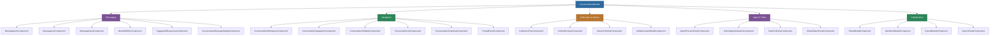

# @memberjunction/ng-conversations

A comprehensive Angular component library for building conversation-based interfaces in MemberJunction, including messaging, artifact management, collections, projects, tasks, agent interaction panels, and collaboration features.

> **Layering note.** The orchestration logic (agent dispatch, default-agent resolution, mention parsing, bridge state, streaming, client tools, sessions observability) lives in **`@memberjunction/conversations-runtime`** — a pure-TS, framework-agnostic package. This widget is one consumer of the runtime; React/Vue/Node hosts are also intended consumers. The widget is automatically wired to the runtime via `ConversationsRuntimeBootstrap` (registered `providedIn: 'root'`), which injects adapters for notifications, active-task tracking, and realtime sessions. See [`guides/CONVERSATIONS_UX_STACK_GUIDE.md`](../../../../guides/CONVERSATIONS_UX_STACK_GUIDE.md) for the full architecture.

## Customization without forking

The widget exposes three layers of extension:

| Surface | What it lets you do |
|---|---|
| **6 named slots** (`mjChatSlot` directive) | Replace the `header`, `emptyState`, `agentPresence`, `messageRenderer`, `messageExtra`, or `demonstrationSurface` regions with your own templates. Three consumption modes: project an ad-hoc template, wrap the exported default for containment, or subclass the default. |
| **Before/After cancelable events** | `(beforeAgentTurn)`, `(beforeToolInvoked)`, `(beforeResponseFormSubmitted)` let you observe AND veto (`event.Cancel = true`) before the action runs. Plus informational `(sessionStarted)` / `(sessionChannelStateChanged)` / `(sessionEnded)` for realtime lifecycle. |
| **`--mj-chat-*` design tokens** | Override bubble colors, composer chrome, character accents, and voice-state hues via standard CSS custom-property overrides. Defaults adapt to dark mode through semantic `--mj-*` tokens. |

Slot interfaces + cloneable default components + the `ChatSlotDirective` are exported — see the public API.

## Overview

The `@memberjunction/ng-conversations` package is a large, feature-rich module that powers MemberJunction's conversation UI. It provides 40+ components covering the entire conversation lifecycle: message composition and rendering (with markdown, mentions, code blocks, and artifacts), conversation navigation and history, threaded discussions, artifact collections and libraries, project/task management, agent execution panels, sharing/permission modals, search, notifications, and export.


```mermaid
graph TD
    A[ConversationsModule] --> B[Messaging]
    A --> C[Navigation]
    A --> D[Collections & Library]
    A --> E[Agent & Tasks]
    A --> F[Collaboration]

    B --> B1[MessageItemComponent]
    B --> B2[MessageListComponent]
    B --> B3[MessageInputComponent]
    B --> B4[MentionEditorComponent]
    B --> B5[SuggestedResponsesComponent]
    B --> B6[ConversationMessageRatingComponent]

    C --> C1[ConversationWorkspaceComponent]
    C --> C2[ConversationNavigationComponent]
    C --> C3[ConversationSidebarComponent]
    C --> C4[ConversationListComponent]
    C --> C5[ConversationChatAreaComponent]
    C --> C6[ThreadPanelComponent]

    D --> D1[CollectionTreeComponent]
    D --> D2[CollectionViewComponent]
    D --> D3[LibraryFullViewComponent]
    D --> D4[ArtifactCreateModalComponent]

    E --> E1[AgentProcessPanelComponent]
    E --> E2[ActiveAgentIndicatorComponent]
    E --> E3[TasksFullViewComponent]
    E --> E4[GlobalTasksPanelComponent]

    F --> F1[ShareModalComponent]
    F --> F2[MembersModalComponent]
    F --> F3[ExportModalComponent]
    F --> F4[SearchPanelComponent]

    style A fill:#2d6a9f,stroke:#1a4971,color:#fff
    style B fill:#7c5295,stroke:#563a6b,color:#fff
    style C fill:#2d8659,stroke:#1a5c3a,color:#fff
    style D fill:#b8762f,stroke:#8a5722,color:#fff
    style E fill:#7c5295,stroke:#563a6b,color:#fff
    style F fill:#2d8659,stroke:#1a5c3a,color:#fff
```

## Installation

```bash
npm install @memberjunction/ng-conversations
```

## Usage

### Import the Module

```typescript
import { ConversationsModule } from '@memberjunction/ng-conversations';

@NgModule({
  imports: [ConversationsModule]
})
export class YourModule { }
```

### Full Conversation Workspace

The top-level workspace component provides a complete conversation experience with sidebar, chat area, and thread panel:

```html
<mj-conversation-workspace
  [conversationId]="selectedConversationId"
  (conversationChanged)="onConversationChanged($event)">
</mj-conversation-workspace>
```

### Chat Area

The chat area handles message display, input, and agent interactions:

```html
<mj-conversation-chat-area
  [conversationId]="conversationId"
  [conversation]="conversation"
  [threadId]="selectedThreadId"
  [isNewConversation]="isNewConversation"
  (conversationCreated)="onConversationCreated($event)"
  (threadOpened)="onThreadOpened($event)"
  (threadClosed)="onThreadClosed()">
</mj-conversation-chat-area>
```

### Chat Overlay

A floating chat panel (bottom-right corner) that wraps the chat area for persistent agent access across the application. Collapses to a bubble icon, expands to a full chat panel.

```html
<mj-chat-agents-overlay
  [IsVisible]="!isChatRoute"
  (ToolExecuted)="onToolExecuted($event)"
  (OpenEntityRecord)="onOpenRecord($event)"
  (OpenFullWorkspace)="onExpandToWorkspace($event)">
</mj-chat-agents-overlay>
```

The overlay is generic — it raises events for navigation and tool execution. The consuming application (e.g., MJExplorer) handles those events with app-specific logic like `NavigationService.OpenEntityRecord()`.

**Related packages:**
- [`@memberjunction/ai-agent-client`](../../../AI/AgentsClient/README.md) — Core agent SDK (framework-agnostic, GraphQL transport, tool registry)
- [`@memberjunction/ng-agent-client`](../agent-client/README.md) — Angular wrapper for the agent SDK
- [`@memberjunction/core-entities`](../../../MJCoreEntities/readme.md) — ConversationEngine for centralized conversation data

### Message Components

#### Message List

```html
<mj-message-list
  [messages]="conversationMessages"
  [isLoading]="isLoadingMessages"
  (messageRated)="onMessageRated($event)">
</mj-message-list>
```

#### Message Input with Mentions

```html
<mj-message-input
  [conversationId]="conversationId"
  [allowSend]="!isProcessing"
  (messageSent)="onMessageSent($event)">
</mj-message-input>
```

#### Mention Editor

```html
<mj-mention-editor
  [mentionSources]="availableMentionSources"
  (mentionSelected)="onMentionSelected($event)">
</mj-mention-editor>
```

### Collections and Library

```html
<!-- Collection tree for organizing artifacts -->
<mj-collection-tree
  [projectId]="currentProjectId"
  (collectionSelected)="onCollectionSelected($event)">
</mj-collection-tree>

<!-- Full library view -->
<mj-library-full-view
  [projectId]="currentProjectId">
</mj-library-full-view>
```

### Project and Task Management

```html
<!-- Project selector -->
<mj-project-selector
  [currentProjectId]="projectId"
  (projectChanged)="onProjectChanged($event)">
</mj-project-selector>

<!-- Tasks view -->
<mj-tasks-full-view
  [projectId]="currentProjectId">
</mj-tasks-full-view>
```

### Agent Components

```html
<!-- Agent execution panel -->
<mj-agent-process-panel
  [agentRunId]="activeRunId">
</mj-agent-process-panel>

<!-- Active agent indicator -->
<mj-active-agent-indicator
  [isActive]="agentIsRunning">
</mj-active-agent-indicator>
```

### Real-Time Voice (Co-Agent) UX

The package hosts the full client UX for MJ's real-time co-agent sessions — live voice calls with the conversation's agent, with interactive channel surfaces (the live Whiteboard) docked beside the call. Architecture background: [guides/REALTIME_CO_AGENTS_GUIDE.md](../../../../guides/REALTIME_CO_AGENTS_GUIDE.md).

**`VoiceSessionService`** (`services/voice-session.service.ts`) is the provider-agnostic orchestrator, injectable at root. It drives a **client-direct** session: it calls the `StartRealtimeClientSession` mutation to mint a server-scoped ephemeral credential, resolves the matching `BaseRealtimeClient` driver (from `@memberjunction/ai-realtime-client` — OpenAI, Gemini, ElevenLabs, or AssemblyAI) through the ClassFactory by the server-reported `Provider` key, and connects the browser **directly** to the realtime provider — audio frames never transit the MJ server; only tool calls, final transcripts, channel state, and usage telemetry relay back over GraphQL. It exposes the reactive session state hosts consume: `ConnectionState$` (`connecting | listening | speaking | thinking | error | closed`), `Captions$`, `Active$`, `DelegationProgress$` / `DelegationResult$` / `DelegationNarration$`, `ActiveChannels$`, `ChannelFocus$`, `Minimized$`, plus `SendText` (typed input into the live call), `ToggleMute`, `RegisterClientToolHandler` (prefix-routed, client-executed UI tools), and the explicit delegation cancel channel — `CancelDelegation(callId)` / `CancelInFlightDelegations()` call the `CancelRealtimeSessionTool` mutation and flip the card to "Cancelled by user" (deliberate policy: **true barge-in never aborts delegated work** — only the per-card ✕ does). The client driver's `OnUsage` token deltas are accumulated and relayed onto the co-agent's observability prompt run via `RelayRealtimeUsage`, debounced (10 s) plus a teardown flush.

**The call overlay** (`components/realtime/`): `RealtimeSessionOverlayComponent` (`mj-realtime-session-overlay`) fills the conversation panel in place while a session is active — hosted by `ConversationChatAreaComponent` behind `Active$`, started from the mic button in `MessageInputComponent`. Two columns:

- **Main column** — the unified APP-BAR (`RealtimeAgentBannerComponent`: identity + turn state + model name + the disclosure-gated action cluster — captions, the gear popover hosting the interface-density escape hatch and developer links, minimize, End call; in review the Start-live + Close actions live here too), then the pure-audio hero orb OR the unified session thread (`RealtimeSessionThreadComponent`, fed by the shared `RealtimeSessionState` merge of caption/delegation/narration streams), the channel strip, and the bottom dock (`RealtimeComposerComponent`: phone-call strip at low disclosure levels ⇄ fused mute/captions minis + typed composer at level 2+; typed turns behave identically to spoken ones).
- **Right panel** — `RealtimeSurfaceTabsComponent`, the tabbed surface panel (`RealtimeSurfaceTabsModel` is the framework-free, unit-tested tab state): channel tabs lead the strip, then **one tab per artifact** a delegated run produces (added UNFOCUSED with a persistent violet "unseen" glow until visited — content never steals the screen), with the Activity rail pinned LAST.

**Progressive disclosure** (`realtime-disclosure.ts`): the console *grows with the user*. A first-ever call is PURE AUDIO — a breathing hero orb, mute / Details / End, nothing to read; the caption thread, composer dock, surface panel and gear unlock by level (0–4) as the user acts (the hero's "Show the conversation", the T-to-type hotkey, the Details peek) or across sessions via the per-user milestones ratchet (UserInfoEngine, `mj.realtimeVoice.uxMilestones.v1`; the gear's Simple/Standard/Pro/Auto density control is the manual escape hatch). Content never flips the console open — **the one auto-reveal is a channel's first agent activity** (`VoiceSessionService.ChannelActivity$`): the panel opens as a peek with that channel's tab focused + flashed, while the left column stays exactly as it was. Review mode bypasses disclosure entirely.

**Audio-reactive visuals** (`realtime-audio-visuals.ts`): when the active driver meters its audio planes (`BaseRealtimeClient.GetAudioActivity()` — all four current drivers do, both directions), the overlay samples it on a requestAnimationFrame loop *outside Angular* and writes CSS variables directly: the hero orb scales with the smoothed output envelope (speaker-cone attack/decay), the EQ bars render the true 9-bin spectrum, and the visuals recolor by speaking direction (agent = brand, user = green) with hysteresis so syllable gaps never flicker. Un-metered drivers gracefully keep the turn-state-driven animations. See the guide's §11 for the full pipeline.

**Interactive channels are plugins** — the shell is channel-agnostic. `BaseRealtimeChannelClient` (`components/realtime/channels/base-realtime-channel-client.ts`) is the contract: a client-executed tool set declared to the realtime model at session mint, a perception serializer feeding coalesced state deltas into the model as context notes, a dynamically-created Angular surface component the plugin binds itself, a persisted state of record, prior-session restore (`RestoreState`), artifact snapshots (`SaveAsArtifact`), and focus-mode layout requests. Plugins resolve at session start from the `MJ: AI Agent Channels` registry by `ClientPluginClass` key.

**The live Whiteboard is a thin consumer of [`@memberjunction/ng-whiteboard`](../whiteboard/README.md)** — the board itself (the `WhiteboardState` engine, the `Whiteboard_*` tool API, the host/board/toolbar/zoom/popover/snapshot components, exports, the sandboxed-HTML-widget input bridge, the context menu) lives in that generic package; read its README for whiteboard details. This package contributes only the integration glue (`components/realtime/whiteboard/`): `RealtimeWhiteboardChannel`, the ~200-line channel plugin that declares `WHITEBOARD_TOOL_DEFINITIONS` to the model, routes `Whiteboard_*` calls to the bound host (or the pure engine call when the pane is collapsed), pipes the coalesced `SceneDelta` stream into the model as `[whiteboard]` context notes (with do-not-narrate-minor-edits etiquette inline), forwards widget submissions (`MJWhiteboard.submit` — the tutoring loop) and agent-undo events, persists/restores the board as the channel's state of record, and snapshots it to versioned `MJ: Artifacts`; plus `WhiteboardArtifactViewerPlugin` (`mj-whiteboard-artifact-viewer`), the saved-board artifact viewer rendered through the package's read-only snapshot component.

**Session review & resume carryover**: a past session replays through the same overlay in review mode — `ConversationChatAreaComponent.OpenRealtimeSessionReview(agentSessionId)` loads a `RealtimeSessionReview` via `RealtimeSessionReviewService`. The loader is **chain-aware**: a session resumed via `lastSessionId` chains legs, and the loader walks the chain backwards (capped, cycle-guarded), rendering every leg chronologically with a divider between legs that carries the previous leg's `CloseReason` as a chip; the chain's conversation-history artifacts load as unfocused artifact tabs, and a read-only Whiteboard tab appears when a board was saved. "Start live session" resumes as a new session chained via `lastSessionId` — saved channel states restore *and* the prior legs' transcript is hydrated into the new model's prompt server-side. The conversations resource also accepts a `realtimeSessionId` query param (the deep link the custom `MJ: AI Agent Sessions` form emits) and opens review mode directly.

This package never navigates (no Router): developer links emit a `RealtimeNavigateRequest` the host converts onto its `openEntityRecord` chain, and minimizing the call shows the host's floating "on call" pill while the session stays live.

### Collaboration

```html
<!-- Share modal -->
<mj-share-modal
  [visible]="showShareModal"
  [resourceId]="resourceId"
  [resourceType]="'conversation'"
  (closed)="onShareClosed()">
</mj-share-modal>

<!-- Export modal -->
<mj-export-modal
  [visible]="showExportModal"
  [conversationId]="conversationId"
  (exported)="onExported($event)">
</mj-export-modal>
```

## Component Reference

### Messaging Components

| Component | Selector | Description |
|-----------|----------|-------------|
| `MessageItemComponent` | `mj-message-item` | Single message display with markdown, artifacts, and rating |
| `MessageListComponent` | `mj-message-list` | Scrollable message list with auto-scroll |
| `MessageInputComponent` | `mj-message-input` | Message input with attachment support |
| `MessageInputBoxComponent` | `mj-message-input-box` | Core input box with auto-resize |
| `SuggestedResponsesComponent` | `mj-suggested-responses` | Quick response buttons |
| `FormQuestionComponent` | `mj-form-question` | Structured form input within conversations |
| `AgentResponseFormComponent` | `mj-agent-response-form` | Agent-generated form responses |
| `ActionableCommandsComponent` | `mj-actionable-commands` | Clickable command suggestions |
| `MentionDropdownComponent` | `mj-mention-dropdown` | @-mention autocomplete dropdown |
| `MentionEditorComponent` | `mj-mention-editor` | Rich text input with mention support |
| `ConversationMessageRatingComponent` | `mj-conversation-message-rating` | Message feedback (thumbs up/down) |

### Navigation Components

| Component | Selector | Description |
|-----------|----------|-------------|
| `ConversationWorkspaceComponent` | `mj-conversation-workspace` | Full workspace layout |
| `ConversationNavigationComponent` | `mj-conversation-navigation` | Top-level navigation |
| `ConversationSidebarComponent` | `mj-conversation-sidebar` | Left sidebar with conversation list |
| `ConversationListComponent` | `mj-conversation-list` | Scrollable conversation history |
| `ConversationChatAreaComponent` | `mj-conversation-chat-area` | Main chat area |
| `ConversationEmptyStateComponent` | `mj-conversation-empty-state` | Empty state display |
| `ThreadPanelComponent` | `mj-thread-panel` | Threaded discussion panel |

### Collection and Library Components

| Component | Selector | Description |
|-----------|----------|-------------|
| `CollectionTreeComponent` | `mj-collection-tree` | Hierarchical collection browser |
| `CollectionViewComponent` | `mj-collection-view` | Collection detail view |
| `CollectionArtifactCardComponent` | `mj-collection-artifact-card` | Artifact card within collections |
| `LibraryFullViewComponent` | `mj-library-full-view` | Full library interface |
| `CollectionFormModalComponent` | `mj-collection-form-modal` | Create/edit collection |
| `ArtifactCreateModalComponent` | `mj-artifact-create-modal` | Create new artifact |
| `CollectionsFullViewComponent` | `mj-collections-full-view` | All collections browser |

### Project and Task Components

| Component | Selector | Description |
|-----------|----------|-------------|
| `ProjectSelectorComponent` | `mj-project-selector` | Project selection dropdown |
| `ProjectFormModalComponent` | `mj-project-form-modal` | Create/edit project |
| `TasksFullViewComponent` | `mj-tasks-full-view` | Full tasks management view (standalone) |
| `TasksDropdownComponent` | `mj-tasks-dropdown` | Task quick-access dropdown |
| `TaskWidgetComponent` | `mj-task-widget` | Compact task widget |
| `GlobalTasksPanelComponent` | `mj-global-tasks-panel` | Global tasks panel |

### Agent Components

| Component | Selector | Description |
|-----------|----------|-------------|
| `AgentProcessPanelComponent` | `mj-agent-process-panel` | Agent execution panel |
| `ActiveAgentIndicatorComponent` | `mj-active-agent-indicator` | Active processing indicator |
| `ActiveTasksPanelComponent` | `mj-active-tasks-panel` | Active tasks panel |

### Real-Time Voice Components

| Component | Selector | Description |
|-----------|----------|-------------|
| `RealtimeSessionOverlayComponent` | `mj-realtime-session-overlay` | The in-place "call mode" overlay for a live voice session (progressive-disclosure console: pure-audio hero → full two-column; audio-reactive orb/EQ) |
| `RealtimeAgentBannerComponent` | `mj-realtime-agent-banner` | The unified app-bar: identity + turn-state + disclosure-gated actions (captions, gear popover w/ density + dev links, minimize, End; review Start-live + Close) |
| `RealtimeSessionThreadComponent` | `mj-realtime-session-thread` | Unified live thread (captions, delegation cards, ephemeral narration) |
| `RealtimeActivityRailComponent` | `mj-realtime-activity-rail` | Session activity rail (the surface panel's pinned-last tab) |
| `RealtimeDelegationCardComponent` | `mj-realtime-delegation-card` | "Working on it" → result card for a delegated agent run |
| `RealtimeChannelStripComponent` | `mj-realtime-channel-strip` | Chip-per-channel strip |
| `RealtimeComposerComponent` | `mj-realtime-composer` | The bottom dock: phone-call strip (levels 0–1: mute / captions / Details peek / End) ⇄ fused minis + typed composer (level 2+) |
| `RealtimeSurfaceTabsComponent` | `mj-realtime-surface-tabs` | Tabbed surface panel: channel tabs first, glowing unfocused artifact tabs, Activity pinned last (backed by the framework-free, unit-tested `RealtimeSurfaceTabsModel`) |
| `WhiteboardArtifactViewerComponent` | `mj-whiteboard-artifact-viewer` | Saved-board artifact viewer (registered as `WhiteboardArtifactViewerPlugin`); renders via `@memberjunction/ng-whiteboard`'s snapshot component |

> The live whiteboard surface itself (`mj-realtime-whiteboard-host`, board, toolbar, zoom, "What the agent sees" popover) ships in [`@memberjunction/ng-whiteboard`](../whiteboard/README.md); the `RealtimeWhiteboardChannel` plugin here creates it dynamically in a channel tab.

### Utility Components

| Component | Selector | Description |
|-----------|----------|-------------|
| `ShareModalComponent` | `mj-share-modal` | Resource sharing modal |
| `MembersModalComponent` | `mj-members-modal` | Members management |
| `ExportModalComponent` | `mj-export-modal` | Data export modal |
| `SearchPanelComponent` | `mj-search-panel` | Search across conversations |
| `NotificationBadgeComponent` | `mj-notification-badge` | Unread notification count |
| `ActivityIndicatorComponent` | `mj-activity-indicator` | Active processing indicator |
| `ToastComponent` | `mj-toast` | Toast notification display |
| `InputDialogComponent` | `mj-input-dialog` | Generic text input dialog |
| `ImageViewerComponent` | `mj-image-viewer` | Image attachment viewer |

## Directives

| Directive | Selector | Description |
|-----------|----------|-------------|
| `SearchShortcutDirective` | `[mjSearchShortcut]` | Keyboard shortcut for search |

## Key Design Patterns

### Performance Optimization

Message components use dynamic component creation (`ViewContainerRef.createComponent`) instead of Angular template binding to minimize render cycles and improve performance with large message lists.

### MJ Entity Integration

All data operations use the MemberJunction entity system:
- `Metadata.GetEntityObject()` for entity creation
- `RunView` for efficient data loading
- Proper generic typing throughout

### Reactive State Management

RxJS `BehaviorSubject` instances for all state, with derived observables using `combineLatest` and `shareReplay(1)` for efficient caching.

## Dependencies

### MemberJunction Packages

| Package | Description |
|---------|-------------|
| `@memberjunction/core` | Core framework |
| `@memberjunction/core-entities` | Entity type definitions |
| `@memberjunction/global` | Global utilities |
| `@memberjunction/graphql-dataprovider` | GraphQL data access |
| `@memberjunction/ng-artifacts` | Artifact viewer components |
| `@memberjunction/ng-code-editor` | Code editor component |
| `@memberjunction/ng-container-directives` | Container directives |
| `@memberjunction/ng-markdown` | Markdown rendering |
| `@memberjunction/ng-shared-generic` | Shared generic components |
| `@memberjunction/ng-testing` | Testing framework components |
| `@memberjunction/ng-whiteboard` | The generic collaborative whiteboard (consumed by the realtime Whiteboard channel + artifact viewer) |
| `@memberjunction/ai-realtime-client` | Browser-side realtime drivers (OpenAI / Gemini / ElevenLabs / AssemblyAI) used by `VoiceSessionService` |

### Kendo UI Packages

Uses `@progress/kendo-angular-dialog`, `@progress/kendo-angular-buttons`, `@progress/kendo-angular-inputs`, `@progress/kendo-angular-layout`, `@progress/kendo-angular-indicators`, `@progress/kendo-angular-dropdowns`, `@progress/kendo-angular-notification`, `@progress/kendo-angular-upload`, `@progress/kendo-angular-dateinputs`.

### Peer Dependencies

- `@angular/common` ^21.x
- `@angular/core` ^21.x
- `@angular/forms` ^21.x
- `@angular/router` ^21.x

## Build

```bash
cd packages/Angular/Generic/conversations
npm run build
```

## License

ISC
