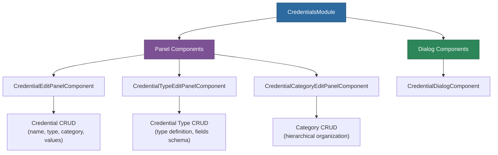

# @memberjunction/ng-credentials

Angular components for managing credentials, credential types, and credential categories in MemberJunction applications, with panel and dialog presentation modes.

## Overview

The `@memberjunction/ng-credentials` package provides reusable UI components for creating and editing credentials, credential types, and credential categories. Each component follows a panel + dialog pattern: panels can be embedded directly in pages, while dialog wrappers provide modal presentation.



## Installation

```bash
npm install @memberjunction/ng-credentials
```

## Usage

### Import the Module

```typescript
import { CredentialsModule } from '@memberjunction/ng-credentials';

@NgModule({
  imports: [CredentialsModule]
})
export class YourModule { }
```

### Credential Edit Panel

Embed a credential editor directly in your page:

```html
<mj-credential-edit-panel
  [credentialId]="selectedCredentialId"
  (saved)="onCredentialSaved($event)"
  (cancelled)="onEditCancelled()">
</mj-credential-edit-panel>
```

### Credential Dialog

Open a credential editor in a modal:

```html
<mj-credential-dialog
  [visible]="showCredentialDialog"
  [credentialId]="selectedCredentialId"
  (saved)="onCredentialSaved($event)"
  (dialogClosed)="onDialogClosed()">
</mj-credential-dialog>
```

### Credential Type Edit Panel

Manage credential type definitions:

```html
<mj-credential-type-edit-panel
  [credentialTypeId]="selectedTypeId"
  (saved)="onTypeSaved($event)"
  (cancelled)="onEditCancelled()">
</mj-credential-type-edit-panel>
```

### Credential Category Edit Panel

Organize credentials into categories:

```html
<mj-credential-category-edit-panel
  [categoryId]="selectedCategoryId"
  (saved)="onCategorySaved($event)"
  (cancelled)="onEditCancelled()">
</mj-credential-category-edit-panel>
```

## Exported Components

| Component | Selector | Description |
|-----------|----------|-------------|
| `CredentialEditPanelComponent` | `mj-credential-edit-panel` | Full credential editor form |
| `CredentialTypeEditPanelComponent` | `mj-credential-type-edit-panel` | Credential type definition editor |
| `CredentialCategoryEditPanelComponent` | `mj-credential-category-edit-panel` | Category management editor |
| `CredentialDialogComponent` | `mj-credential-dialog` | Modal wrapper for credential editing |

## Dependencies

| Package | Description |
|---------|-------------|
| `@memberjunction/core` | Core framework |
| `@memberjunction/core-entities` | Entity type definitions |
| `@memberjunction/global` | Global utilities |
| `@memberjunction/ng-shared-generic` | Shared generic components |
| `@progress/kendo-angular-dialog` | Dialog/modal support |
| `@progress/kendo-angular-buttons` | Button components |

### Peer Dependencies

- `@angular/common` ^21.x
- `@angular/core` ^21.x
- `@angular/forms` ^21.x

## Build

```bash
cd packages/Angular/Generic/credentials
npm run build
```

## License

ISC
