# @memberjunction/ng-dashboard-viewer

A pluggable Angular dashboard viewer for rendering and editing MemberJunction dashboards with configurable panels, multiple part types (Web URLs, Entity Views, Queries, Artifacts), and a dynamic plugin architecture.

## Overview

The `@memberjunction/ng-dashboard-viewer` package provides a complete dashboard rendering and editing system. Dashboards consist of panels containing parts, where each part type has a corresponding runtime renderer and configuration panel -- both loaded dynamically via MemberJunction's `ClassFactory` plugin system. The package includes a dashboard browser for navigating available dashboards, breadcrumb navigation, and built-in support for Web URL, Entity View, Query, and Artifact part types.

```mermaid
graph TD
    A[DashboardViewerModule] --> B[Core Components]
    A --> C[Config Panels]
    A --> D[Runtime Parts]
    A --> E[Dialogs]

    B --> B1[DashboardViewerComponent]
    B --> B2[DashboardBrowserComponent]
    B --> B3[DashboardBreadcrumbComponent]

    C --> C1["WebURLConfigPanel
    (@RegisterClass)"]
    C --> C2["ViewConfigPanel
    (@RegisterClass)"]
    C --> C3["QueryConfigPanel
    (@RegisterClass)"]
    C --> C4["ArtifactConfigPanel
    (@RegisterClass)"]

    D --> D1["WebURLPartComponent
    (@RegisterClass)"]
    D --> D2["ViewPartComponent
    (@RegisterClass)"]
    D --> D3["QueryPartComponent
    (@RegisterClass)"]
    D --> D4["ArtifactPartComponent
    (@RegisterClass)"]

    E --> E1[AddPanelDialogComponent]
    E --> E2[EditPartDialogComponent]
    E --> E3[ConfirmDialogComponent]

    style A fill:#2d6a9f,stroke:#1a4971,color:#fff
    style B fill:#7c5295,stroke:#563a6b,color:#fff
    style C fill:#2d8659,stroke:#1a5c3a,color:#fff
    style D fill:#b8762f,stroke:#8a5722,color:#fff
    style E fill:#7c5295,stroke:#563a6b,color:#fff
```



## Installation

```bash
npm install @memberjunction/ng-dashboard-viewer
```

## Usage

### Import the Module

```typescript
import { DashboardViewerModule } from '@memberjunction/ng-dashboard-viewer';

@NgModule({
  imports: [DashboardViewerModule]
})
export class YourModule { }
```

### Dashboard Viewer

Render a full dashboard by ID:

```html
<mj-dashboard-viewer
  [dashboardId]="selectedDashboardId"
  [editMode]="isEditing"
  (dashboardSaved)="onDashboardSaved($event)"
  (panelClicked)="onPanelClicked($event)">
</mj-dashboard-viewer>
```

### Dashboard Browser

Browse available dashboards with category filtering:

```html
<mj-dashboard-browser
  [categoryId]="selectedCategoryId"
  (dashboardSelected)="onDashboardSelected($event)">
</mj-dashboard-browser>
```

### Dashboard Breadcrumb

Navigation breadcrumb trail:

```html
<mj-dashboard-breadcrumb
  [dashboardId]="currentDashboardId"
  (navigate)="onBreadcrumbNavigate($event)">
</mj-dashboard-breadcrumb>
```

## Architecture

### Plugin System

Both config panels and runtime parts are registered with `@RegisterClass` and loaded dynamically via ClassFactory. This allows custom part types to be added without modifying the dashboard viewer itself.

#### Adding a Custom Part Type

1. Create a config panel component:

```typescript
import { RegisterClass } from '@memberjunction/global';
import { BaseDashboardConfigPanel } from '@memberjunction/ng-dashboard-viewer';

@RegisterClass(BaseDashboardConfigPanel, 'CustomChart')
@Component({
  selector: 'mj-custom-chart-config',
  template: `<!-- chart configuration form -->`
})
export class CustomChartConfigComponent extends BaseDashboardConfigPanel {
  // Configuration logic
}
```

2. Create a runtime part component:

```typescript
import { RegisterClass } from '@memberjunction/global';
import { BaseDashboardPart } from '@memberjunction/ng-dashboard-viewer';

@RegisterClass(BaseDashboardPart, 'CustomChart')
@Component({
  selector: 'mj-custom-chart-part',
  template: `<!-- chart rendering -->`
})
export class CustomChartPartComponent extends BaseDashboardPart {
  // Rendering logic
}
```

### Built-in Part Types

| Part Type | Config Panel | Runtime Part | Description |
|-----------|-------------|-------------|-------------|
| Web URL | `WebURLConfigPanelComponent` | `WebURLPartComponent` | Embedded web page via iframe |
| View | `ViewConfigPanelComponent` | `ViewPartComponent` | MJ Entity View grid/cards |
| Query | `QueryConfigPanelComponent` | `QueryPartComponent` | MJ Query results display |
| Artifact | `ArtifactConfigPanelComponent` | `ArtifactPartComponent` | Conversation artifact viewer |

## Component Reference

### DashboardViewerComponent

Main viewer component that renders a dashboard's panels and parts.

### DashboardBrowserComponent

Grid/list browser for navigating available dashboards with category tree sidebar.

### DashboardBreadcrumbComponent

Breadcrumb navigation showing the current dashboard path.

### Dialog Components

| Component | Description |
|-----------|-------------|
| `AddPanelDialogComponent` | Add a new panel to the dashboard |
| `EditPartDialogComponent` | Edit a part's configuration |
| `ConfirmDialogComponent` | Generic confirmation dialog |

## Dependencies

| Package | Description |
|---------|-------------|
| `@memberjunction/core` | Core framework |
| `@memberjunction/core-entities` | Entity type definitions |
| `@memberjunction/global` | Global utilities and ClassFactory |
| `@memberjunction/ng-artifacts` | Artifact viewer components |
| `@memberjunction/ng-entity-viewer` | Entity data grids |
| `@memberjunction/ng-query-viewer` | Query result display |
| `@memberjunction/ng-shared-generic` | Shared generic components |
| `@memberjunction/ng-trees` | Tree view components |

### Peer Dependencies

- `@angular/common` ^21.x
- `@angular/core` ^21.x
- `@angular/forms` ^21.x

## Build

```bash
cd packages/Angular/Generic/dashboard-viewer
npm run build
```

## License

ISC
