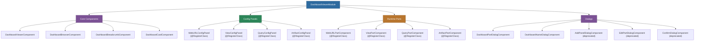

# @memberjunction/ng-dashboard-viewer

A pluggable Angular dashboard viewer for rendering and editing MemberJunction dashboards with configurable panels, multiple part types (Web URLs, Entity Views, Queries, Artifacts), and a dynamic plugin architecture.

## Overview

The `@memberjunction/ng-dashboard-viewer` package provides a complete dashboard rendering and editing system. Dashboards consist of panels containing parts, where each part type has a corresponding runtime renderer and configuration panel -- both loaded dynamically via MemberJunction's `ClassFactory` plugin system. The package includes a dashboard browser for navigating available dashboards, breadcrumb navigation, and built-in support for Web URL, Entity View, Query, and Artifact part types.


```mermaid
graph TD
    A[DashboardViewerModule] --> B[Core Components]
    A --> C[Config Panels]
    A --> D[Runtime Parts]
    A --> E[Dialogs]

    B --> B1[DashboardViewerComponent]
    B --> B2[DashboardBrowserComponent]
    B --> B3[DashboardBreadcrumbComponent]
    B --> B4[DashboardCardComponent]

    C --> C1["WebURLConfigPanel
    (@RegisterClass)"]
    C --> C2["ViewConfigPanel
    (@RegisterClass)"]
    C --> C3["QueryConfigPanel
    (@RegisterClass)"]
    C --> C4["ArtifactConfigPanel
    (@RegisterClass)"]

    D --> D1["WebURLPartComponent
    (@RegisterClass)"]
    D --> D2["ViewPartComponent
    (@RegisterClass)"]
    D --> D3["QueryPartComponent
    (@RegisterClass)"]
    D --> D4["ArtifactPartComponent
    (@RegisterClass)"]

    E --> E0[DashboardPartDialogComponent]
    E --> E4[DashboardNameDialogComponent]
    E --> E1["AddPanelDialogComponent (deprecated)"]
    E --> E2["EditPartDialogComponent (deprecated)"]
    E --> E3["ConfirmDialogComponent (deprecated)"]

    style A fill:#2d6a9f,stroke:#1a4971,color:#fff
    style B fill:#7c5295,stroke:#563a6b,color:#fff
    style C fill:#2d8659,stroke:#1a5c3a,color:#fff
    style D fill:#b8762f,stroke:#8a5722,color:#fff
    style E fill:#7c5295,stroke:#563a6b,color:#fff
```

## Installation

```bash
npm install @memberjunction/ng-dashboard-viewer
```

## Usage

### Import the Module

```typescript
import { DashboardViewerModule } from '@memberjunction/ng-dashboard-viewer';

@NgModule({
  imports: [DashboardViewerModule]
})
export class YourModule { }
```

### Dashboard Viewer

Render a full dashboard by ID:

```html
<mj-dashboard-viewer
  [DashboardId]="selectedDashboardId"
  [IsEditing]="isEditing"
  [CanEdit]="canEdit"
  (DashboardSaved)="onDashboardSaved($event)"
  (PanelInteraction)="onPanelInteraction($event)">
</mj-dashboard-viewer>
```

The viewer asks the host to add, edit or remove a part through `PanelInteraction`; see [DashboardViewerComponent](#dashboardviewercomponent).

### Dashboard Browser

Browse dashboards as cards or as a list, by category folder:

```html
<mj-dashboard-browser
  [Dashboards]="dashboards"
  [Categories]="categories"
  [SelectedCategoryId]="selectedCategoryId"
  [DashboardPermissions]="permissions"
  (DashboardOpen)="onDashboardOpen($event)"
  (DashboardEdit)="onDashboardEdit($event)"
  (DashboardDelete)="onDashboardDelete($event)">
</mj-dashboard-browser>
```

Set `[FlatMode]="true"` to show every dashboard you pass in one flat list, with no folder scoping and no folder cards (for example, a list of favorites or of dashboards shared with the user). Flat mode ignores `SelectedCategoryId`, so new dashboards and categories are created at the root.

Each dashboard in the card view is an `mj-dashboard-card` (see [Dashboard Card](#dashboard-card)). These inputs fill the cards and the empty state:

| Input | Default | Description |
|-------|---------|-------------|
| `FavoriteIds` | `[]` | IDs of the user's favorite dashboards. Their cards show a filled star. IDs match in any letter case. |
| `ShowFavorites` | `false` | Shows the star on each card. Turn it on when the host handles `DashboardFavoriteToggle`. |
| `OwnerLabels` | empty | Map of dashboard ID to the owner text its card shows, for example `"You"` or `"Ana Ruiz"`. A dashboard that is not in the map shows no owner. |
| `FlatEmptyIcon`, `FlatEmptyTitle`, `FlatEmptyMessage` | "No dashboards to show" | The empty state of a flat list with no dashboards and no search. |
| `FlatEmptyWelcome` | `false` | An empty flat list with no search shows the first-run welcome instead. |

- `DashboardFavoriteToggle` gives a `DashboardFavoriteToggleEvent` (`{ Dashboard }`) when the user clicks a card's star. The browser does not change `FavoriteIds` itself; the host updates it.
- A card shows the Shared marker for a dashboard the user can read but does not own (from `DashboardPermissions`).
- In flat mode each card also shows its category path (the user's filing, from `EffectiveCategoryMap`, else the dashboard's category).
- Outside selection mode, a click on a card opens the dashboard (`DashboardOpen`), and a Shift, Ctrl or Cmd click sets `OpenInNewTab`. In selection mode, a Ctrl or Cmd click toggles the card, a Shift-click selects a range, and the card's checkbox toggles it. A double-click emits `DashboardEdit`.

### Dashboard Layout Preview

A miniature of a dashboard's saved panel layout, for dashboard cards: each panel is a box with its icon and title, sized like the saved layout. It fills its container, renders only phrasing elements (so it can sit inside a button), and is `aria-hidden`, so the host must name the dashboard. It draws nothing when `UIConfigDetails` has no panel layout. `BuildDashboardLayoutPreview(uiConfigDetails)` returns the tree it draws, or null, so a host can choose another picture first. A host that already has the tree passes it in `[Preview]`, and the configuration is not parsed again.

```html
<mj-dashboard-layout-preview [UIConfigDetails]="dashboard.UIConfigDetails"></mj-dashboard-layout-preview>
<mj-dashboard-layout-preview [Preview]="tree"></mj-dashboard-layout-preview>
```

### Dashboard Card

One dashboard as a card: a picture, the name, the description, and a meta row with the owner, a Shared marker, the category path and the last update. The picture is the dashboard's screenshot (`Thumbnail`), else a miniature of its saved panel layout, else an icon. A Config dashboard with no parts shows the icon and "Not set up yet", also when it has an old screenshot. The card is presentational: the host gives it its state and decides what each event does.

```html
<mj-dashboard-card
  [Dashboard]="dashboard"
  [IsFavorite]="isFavorite"
  [IsShared]="isShared"
  [OwnerLabel]="ownerLabel"
  [CategoryPath]="categoryPath"
  (CardClick)="open($event.Dashboard, $event.MouseEvent)"
  (ToggleFavorite)="toggleFavorite($event)">
</mj-dashboard-card>
```

- Inputs: `Dashboard` (required), `IsFavorite`, `ShowFavorite` (default `true`), `IsShared`, `OwnerLabel` and `CategoryPath` (null shows none), `HighlightQuery` (search text to mark in the name and description), `Selectable` and `Selected` (the selection checkbox), `CanEdit` and `CanDelete` (the Edit and Delete buttons).
- `CardClick` and `CardDoubleClick` give a `DashboardCardClickEvent` (`{ Dashboard, MouseEvent }`), so the host can read the Shift, Ctrl and Cmd keys. A click on a card button counts only as that button: `ToggleFavorite`, `Edit`, `Delete` and `SelectionToggle` each emit the dashboard.
- The card never shows the dashboard's `User` field (the owner's user name, often an e-mail). Pass the text to show in `OwnerLabel`.
- Helpers: `IsDashboardNotSetUp(dashboard)`, `FormatDashboardDate(date)` ("Today", "Yesterday", "N days ago" under a week, else the local date) and `DashboardCategoryPath(categoryId, categories)` (for example "Sales › Pipeline").
- A module that declares the card itself (for example a test module) also declares `DashboardLayoutPreviewComponent` and `DashboardLayoutPreviewNodeComponent`.

### Part Dialog

One dialog, on `mj-dialog`, adds a part or edits one. It shows the part type tiles, the part type's settings panel as the Source section, the title and, for a query, the parameter-controls and automatic refresh options. Create it with `@if` each time it opens:

```html
@if (PartDialogMode) {
  <mj-dashboard-part-dialog
    [Visible]="true"
    [Mode]="PartDialogMode"
    [PartTypes]="viewer.PartTypes"
    [Panel]="EditPartPanel"
    [Provider]="Provider"
    (Saved)="OnPartDialogSaved($event)"
    (Cancelled)="PartDialogMode = null">
  </mj-dashboard-part-dialog>
}
```

- `Mode` is `'add'` or `'edit'`. In edit mode, `Panel` is the part. Its part type cannot change, so the other type tiles are disabled.
- `Saved` gives a `DashboardPartDialogResult`: `{ PartType, Config, Title, Icon? }`. Pass it to the viewer's `AddPanel(r.PartType.ID, r.Config, r.Title, r.Icon)` or `UpdatePanelConfig(panel.id, r.Config, r.Title, r.Icon)`, then close the dialog. The dialog does not close itself.
- The tiles show the active part types by `SortOrder`, with the part type's metadata `Icon`.
- An empty title gives the part the name of its source. The title field's placeholder shows that name.
- A query part's refresh interval is one of `QUERY_REFRESH_SECONDS` (30, 60, 300 or 600 seconds).
- The dialog loads the settings panel that ClassFactory registers under the part type's `ConfigDialogClass`. It passes the panel its `Provider` and sets the panel's `ShowCommonFields` to `false`, so the panel leaves out the title and query options that the dialog shows itself. A part type without a settings panel gets a config that names only its type.

### Name Dialog

Asks for the name of a new dashboard before the host creates it. The component is standalone, so the host imports `DashboardNameDialogComponent` itself:

```html
<mj-dashboard-name-dialog
  [Visible]="ShowNewDashboardDialog"
  [MaxLength]="NewDashboardNameMaxLength"
  [Processing]="IsCreatingDashboard"
  (Confirmed)="OnNewDashboardNamed($event)"
  (Cancelled)="OnNewDashboardCancelled()">
</mj-dashboard-name-dialog>
```

- Create stays disabled until the trimmed name has 1 to `MaxLength` characters. The default is `DASHBOARD_NAME_MAX_LENGTH` (255, the length of `MJ: Dashboards.Name`).
- Create, or Enter in the field, emits `Confirmed` with the trimmed name, and the dialog stays open. The host creates the dashboard, sets `Processing` while it saves, and closes the dialog through `Visible`.
- Cancel, Esc, the backdrop and the close button emit `Cancelled`. The host closes the dialog and creates nothing.
- `Title` ("New dashboard"), `ConfirmText` ("Create") and `Placeholder` ("Name this dashboard") change the texts. The name field is empty each time the dialog opens.

### Dashboard Breadcrumb

The path from the root to a category, and optionally the current dashboard:

```html
<mj-dashboard-breadcrumb
  [Categories]="categories"
  [CurrentCategoryId]="selectedCategoryId"
  [CurrentDashboard]="dashboard"
  [ShowDashboardName]="true"
  RootLabel="Dashboards"
  RootIcon="fa-solid fa-gauge-high"
  (Navigate)="onBreadcrumbNavigate($event)"
  (DashboardDrop)="onDashboardDrop($event)">
</mj-dashboard-breadcrumb>
```

- `Navigate` gives a `BreadcrumbNavigateEvent` (`{ CategoryId, Category }`; null for the root) when the user clicks a crumb. The last category crumb emits it only when `ShowDashboardName` is true.
- `DashboardDrop` gives a `BreadcrumbDropEvent` (`{ TargetCategoryId, DashboardIds }`) when the user drops dashboards on a crumb. Set `AllowDragDrop` (default `true`) to `false` to turn this off.
- Set `Visible` (default `true`) to `false` to hide it. `Size` is `'normal'` or `'large'`.

## Architecture

### Plugin System

Both config panels and runtime parts are registered with `@RegisterClass` and loaded dynamically via ClassFactory. This allows custom part types to be added without modifying the dashboard viewer itself.

#### Adding a Custom Part Type

1. Create a config panel component:

```typescript
import { RegisterClass } from '@memberjunction/global';
import { BaseDashboardConfigPanel } from '@memberjunction/ng-dashboard-viewer';

@RegisterClass(BaseDashboardConfigPanel, 'CustomChart')
@Component({
  selector: 'mj-custom-chart-config',
  template: `<!-- chart configuration form -->`
})
export class CustomChartConfigComponent extends BaseDashboardConfigPanel {
  // Configuration logic
}
```

   The part dialog shows the title field itself and sets the panel's `ShowCommonFields` input to `false`. If the panel has its own title field, wrap it in `@if (ShowCommonFields) { … }`.

2. Create a runtime part component:

```typescript
import { RegisterClass } from '@memberjunction/global';
import { BaseDashboardPart } from '@memberjunction/ng-dashboard-viewer';

@RegisterClass(BaseDashboardPart, 'CustomChart')
@Component({
  selector: 'mj-custom-chart-part',
  template: `<!-- chart rendering -->`
})
export class CustomChartPartComponent extends BaseDashboardPart {
  // Rendering logic
}
```

### Built-in Part Types

| Part Type | Config Panel | Runtime Part | Description |
|-----------|-------------|-------------|-------------|
| Web URL | `WebURLConfigPanelComponent` | `WebURLPartComponent` | Embedded web page via iframe |
| View | `ViewConfigPanelComponent` | `ViewPartComponent` | MJ Entity View grid/cards |
| Query | `QueryConfigPanelComponent` | `QueryPartComponent` | MJ Query results display |
| Artifact | `ArtifactConfigPanelComponent` | `ArtifactPartComponent` | Conversation artifact viewer |

## Component Reference

### DashboardViewerComponent

Main viewer component that renders a dashboard's panels and parts.

The viewer reads the dashboard's saved layout (`UIConfigDetails`) when it gets the dashboard. Two methods keep a host in step with saves made elsewhere:

- `HasNewerSavedLayout(dashboard?)` returns true when the saved layout differs from the one the viewer last loaded or saved, for example after another tab saved the dashboard. Pass another copy of the dashboard to compare that copy.
- `ReloadFromSaved(dashboard?)` shows the saved layout again (of the given copy, if any) and drops unsaved layout changes. An edit-mode change made right after the call applies to the new layout. A hidden viewer builds the layout when its container gets a size.
- `UseSavedCopy(dashboard)` takes another copy of the shown dashboard whose saved layout is the one shown (for example after `DashboardEngine` reloaded its dashboards), without rebuilding the layout. Later saves write that copy. It returns false for a copy of another dashboard or with another saved layout.

Editing:

- `IsEditing` puts the dashboard in edit mode. `CanEdit` (default `false`) tells the viewer that the user may edit the dashboard: an empty dashboard then offers Add part in view mode too, and the host decides how to enter edit mode.
- The parts are tabs in tab groups (Golden Layout stacks). In edit mode, each tab group's header has an Edit part button and a Remove button, which act on the group's active part. Tabs can be dragged only in edit mode. In both modes, the keyboard reaches each tab, and Enter or Space shows it.
- The viewer does not open a dialog itself. It asks the host through `PanelInteraction`, with `interactionType: 'custom'` and one of these payloads:

| `payload.action` | When | Also in the event |
|------------------|------|-------------------|
| `add-panel-requested` | Add part (the toolbar, or the empty state) | `payload.partTypes` |
| `configure-part-requested` | Edit part | `panelId` |
| `remove-part-requested` | Remove | `panelId`, `payload.panelTitle`, `payload.partTypeName` (the `MJ: Dashboard Part Types` name, or null) |

- `RemovePartConfirmOptions(panelTitle, partTypeName)` gives the texts of the Remove part confirm, for `MJConfirmService.ConfirmDelete`: for example `Remove "Revenue" from this dashboard?`, and for the four built-in part types a detail line that says the view, query, artifact or page itself is not deleted.

### GoldenLayoutWrapperService

The viewer's Golden Layout wrapper. In edit mode, `OnStackAction` emits a `StackActionEvent` (`{ Action, PanelId }`) when the user clicks Edit part (`Action: 'edit'`) or Remove (`'remove'`) in a tab group's header; `PanelId` is the group's active part at the time of the click. `DASHBOARD_STACK_HEADER_HEIGHT` (44) and `DASHBOARD_TAB_CONTROL_OFFSET` (78) are the header height and the room kept beside the tabs, in pixels. The wrapper writes both into each layout it loads, and the viewer CSS uses the same values.

### DashboardBrowserComponent

Grid/list browser for navigating available dashboards with category tree sidebar. Each dashboard in the grid is an `mj-dashboard-card`; see [Dashboard Browser](#dashboard-browser) for the inputs that fill the cards.

Delete asks the user to confirm through `MJConfirmService` (from `@memberjunction/ng-ui-components`), then emits `DashboardDelete`. The host deletes the dashboards and does not ask again.

### DashboardCardComponent

One dashboard as a card (`<mj-dashboard-card>`); see [Dashboard Card](#dashboard-card).

### DashboardBreadcrumbComponent

Breadcrumb navigation showing the current dashboard path.

### Dialog Components

| Component | Description |
|-----------|-------------|
| `DashboardPartDialogComponent` | Adds a part or edits one (`<mj-dashboard-part-dialog>`); see [Part Dialog](#part-dialog) |
| `DashboardNameDialogComponent` | Asks for a new dashboard's name (`<mj-dashboard-name-dialog>`, standalone); see [Name Dialog](#name-dialog) |
| `AddPanelDialogComponent` | Deprecated. Use `DashboardPartDialogComponent` with `Mode="add"` |
| `EditPartDialogComponent` | Deprecated. Use `DashboardPartDialogComponent` with `Mode="edit"` |
| `ConfirmDialogComponent` | Deprecated. Use `MJConfirmService` (or `MJConfirmDialogComponent`) from `@memberjunction/ng-ui-components`. MJ Explorer's dashboard tab still renders it for its two Dashboard Studio confirms |

## Dependencies

| Package | Description |
|---------|-------------|
| `@memberjunction/core` | Core framework |
| `@memberjunction/core-entities` | Entity type definitions |
| `@memberjunction/global` | Global utilities and ClassFactory |
| `@memberjunction/ng-artifacts` | Artifact viewer components |
| `@memberjunction/ng-entity-viewer` | Entity data grids |
| `@memberjunction/ng-query-viewer` | Query result display |
| `@memberjunction/ng-shared-generic` | Shared generic components |
| `@memberjunction/ng-trees` | Tree view components |
| `@memberjunction/ng-ui-components` | Dialogs, buttons, empty state, and `MJConfirmService` |

### Peer Dependencies

- `@angular/common` ^21.x
- `@angular/core` ^21.x
- `@angular/forms` ^21.x

## Build

```bash
cd packages/Angular/Generic/dashboard-viewer
npm run build
```

## License

Business Source License 1.1 — see [LICENSE](../../../../LICENSE) for details.
