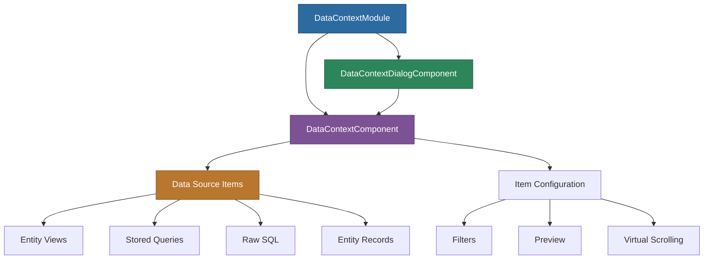

# @memberjunction/ng-data-context

Angular components for managing MemberJunction Data Contexts -- reusable collections of data sources (views, queries, raw SQL) that can be composed and referenced by reports, dashboards, and AI prompts.

## Overview

The `@memberjunction/ng-data-context` package provides an interactive component for creating, editing, and previewing data contexts. A data context defines one or more data source items (entity views, stored queries, or raw SQL statements) along with optional filters, and packages them into a named, reusable unit. The package includes both an inline component and a dialog wrapper.



## Installation

```bash
npm install @memberjunction/ng-data-context
```

## Usage

### Import the Module

```typescript
import { DataContextModule } from '@memberjunction/ng-data-context';

@NgModule({
  imports: [DataContextModule]
})
export class YourModule { }
```

### Inline Component

```html
<mj-data-context
  [dataContextId]="'your-data-context-id'"
  [Provider]="customMetadataProvider">
</mj-data-context>
```

### Dialog Component

```html
<mj-data-context-dialog
  [dataContextId]="selectedDataContextId"
  [Provider]="metadataProvider"
  (dialogClosed)="onDialogClosed()">
</mj-data-context-dialog>
```

### Complete Example

```typescript
import { Component } from '@angular/core';
import { IMetadataProvider, Metadata } from '@memberjunction/core';

@Component({
  selector: 'app-data-context-viewer',
  template: `
    <mj-data-context
      [dataContextId]="selectedDataContextId"
      [Provider]="metadataProvider">
    </mj-data-context>

    <button (click)="showDialog()">View in Dialog</button>

    @if (isDialogVisible) {
      <mj-data-context-dialog
        [dataContextId]="selectedDataContextId"
        [Provider]="metadataProvider"
        (dialogClosed)="onDialogClose()">
      </mj-data-context-dialog>
    }
  `
})
export class DataContextViewerComponent {
  isDialogVisible = false;
  selectedDataContextId = '12345-67890-abcdef';
  metadataProvider: IMetadataProvider;

  constructor() {
    this.metadataProvider = Metadata.Provider;
  }

  showDialog(): void {
    this.isDialogVisible = true;
  }

  onDialogClose(): void {
    this.isDialogVisible = false;
  }
}
```

## API Reference

### DataContextComponent (`mj-data-context`)

Main component for displaying a data context and its items.

#### Inputs

| Input | Type | Required | Default | Description |
|-------|------|----------|---------|-------------|
| `dataContextId` | `string` | Yes | - | The ID of the data context to display |
| `Provider` | `IMetadataProvider \| null` | No | `Metadata.Provider` | Custom metadata provider |

### DataContextDialogComponent (`mj-data-context-dialog`)

Dialog wrapper displaying the DataContextComponent in a Kendo dialog.

#### Inputs

| Input | Type | Required | Default | Description |
|-------|------|----------|---------|-------------|
| `dataContextId` | `string` | Yes | - | The ID of the data context to display |
| `Provider` | `IMetadataProvider \| null` | No | `null` | Custom metadata provider |

#### Outputs

| Output | Type | Description |
|--------|------|-------------|
| `dialogClosed` | `EventEmitter<void>` | Emitted when the dialog is closed |

## Data Context Structure

A data context in MemberJunction consists of:

1. **Context Record** (`DataContextEntity`) -- ID, Name, Description, and metadata
2. **Context Items** (`Data Context Items` entity) with the following types:
   - `SQL` -- Direct SQL query
   - `View` -- Reference to a saved view
   - `Query` -- Reference to a stored query
   - `Entity` -- Reference to an entity
   - `Record` -- Specific record reference

## Features

- **Multi-source composition**: Combine entity views, stored queries, raw SQL, and specific records into a single named context
- **Virtual scrolling**: Efficient handling of large datasets via Kendo Grid
- **Column sorting and resizing**: Interactive grid features
- **Metadata integration**: Uses MemberJunction's metadata system for entity loading
- **Loading state management**: Built-in loading indicators
- **Custom provider support**: Works with custom metadata providers for multi-tenant scenarios
- **Error handling**: Logs errors via MemberJunction's `LogError` function

## Dependencies

### Runtime Dependencies

| Package | Description |
|---------|-------------|
| `@memberjunction/core` | Core MemberJunction framework |
| `@memberjunction/core-entities` | Entity type definitions |
| `@memberjunction/global` | Global utilities |
| `@memberjunction/ng-container-directives` | Container directives |
| `@memberjunction/ng-shared` | Shared Angular utilities |
| `@progress/kendo-angular-grid` | Grid with virtual scrolling |
| `@progress/kendo-angular-indicators` | Loading indicators |
| `@progress/kendo-angular-dialog` | Dialog component |
| `@progress/kendo-angular-buttons` | Button components |

### Peer Dependencies

- `@angular/common` ^21.x
- `@angular/core` ^21.x

## Build

```bash
cd packages/Angular/Generic/data-context
npm run build
```

## License

ISC
