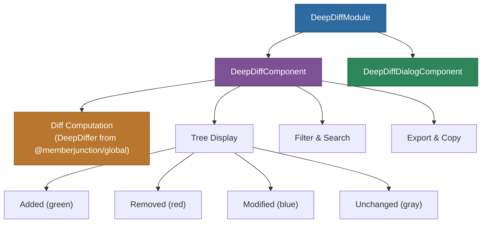

# @memberjunction/ng-deep-diff

Angular component for visualizing deep object differences using the non-visual `DeepDiffer` functionality from `@memberjunction/global`. Provides both an inline comparison view and a dialog wrapper.

## Overview

The `@memberjunction/ng-deep-diff` package renders a hierarchical diff of two JavaScript objects, highlighting additions, removals, and modifications. It supports expandable tree navigation, change type filtering, text search, copy-to-clipboard, and JSON export. A dialog variant wraps the inline component for modal use.



## Installation

```bash
npm install @memberjunction/ng-deep-diff
```

## Usage

### Import the Module

```typescript
import { DeepDiffModule } from '@memberjunction/ng-deep-diff';

@NgModule({
  imports: [
    DeepDiffModule,
    // ... other imports
  ]
})
export class YourModule { }
```

### Basic Component Usage

```html
<mj-deep-diff
  [oldValue]="originalData"
  [newValue]="modifiedData"
  [title]="'Data Comparison'"
  [showSummary]="true"
  [showUnchanged]="false">
</mj-deep-diff>
```

### Dialog Usage

```html
<mj-deep-diff-dialog
  [(visible)]="showDiffDialog"
  [oldValue]="originalData"
  [newValue]="modifiedData"
  [title]="'Compare Changes'"
  [width]="'90%'"
  [height]="'80vh'">
</mj-deep-diff-dialog>
```

## Component Properties

### DeepDiffComponent

| Property | Type | Default | Description |
|----------|------|---------|-------------|
| `oldValue` | `Record<string, unknown>` | - | The original value to compare |
| `newValue` | `Record<string, unknown>` | - | The new value to compare against |
| `title` | `string` | `'Deep Diff Analysis'` | Title displayed in the header |
| `showSummary` | `boolean` | `true` | Whether to show summary statistics |
| `showUnchanged` | `boolean` | `false` | Whether to show unchanged properties |
| `expandAll` | `boolean` | `false` | Whether to expand all nodes by default |
| `maxDepth` | `number` | `10` | Maximum depth to traverse in nested objects |
| `maxStringLength` | `number` | `100` | Maximum string length before truncation |
| `truncateValues` | `boolean` | `true` | Whether to truncate long values |
| `treatNullAsUndefined` | `boolean` | `false` | Whether to treat null values as equivalent to undefined |

### DeepDiffDialogComponent

All properties from DeepDiffComponent, plus:

| Property | Type | Default | Description |
|----------|------|---------|-------------|
| `visible` | `boolean` | `false` | Controls dialog visibility |
| `width` | `string` | `'80%'` | Dialog width |
| `height` | `string` | `'80vh'` | Dialog height |

## Features

- **Hierarchical Display**: Nested objects and arrays are displayed in an expandable tree structure
- **Change Type Filtering**: Filter by added, removed, modified, or unchanged items
- **Text Search**: Search through paths and descriptions
- **Copy Functionality**: Copy paths and values to clipboard
- **Export**: Export diff results as JSON
- **Responsive Design**: Works on desktop and mobile devices
- **Performance**: Handles large objects with configurable depth limits
- **Null Handling**: Optional treatment of null as undefined for API compatibility

## Examples

### Basic Comparison

```typescript
export class MyComponent {
  originalData = {
    name: 'John Doe',
    age: 30,
    email: 'john@example.com'
  };

  modifiedData = {
    name: 'John Doe',
    age: 31,
    email: 'john.doe@example.com',
    phone: '+1234567890'
  };
}
```

```html
<mj-deep-diff
  [oldValue]="originalData"
  [newValue]="modifiedData">
</mj-deep-diff>
```

### API Response Comparison with Null Handling

```typescript
export class ApiComponent {
  apiResponse1 = {
    id: 123,
    name: null,
    description: 'Product',
    price: 99.99
  };

  apiResponse2 = {
    id: 123,
    name: 'Updated Product',
    description: null,
    price: 89.99
  };
}
```

```html
<mj-deep-diff
  [oldValue]="apiResponse1"
  [newValue]="apiResponse2"
  [treatNullAsUndefined]="true"
  [showSummary]="true">
</mj-deep-diff>
```

### Dialog with Custom Configuration

```typescript
export class ConfigComponent {
  showComparison = false;

  compareVersions() {
    this.showComparison = true;
  }
}
```

```html
<button (click)="compareVersions()">Compare Versions</button>

<mj-deep-diff-dialog
  [(visible)]="showComparison"
  [oldValue]="version1"
  [newValue]="version2"
  [title]="'Version Comparison'"
  [expandAll]="true"
  [maxDepth]="5"
  [width]="'95%'"
  [height]="'90vh'">
</mj-deep-diff-dialog>
```

## Styling

The component uses CSS classes that can be customized:

- `.diff-added` -- Added items (green)
- `.diff-removed` -- Removed items (red)
- `.diff-modified` -- Modified items (blue)
- `.diff-unchanged` -- Unchanged items (gray)

## Dependencies

| Package | Description |
|---------|-------------|
| `@memberjunction/global` | Provides the core `DeepDiffer` functionality |
| `@angular/common` | Angular common module |
| `@angular/core` | Angular core framework |

### Peer Dependencies

- `@angular/common` ^21.x
- `@angular/core` ^21.x

## Build

```bash
cd packages/Angular/Generic/deep-diff
npm run build
```

## License

ISC
