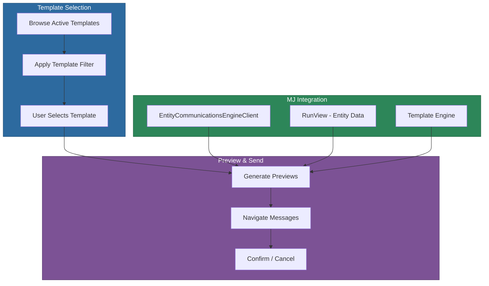

# @memberjunction/ng-entity-communications

Angular components for selecting message templates, previewing communications with live entity data, and sending messages to recipients within the MemberJunction framework.

## Overview

The `@memberjunction/ng-entity-communications` package provides a two-step communication workflow: first, users browse and select from available message templates; then they preview how those templates render against actual entity data before sending. The package includes both an inline preview component and a dialog wrapper for modal presentation.



## Installation

```bash
npm install @memberjunction/ng-entity-communications
```

## Usage

### Import the Module

```typescript
import { EntityCommunicationsModule } from '@memberjunction/ng-entity-communications';

@NgModule({
  imports: [EntityCommunicationsModule]
})
export class YourModule { }
```

### Inline Preview Component

```html
<mj-entity-communications-preview
  [entityInfo]="entityInfo"
  [runViewParams]="runViewParams"
  [templateFilter]="'TemplateType = ''Email'''"
  (templateSelected)="onTemplateSelected($event)">
</mj-entity-communications-preview>
```

### Dialog Component

```html
@if (showPreview) {
  <mj-entity-communications-preview-window
    [entityInfo]="customerEntityInfo"
    [runViewParams]="customerViewParams"
    [DialogVisible]="showPreview"
    [Title]="'Customer Email Preview'"
    (DialogClosed)="onPreviewClosed($event)">
  </mj-entity-communications-preview-window>
}
```

### Complete Example

```typescript
import { Component } from '@angular/core';
import { EntityInfo, Metadata, RunViewParams } from '@memberjunction/core';
import { TemplateEntityExtended } from '@memberjunction/templates-base-types';

@Component({
  selector: 'app-customer-communication',
  template: `
    <button (click)="showPreview = true">Preview Customer Emails</button>

    @if (showPreview) {
      <mj-entity-communications-preview-window
        [entityInfo]="customerEntityInfo"
        [runViewParams]="customerViewParams"
        [DialogVisible]="showPreview"
        [Title]="'Customer Email Preview'"
        (DialogClosed)="onPreviewClosed($event)">
      </mj-entity-communications-preview-window>
    }
  `
})
export class CustomerCommunicationComponent {
  showPreview = false;
  customerEntityInfo: EntityInfo;
  customerViewParams: RunViewParams;

  constructor() {
    const md = new Metadata();
    this.customerEntityInfo = md.Entities.find(e => e.Name === 'Customers')!;
    this.customerViewParams = {
      EntityName: 'Customers',
      ExtraFilter: 'IsActive = 1',
      OrderBy: 'LastContactDate ASC',
      ResultType: 'entity_object'
    };
  }

  onPreviewClosed(confirmed: boolean) {
    this.showPreview = false;
    if (confirmed) {
      console.log('User confirmed sending emails');
    }
  }
}
```

## API Reference

### EntityCommunicationsPreviewComponent (`mj-entity-communications-preview`)

Main component for template selection and message preview.

#### Inputs

| Input | Type | Description |
|-------|------|-------------|
| `entityInfo` | `EntityInfo` | Entity metadata for the communication recipients |
| `runViewParams` | `RunViewParams` | Parameters for loading entity data |
| `templateFilter` | `string` | SQL filter expression for available templates |

#### Outputs

| Output | Type | Description |
|--------|------|-------------|
| `templateSelected` | `EventEmitter<TemplateEntityExtended>` | Emitted when a template is selected |

### EntityCommunicationsPreviewWindowComponent (`mj-entity-communications-preview-window`)

Dialog wrapper around the preview component.

#### Inputs

| Input | Type | Default | Description |
|-------|------|---------|-------------|
| `DialogVisible` | `boolean` | - | Controls dialog visibility |
| `Title` | `string` | `'Communications Preview'` | Dialog title |
| `Width` | `number` | `650` | Dialog width in pixels |
| `Height` | `number` | `600` | Dialog height in pixels |
| `MinWidth` | `number` | `400` | Minimum dialog width |
| `MinHeight` | `number` | `350` | Minimum dialog height |
| `Resizable` | `boolean` | `true` | Whether the dialog can be resized |
| `entityInfo` | `EntityInfo` | - | Entity metadata |
| `runViewParams` | `RunViewParams` | - | View parameters for data loading |

#### Outputs

| Output | Type | Description |
|--------|------|-------------|
| `DialogClosed` | `EventEmitter<boolean>` | `true` if confirmed, `false` if canceled |

## Process Flow

1. **Template Selection** -- Component loads active templates filtered by the `templateFilter` expression. User browses and selects a template.
2. **Preview Generation** -- The selected template is processed against entity data from `runViewParams` using `EntityCommunicationsEngineClient`. A loading indicator shows during processing.
3. **Preview Navigation** -- VCR-style controls (first, previous, next, last) let the user browse through all generated preview messages, viewing processed subject lines and HTML bodies.
4. **Confirmation** (dialog mode) -- OK/Cancel buttons control the dialog, with `DialogClosed` emitting the user's choice.

## Dependencies

### Runtime Dependencies

| Package | Description |
|---------|-------------|
| `@memberjunction/core` | Metadata, entity framework, view execution |
| `@memberjunction/core-entities` | Entity type definitions |
| `@memberjunction/global` | Global utilities and event system |
| `@memberjunction/communication-types` | Message types and communication engine interfaces |
| `@memberjunction/entity-communications-base` | EntityCommunicationParams interface |
| `@memberjunction/entity-communications-client` | Client-side communication processing engine |
| `@memberjunction/templates-base-types` | Template engine and extended template types |
| `@memberjunction/ng-container-directives` | Container directive utilities |
| `@memberjunction/ng-shared` | Shared Angular utilities |
| `@memberjunction/ng-shared-generic` | Shared generic components |

### Peer Dependencies

- `@angular/common` ^21.x
- `@angular/core` ^21.x
- `@angular/forms` ^21.x
- `@angular/router` ^21.x
- `@progress/kendo-angular-buttons` ^22.x
- `@progress/kendo-angular-dialog` ^22.x
- `@progress/kendo-angular-listbox` ^22.x
- `@progress/kendo-angular-indicators` ^22.x

## Build

```bash
cd packages/Angular/Generic/entity-communication
npm run build
```

## License

ISC
