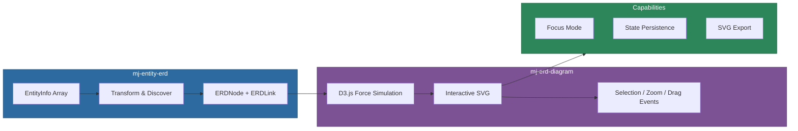

# @memberjunction/ng-entity-relationship-diagram

Angular components for rendering interactive Entity Relationship Diagrams (ERD) using D3.js force-directed graphs, with both a MemberJunction-specific wrapper and a generic reusable component.

## Overview

This package provides two complementary components for visualizing entity relationships:

1. **`<mj-entity-erd>`** -- A higher-level wrapper that accepts MemberJunction `EntityInfo[]` directly, handles automatic relationship discovery, and supports configurable depth traversal.
2. **`<mj-erd-diagram>`** -- A generic, lower-level component that works with plain `ERDNode[]` data, suitable for any project regardless of MemberJunction usage.



## Installation

```bash
npm install @memberjunction/ng-entity-relationship-diagram
```

## Which Component Should I Use?

| Use Case | Component | Why |
|----------|-----------|-----|
| MemberJunction project | `<mj-entity-erd>` | Auto-discovers relationships, handles transformation |
| Custom data sources | `<mj-erd-diagram>` | Full control over node/link data |
| Single entity + related | `<mj-entity-erd>` | Built-in depth/relationship discovery |
| Non-MJ Angular project | `<mj-erd-diagram>` | No MJ dependencies in your code |

## Usage

### Import the Module

```typescript
import { EntityRelationshipDiagramModule } from '@memberjunction/ng-entity-relationship-diagram';

@NgModule({
  imports: [EntityRelationshipDiagramModule]
})
export class YourModule { }
```

### MemberJunction Entity Wrapper

```typescript
import { EntityInfo, Metadata } from '@memberjunction/core';

@Component({
  selector: 'my-entity-viewer',
  template: `
    <mj-entity-erd
      [entities]="selectedEntities"
      [allEntities]="allEntities"
      [selectedEntityId]="currentEntityId"
      [depth]="1"
      [includeIncoming]="true"
      [includeOutgoing]="true"
      (entitySelected)="onEntitySelected($event)"
      (openRecord)="onOpenEntity($event)">
    </mj-entity-erd>
  `
})
export class MyEntityViewerComponent {
  allEntities: EntityInfo[] = [];
  selectedEntities: EntityInfo[] = [];
  currentEntityId: string | null = null;

  constructor() {
    const md = new Metadata();
    this.allEntities = md.Entities;
  }

  onEntitySelected(entity: EntityInfo) {
    this.currentEntityId = entity.ID;
  }

  onOpenEntity(entity: EntityInfo) {
    // Navigate to entity record
  }
}
```

### Generic ERD Component

```typescript
import { ERDNode, ERDNodeClickEvent } from '@memberjunction/ng-entity-relationship-diagram';

@Component({
  selector: 'my-schema-viewer',
  template: `
    <mj-erd-diagram
      [nodes]="entityNodes"
      [selectedNodeId]="selectedId"
      (nodeSelected)="onNodeSelected($event)"
      (nodeDoubleClick)="onNodeDoubleClick($event)">
    </mj-erd-diagram>
  `
})
export class SchemaViewerComponent {
  entityNodes: ERDNode[] = [
    {
      id: 'users',
      name: 'Users',
      fields: [
        { id: 'id', name: 'ID', isPrimaryKey: true, type: 'uuid' },
        { id: 'email', name: 'Email', isPrimaryKey: false, type: 'string' },
        { id: 'roleId', name: 'RoleID', isPrimaryKey: false, relatedNodeId: 'roles', relatedFieldName: 'ID' }
      ]
    },
    {
      id: 'roles',
      name: 'Roles',
      fields: [
        { id: 'id', name: 'ID', isPrimaryKey: true, type: 'uuid' },
        { id: 'name', name: 'Name', isPrimaryKey: false, type: 'string' }
      ]
    }
  ];
  selectedId: string | null = null;

  onNodeSelected(node: ERDNode) {
    this.selectedId = node.id;
  }
}
```

### Focus Mode

Show a single entity with its N-hop related entities:

```html
<mj-erd-diagram
  [nodes]="allNodes"
  [focusNodeId]="'users'"
  [focusDepth]="1"
  (nodeSelected)="onNodeSelected($event)">
</mj-erd-diagram>
```

| Depth | Description |
|-------|-------------|
| `0` | Show only the focus node |
| `1` | Focus node + directly related nodes |
| `2` | Focus node + nodes within 2 relationship hops |
| `3+` | Continue expanding the relationship graph |

## API Reference

### `<mj-entity-erd>` Inputs

| Input | Type | Default | Description |
|-------|------|---------|-------------|
| `entities` | `EntityInfo[]` | `[]` | Primary entities to display |
| `allEntities` | `EntityInfo[]` | `[]` | All entities for relationship discovery |
| `selectedEntityId` | `string \| null` | `null` | ID of currently selected entity |
| `depth` | `number` | `1` | Relationship hops to include |
| `includeIncoming` | `boolean` | `true` | Include entities referencing primary entities |
| `includeOutgoing` | `boolean` | `true` | Include entities referenced by primary entities |
| `showHeader` | `boolean` | `true` | Show header with zoom controls |
| `headerTitle` | `string` | `'Entity Relationship Diagram'` | Header title |
| `isRefreshing` | `boolean` | `false` | Show loading overlay |
| `readOnly` | `boolean` | `false` | Disable interactions |
| `config` | `ERDConfig` | `{}` | Configuration options |

### `<mj-entity-erd>` Outputs

| Output | Type | Description |
|--------|------|-------------|
| `entitySelected` | `EntityInfo` | Entity was selected |
| `entityDeselected` | `void` | Selection was cleared |
| `openRecord` | `EntityInfo` | Entity double-clicked |
| `stateChange` | `ERDState` | Diagram state changed |

### `<mj-erd-diagram>` Inputs

| Input | Type | Default | Description |
|-------|------|---------|-------------|
| `nodes` | `ERDNode[]` | `[]` | Nodes (entities) to display |
| `selectedNodeId` | `string \| null` | `null` | Currently selected node |
| `highlightedNodeIds` | `string[]` | `[]` | Highlighted node IDs |
| `focusNodeId` | `string \| null` | `null` | Focus mode target |
| `focusDepth` | `number` | `1` | Relationship hops in focus mode |
| `isRefreshing` | `boolean` | `false` | Show loading overlay |
| `readOnly` | `boolean` | `false` | Disable dragging and selection |
| `config` | `ERDConfig` | `{}` | Configuration options |
| `showHeader` | `boolean` | `true` | Show header with controls |
| `headerTitle` | `string` | `'Entity Relationship Diagram'` | Title in header |

### `<mj-erd-diagram>` Outputs

**Selection Events:**

| Output | Type | Description |
|--------|------|-------------|
| `nodeClick` | `ERDNodeClickEvent` | Node clicked (cancelable) |
| `nodeDoubleClick` | `ERDNodeDoubleClickEvent` | Node double-clicked |
| `nodeSelected` | `ERDNode` | Node selected |
| `nodeDeselected` | `void` | Selection cleared |
| `linkClick` | `ERDLinkClickEvent` | Relationship link clicked |

**Hover Events:**

| Output | Type | Description |
|--------|------|-------------|
| `nodeHover` | `ERDNodeHoverEvent` | Mouse entered a node |
| `nodeHoverEnd` | `ERDNode` | Mouse left a node |
| `linkHover` | `ERDLinkHoverEvent` | Mouse entered a link |
| `linkHoverEnd` | `ERDLink` | Mouse left a link |

**Context Menu Events:**

| Output | Type | Description |
|--------|------|-------------|
| `nodeContextMenu` | `ERDNodeContextMenuEvent` | Right-click on node |
| `linkContextMenu` | `ERDLinkContextMenuEvent` | Right-click on link |
| `diagramContextMenu` | `ERDDiagramContextMenuEvent` | Right-click on background |

**Diagram Events:**

| Output | Type | Description |
|--------|------|-------------|
| `nodeDragStart` | `ERDNodeDragEvent` | Drag started (cancelable) |
| `nodeDragEnd` | `ERDNodeDragEvent` | Drag ended |
| `zoomChange` | `ERDZoomEvent` | Zoom level or pan changed |
| `refreshRequested` | `void` | Refresh button clicked |
| `layoutComplete` | `void` | Force simulation completed |
| `stateChange` | `ERDState` | Any state change |

### Public Methods

Access via `@ViewChild(ERDDiagramComponent)`:

```typescript
// Zoom control
zoomIn(): void
zoomOut(): void
resetZoom(): void
zoomToNode(nodeId: string, scale?: number): void
zoomToFit(padding?: number): void
centerDiagram(): void

// Selection
selectNode(nodeId: string): boolean
deselectAll(): void

// Highlighting
highlightNode(nodeId: string): void
clearHighlights(): void
highlightRelated(nodeId: string, depth?: number): void
getRelatedNodes(nodeId: string, depth?: number): ERDRelationshipInfo[]

// State management
getState(): ERDState
setState(state: Partial<ERDState>, restorePositions?: boolean): void

// Layout control
freezeLayout(): void
unfreezeLayout(): void

// Utilities
refresh(): void
triggerResize(): void
getZoomState(): ERDZoomEvent
exportAsSVG(): string
```

## Configuration

```typescript
const config: ERDConfig = {
  // Node sizing
  nodeWidth: 180,
  nodeBaseHeight: 60,
  fieldHeight: 20,
  maxNodeHeight: 300,

  // Force simulation
  chargeStrength: -800,
  linkDistance: 80,
  collisionPadding: 20,

  // Display
  showFieldDetails: true,
  showRelationshipLabels: true,
  showHeader: true,
  showNodeCount: true,
  showMinimap: false,
  showLegend: false,

  // Interaction
  enableDragging: true,
  enableZoom: true,
  enablePan: true,
  minZoom: 0.1,
  maxZoom: 4,
  initialZoom: 1,
  enableMultiSelect: false,

  // Animation
  animationDuration: 750,
  fitOnLoad: true,

  // Layout
  layoutAlgorithm: 'force', // 'force' | 'horizontal' | 'vertical' | 'radial'

  // Colors
  colors: {
    nodeBackground: '#f8f9fa',
    nodeBorder: '#333',
    nodeHeader: '#007bff',
    nodeHeaderText: 'white',
    primaryKeyBackground: '#fff3cd',
    foreignKeyBackground: '#cce5ff',
    linkColor: '#666',
    selectedBorder: '#4CAF50',
    highlightBorder: '#ff9800',
    relatedBorder: '#ff6b35'
  }
};
```

## Data Interfaces

```typescript
interface ERDNode {
  id: string;
  name: string;
  schemaName?: string;
  description?: string;
  status?: string;
  baseTable?: string;
  fields: ERDField[];
  customData?: Record<string, unknown>;
}

interface ERDField {
  id: string;
  name: string;
  type?: string;
  isPrimaryKey: boolean;
  relatedNodeId?: string;
  relatedNodeName?: string;
  relatedFieldName?: string;
  description?: string;
  allowsNull?: boolean;
  defaultValue?: string;
  length?: number;
  isVirtual?: boolean;
  autoIncrement?: boolean;
  customData?: Record<string, unknown>;
}

interface ERDLink {
  sourceNodeId: string;
  targetNodeId: string;
  sourceField: ERDField;
  targetField?: ERDField;
  isSelfReference: boolean;
  relationshipType?: 'one-to-one' | 'one-to-many' | 'many-to-one' | 'many-to-many';
  label?: string;
}

interface ERDState {
  selectedNodeId: string | null;
  highlightedNodeIds: string[];
  zoomLevel: number;
  translateX: number;
  translateY: number;
  focusNodeId: string | null;
  focusDepth: number;
  nodePositions: Record<string, { x: number; y: number; fx?: number | null; fy?: number | null }>;
}
```

## Utility Functions

The package exports utility functions for transforming MemberJunction entities to ERD data:

```typescript
import {
  buildERDDataFromEntities,
  entityInfoToERDNode,
  entityFieldToERDField,
  entitiesToERDNodes,
  getOriginalEntityFromERDNode,
  findEntityByNodeId
} from '@memberjunction/ng-entity-relationship-diagram';

// Build complete ERD data with automatic relationship discovery
const { nodes, links } = buildERDDataFromEntities(primaryEntities, {
  allEntities: md.Entities,
  includeIncoming: true,
  includeOutgoing: true,
  depth: 2
});
```

## State Persistence

```typescript
// Save diagram state
const state = this.erdDiagram.getState();
localStorage.setItem('erd-state', JSON.stringify(state));

// Restore state on init
ngAfterViewInit() {
  const savedState = localStorage.getItem('erd-state');
  if (savedState) {
    this.erdDiagram.setState(JSON.parse(savedState));
  }
}
```

## Performance Considerations

- For 100+ node diagrams, use focus mode to show subsets
- Call `freezeLayout()` after the initial layout settles for static diagrams
- Adjust `chargeStrength` and `linkDistance` for different node densities
- Set `fitOnLoad: false` when restoring state to avoid double-animation

## Dependencies

| Package | Description |
|---------|-------------|
| `@memberjunction/core` | Core framework (for entity wrapper) |
| `d3` | D3.js force-directed graph engine |
| `@dagrejs/dagre` | DAG layout algorithms |
| `@progress/kendo-angular-layout` | Layout components |
| `rxjs` | Reactive extensions |

### Peer Dependencies

- `@angular/common` ^21.x
- `@angular/core` ^21.x
- `@angular/platform-browser` ^21.x

## Build

```bash
cd packages/Angular/Generic/entity-relationship-diagram
npm run build
```

## License

ISC
