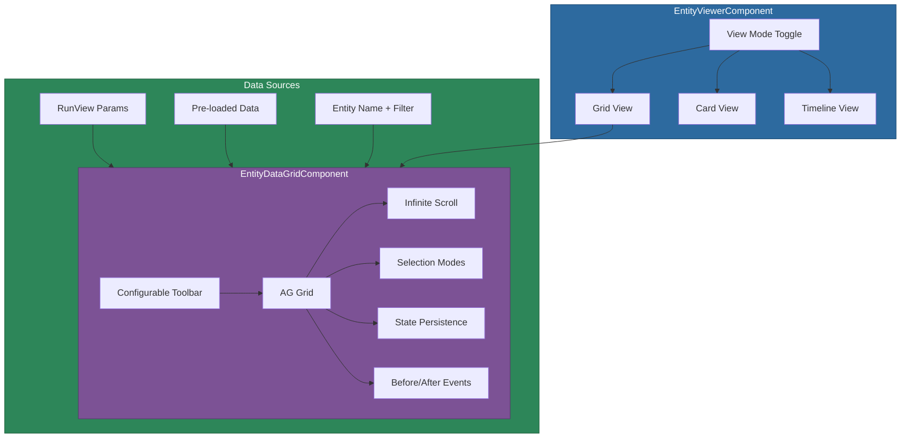

# @memberjunction/ng-entity-viewer

Angular components for viewing MemberJunction entity data in multiple formats -- grid, card, and timeline views -- with filtering, selection, toolbar actions, and a comprehensive Before/After cancelable event system.

## Overview

The `@memberjunction/ng-entity-viewer` package provides a suite of data presentation components built on AG Grid. The primary component, `EntityDataGridComponent`, offers infinite scroll, configurable toolbars with custom buttons, server-side sorting, grid state persistence, and a rich event system where "before" events can be canceled. The `EntityViewerComponent` wraps the grid alongside card and timeline views with a view-mode toggle.



## Installation

```bash
npm install @memberjunction/ng-entity-viewer ag-grid-angular ag-grid-community
```

## Usage

### Import the Module

```typescript
import { EntityViewerModule } from '@memberjunction/ng-entity-viewer';

@NgModule({
  imports: [EntityViewerModule]
})
export class MyModule { }
```

### Composite Viewer

```html
<mj-entity-viewer
  [entity]="selectedEntity"
  [viewEntity]="myUserView"
  [showGridToolbar]="true"
  [gridToolbarConfig]="toolbarConfig"
  [gridSelectionMode]="'multiple'"
  (recordSelected)="onRecordSelected($event)"
  (recordOpened)="onRecordOpened($event)"
  (addRequested)="onAddNew()"
  (exportRequested)="onExport($event)">
</mj-entity-viewer>
```

### Standalone Data Grid

```html
<mj-entity-data-grid
  [entityName]="'Contacts'"
  [extraFilter]="'Status = \'Active\''"
  [showToolbar]="true"
  [toolbarConfig]="myToolbarConfig"
  [selectionMode]="'multiple'"
  [PaginationMode]="'infinite'"
  [PageSize]="100"
  (afterRowClick)="onRowClick($event)"
  (afterRowDoubleClick)="onRowDoubleClick($event)"
  (newButtonClick)="onAddNew()"
  (exportButtonClick)="onExport()">
</mj-entity-data-grid>
```

### Cancelable Events

```typescript
onBeforeRowSelect(event: BeforeRowSelectEventArgs) {
  // Prevent selecting locked records
  if (event.row.Get('Status') === 'Locked') {
    event.cancel = true;
    event.cancelReason = 'Cannot select locked records';
  }
}
```

## API Reference

### EntityDataGridComponent (`mj-entity-data-grid`)

AG Grid-based data grid with rich event system and configurable toolbar.

#### Data Source Inputs

| Input | Type | Default | Description |
|-------|------|---------|-------------|
| `Params` | `RunViewParams` | - | Primary data source (stored views + dynamic views) |
| `entityName` | `string` | - | Entity name for dynamic views |
| `extraFilter` | `string` | - | Additional WHERE clause filter |
| `searchString` | `string` | - | User search string |
| `orderBy` | `string` | - | ORDER BY clause |
| `maxRows` | `number` | `0` | Max rows to fetch (0 = no limit) |
| `data` | `BaseEntity[]` | - | Pre-loaded data (bypasses RunView) |
| `AllowLoad` | `boolean` | `true` | Enable/disable data loading |
| `AutoRefreshOnParamsChange` | `boolean` | `true` | Auto-refresh when Params changes |

#### Pagination Inputs

| Input | Type | Default | Description |
|-------|------|---------|-------------|
| `PaginationMode` | `'client' \| 'infinite'` | `'client'` | Pagination strategy |
| `PageSize` | `number` | `100` | Rows per page (infinite mode) |
| `CacheBlockSize` | `number` | `100` | Cache block size (infinite mode) |
| `MaxBlocksInCache` | `number` | `10` | Max cached blocks |

#### Display Inputs

| Input | Type | Default | Description |
|-------|------|---------|-------------|
| `showToolbar` | `boolean` | `true` | Show the toolbar |
| `toolbarConfig` | `GridToolbarConfig` | - | Toolbar configuration |
| `selectionMode` | `'none' \| 'single' \| 'multiple' \| 'checkbox'` | `'single'` | Row selection mode |
| `height` | `number \| 'auto' \| 'fit-content'` | `'auto'` | Grid height |
| `gridState` | `ViewGridStateConfig` | - | Column/sort state from User View |
| `allowSorting` | `boolean` | `true` | Enable column sorting |
| `allowColumnReorder` | `boolean` | `true` | Enable column reordering |
| `allowColumnResize` | `boolean` | `true` | Enable column resizing |
| `serverSideSorting` | `boolean` | `true` | Sort triggers server reload |

#### Before/After Events

The grid uses a cancelable event pattern. Before events can be canceled by setting `event.cancel = true`.

**Row Selection Events:**

| Event | Args Type | Description |
|-------|-----------|-------------|
| `beforeRowSelect` | `BeforeRowSelectEventArgs` | Before row is selected |
| `afterRowSelect` | `AfterRowSelectEventArgs` | After row is selected |
| `beforeRowDeselect` | `BeforeRowDeselectEventArgs` | Before row is deselected |
| `afterRowDeselect` | `AfterRowDeselectEventArgs` | After row is deselected |

**Row Click Events:**

| Event | Args Type | Description |
|-------|-----------|-------------|
| `beforeRowClick` | `BeforeRowClickEventArgs` | Before row click processes |
| `afterRowClick` | `AfterRowClickEventArgs` | After row click |
| `beforeRowDoubleClick` | `BeforeRowDoubleClickEventArgs` | Before double-click |
| `afterRowDoubleClick` | `AfterRowDoubleClickEventArgs` | After double-click |

**Data Events:**

| Event | Args Type | Description |
|-------|-----------|-------------|
| `beforeDataLoad` | `BeforeDataLoadEventArgs` | Before data loads |
| `afterDataLoad` | `AfterDataLoadEventArgs` | After data loads |
| `beforeDataRefresh` | `BeforeDataRefreshEventArgs` | Before refresh |
| `afterDataRefresh` | `AfterDataRefreshEventArgs` | After refresh |

**Sorting/Column Events:**

| Event | Args Type | Description |
|-------|-----------|-------------|
| `beforeSort` | `BeforeSortEventArgs` | Before sort changes |
| `afterSort` | `AfterSortEventArgs` | After sort changes |
| `beforeColumnReorder` | `BeforeColumnReorderEventArgs` | Before column move |
| `afterColumnReorder` | `AfterColumnReorderEventArgs` | After column move |
| `gridStateChanged` | `GridStateChangedEvent` | Column state changed |

**Toolbar Button Events:**

| Event | Args Type | Description |
|-------|-----------|-------------|
| `newButtonClick` | `void` | Add/New button clicked |
| `refreshButtonClick` | `void` | Refresh button clicked |
| `deleteButtonClick` | `BaseEntity[]` | Delete button clicked |
| `exportButtonClick` | `void` | Export button clicked |
| `compareButtonClick` | `BaseEntity[]` | Compare button clicked |
| `mergeButtonClick` | `BaseEntity[]` | Merge button clicked |
| `addToListButtonClick` | `BaseEntity[]` | Add to List clicked |

### GridToolbarConfig

Configure toolbar buttons and behavior:

```typescript
const toolbarConfig: GridToolbarConfig = {
  showSearch: true,
  searchPlaceholder: 'Search records...',
  searchDebounce: 300,
  showRefresh: true,
  showAdd: true,
  showDelete: true,
  showExport: true,
  showColumnChooser: true,
  showFilterToggle: false,
  exportFormats: ['excel', 'csv', 'json'],
  showRowCount: true,
  showSelectionCount: true,
  position: 'top',
  customButtons: [
    {
      id: 'myButton',
      text: 'My Action',
      icon: 'fa-solid fa-star',
      tooltip: 'Do something custom',
      position: 'right',
      onClick: () => console.log('Clicked!')
    }
  ]
};
```

### EntityViewerComponent (`mj-entity-viewer`)

Composite component combining grid, cards, and timeline views.

#### Inputs

| Input | Type | Default | Description |
|-------|------|---------|-------------|
| `entity` | `EntityInfo` | - | Entity metadata |
| `records` | `BaseEntity[]` | - | Pre-loaded records |
| `viewEntity` | `UserViewEntityExtended` | - | User View for filtering/sorting |
| `viewMode` | `'grid' \| 'cards' \| 'timeline'` | `'grid'` | Current view mode |
| `filterText` | `string` | - | Filter text |
| `sortState` | `SortState` | - | Sort state |
| `gridState` | `ViewGridStateConfig` | - | Grid column state |
| `showGridToolbar` | `boolean` | `true` | Show grid toolbar |
| `gridToolbarConfig` | `GridToolbarConfig` | - | Toolbar configuration |
| `gridSelectionMode` | `GridSelectionMode` | `'single'` | Selection mode |

#### Outputs

| Output | Event Type | Description |
|--------|------------|-------------|
| `recordSelected` | `RecordSelectedEvent` | Record clicked |
| `recordOpened` | `RecordOpenedEvent` | Record double-clicked |
| `dataLoaded` | `DataLoadedEvent` | Data finished loading |
| `viewModeChange` | `EntityViewMode` | View mode changed |
| `filterTextChange` | `string` | Filter text changed |
| `sortChanged` | `SortChangedEvent` | Sort changed |
| `gridStateChanged` | `GridStateChangedEvent` | Grid state changed |
| `addRequested` | `void` | Add button clicked |
| `deleteRequested` | `{ records }` | Delete button clicked |
| `refreshRequested` | `void` | Refresh button clicked |
| `exportRequested` | `{ format }` | Export button clicked |

### EntityCardsComponent (`mj-entity-cards`)

Card-based view with auto-generated layout.

```html
<mj-entity-cards
  [entity]="selectedEntity"
  [records]="records"
  [filterText]="searchFilter"
  (recordSelected)="onSelected($event)"
  (recordOpened)="onOpened($event)">
</mj-entity-cards>
```

### PillComponent (`mj-pill`)

Semantic color pill for categorical values. Colors are auto-detected based on value:

| Color | Values |
|-------|--------|
| success (green) | active, approved, complete, success |
| warning (yellow) | pending, in progress, draft, waiting |
| danger (red) | failed, error, rejected, cancelled |
| info (blue) | new, info, created, open |
| neutral (gray) | default |

```html
<mj-pill [value]="record.Status"></mj-pill>
```

## Advanced Usage

### Infinite Scroll Pagination

```html
<mj-entity-data-grid
  [entityName]="'Contacts'"
  [PaginationMode]="'infinite'"
  [PageSize]="100"
  [CacheBlockSize]="100"
  [MaxBlocksInCache]="10">
</mj-entity-data-grid>
```

### State Persistence with User Views

```html
<mj-entity-data-grid
  [Params]="{ ViewID: myUserView.ID }"
  [AutoPersistState]="true"
  [StatePersistDebounce]="5000">
</mj-entity-data-grid>
```

## Type Exports

```typescript
// Types
import {
  GridToolbarConfig,
  GridToolbarButton,
  GridSelectionMode,
  GridColumnConfig,
  ViewGridStateConfig,
  DataGridSortState,
  RecordSelectedEvent,
  RecordOpenedEvent
} from '@memberjunction/ng-entity-viewer';

// Event Args
import {
  BeforeRowSelectEventArgs,
  AfterRowSelectEventArgs,
  BeforeRowClickEventArgs,
  AfterRowClickEventArgs,
  BeforeDataLoadEventArgs,
  AfterDataLoadEventArgs,
  AfterSortEventArgs
} from '@memberjunction/ng-entity-viewer';
```

## Dependencies

### Runtime Dependencies

| Package | Description |
|---------|-------------|
| `@memberjunction/core` | Core framework |
| `@memberjunction/core-entities` | Entity type definitions |
| `@memberjunction/global` | Global utilities |
| `@memberjunction/export-engine` | Data export engine |
| `@memberjunction/ng-shared-generic` | Shared generic components |
| `@memberjunction/ng-timeline` | Timeline view component |
| `@memberjunction/ng-filter-builder` | Filter builder component |
| `@memberjunction/ng-export-service` | Export service and dialog |

### Peer Dependencies

- `@angular/common` ^21.x
- `@angular/core` ^21.x
- `@angular/forms` ^21.x
- `@angular/animations` ^21.x
- `ag-grid-angular` ^35.x
- `ag-grid-community` ^35.x

## Build

```bash
cd packages/Angular/Generic/entity-viewer
npm run build
```

## License

ISC
