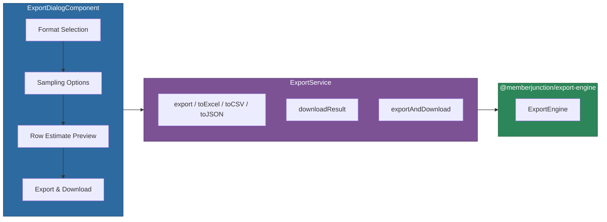

# @memberjunction/ng-export-service

Angular service and dialog component for exporting data to Excel, CSV, and JSON formats, with configurable sampling, column selection, and browser-side file download.

## Overview

The `@memberjunction/ng-export-service` package wraps the [`@memberjunction/export-engine`](../../../ExportEngine/README.md) for Angular usage. It provides an injectable `ExportService` with format-specific convenience methods and an `ExportDialogComponent` that presents a progressive UI for format selection, row sampling, and one-click download.



## Installation

```bash
npm install @memberjunction/ng-export-service
```

## Usage

### Import the Module

```typescript
import { ExportServiceModule } from '@memberjunction/ng-export-service';

@NgModule({
  imports: [ExportServiceModule]
})
export class YourModule { }
```

### Using the Export Dialog

```html
@if (showExportDialog) {
  <mj-export-dialog
    [visible]="showExportDialog"
    [config]="exportConfig"
    (closed)="onExportDialogClosed($event)">
  </mj-export-dialog>
}
```

```typescript
import { ExportDialogConfig, ExportDialogResult } from '@memberjunction/ng-export-service';

@Component({ ... })
export class MyComponent {
  showExportDialog = false;
  exportConfig: ExportDialogConfig | null = null;

  openExport(data: Record<string, unknown>[]) {
    this.exportConfig = {
      data,
      defaultFileName: 'contacts-export',
      defaultFormat: 'excel',
      showSamplingOptions: true,
      dialogTitle: 'Export Contacts'
    };
    this.showExportDialog = true;
  }

  onExportDialogClosed(result: ExportDialogResult) {
    this.showExportDialog = false;
    if (result.exported) {
      console.log('Exported successfully:', result.result?.fileName);
    }
  }
}
```

### Using the Service Directly

```typescript
import { ExportService } from '@memberjunction/ng-export-service';
import { ExportData } from '@memberjunction/export-engine';

@Component({ ... })
export class MyComponent {
  private exportService = inject(ExportService);

  async exportToExcel(data: ExportData) {
    // Export and immediately trigger browser download
    const result = await this.exportService.exportAndDownload(data, {
      format: 'excel',
      fileName: 'my-data',
      includeHeaders: true
    });

    if (!result.success) {
      console.error('Export failed:', result.error);
    }
  }

  async exportToCSV(data: ExportData) {
    // Export with sampling -- only first 500 rows
    const result = await this.exportService.toCSV(data, {
      fileName: 'sample-data',
      sampling: { mode: 'top', count: 500 }
    });

    if (result.success) {
      this.exportService.downloadResult(result);
    }
  }
}
```

## API Reference

### ExportService

Root-provided Angular service wrapping `ExportEngine`.

| Method | Returns | Description |
|--------|---------|-------------|
| `export(data, options?)` | `Promise<ExportResult>` | Export data with full options |
| `toExcel(data, options?)` | `Promise<ExportResult>` | Export to Excel format |
| `toCSV(data, options?)` | `Promise<ExportResult>` | Export to CSV format |
| `toJSON(data, options?)` | `Promise<ExportResult>` | Export to JSON format |
| `getSupportedFormats()` | `ExportFormat[]` | List supported formats |
| `downloadResult(result)` | `void` | Trigger browser file download |
| `exportAndDownload(data, options?)` | `Promise<ExportResult>` | Export then download in one call |
| `getSamplingModes()` | `SamplingModeInfo[]` | Get sampling modes with labels |
| `getFormatInfo(format)` | `FormatInfo` | Get format label, icon, description |
| `buildSamplingOptions(mode, count?, interval?)` | `SamplingOptions` | Build sampling config from user selections |

### ExportDialogComponent (`mj-export-dialog`)

Standalone export dialog with progressive UX.

#### Inputs

| Input | Type | Default | Description |
|-------|------|---------|-------------|
| `visible` | `boolean` | `false` | Controls dialog visibility |
| `config` | `ExportDialogConfig \| null` | `null` | Dialog configuration |

#### Outputs

| Output | Type | Description |
|--------|------|-------------|
| `closed` | `EventEmitter<ExportDialogResult>` | Emitted when dialog closes |

### ExportDialogConfig

```typescript
interface ExportDialogConfig {
  data: ExportData;
  columns?: ExportColumn[];
  defaultFileName?: string;
  availableFormats?: ExportFormat[];
  defaultFormat?: ExportFormat;
  showSamplingOptions?: boolean;
  defaultSamplingMode?: SamplingMode;
  defaultSampleCount?: number;
  dialogTitle?: string;
}
```

### ExportDialogResult

```typescript
interface ExportDialogResult {
  exported: boolean;
  result?: ExportResult;
  options?: ExportOptions;
}
```

### Sampling Modes

| Mode | Description |
|------|-------------|
| `all` | Export all data rows |
| `top` | Export the first N rows |
| `bottom` | Export the last N rows |
| `every-nth` | Export every Nth row |
| `random` | Export N random rows |

## Dependencies

### Runtime Dependencies

| Package | Description |
|---------|-------------|
| `@memberjunction/export-engine` | Core export engine with format support |

### Peer Dependencies

- `@angular/common` ^21.x
- `@angular/core` ^21.x
- `@angular/forms` ^21.x
- `@angular/cdk` ^21.x

**Note:** For export types (`ExportFormat`, `ExportOptions`, `ExportResult`, etc.), import directly from `@memberjunction/export-engine`.

## Build

```bash
cd packages/Angular/Generic/export-service
npm run build
```

## License

ISC
