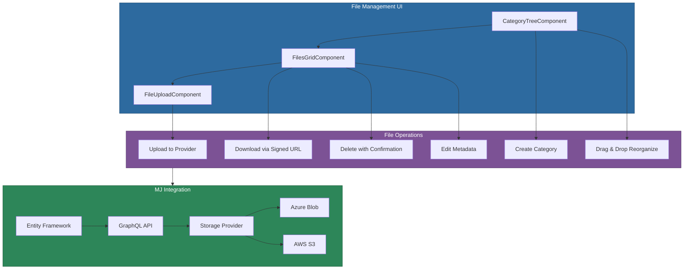

# @memberjunction/ng-file-storage

Angular components for managing file storage in MemberJunction applications, providing a complete file management system with category trees, file grids, upload with overwrite protection, and integration with MemberJunction's pluggable storage providers.

## Overview

The `@memberjunction/ng-file-storage` package provides three core components that together form a file management interface: a hierarchical category tree for organizing files, a Kendo Grid for browsing and managing files within categories, and an upload component with provider integration and overwrite protection. All file operations flow through MemberJunction's entity system and storage provider abstraction, supporting Azure Blob Storage, AWS S3, and other backends.



## Installation

```bash
npm install @memberjunction/ng-file-storage
```

## Prerequisites

Before using this package, ensure your MemberJunction database has:
- File Storage Providers configured and active
- File Categories entity permissions for users
- Files entity permissions for users
- GraphQL endpoints configured

## Usage

### Import the Module

```typescript
import { FileStorageModule } from '@memberjunction/ng-file-storage';

@NgModule({
  imports: [FileStorageModule]
})
export class YourModule { }
```

### File Browser Layout

```html
<div style="display: flex; height: 600px;">
  <div style="width: 300px; border-right: 1px solid #ccc;">
    <mj-files-category-tree
      (categorySelected)="selectedCategoryId = $event">
    </mj-files-category-tree>
  </div>
  <div style="flex: 1;">
    <mj-files-grid
      [CategoryID]="selectedCategoryId">
    </mj-files-grid>
  </div>
</div>
```

### File Upload

```html
<mj-files-file-upload
  [CategoryID]="selectedCategoryId"
  (uploadStarted)="onUploadStarted()"
  (fileUpload)="onFileUploaded($event)">
</mj-files-file-upload>
```

### Complete Example

```typescript
import { Component, ViewChild } from '@angular/core';
import { FilesGridComponent, FileUploadEvent } from '@memberjunction/ng-file-storage';

@Component({
  selector: 'app-document-manager',
  template: `
    <div class="file-manager">
      <div class="categories">
        <mj-files-category-tree
          (categorySelected)="onCategorySelected($event)">
        </mj-files-category-tree>
      </div>
      <div class="files">
        <mj-files-file-upload
          [CategoryID]="selectedCategoryId"
          (fileUpload)="onFileUploaded($event)">
        </mj-files-file-upload>
        <mj-files-grid #filesGrid
          [CategoryID]="selectedCategoryId">
        </mj-files-grid>
      </div>
    </div>
  `
})
export class DocumentManagerComponent {
  @ViewChild('filesGrid') filesGrid!: FilesGridComponent;
  selectedCategoryId: string | undefined;

  onCategorySelected(categoryId: string | undefined) {
    this.selectedCategoryId = categoryId;
  }

  onFileUploaded(event: FileUploadEvent) {
    if (event.success) {
      console.log('Uploaded:', event.file.Name);
    }
  }

  refreshFiles() {
    this.filesGrid.Refresh();
  }
}
```

## API Reference

### CategoryTreeComponent (`mj-files-category-tree`)

Hierarchical tree view for managing file categories with drag-and-drop reorganization.

#### Outputs

| Output | Type | Description |
|--------|------|-------------|
| `categorySelected` | `EventEmitter<string \| undefined>` | Emitted when a category is selected |

#### Public Methods

| Method | Description |
|--------|-------------|
| `createNewCategory()` | Opens dialog to create a category |
| `deleteCategory(category)` | Deletes a category with error handling |
| `handleDrop(e)` | Handles drag-and-drop to move categories |
| `Refresh()` | Refreshes the category tree |
| `clearSelection()` | Clears the current selection |

### FilesGridComponent (`mj-files-grid`)

Kendo Grid for displaying and managing files with inline editing.

#### Inputs

| Input | Type | Default | Description |
|-------|------|---------|-------------|
| `CategoryID` | `string \| undefined` | `undefined` | Category ID to filter files by |

#### Public Methods

| Method | Description |
|--------|-------------|
| `downloadFile(file)` | Downloads file via provider's signed URL |
| `deleteFile(file)` | Deletes file with confirmation |
| `saveEditFile()` | Saves changes to file metadata |
| `resetEditFile()` | Cancels metadata editing |
| `canBeDeleted(file)` | Checks if file can be deleted |
| `Refresh()` | Refreshes the files grid |

### FileUploadComponent (`mj-files-file-upload`)

File upload component with storage provider integration and overwrite protection.

#### Inputs

| Input | Type | Default | Description |
|-------|------|---------|-------------|
| `disabled` | `boolean` | `false` | Disable the upload component |
| `CategoryID` | `string \| undefined` | `undefined` | Category ID for uploaded files |

#### Outputs

| Output | Type | Description |
|--------|------|-------------|
| `uploadStarted` | `EventEmitter<void>` | Emitted when upload begins |
| `fileUpload` | `EventEmitter<FileUploadEvent>` | Emitted on upload completion |

#### Properties

| Property | Type | Description |
|----------|------|-------------|
| `IsUploading` | `boolean` | Whether files are currently uploading |

## Types

### FileUploadEvent

```typescript
type FileUploadEvent =
  | { success: true; file: FileEntity }
  | { success: false; file: FileInfo };
```

## Upload Flow

1. User selects a file through the upload component
2. A preliminary file record is created in the MemberJunction system
3. If a file with the same name exists, a confirmation dialog appears
4. On confirmation, the file uploads to the active storage provider
5. The file record status updates to "Uploaded"
6. The `fileUpload` event emits with success status and file details

## Key Behaviors

- **File deletion** is restricted based on upload status and age (10 minutes for pending files)
- **Overwrite protection** prompts users before replacing existing files
- **Download** uses provider-specific signed URLs for security
- **Category drag-and-drop** supports reorganizing the hierarchy
- All operations include loading state indicators

## Dependencies

### Runtime Dependencies

| Package | Description |
|---------|-------------|
| `@memberjunction/core` | Core metadata and entity access |
| `@memberjunction/core-entities` | File-related entity types |
| `@memberjunction/global` | Global utilities |
| `@memberjunction/graphql-dataprovider` | GraphQL data operations |
| `@memberjunction/ng-container-directives` | Container directives |
| `@memberjunction/ng-shared` | Shared Angular services |
| `@memberjunction/ng-shared-generic` | Shared generic components |
| `@progress/kendo-angular-grid` | Data grid |
| `@progress/kendo-angular-treeview` | Category tree |
| `@progress/kendo-angular-upload` | File upload |
| `@progress/kendo-angular-dialog` | Confirmation dialogs |
| `@progress/kendo-angular-buttons` | Button components |
| `@progress/kendo-angular-dropdowns` | Dropdown components |
| `@progress/kendo-angular-indicators` | Loading indicators |
| `@progress/kendo-angular-menu` | Context menu |

### Peer Dependencies

- `@angular/common` ^21.x
- `@angular/core` ^21.x
- `@angular/forms` ^21.x
- `@angular/router` ^21.x

## Build

```bash
cd packages/Angular/Generic/file-storage
npm run build
```

## License

ISC
