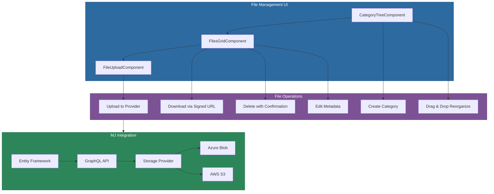

# @memberjunction/ng-file-storage

Angular components for managing file storage in MemberJunction applications, providing a complete file management system with category trees, file grids, upload with overwrite protection, and integration with MemberJunction's pluggable storage providers.

## Overview

The `@memberjunction/ng-file-storage` package provides three core components that together form a file management interface: a hierarchical category tree for organizing files, a Kendo Grid for browsing and managing files within categories, and an upload component with provider integration and overwrite protection. All file operations flow through MemberJunction's entity system and storage provider abstraction, supporting Azure Blob Storage, AWS S3, and other backends.


```mermaid
flowchart TD
    subgraph UI["File Management UI"]
        CT[CategoryTreeComponent] --> FG[FilesGridComponent]
        FG --> FU[FileUploadComponent]
    end

    subgraph Operations["File Operations"]
        FU --> UPLOAD[Upload to Provider]
        FG --> DOWNLOAD[Download via Signed URL]
        FG --> DELETE[Delete with Confirmation]
        FG --> EDIT[Edit Metadata]
        CT --> CREATE[Create Category]
        CT --> DND[Drag & Drop Reorganize]
    end

    subgraph Backend["MJ Integration"]
        ENTITY[Entity Framework] --> GQL[GraphQL API]
        GQL --> PROVIDER[Storage Provider]
        PROVIDER --> AZURE[Azure Blob]
        PROVIDER --> S3[AWS S3]
    end

    Operations --> Backend

    style UI fill:#2d6a9f,stroke:#1a4971,color:#fff
    style Operations fill:#7c5295,stroke:#563a6b,color:#fff
    style Backend fill:#2d8659,stroke:#1a5c3a,color:#fff
```

## Installation

```bash
npm install @memberjunction/ng-file-storage
```

## Prerequisites

Before using this package, ensure your MemberJunction database has:
- File Storage Providers configured and active
- File Categories entity permissions for users
- Files entity permissions for users
- GraphQL endpoints configured

## Usage

### Import the Module

```typescript
import { FileStorageModule } from '@memberjunction/ng-file-storage';

@NgModule({
  imports: [FileStorageModule]
})
export class YourModule { }
```

### File Browser Layout

```html
<div style="display: flex; height: 600px;">
  <div style="width: 300px; border-right: 1px solid #ccc;">
    <mj-files-category-tree
      (categorySelected)="selectedCategoryId = $event">
    </mj-files-category-tree>
  </div>
  <div style="flex: 1;">
    <mj-files-grid
      [CategoryID]="selectedCategoryId">
    </mj-files-grid>
  </div>
</div>
```

### File Upload

```html
<mj-files-file-upload
  [CategoryID]="selectedCategoryId"
  (uploadStarted)="onUploadStarted()"
  (fileUpload)="onFileUploaded($event)">
</mj-files-file-upload>
```

### Complete Example

```typescript
import { Component, ViewChild } from '@angular/core';
import { FilesGridComponent, FileUploadEvent } from '@memberjunction/ng-file-storage';

@Component({
  selector: 'app-document-manager',
  template: `
    <div class="file-manager">
      <div class="categories">
        <mj-files-category-tree
          (categorySelected)="onCategorySelected($event)">
        </mj-files-category-tree>
      </div>
      <div class="files">
        <mj-files-file-upload
          [CategoryID]="selectedCategoryId"
          (fileUpload)="onFileUploaded($event)">
        </mj-files-file-upload>
        <mj-files-grid #filesGrid
          [CategoryID]="selectedCategoryId">
        </mj-files-grid>
      </div>
    </div>
  `
})
export class DocumentManagerComponent {
  @ViewChild('filesGrid') filesGrid!: FilesGridComponent;
  selectedCategoryId: string | undefined;

  onCategorySelected(categoryId: string | undefined) {
    this.selectedCategoryId = categoryId;
  }

  onFileUploaded(event: FileUploadEvent) {
    if (event.success) {
      console.log('Uploaded:', event.file.Name);
    }
  }

  refreshFiles() {
    this.filesGrid.Refresh();
  }
}
```

## API Reference

### CategoryTreeComponent (`mj-files-category-tree`)

Hierarchical tree view for managing file categories with drag-and-drop reorganization.

#### Outputs

| Output | Type | Description |
|--------|------|-------------|
| `categorySelected` | `EventEmitter<string \| undefined>` | Emitted when a category is selected |

#### Public Methods

| Method | Description |
|--------|-------------|
| `createNewCategory()` | Opens dialog to create a category |
| `deleteCategory(category)` | Deletes a category with error handling |
| `handleDrop(e)` | Handles drag-and-drop to move categories |
| `Refresh()` | Refreshes the category tree |
| `clearSelection()` | Clears the current selection |

### FilesGridComponent (`mj-files-grid`)

Kendo Grid for displaying and managing files with inline editing.

#### Inputs

| Input | Type | Default | Description |
|-------|------|---------|-------------|
| `CategoryID` | `string \| undefined` | `undefined` | Category ID to filter files by |

#### Public Methods

| Method | Description |
|--------|-------------|
| `downloadFile(file)` | Downloads file via provider's signed URL |
| `deleteFile(file)` | Deletes file with confirmation |
| `saveEditFile()` | Saves changes to file metadata |
| `resetEditFile()` | Cancels metadata editing |
| `canBeDeleted(file)` | Checks if file can be deleted |
| `Refresh()` | Refreshes the files grid |

### RecordAttachmentsComponent (`mj-record-attachments`)

Slide-in drawer and standalone component for managing file attachments linked to specific entity records via `MJ: File Entity Record Links` and `MJ: Files`.

Features:
- **Slide-in & Resizable**: Built on `<mj-slide-panel>` with `UserInfoEngine` width persistence.
- **Provider Filtering**: Filter attachments across all configured cloud storage providers (Azure Blob, AWS S3, Box, etc.).
- **Dual View Modes**: Card/Grid view with rich thumbnails and compact table/list view.
- **Drag-and-Drop Uploader**: Direct upload pipeline with target storage account picker and signed token generation.
- **Rich Media Preview**: In-app previews for PDFs, Images, Audio, Video, Code/Text, and Documents.
- **Cancelable Before/After Events**: Full event lifecycle for uploads, deletions, unlinking, downloads, previews, and replacements.
- **Programmatic Verbs**: Data model and action methods callable via code.

#### Inputs

| Input | Type | Default | Description |
|-------|------|---------|-------------|
| `Record` | `BaseEntity \| undefined` | `undefined` | Entity record to load/link attachments for |
| `EntityID` | `string \| undefined` | `undefined` | Explicit Entity ID (alternative to Record) |
| `RecordID` | `string \| undefined` | `undefined` | Explicit Record ID (alternative to Record) |
| `Attachments` | `RecordAttachmentItem[]` | `[]` | Direct data-bound array of attachment items |
| `Config` | `RecordAttachmentsConfig` | `undefined` | Optional configuration bag |
| `Visible` | `boolean` | `true` | Whether the slide panel is visible |
| `Resizable` | `boolean` | `true` | Whether the panel is resizable |
| `WidthPx` | `number` | `0` | Width in pixels (0 = restore from `UserInfoEngine`) |
| `ViewMode` | `'grid' \| 'list'` | `'grid'` | Preferred view layout |
| `AllowUpload` | `boolean` | `true` | Whether file uploading is enabled |
| `AllowDelete` | `boolean` | `true` | Whether hard delete from storage is enabled |
| `AllowUnlink` | `boolean` | `true` | Whether unlinking from record is enabled |
| `AllowDownload` | `boolean` | `true` | Whether file download is enabled |
| `AllowPreview` | `boolean` | `true` | Whether in-app media preview is enabled |
| `AllowReplace` | `boolean` | `true` | Whether replacing files is enabled |
| `ShowProviderFilter` | `boolean` | `true` | Show filter pills when multiple providers are active |
| `ShowSearch` | `boolean` | `true` | Show quick search filter |

#### Outputs & Cancelable Events

| Output | Type | Description |
|--------|------|-------------|
| `PanelClosed` | `EventEmitter<void>` | Emitted when user closes the panel |
| `WidthChanged` | `EventEmitter<number>` | Emitted when panel is resized (auto-persisted) |
| `AttachmentCountChanged` | `EventEmitter<number>` | Emitted when attachments count changes |
| `ViewModeChanged` | `EventEmitter<AttachmentViewMode>` | Emitted when view mode toggles |
| `BeforeUpload` | `EventEmitter<BeforeUploadAttachmentEventArgs>` | Cancelable (`event.Cancel = true`) before upload begins |
| `AfterUpload` | `EventEmitter<AfterUploadAttachmentEventArgs>` | Emitted after files are uploaded and linked |
| `BeforeDelete` | `EventEmitter<BeforeDeleteAttachmentEventArgs>` | Cancelable before an attachment is deleted |
| `AfterDelete` | `EventEmitter<AfterDeleteAttachmentEventArgs>` | Emitted after an attachment is deleted |
| `BeforeUnlink` | `EventEmitter<BeforeUnlinkAttachmentEventArgs>` | Cancelable before an attachment is unlinked |
| `AfterUnlink` | `EventEmitter<AfterUnlinkAttachmentEventArgs>` | Emitted after an attachment is unlinked |
| `BeforeDownload` | `EventEmitter<BeforeDownloadAttachmentEventArgs>` | Cancelable before download starts |
| `AfterDownload` | `EventEmitter<AfterDownloadAttachmentEventArgs>` | Emitted after download URL is resolved |
| `BeforePreview` | `EventEmitter<BeforePreviewAttachmentEventArgs>` | Cancelable before preview opens |
| `AfterPreview` | `EventEmitter<AfterPreviewAttachmentEventArgs>` | Emitted after preview opens |
| `BeforeReplace` | `EventEmitter<BeforeReplaceAttachmentEventArgs>` | Cancelable before file replacement begins |
| `AfterReplace` | `EventEmitter<AfterReplaceAttachmentEventArgs>` | Emitted after file is replaced |

#### Public Methods (Programmatic Verbs)

| Method | Returns | Description |
|--------|---------|-------------|
| `Refresh()` | `Promise<void>` | Reloads attachments from server |
| `UploadFiles(files, accountId?, categoryId?)` | `Promise<RecordAttachmentItem[]>` | Uploads and links files programmatically |
| `DeleteAttachment(item, hardDelete?)` | `Promise<boolean>` | Deletes an attachment |
| `UnlinkAttachment(item)` | `Promise<boolean>` | Unlinks attachment from record |
| `DownloadAttachment(item)` | `Promise<boolean>` | Triggers secure download |
| `PreviewAttachment(item)` | `Promise<boolean>` | Opens media preview |
| `ReplaceAttachment(item, newFile)` | `Promise<RecordAttachmentItem \| null>` | Replaces attachment with a new file |
| `SetViewMode(mode)` | `void` | Changes view mode and persists preference |

## Types

### FileUploadEvent

```typescript
type FileUploadEvent =
  | { success: true; file: FileEntity }
  | { success: false; file: FileInfo };
```

## Upload Flow

1. User selects a file through the upload component
2. A preliminary file record is created in the MemberJunction system
3. If a file with the same name exists, a confirmation dialog appears
4. On confirmation, the file uploads to the active storage provider
5. The file record status updates to "Uploaded"
6. The `fileUpload` event emits with success status and file details

## Key Behaviors

- **File deletion** is restricted based on upload status and age (10 minutes for pending files)
- **Overwrite protection** prompts users before replacing existing files
- **Download** uses provider-specific signed URLs for security
- **Category drag-and-drop** supports reorganizing the hierarchy
- All operations include loading state indicators

## Dependencies

### Runtime Dependencies

| Package | Description |
|---------|-------------|
| `@memberjunction/core` | Core metadata and entity access |
| `@memberjunction/core-entities` | File-related entity types |
| `@memberjunction/global` | Global utilities |
| `@memberjunction/graphql-dataprovider` | GraphQL data operations |
| `@memberjunction/ng-container-directives` | Container directives |
| `@memberjunction/ng-shared` | Shared Angular services |
| `@memberjunction/ng-shared-generic` | Shared generic components |
| `@progress/kendo-angular-grid` | Data grid |
| `@progress/kendo-angular-treeview` | Category tree |
| `@progress/kendo-angular-upload` | File upload |
| `@progress/kendo-angular-dialog` | Confirmation dialogs |
| `@progress/kendo-angular-buttons` | Button components |
| `@progress/kendo-angular-dropdowns` | Dropdown components |
| `@progress/kendo-angular-indicators` | Loading indicators |
| `@progress/kendo-angular-menu` | Context menu |

### Peer Dependencies

- `@angular/common` ^21.x
- `@angular/core` ^21.x
- `@angular/forms` ^21.x
- `@angular/router` ^21.x

## Build

```bash
cd packages/Angular/Generic/file-storage
npm run build
```

## License

Business Source License 1.1 — see [LICENSE](../../../../LICENSE) for details.
