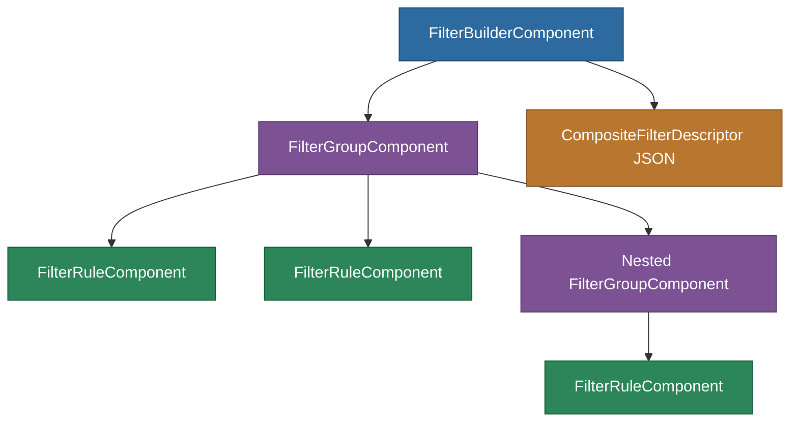

# @memberjunction/ng-filter-builder

A modern, intuitive Angular filter builder component for creating complex boolean filter expressions. Outputs portable, Kendo-compatible `CompositeFilterDescriptor` JSON for seamless integration with MemberJunction views and grids.

## Installation

```bash
npm install @memberjunction/ng-filter-builder
```

## Overview

The Filter Builder provides a visual interface for constructing nested AND/OR filter expressions against entity fields. It supports multiple field types (string, number, boolean, date, lookup), nested groups up to a configurable depth, and generates a human-readable summary of the active filter.



## Usage

### Module Import

```typescript
import { FilterBuilderModule } from '@memberjunction/ng-filter-builder';

@NgModule({
  imports: [FilterBuilderModule]
})
export class YourModule {}
```

### Basic Usage

```html
<mj-filter-builder
  [fields]="filterFields"
  [filter]="currentFilter"
  (filterChange)="onFilterChange($event)">
</mj-filter-builder>
```

### Defining Fields

```typescript
import { FilterFieldInfo } from '@memberjunction/ng-filter-builder';

filterFields: FilterFieldInfo[] = [
  { name: 'Name', displayName: 'Name', type: 'string' },
  { name: 'Age', displayName: 'Age', type: 'number' },
  { name: 'IsActive', displayName: 'Active', type: 'boolean' },
  { name: 'CreatedAt', displayName: 'Created Date', type: 'date' },
  { name: 'CategoryID', displayName: 'Category', type: 'lookup', lookupEntityName: 'Categories' }
];
```

### Configuration Options

```html
<mj-filter-builder
  [fields]="filterFields"
  [config]="{
    maxDepth: 3,
    allowGroups: true,
    showClearButton: true,
    showApplyButton: false,
    applyOnChange: true
  }"
  [showSummary]="true"
  [disabled]="false"
  (filterChange)="onFilterChange($event)"
  (apply)="onApply($event)"
  (clear)="onClear()">
</mj-filter-builder>
```

## Components

| Component | Selector | Purpose |
|-----------|----------|---------|
| `FilterBuilderComponent` | `mj-filter-builder` | Top-level container with config, summary, and clear/apply buttons |
| `FilterGroupComponent` | internal | Renders a group of rules combined by AND/OR logic |
| `FilterRuleComponent` | internal | Renders a single filter rule (field, operator, value) |

## Supported Operators by Field Type

| Type | Operators |
|------|-----------|
| String | contains, does not contain, equals, not equals, starts with, ends with, is empty, is not empty |
| Number | equals, not equals, greater than, greater/equal, less than, less/equal, is empty, is not empty |
| Boolean | is, is not, is empty, is not empty |
| Date | equals, not equals, is after, is on or after, is before, is on or before, is empty, is not empty |
| Lookup | equals, not equals, contains, does not contain, starts with, ends with, is empty, is not empty |

## Exported Types

- `FilterOperator` -- Union type of all operator strings
- `FilterLogic` -- `'and' | 'or'`
- `FilterDescriptor` -- Single filter condition
- `CompositeFilterDescriptor` -- Group of filters with AND/OR logic
- `FilterFieldInfo` -- Field metadata for the builder
- `FilterBuilderConfig` -- Configuration options
- `FilterValueOption` -- Value option for dropdown fields

## Utility Functions

- `createEmptyFilter()` -- Creates a new empty `CompositeFilterDescriptor`
- `createFilterRule(field, type)` -- Creates a new filter rule with defaults
- `isCompositeFilter(filter)` -- Type guard for composite filters
- `isSimpleFilter(filter)` -- Type guard for simple filter descriptors
- `getOperatorsForType(type)` -- Returns available operators for a field type
- `operatorRequiresValue(operator)` -- Checks if an operator needs a value input
