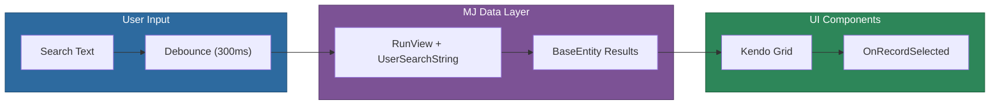

# @memberjunction/ng-find-record

An Angular component library for searching and selecting records from any MemberJunction entity. Provides both a standalone search component and a dialog wrapper for modal usage.

## Installation

```bash
npm install @memberjunction/ng-find-record
```

## Overview

The Find Record package provides a reusable search interface that works with any entity registered in the MemberJunction metadata system. It uses debounced search input with the RunView API and displays results in a Kendo UI grid for easy selection.



## Usage

### Module Import

```typescript
import { FindRecordModule } from '@memberjunction/ng-find-record';

@NgModule({
  imports: [FindRecordModule]
})
export class YourModule {}
```

### Standalone Search Component

```html
<mj-find-record
  [EntityName]="'Users'"
  [SearchDebounceTime]="500"
  (OnRecordSelected)="handleRecordSelected($event)">
</mj-find-record>
```

### Dialog Wrapper

```html
<mj-find-record-dialog
  [EntityName]="'Users'"
  [DialogTitle]="'Find User'"
  [DialogVisible]="showFindDialog"
  (DialogClosed)="handleDialogClosed($event)"
  (OnRecordSelected)="handleRecordSelected($event)">
</mj-find-record-dialog>
```

## Components

| Component | Selector | Purpose |
|-----------|----------|---------|
| `FindRecordComponent` | `mj-find-record` | Standalone search with results grid |
| `FindRecordDialogComponent` | `mj-find-record-dialog` | Modal dialog wrapper around the search component |

### FindRecordComponent

#### Inputs

| Property | Type | Default | Description |
|----------|------|---------|-------------|
| `EntityName` | `string` | `''` | Name of the MemberJunction entity to search |
| `DisplayFields` | `EntityFieldInfo[]` | `[]` | Fields to display in the results grid. Defaults to fields marked as `DefaultInView`, `IsPrimaryKey`, `IsNameField`, or `IncludeInUserSearchAPI` |
| `SearchDebounceTime` | `number` | `300` | Debounce time in milliseconds for search input |

#### Outputs

| Event | Type | Description |
|-------|------|-------------|
| `OnRecordSelected` | `EventEmitter<BaseEntity>` | Emitted when a user selects a record from the grid |

### FindRecordDialogComponent

Inherits all inputs from `FindRecordComponent`, plus:

| Property | Type | Default | Description |
|----------|------|---------|-------------|
| `DialogTitle` | `string` | `'Find Record'` | Title displayed in the dialog header |
| `DialogWidth` | `string` | `'700px'` | Width of the dialog |
| `DialogHeight` | `string` | `'450px'` | Height of the dialog |
| `DialogVisible` | `boolean` | `false` | Controls dialog visibility |
| `SelectedRecord` | `BaseEntity \| null` | `null` | Pre-selected record |

| Event | Type | Description |
|-------|------|-------------|
| `DialogClosed` | `EventEmitter<boolean>` | `true` if OK was clicked, `false` if cancelled |

## Search Behavior

1. User types in the search input; input is debounced (default 300ms)
2. A search executes via `RunView` with `UserSearchString` and `ResultType: 'entity_object'`
3. Results display in a Kendo UI grid with the configured display fields
4. Clicking a row emits the selected `BaseEntity` instance via `OnRecordSelected`

## Dependencies

- [@memberjunction/core](../../MJCore/README.md) -- Metadata, RunView, BaseEntity
- [@memberjunction/core-entities](../../MJCoreEntities/README.md) -- Entity type definitions
- [@memberjunction/ng-shared](../shared/README.md) -- Shared Angular utilities
- `@progress/kendo-angular-grid` -- Grid display

## Related Packages

- [@memberjunction/ng-record-selector](../record-selector/README.md) -- Dual-listbox record selection
- [@memberjunction/ng-generic-dialog](../generic-dialog/README.md) -- Reusable dialog component
