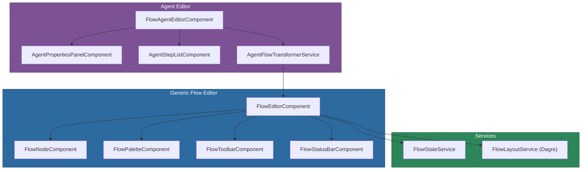

# @memberjunction/ng-flow-editor

A generic, entity-agnostic visual flow editor component powered by Foblex Flow, with an agent-specific Flow Agent Editor for building AI agent workflows.

## Installation

```bash
npm install @memberjunction/ng-flow-editor
```

## Overview

The Flow Editor provides a canvas-based visual editor for building node-and-connection graphs. It wraps [Foblex Flow](https://www.foblex.com/flow) with a clean MemberJunction-style API and includes automatic layout via the Dagre graph algorithm. A specialized Agent Editor component is also included for visually designing AI agent step flows.



## Usage

### Module Import

```typescript
import { FlowEditorModule } from '@memberjunction/ng-flow-editor';

@NgModule({
  imports: [FlowEditorModule]
})
export class YourModule {}
```

### Basic Flow Editor

```html
<mj-flow-editor
  [Nodes]="myNodes"
  [Connections]="myConnections"
  [NodeTypes]="myNodeTypes"
  [ShowMinimap]="true"
  [ShowPalette]="true"
  [ShowGrid]="true"
  (NodeSelected)="onNodeSelected($event)"
  (ConnectionCreated)="onConnectionCreated($event)"
  (NodesChanged)="onNodesChanged($event)">
</mj-flow-editor>
```

### Agent Flow Editor

```html
<mj-flow-agent-editor
  [AgentId]="selectedAgentId"
  [ReadOnly]="false"
  (StepSelected)="onStepSelected($event)"
  (FlowChanged)="onFlowChanged($event)">
</mj-flow-agent-editor>
```

## Components

| Component | Selector | Purpose |
|-----------|----------|---------|
| `FlowEditorComponent` | `mj-flow-editor` | Generic canvas-based flow editor |
| `FlowNodeComponent` | internal | Renders individual nodes on the canvas |
| `FlowPaletteComponent` | internal | Draggable palette of node types |
| `FlowToolbarComponent` | internal | Toolbar with zoom, layout, grid controls |
| `FlowStatusBarComponent` | internal | Displays node/connection counts |
| `FlowAgentEditorComponent` | `mj-flow-agent-editor` | Agent-specific flow editor wrapper |
| `AgentPropertiesPanelComponent` | internal | Agent property editing panel |
| `AgentStepListComponent` | internal | List of agent steps |

## FlowEditorComponent API

### Inputs

| Property | Type | Default | Description |
|----------|------|---------|-------------|
| `Nodes` | `FlowNode[]` | `[]` | Array of flow nodes |
| `Connections` | `FlowConnection[]` | `[]` | Array of connections between nodes |
| `NodeTypes` | `FlowNodeTypeConfig[]` | `[]` | Available node type definitions |
| `ReadOnly` | `boolean` | `false` | Disable editing |
| `ShowMinimap` | `boolean` | `true` | Show minimap overlay |
| `ShowPalette` | `boolean` | `true` | Show the node palette |
| `ShowGrid` | `boolean` | `true` | Show background grid |
| `ShowStatusBar` | `boolean` | `true` | Show the status bar |
| `ShowToolbar` | `boolean` | `true` | Show the toolbar |
| `ShowLegend` | `boolean` | `true` | Show the node type legend |
| `GridSize` | `number` | `20` | Grid snap size in pixels |
| `AutoLayoutDirection` | `FlowLayoutDirection` | `'vertical'` | Dagre auto-layout direction |

### Outputs

| Event | Type | Description |
|-------|------|-------------|
| `NodeSelected` | `EventEmitter<FlowNode \| null>` | A node was selected or deselected |
| `NodeAdded` | `EventEmitter<FlowNodeAddedEvent>` | A node was added to the canvas |
| `NodeRemoved` | `EventEmitter<FlowNode>` | A node was removed |
| `NodeMoved` | `EventEmitter<FlowNodeMovedEvent>` | A node was repositioned |
| `ConnectionCreated` | `EventEmitter<FlowConnectionCreatedEvent>` | A connection was created |
| `ConnectionRemoved` | `EventEmitter<FlowConnection>` | A connection was removed |
| `ConnectionReassigned` | `EventEmitter<FlowConnectionReassignedEvent>` | A connection endpoint was moved |
| `SelectionChanged` | `EventEmitter<FlowSelectionChangedEvent>` | Selection state changed |
| `NodesChanged` | `EventEmitter<FlowNode[]>` | The nodes array was modified |
| `ConnectionsChanged` | `EventEmitter<FlowConnection[]>` | The connections array was modified |
| `NodeEditRequested` | `EventEmitter<FlowNode>` | Double-click to edit a node |

## Exported Types

- `FlowNode` -- A node on the canvas with id, type, label, position, size, ports, badges
- `FlowConnection` -- A connection between two node ports with optional label
- `FlowNodeTypeConfig` -- Configuration for a node type (icon, color, ports, palette info)
- `FlowNodePort` -- Input/output port definition
- `FlowPosition` / `FlowSize` -- Position and size types
- `FlowSnapshot` -- Serializable snapshot of the entire flow state
- `FlowLayoutDirection` -- `'vertical' | 'horizontal'`

## Services

| Service | Purpose |
|---------|---------|
| `FlowStateService` | Manages undo/redo, snapshots, dirty state |
| `FlowLayoutService` | Dagre-based auto-layout for flow graphs |
| `AgentFlowTransformerService` | Transforms MJ Agent entities into flow graph data |

## Dependencies

- [@memberjunction/core](../../MJCore/README.md) -- Core MJ functionality
- [@memberjunction/core-entities](../../MJCoreEntities/README.md) -- Entity types for agent editor
- `@foblex/flow` -- Canvas rendering engine
- `@dagrejs/dagre` -- Graph layout algorithm
