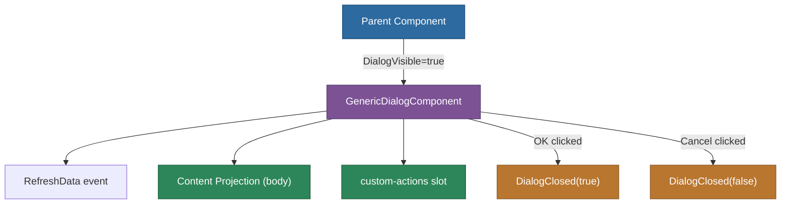

# @memberjunction/ng-generic-dialog

A flexible, customizable modal dialog component for Angular applications in the MemberJunction framework. Built on Kendo UI Dialog, it provides a consistent way to create modals with standard OK/Cancel buttons and custom action slots.

## Installation

```bash
npm install @memberjunction/ng-generic-dialog
```

## Overview

The Generic Dialog wraps Kendo UI's dialog with a standardized API for content projection, configurable buttons, and a data refresh lifecycle. It serves as the foundation for many dialog experiences throughout MemberJunction applications.



## Usage

### Module Import

```typescript
import { GenericDialogModule } from '@memberjunction/ng-generic-dialog';

@NgModule({
  imports: [GenericDialogModule]
})
export class YourModule {}
```

### Basic Confirmation Dialog

```html
<mj-generic-dialog
  DialogTitle="Confirm Delete"
  DialogWidth="400px"
  DialogHeight="200px"
  [DialogVisible]="showDeleteConfirm"
  OKButtonText="Delete"
  CancelButtonText="Keep"
  (DialogClosed)="handleDeleteConfirmation($event)">
  <p>Are you sure you want to delete this item?</p>
  <p><strong>This action cannot be undone.</strong></p>
</mj-generic-dialog>
```

### Dialog with Custom Actions

```html
<mj-generic-dialog
  DialogTitle="Advanced Options"
  [DialogVisible]="showDialog"
  [ShowOKButton]="false"
  CancelButtonText="Close"
  (DialogClosed)="onDialogClosed($event)"
  (RefreshData)="loadDialogData()">

  <div>Your dialog content here</div>

  <div custom-actions>
    <button kendoButton (click)="saveSettings()" themeColor="primary">Save</button>
    <button kendoButton (click)="applySettings()">Apply</button>
  </div>
</mj-generic-dialog>
```

## API Reference

### Selector

`mj-generic-dialog`

### Inputs

| Property | Type | Default | Description |
|----------|------|---------|-------------|
| `DialogTitle` | `string` | `'Default Title'` | Title displayed in the dialog header |
| `DialogWidth` | `string` | `'700px'` | Width of the dialog (pixels or percentage) |
| `DialogHeight` | `string` | `'450px'` | Height of the dialog (pixels or percentage) |
| `DialogVisible` | `boolean` | `false` | Controls dialog visibility. Setting to `true` triggers `RefreshData` |
| `ShowOKButton` | `boolean` | `true` | Whether to show the OK button |
| `OKButtonText` | `string` | `'OK'` | Text on the OK button |
| `ShowCancelButton` | `boolean` | `true` | Whether to show the Cancel button |
| `CancelButtonText` | `string` | `'Cancel'` | Text on the Cancel button |

### Outputs

| Event | Type | Description |
|-------|------|-------------|
| `DialogClosed` | `EventEmitter<boolean>` | `true` if OK was clicked, `false` if Cancel or X |
| `RefreshData` | `EventEmitter<void>` | Emitted when dialog becomes visible, for loading fresh data |

### Public Methods

| Method | Description |
|--------|-------------|
| `HandleOKClick()` | Programmatically trigger OK (closes dialog, emits `true`) |
| `HandleCancelClick()` | Programmatically trigger Cancel (closes dialog, emits `false`) |

### Content Projection Slots

- **Default slot** -- Content displayed in the dialog body
- **`custom-actions` slot** -- Buttons projected into the action area (use `custom-actions` attribute)

## Dependencies

- `@progress/kendo-angular-dialog` -- Dialog rendering
- `@progress/kendo-angular-buttons` -- Button components

## Related Packages

- [@memberjunction/ng-find-record](../find-record/README.md) -- Uses generic dialog for record search modal
- [@memberjunction/ng-record-selector](../record-selector/README.md) -- Uses generic dialog for record selection modal
