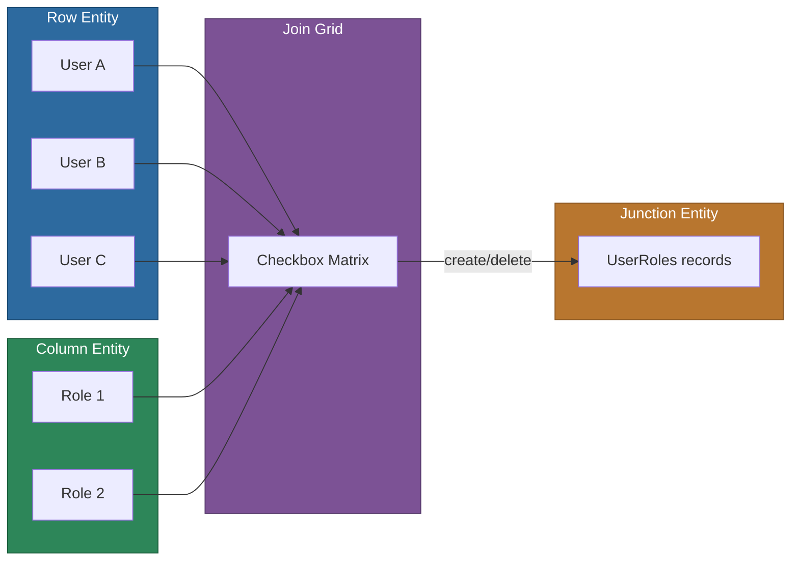

# @memberjunction/ng-join-grid

A checkbox-based grid component for managing many-to-many entity relationships in MemberJunction applications. Supports both junction entity record creation/deletion and direct field editing modes.

## Installation

```bash
npm install @memberjunction/ng-join-grid
```

## Overview

The Join Grid displays rows from one entity against columns from another, with checkboxes at each intersection. Checking a box creates a record in the junction entity; unchecking deletes it. An alternative Fields mode allows editing field values directly in related records. All changes are batched in transaction groups for atomic saves.



## Usage

### Module Import

```typescript
import { JoinGridModule } from '@memberjunction/ng-join-grid';

@NgModule({
  imports: [JoinGridModule]
})
export class YourModule {}
```

### Entity Mode (Many-to-Many)

```html
<mj-join-grid
  [RowsEntityName]="'Users'"
  [RowsEntityDisplayField]="'UserName'"
  [ColumnsEntityName]="'Roles'"
  [ColumnsEntityDisplayField]="'RoleName'"
  [JoinEntityName]="'UserRoles'"
  [JoinEntityRowForeignKey]="'UserID'"
  [JoinEntityColumnForeignKey]="'RoleID'"
  [CheckBoxValueMode]="'RecordExists'"
  [ShowSaveButton]="true"
  [ShowCancelButton]="true">
</mj-join-grid>
```

### Fields Mode (Direct Editing)

```html
<mj-join-grid
  [RowsEntityName]="'Users'"
  [RowsEntityDisplayField]="'UserName'"
  [ColumnsMode]="'Fields'"
  [JoinEntityName]="'UserPreferences'"
  [JoinEntityRowForeignKey]="'UserID'"
  [JoinEntityDisplayColumns]="['PreferenceType', 'PreferenceValue']"
  [ShowSaveButton]="true">
</mj-join-grid>
```

## Operation Modes

| Mode | `CheckBoxValueMode` | Behavior |
|------|---------------------|----------|
| Entity + RecordExists | `'RecordExists'` | Checkbox creates/deletes junction records |
| Entity + ColumnValue | `'ColumnValue'` | Checkbox toggles a boolean field on existing records |
| Fields | N/A | Displays and edits field values in the join entity |

## Key Inputs

### Row Configuration

| Input | Type | Default | Description |
|-------|------|---------|-------------|
| `RowsEntityName` | `string` | -- | Entity for rows (required) |
| `RowsEntityDisplayField` | `string` | -- | Field to display in first column (required) |
| `RowsEntityDataSource` | `'FullEntity' \| 'ViewName' \| 'Array'` | `'FullEntity'` | Data source type |
| `RowsExtraFilter` | `string` | -- | SQL filter for rows |
| `RowsOrderBy` | `string` | -- | SQL order by for rows |

### Column Configuration

| Input | Type | Default | Description |
|-------|------|---------|-------------|
| `ColumnsMode` | `'Entity' \| 'Fields'` | `'Entity'` | Column generation mode |
| `ColumnsEntityName` | `string` | -- | Entity for columns (Entity mode) |
| `ColumnsEntityDisplayField` | `string` | -- | Field for column headers |

### Join Entity Configuration

| Input | Type | Default | Description |
|-------|------|---------|-------------|
| `JoinEntityName` | `string` | -- | Junction entity name (required) |
| `JoinEntityRowForeignKey` | `string` | -- | FK linking to row entity (required) |
| `JoinEntityColumnForeignKey` | `string` | -- | FK linking to column entity (required) |
| `CheckBoxValueMode` | `'RecordExists' \| 'ColumnValue'` | `'RecordExists'` | How checkbox state is determined |
| `EditMode` | `'None' \| 'Save' \| 'Queue'` | `'None'` | Editing mode for form integration |

### Public Methods

| Method | Returns | Description |
|--------|---------|-------------|
| `Refresh()` | `Promise<void>` | Reload all grid data |
| `Save()` | `Promise<boolean>` | Save all pending changes |
| `CancelEdit()` | `void` | Cancel pending changes |

## Exported Classes

- `JoinGridCell` -- Represents a single cell in the grid
- `JoinGridRow` -- Represents a row with column data

## Dependencies

- [@memberjunction/core](../../MJCore/README.md) -- Metadata, RunView, BaseEntity
- [@memberjunction/ng-shared](../shared/README.md) -- Shared Angular utilities
- `@progress/kendo-angular-grid` -- Grid rendering
