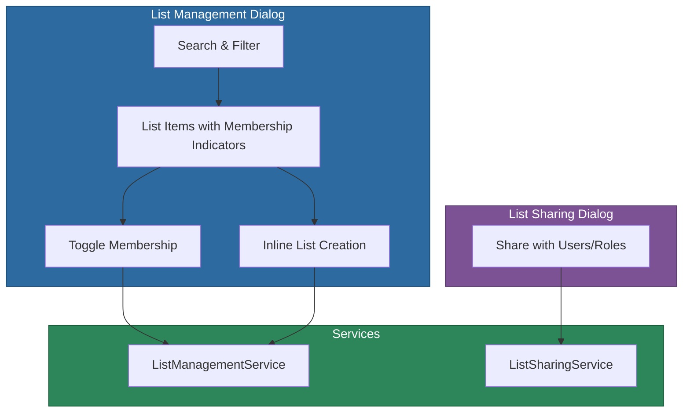

# @memberjunction/ng-list-management

Angular components for managing entity list membership with a responsive dialog interface. Allows users to add and remove records from multiple lists with visual membership indicators.

## Installation

```bash
npm install @memberjunction/ng-list-management
```

## Overview

The List Management package provides a dialog-based UI for managing which lists a set of entity records belong to. It supports search and filtering, visual membership indicators (full/partial/none), inline list creation, batch operations with progress feedback, and list sharing via a separate sharing dialog.



## Usage

### Module Import

```typescript
import { ListManagementModule } from '@memberjunction/ng-list-management';

@NgModule({
  imports: [ListManagementModule]
})
export class YourModule {}
```

### List Management Dialog

```html
<mj-list-management-dialog
  [config]="listConfig"
  [visible]="showListDialog"
  (complete)="onListManagementComplete($event)"
  (cancel)="onListManagementCancel()">
</mj-list-management-dialog>
```

### List Sharing Dialog

```html
<mj-list-share-dialog
  [listId]="selectedListId"
  [visible]="showShareDialog"
  (closed)="onShareDialogClosed()">
</mj-list-share-dialog>
```

### Configuration Example

```typescript
import { ListManagementDialogConfig } from '@memberjunction/ng-list-management';

const listConfig: ListManagementDialogConfig = {
  EntityName: 'Products',
  RecordIDs: ['product-1', 'product-2', 'product-3'],
  Title: 'Manage Product Lists',
  AllowCreateList: true,
  AllowShareList: true
};
```

## Components

| Component | Selector | Purpose |
|-----------|----------|---------|
| `ListManagementDialogComponent` | `mj-list-management-dialog` | Dialog for adding/removing records to/from lists |
| `ListShareDialogComponent` | `mj-list-share-dialog` | Dialog for sharing lists with users and roles |

## Services

| Service | Purpose |
|---------|---------|
| `ListManagementService` | Business logic for list operations (add, remove, create, load) |
| `ListSharingService` | Business logic for sharing lists with users and roles |

## Exported Types

- `ListManagementDialogConfig` -- Configuration for the list management dialog
- `ListManagementResult` -- Result returned when dialog completes
- `ListOperationDetail` -- Detail of a single add/remove operation
- `ListItemViewModel` -- View model for a list item with membership state
- `ListFilterTab` -- Filter tab type (`'all' | 'member' | 'not-member'`)
- `ListSortOption` -- Sort option type (`'name' | 'date' | 'count'`)
- `CreateListConfig` -- Configuration for inline list creation
- `BatchOperationResult` -- Result of batch add/remove operations
- `RecordMembershipInfo` -- Membership info for a record across lists
- `ListShareConfig` -- Configuration for list sharing
- `ListShareResult` -- Result of sharing operations

## Dependencies

- [@memberjunction/core](../../MJCore/README.md) -- Metadata, RunView
- [@memberjunction/core-entities](../../MJCoreEntities/README.md) -- ListEntity, ListCategoryEntity
- [@memberjunction/ng-shared-generic](../shared/README.md) -- Loading component
- `@progress/kendo-angular-dialog` -- Dialog rendering
- `@progress/kendo-angular-buttons` -- Button components
- `@progress/kendo-angular-inputs` -- Input components
