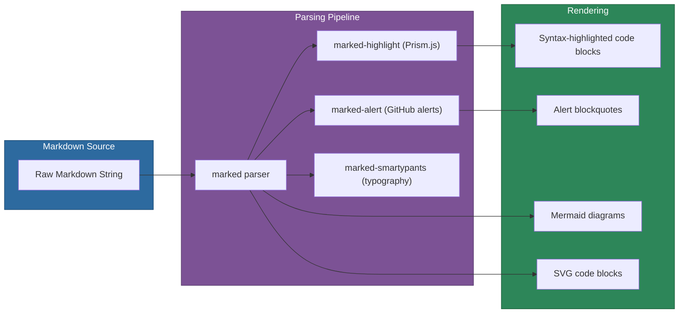

# @memberjunction/ng-markdown

A feature-rich Angular component for rendering Markdown content with syntax highlighting, Mermaid diagrams, collapsible sections, GitHub-style alerts, and SVG rendering.

## Installation

```bash
npm install @memberjunction/ng-markdown
```

## Overview

The Markdown component replaces `ngx-markdown` with a MemberJunction-native implementation. It uses [marked](https://marked.js.org/) for parsing, [Prism.js](https://prismjs.com/) for syntax highlighting, and [Mermaid](https://mermaid.js.org/) for diagram rendering. The module does not use `forRoot()` -- simply import `MarkdownModule` wherever needed.



## Usage

### Module Import

```typescript
import { MarkdownModule } from '@memberjunction/ng-markdown';

@NgModule({
  imports: [MarkdownModule]  // No forRoot() needed
})
export class YourModule {}
```

### Basic Usage

```html
<mj-markdown [data]="markdownContent"></mj-markdown>
```

### Full Configuration

```html
<mj-markdown
  [data]="content"
  [enableMermaid]="true"
  [enableCollapsibleHeadings]="true"
  [collapsibleHeadingLevel]="2"
  [autoExpandLevels]="[2]"
  [enableCodeCopy]="true"
  [enableAlerts]="true"
  [enableSmartypants]="true"
  [enableSvgRenderer]="true"
  [enableHtml]="false"
  [mermaidTheme]="'default'"
  (rendered)="onRendered($event)"
  (headingClick)="onHeadingClick($event)"
  (codeCopied)="onCodeCopied($event)">
</mj-markdown>
```

## Key Features

| Feature | Default | Description |
|---------|---------|-------------|
| Syntax highlighting | Enabled | Prism.js with Okaidia theme |
| Mermaid diagrams | Enabled | Render mermaid code blocks as diagrams |
| Code copy button | Enabled | Copy-to-clipboard on hover |
| GitHub-style alerts | Enabled | `[!NOTE]`, `[!TIP]`, `[!WARNING]` blockquotes |
| Smartypants typography | Enabled | Curly quotes, em/en dashes, ellipsis |
| SVG rendering | Enabled | Render SVG code blocks as images |
| Collapsible headings | Disabled | Expand/collapse heading sections |
| HTML passthrough | Disabled | Raw HTML rendering (security-sensitive) |
| JavaScript | Disabled | Allow JS in HTML (use only for trusted content) |

## Configuration Inputs

| Input | Type | Default | Description |
|-------|------|---------|-------------|
| `data` | `string` | `''` | Markdown content to render |
| `enableHighlight` | `boolean` | `true` | Prism.js syntax highlighting |
| `enableMermaid` | `boolean` | `true` | Mermaid diagram rendering |
| `enableCodeCopy` | `boolean` | `true` | Copy button on code blocks |
| `enableCollapsibleHeadings` | `boolean` | `false` | Collapsible heading sections |
| `collapsibleHeadingLevel` | `1-6` | `2` | Heading level to start collapsing |
| `collapsibleDefaultExpanded` | `boolean` | `true` | Default expansion state |
| `autoExpandLevels` | `number[]` | `undefined` | Specific levels to auto-expand |
| `enableAlerts` | `boolean` | `true` | GitHub-style alerts |
| `enableSmartypants` | `boolean` | `true` | Typography improvements |
| `enableSvgRenderer` | `boolean` | `true` | SVG code block rendering |
| `enableHtml` | `boolean` | `false` | Raw HTML passthrough |
| `enableJavaScript` | `boolean` | `false` | Allow JS in HTML |
| `enableHeadingIds` | `boolean` | `true` | Generate heading IDs for anchors |
| `headingIdPrefix` | `string` | `''` | Prefix for heading IDs |
| `enableLineNumbers` | `boolean` | `false` | Show line numbers in code blocks |
| `containerClass` | `string` | `''` | Custom CSS class for container |
| `mermaidTheme` | `string` | `'default'` | Mermaid theme (default/dark/forest/neutral/base) |
| `sanitize` | `boolean` | `true` | Sanitize HTML output |

## Outputs

| Event | Type | Description |
|-------|------|-------------|
| `rendered` | `MarkdownRenderEvent` | Emitted when rendering completes |
| `headingClick` | `HeadingInfo` | Emitted when a heading is clicked |
| `codeCopied` | `string` | Emitted when code is copied to clipboard |

## Migration from ngx-markdown

1. Replace imports: `'ngx-markdown'` to `'@memberjunction/ng-markdown'`
2. Remove `forRoot()` from module imports
3. Update selectors: `<markdown>` to `<mj-markdown>`
4. The `element` property is preserved for backward compatibility

## Dependencies

- `marked` -- Markdown parser
- `marked-alert` -- GitHub-style alerts
- `marked-highlight` -- Syntax highlighting integration
- `marked-smartypants` -- Typography improvements
- `prismjs` -- Syntax highlighting
- `mermaid` -- Diagram rendering

## Related Packages

- [@memberjunction/ng-skip-chat](../skip-chat/README.md) -- Uses markdown for chat message rendering
