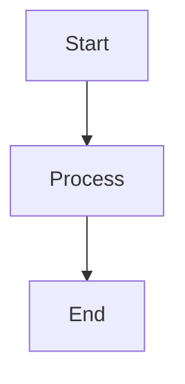

# @memberjunction/ng-markdown

A lightweight Angular module for rendering markdown content with rich features including syntax highlighting, Mermaid diagrams, collapsible sections, and more.

## Installation

```bash
npm install @memberjunction/ng-markdown
```

## Usage

### Basic Setup

Import the `MarkdownModule` in your Angular module:

```typescript
import { NgModule } from '@angular/core';
import { MarkdownModule } from '@memberjunction/ng-markdown';

@NgModule({
  imports: [
    MarkdownModule
  ]
})
export class YourModule { }
```

> **Note**: This module does NOT use `forRoot()`. Simply import `MarkdownModule` in any module where you need markdown rendering. The `MarkdownService` is provided at root level for efficient sharing across the application.

### Basic Usage

```html
<mj-markdown [data]="markdownContent"></mj-markdown>
```

### Advanced Usage

```html
<mj-markdown
  [data]="content"
  [enableMermaid]="true"
  [enableCollapsibleHeadings]="true"
  [collapsibleHeadingLevel]="2"
  [autoExpandLevels]="[2]"
  [enableCodeCopy]="true"
  [enableAlerts]="true"
  [enableSmartypants]="true"
  [enableSvgRenderer]="true"
  [enableHtml]="false"
  (rendered)="onRendered($event)"
  (headingClick)="onHeadingClick($event)"
  (codeCopied)="onCodeCopied($event)">
</mj-markdown>
```

## Features

### Syntax Highlighting (Prism.js)
Code blocks are automatically highlighted using Prism.js with the Okaidia theme.

### Mermaid Diagrams
Support for Mermaid diagram rendering:

~~~markdown

~~~

### Collapsible Headings
Enable collapsible sections with expand/collapse all buttons:

```html
<mj-markdown
  [data]="content"
  [enableCollapsibleHeadings]="true"
  [collapsibleHeadingLevel]="2"
  [autoExpandLevels]="[2]">
</mj-markdown>
```

- `collapsibleHeadingLevel`: Heading level to start collapsing (1-6)
- `autoExpandLevels`: Array of heading levels to expand by default (e.g., `[2]` expands only h2)
- `collapsibleDefaultExpanded`: Whether sections are expanded by default (true/false)

### Copy-to-Clipboard
Code blocks include a copy button that appears on hover.

### GitHub-Style Alerts
Support for GitHub-style blockquote alerts:

```markdown
> [!NOTE]
> Useful information that users should know.

> [!TIP]
> Helpful advice for doing things better.

> [!WARNING]
> Urgent info that needs immediate attention.
```

### Smartypants Typography
Automatically converts:
- "quotes" to "curly quotes"
- `--` to en-dash (–)
- `---` to em-dash (—)
- `...` to ellipsis (…)

### SVG Code Block Rendering
Render SVG code blocks as actual images:

~~~markdown
```svg
<svg width="100" height="100" xmlns="http://www.w3.org/2000/svg">
  <circle cx="50" cy="50" r="40" fill="blue"/>
</svg>
```
~~~

### HTML Passthrough
Enable raw HTML rendering for mockups and custom layouts:

```html
<mj-markdown
  [data]="content"
  [enableHtml]="true"
  [enableJavaScript]="false">
</mj-markdown>
```

> **Security Note**: When `enableHtml` is true, JavaScript is still stripped unless `enableJavaScript` is also true. Only enable `enableJavaScript` for fully trusted content.

## Configuration Options

| Input | Type | Default | Description |
|-------|------|---------|-------------|
| `data` | `string` | `''` | Markdown content to render |
| `enableHighlight` | `boolean` | `true` | Enable Prism.js syntax highlighting |
| `enableMermaid` | `boolean` | `true` | Enable Mermaid diagram rendering |
| `enableCodeCopy` | `boolean` | `true` | Enable copy button on code blocks |
| `enableCollapsibleHeadings` | `boolean` | `false` | Enable collapsible heading sections |
| `collapsibleHeadingLevel` | `1-6` | `2` | Heading level to start collapsing |
| `collapsibleDefaultExpanded` | `boolean` | `true` | Default expansion state |
| `autoExpandLevels` | `number[]` | `undefined` | Specific levels to auto-expand |
| `enableAlerts` | `boolean` | `true` | Enable GitHub-style alerts |
| `enableSmartypants` | `boolean` | `true` | Enable typography improvements |
| `enableSvgRenderer` | `boolean` | `true` | Enable SVG code block rendering |
| `enableHtml` | `boolean` | `false` | Enable raw HTML passthrough |
| `enableJavaScript` | `boolean` | `false` | Allow JavaScript in HTML (security risk) |
| `enableHeadingIds` | `boolean` | `true` | Generate heading IDs for anchors |
| `headingIdPrefix` | `string` | `''` | Prefix for heading IDs |
| `enableLineNumbers` | `boolean` | `false` | Show line numbers in code blocks |
| `containerClass` | `string` | `''` | Custom CSS class for container |
| `mermaidTheme` | `string` | `'default'` | Mermaid theme (default/dark/forest/neutral/base) |
| `sanitize` | `boolean` | `true` | Sanitize HTML output |

## Events

| Output | Type | Description |
|--------|------|-------------|
| `rendered` | `MarkdownRenderEvent` | Emitted when rendering is complete |
| `headingClick` | `HeadingInfo` | Emitted when a heading is clicked |
| `codeCopied` | `string` | Emitted when code is copied to clipboard |

## Migration from ngx-markdown

If you're migrating from `ngx-markdown`:

1. Replace imports:
   ```typescript
   // Before
   import { MarkdownModule } from 'ngx-markdown';

   // After
   import { MarkdownModule } from '@memberjunction/ng-markdown';
   ```

2. Update module imports (no `forRoot()` needed):
   ```typescript
   // Before
   MarkdownModule.forRoot()

   // After
   MarkdownModule
   ```

3. Update template selectors:
   ```html
   <!-- Before -->
   <markdown [data]="content"></markdown>

   <!-- After -->
   <mj-markdown [data]="content"></mj-markdown>
   ```

4. The `MarkdownComponent` still exposes an `element` property for backward compatibility with code that accessed `element.nativeElement`.

## Dependencies

- `marked` - Markdown parser
- `marked-alert` - GitHub-style alerts
- `marked-highlight` - Syntax highlighting integration
- `marked-smartypants` - Typography improvements
- `prismjs` - Syntax highlighting
- `mermaid` - Diagram rendering

## License

ISC
