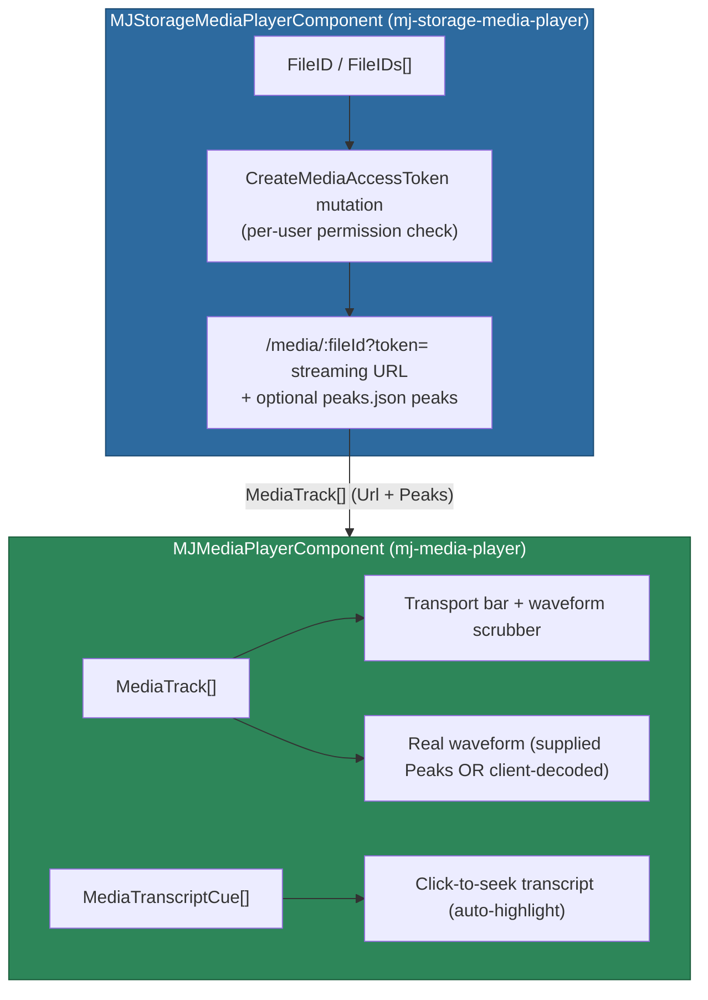

# @memberjunction/ng-media-player

A world-class, zero-dependency Angular media (audio/video) player for MemberJunction applications, plus an MJStorage-bound wrapper that streams files stored in any MJ storage provider. The generic player has **no MemberJunction-core dependency** — it is pure Angular and safe to reuse in any app; all the MJ wiring lives in the separate wrapper.

## Installation

```bash
npm install @memberjunction/ng-media-player
```

## Overview

This package ships **two** standalone components:

| Component | Selector | Purpose |
|-----------|----------|---------|
| `MJMediaPlayerComponent` | `mj-media-player` | Generic, framework-agnostic player. You give it one or more `MediaTrack`s (plain URLs) and an optional transcript. |
| `MJStorageMediaPlayerComponent` | `mj-storage-media-player` | MJStorage-bound wrapper. You give it an `MJ: Files` `FileID` (or several); it resolves each to a short-lived authenticated streaming URL and hands them to the generic player. |

The generic player renders a custom transport bar (play/pause, click-and-drag scrubber, playback-rate menu, ±skip, volume + mute, fullscreen), a **real audio waveform** that doubles as the scrubber, and an optional **time-synced transcript** whose cues are clickable and auto-highlight as playback advances. For a single audio track it shows the transport + waveform; for multiple video tracks it renders a responsive grid.



## Key features

- **Custom transport** — play/pause, click-and-drag scrubber, playback-rate menu, ±skip (configurable seconds), volume slider + mute, fullscreen for video.
- **Real audio waveform** — for audio-only tracks the player renders a true waveform (not a synthetic one) that **IS** the scrubber. Peaks are either supplied via `MediaTrack.Peaks` (rendered as-is, no decode) or extracted client-side by decoding the track URL through an `AudioContext`. On any decode failure it falls back gracefully to a plain progress bar.
- **Time-synced transcript** — supply `MediaTranscriptCue[]` and the player renders a transcript panel; clicking a cue seeks to its start, and the active cue auto-highlights as playback advances. Defaults to **below** the player (`TranscriptPosition='bottom'`) with a show/hide toggle in the transport bar.
- **Loading / buffering state** — a `MediaPlaybackState` lifecycle (`idle`/`loading`/`buffering`/`ready`/`playing`/`paused`/`ended`/`error`) drives a stage busy-indicator overlay (the buffering spinner is debounced so instant seeks don't flash it) and a screen-reader-friendly status label.
- **Multi-track video grid** — multiple video tracks render in a responsive grid; the first video leads the master timeline.
- **Keyboard support** — space (play/pause), ←/→ (±5s), J/L (±10s), ↑/↓ (volume), M (mute), F (fullscreen); the scrubber itself is a `role="slider"` with arrow/Home/End support.
- **Cancelable `Before*` events** — `BeforePlay`/`BeforePause`/`BeforeSeek`/`BeforeRateChange` each pass an event object; set `event.Cancel = true` to abort the pending action (mirrors the ng-conversations `beforeAgentTurn` pattern).
- **Imperative API** — `Play()`, `Pause()`, `SeekToMs()`, `SetPlaybackRate()`, `SeekToCue()`, etc.
- **Reduced-motion aware** — suppresses the waveform draw-in animation when the user prefers reduced motion.

## Usage

### Generic player (plain URLs)

```typescript
import { MJMediaPlayerComponent, MediaTrack, MediaTranscriptCue } from '@memberjunction/ng-media-player';

@Component({
  standalone: true,
  imports: [MJMediaPlayerComponent],
  template: `
    <mj-media-player
      [Tracks]="tracks"
      [Transcript]="transcript"
      (Ended)="onEnded()">
    </mj-media-player>
  `,
})
export class MyComponent {
  tracks: MediaTrack[] = [
    { Id: 'a1', Kind: 'audio', Url: 'https://example.com/interview.wav' },
  ];
  transcript: MediaTranscriptCue[] = [
    { Id: 'c1', StartMs: 0,    SpeakerLabel: 'Host',  Text: 'Welcome to the show.' },
    { Id: 'c2', StartMs: 3200, SpeakerLabel: 'Guest', Text: 'Thanks for having me.' },
  ];
  onEnded() { /* ... */ }
}
```

### Storage-backed player (MJ: Files)

```typescript
import { MJStorageMediaPlayerComponent } from '@memberjunction/ng-media-player';

@Component({
  standalone: true,
  imports: [MJStorageMediaPlayerComponent],
  template: `
    <mj-storage-media-player
      [FileID]="recordingFileId"
      [Transcript]="transcript">
    </mj-storage-media-player>
  `,
})
export class RecordingPlaybackComponent {
  recordingFileId = '...';            // an MJ: Files row ID
  transcript: MediaTranscriptCue[] = [ /* ... */ ];
}
```

The wrapper resolves the file id to a streaming URL on init (and whenever `FileID`/`FileIDs` change), surfacing graceful loading / no-access / empty states while it does.

## `MJMediaPlayerComponent` (`mj-media-player`)

### Inputs

| Property | Type | Default | Description |
|----------|------|---------|-------------|
| `Tracks` | `MediaTrack[]` | `[]` | The track(s) to play. One audio track → transport bar + waveform; many videos → grid. |
| `Transcript` | `MediaTranscriptCue[] \| null` | `null` | Transcript cues. When set (and `ShowTranscript`), a transcript panel renders. |
| `Autoplay` | `boolean` | `false` | Begin playback automatically once media is ready. |
| `StartAtMs` | `number \| null` | `null` | Start playback at this position (ms) once metadata loads. |
| `ShowTranscript` | `boolean` | `true` | Master switch for the transcript panel (when a transcript is provided). |
| `ShowTranscriptToggle` | `boolean` | `true` | Whether the transcript show/hide toggle renders in the transport bar. |
| `ShowSpeedControl` | `boolean` | `true` | Whether the playback-rate menu is shown. |
| `ShowSkipControls` | `boolean` | `true` | Whether the ±skip buttons are shown. |
| `ShowVolume` | `boolean` | `true` | Whether the volume slider + mute are shown. |
| `ShowWaveform` | `boolean` | `true` | Whether the real audio waveform (which doubles as the scrubber) is shown for audio-only tracks. |
| `WaveformBarCount` | `number` | `DEFAULT_WAVEFORM_BARS` | Number of bars the waveform renders / downsamples to. |
| `ShowFullscreen` | `boolean` | `true` | Whether the fullscreen button is shown for video. |
| `SkipSeconds` | `number` | `30` | Seconds the ±skip buttons jump. |
| `PlaybackRates` | `number[]` | `[0.5, 1, 1.25, 1.5, 2]` | Rates offered in the rate menu. |
| `InitialRate` | `number` | `1` | Initial playback rate. |
| `InitialVolume` | `number` | `1` | Initial volume (0..1). |
| `TranscriptPosition` | `'bottom' \| 'side'` | `'bottom'` | Where the transcript panel sits relative to the media. |

### Outputs

`Before*` events are **cancelable** — set `event.Cancel = true` in a handler to abort.

| Event | Type | Description |
|-------|------|-------------|
| `BeforePlay` | `EventEmitter<MediaPlayerCancelableEvent>` | Before playback starts (cancelable). |
| `AfterPlay` | `EventEmitter<void>` | After playback starts. |
| `BeforePause` | `EventEmitter<MediaPlayerCancelableEvent>` | Before pause (cancelable). |
| `AfterPause` | `EventEmitter<void>` | After pause. |
| `BeforeSeek` | `EventEmitter<MediaSeekEvent>` | Before a seek (cancelable; carries `FromMs`/`ToMs`). |
| `AfterSeek` | `EventEmitter<number>` | After a seek (the new position in ms). |
| `BeforeRateChange` | `EventEmitter<MediaRateEvent>` | Before a rate change (cancelable; carries `FromRate`/`ToRate`). |
| `AfterRateChange` | `EventEmitter<number>` | After a rate change (the new rate). |
| `CueActivated` | `EventEmitter<MediaCueEvent>` | When the active transcript cue changes during playback. |
| `CueClicked` | `EventEmitter<MediaCueEvent>` | When a transcript cue is clicked. |
| `TimeUpdate` | `EventEmitter<number>` | On every time update (current position in ms). |
| `DurationChange` | `EventEmitter<number>` | When the media duration is resolved/changes (ms). |
| `Ended` | `EventEmitter<void>` | When playback reaches the end. |
| `StateChanged` | `EventEmitter<MediaPlaybackState>` | On every playback-lifecycle transition. |
| `TranscriptVisibilityChanged` | `EventEmitter<boolean>` | When the transcript is toggled (`true` = shown). |

### Methods (imperative API)

| Method | Returns | Description |
|--------|---------|-------------|
| `Play()` | `void` | Begin playback (honors `BeforePlay`). |
| `Pause()` | `void` | Pause playback (honors `BeforePause`). |
| `TogglePlay()` | `void` | Toggle play/pause. |
| `SeekToMs(ms)` | `void` | Seek to an absolute position (honors `BeforeSeek`). |
| `SkipForward()` / `SkipBackward()` | `void` | Skip ±`SkipSeconds`. |
| `SetPlaybackRate(rate)` | `void` | Set the playback rate (honors `BeforeRateChange`). |
| `SeekToCue(index)` | `void` | Seek to a transcript cue's start (continues playing if playing, repositions if paused). |
| `SetVolume(v)` | `void` | Set volume 0..1 (unmutes if > 0). |
| `ToggleMute()` | `void` | Toggle mute. |
| `EnterFullscreen()` / `ExitFullscreen()` / `ToggleFullscreen()` | `void` | Fullscreen control for video. |
| `ToggleTranscript()` | `void` | Show/hide the transcript panel (emits `TranscriptVisibilityChanged`). |

Read-only getters expose live state for template binding / inspection, including `CurrentTimeMs`, `DurationMs`, `IsPlaying`, `PlaybackRate`, `ActiveCueIndex`, `MediaState`, `IsLoading`, `IsBuffering`, and `StatusLabel`.

## `MJStorageMediaPlayerComponent` (`mj-storage-media-player`)

Extends `BaseAngularComponent`, so it accepts the standard `[Provider]` input for multi-provider apps.

### Inputs

| Property | Type | Default | Description |
|----------|------|---------|-------------|
| `FileID` | `string \| null` | `null` | Convenience single `MJ: Files` id. Combined with `FileIDs`; duplicates are de-duped. |
| `FileIDs` | `string[]` | `[]` | Multi-track file ids (e.g. separate meeting streams). |
| `Transcript` | `MediaTranscriptCue[] \| null` | `null` | Transcript cues forwarded to the generic player. |
| `ShowTranscript` / `ShowTranscriptToggle` / `ShowSpeedControl` / `ShowSkipControls` / `ShowVolume` / `ShowWaveform` / `ShowFullscreen` | `boolean` | `true` | Pass-through feature flags, forwarded to the generic player. |
| `SkipSeconds` | `number` | `30` | Forwarded skip step. |
| `PlaybackRates` | `number[]` | `[0.5, 1, 1.25, 1.5, 2]` | Forwarded rate menu. |
| `Autoplay` | `boolean` | `false` | Forwarded autoplay flag. |
| `StartAtMs` | `number \| null` | `null` | Forwarded start position. |
| `TranscriptPosition` | `'side' \| 'bottom'` | `'bottom'` | Forwarded transcript position. |

### Read-only getters

| Getter | Type | Description |
|--------|------|-------------|
| `ResolvedTracks` | `MediaTrack[]` | The streaming tracks resolved from the file ids. |
| `IsLoading` | `boolean` | True while minting access tokens / resolving tracks. |
| `AccessError` | `string \| null` | A no-access / unavailable message, set only when **nothing** resolved. |
| `HasFileIds` | `boolean` | Whether any file id is configured. |

## Streaming & permission model (wrapper)

The wrapper resolves each file id by calling the **`CreateMediaAccessToken`** GraphQL mutation (server-side, in `@memberjunction/server`). The server:

1. Runs a **per-user permission check** for the file.
2. Mints a short-lived (HS256) signed token and returns the authenticated streaming URL `GET /media/:fileId?token=…`.
3. If a `peaks.json` sidecar sits beside the recording in storage, returns its precomputed waveform **peaks** alongside the URL.

The `<audio>` / `<video>` element then streams that URL natively over **HTTP Range** (progressive playback + seek-before-download for large video) instead of base64'ing the whole file over GraphQL. The `/media` route re-verifies the token's signature/expiry and that it matches the requested file, then range-streams the bytes from the underlying MJ storage provider via `FileStorageBase.GetObjectStream` (see [@memberjunction/storage](../../../MJStorage/docs/STREAMING.md)).

**Waveform peaks:** when the server supplies precomputed peaks (from the `peaks.json` sidecar), the wrapper sets them on `MediaTrack.Peaks` so the generic player renders the real waveform **instantly with no client-side fetch/decode**. When no sidecar exists, audio waveforms still decode client-side from the streaming URL; video shows the plain progress bar.

## Public types

```typescript
type MediaKind = 'audio' | 'video';

type MediaPlaybackState =
  | 'idle' | 'loading' | 'buffering' | 'ready'
  | 'playing' | 'paused' | 'ended' | 'error';

interface MediaTrack {
  Id: string;            // stable identifier (track-by + event correlation)
  Kind: MediaKind;       // audio vs. video
  Url: string;           // http(s) or blob: object URL
  MimeType?: string;     // optional MIME hint (e.g. 'audio/wav', 'video/mp4')
  Label?: string;        // optional label shown in multi-track layouts
  PosterUrl?: string;    // optional poster image for video
  Peaks?: number[];      // optional precomputed waveform peaks (normalized 0..1, one per bar).
                         // Supplied → rendered directly, NO client-side decode.
                         // Absent (audio + waveform on) → player decodes the URL client-side.
}

interface MediaTranscriptCue {
  Id: string;            // stable cue identifier
  StartMs: number;       // cue start (ms from media start)
  EndMs?: number;        // optional cue end; when absent, the next cue's start is used
  SpeakerLabel?: string; // optional speaker label (color-coded)
  Text: string;          // the spoken text
}

interface MediaPlayerCancelableEvent { Cancel: boolean; }          // set true to abort
interface MediaSeekEvent extends MediaPlayerCancelableEvent { FromMs: number; ToMs: number; }
interface MediaRateEvent extends MediaPlayerCancelableEvent { FromRate: number; ToRate: number; }
interface MediaCueEvent { Cue: MediaTranscriptCue; Index: number; }
```

Helper utilities (`computeActiveCueIndex`, `downsamplePeaks`, `nextPlaybackState`, transcript-layout resolvers) are also exported from the package public API for reuse and testing.

## Dependencies

- `@angular/common` / `@angular/core` (peer)
- `@memberjunction/core`, `@memberjunction/graphql-dataprovider`, `@memberjunction/ng-base-types` — used **only** by the storage wrapper. The generic `MJMediaPlayerComponent` has no MemberJunction dependency.

## Building & testing

```bash
npm run build   # ngc
npm run test    # vitest
```

## License

ISC
