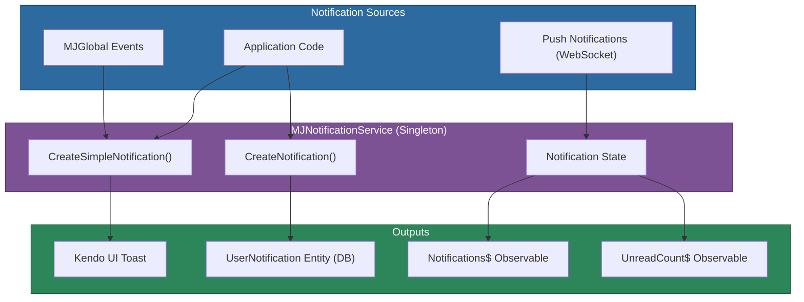

# @memberjunction/ng-notifications

Angular singleton service for managing user notifications in MemberJunction applications. Provides both temporary UI notifications (Kendo toasts) and persistent database-backed notifications via the User Notifications entity.

## Installation

```bash
npm install @memberjunction/ng-notifications
```

## Overview

The notification service acts as a centralized hub for all notifications across the application. It automatically subscribes to MemberJunction global events, manages real-time push notification updates via GraphQL WebSockets, and maintains an observable stream of unread notification counts.



## Usage

### Module Import

```typescript
import { MJNotificationsModule } from '@memberjunction/ng-notifications';

@NgModule({
  imports: [MJNotificationsModule]
})
export class YourModule {}
```

### Simple (Transient) Notifications

```typescript
import { MJNotificationService } from '@memberjunction/ng-notifications';

// Via singleton instance
MJNotificationService.Instance.CreateSimpleNotification(
  'Record saved successfully',
  'success',
  3000  // auto-hide after 3 seconds
);

// Error notification without auto-hide
MJNotificationService.Instance.CreateSimpleNotification(
  'Failed to load data',
  'error'
);
```

### Persistent (Database) Notifications

```typescript
const notification = await MJNotificationService.Instance.CreateNotification(
  'Report Ready',
  'Your monthly sales report has been generated',
  reportResourceTypeId,  // optional resource type ID
  reportId,              // optional resource record ID
  { format: 'pdf' },    // optional configuration JSON
  true                   // display UI notification immediately
);
```

### Accessing Notification State

```typescript
// All notifications
const all = MJNotificationService.UserNotifications;

// Unread only
const unread = MJNotificationService.UnreadUserNotifications;

// Unread count
const count = MJNotificationService.UnreadUserNotificationCount;

// Refresh from server
await MJNotificationService.RefreshUserNotifications();
```

## API Reference

### MJNotificationService

| Method | Description |
|--------|-------------|
| `CreateSimpleNotification(message, style?, hideAfter?)` | Display a temporary toast notification |
| `CreateNotification(title, message, resourceTypeId?, resourceRecordId?, config?, displayToUser?)` | Create a persistent notification in the database |
| `PushStatusUpdates()` | Returns an Observable for real-time push notifications |

| Static Property | Type | Description |
|-----------------|------|-------------|
| `Instance` | `MJNotificationService` | Singleton instance |
| `UserNotifications` | `UserNotificationEntity[]` | All user notifications |
| `UnreadUserNotifications` | `UserNotificationEntity[]` | Unread notifications only |
| `UnreadUserNotificationCount` | `number` | Count of unread notifications |

### Notification Styles

| Style | Use Case |
|-------|----------|
| `'success'` | Completed operations, confirmations |
| `'error'` | Failed operations, validation errors |
| `'warning'` | Important notices requiring attention |
| `'info'` | General information |
| `'none'` | Unstyled notification |

## Event Integration

The service automatically handles these MJGlobal events:

- **`MJEventType.LoggedIn`** -- Refreshes notifications and subscribes to push updates
- **`MJEventType.DisplaySimpleNotificationRequest`** -- Displays notifications from any part of the application
- **`MJEventType.ComponentEvent`** (`UserNotificationsUpdated`) -- Refreshes the notification list

## Dependencies

- [@memberjunction/core](../../MJCore/README.md) -- Metadata, UserInfo
- [@memberjunction/core-entities](../../MJCoreEntities/README.md) -- UserNotificationEntity
- [@memberjunction/global](../../MJGlobal/README.md) -- MJGlobal event system
- [@memberjunction/graphql-dataprovider](../../GraphQLDataProvider/README.md) -- Push notification subscriptions
- `@progress/kendo-angular-notification` -- Toast notification rendering
