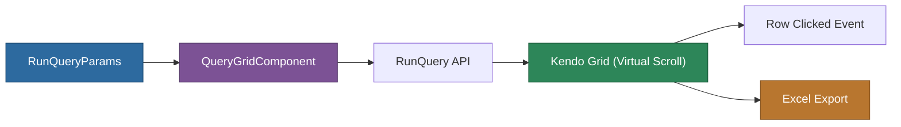

# @memberjunction/ng-query-grid

> **Deprecated**: Use [`@memberjunction/ng-query-viewer`](../query-viewer/README.md) instead. This component will be removed in a future version. The replacement provides state persistence, parameter persistence, entity linking, and auto-run capability.

An Angular component for running and displaying stored query results in a Kendo UI grid.

## Installation

```bash
npm install @memberjunction/ng-query-grid
```

## Overview

The Query Grid component runs a stored query via `RunQuery` and renders results in a Kendo virtual-scrolling grid. It supports Excel export and provides click events for navigating to entity records from query results.



## Usage

### Module Import

```typescript
import { QueryGridModule } from '@memberjunction/ng-query-grid';

@NgModule({
  imports: [QueryGridModule]
})
export class YourModule {}
```

### Basic Usage

```html
<mj-query-grid
  [Params]="queryParams"
  [BottomMargin]="50"
  (rowClicked)="onRowClicked($event)">
</mj-query-grid>
```

```typescript
import { RunQueryParams } from '@memberjunction/core';

const queryParams: RunQueryParams = {
  QueryID: 'some-query-id'
};
```

## API Reference

### Inputs

| Property | Type | Default | Description |
|----------|------|---------|-------------|
| `Params` | `RunQueryParams` | `undefined` | Query parameters including QueryID |
| `BottomMargin` | `number` | `0` | Bottom margin in pixels |
| `InEditMode` | `boolean` | `false` | Whether edit mode is active |
| `EditMode` | `'None' \| 'Save' \| 'Queue'` | `'None'` | Edit behavior mode |
| `AutoNavigate` | `boolean` | `true` | Auto-navigate on row click |
| `AllowLoad` | `boolean` | `true` | Deferred loading control |

### Outputs

| Event | Type | Description |
|-------|------|-------------|
| `rowClicked` | `EventEmitter<GridRowClickedEvent>` | Emitted when a grid row is clicked |

### Public Methods

| Method | Description |
|--------|-------------|
| `Refresh(params)` | Runs the query and refreshes the grid |
| `RefreshFromSavedParams()` | Re-runs with previously saved parameters |
| `doExcelExport()` | Exports current data to Excel |

## Migration to @memberjunction/ng-query-viewer

Replace:
```html
<mj-query-grid [Params]="params" (rowClicked)="onRow($event)">
</mj-query-grid>
```

With:
```html
<mj-query-viewer
  [QueryId]="queryId"
  [AutoRun]="true"
  (EntityLinkClick)="onEntityLink($event)">
</mj-query-viewer>
```

## Dependencies

- [@memberjunction/core](../../MJCore/README.md) -- Metadata, RunQuery
- `@progress/kendo-angular-grid` -- Grid rendering
- `@progress/kendo-angular-excel-export` -- Excel export

## Related Packages

- [@memberjunction/ng-query-viewer](../query-viewer/README.md) -- Recommended replacement
