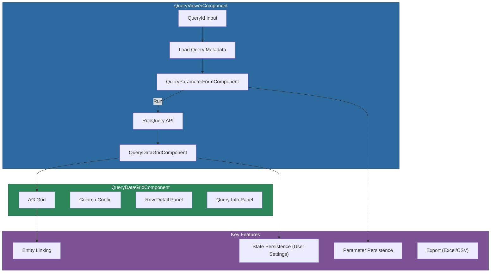

# @memberjunction/ng-query-viewer

Angular components for viewing and executing stored queries with parameter input, interactive AG Grid results, and entity linking. The recommended replacement for the deprecated `@memberjunction/ng-query-grid`.

## Installation

```bash
npm install @memberjunction/ng-query-viewer
```

## Overview

The Query Viewer provides a complete query execution experience: a parameter input form, an AG Grid results display, entity linking for clickable record IDs, and automatic state persistence to User Settings. It replaces the older Kendo-based Query Grid with a more feature-rich implementation.



## Usage

### Module Import

```typescript
import { QueryViewerModule } from '@memberjunction/ng-query-viewer';

@NgModule({
  imports: [QueryViewerModule]
})
export class YourModule {}
```

### Basic Usage

```html
<mj-query-viewer
  [QueryId]="selectedQueryId"
  [AutoRun]="true"
  (EntityLinkClick)="openRecord($event)">
</mj-query-viewer>
```

### Full Configuration

```html
<mj-query-viewer
  [QueryId]="queryId"
  [AutoRun]="false"
  [SelectionMode]="'multiple'"
  [ShowInfoPanel]="true"
  [ShowRowDetail]="true"
  [PersistState]="true"
  [PersistParams]="true"
  (EntityLinkClick)="navigateToEntity($event)"
  (SelectionChanged)="onSelectionChanged($event)"
  (RowClick)="onRowClick($event)"
  (GridStateChanged)="onStateChanged($event)">
</mj-query-viewer>
```

## Components

| Component | Selector | Purpose |
|-----------|----------|---------|
| `QueryViewerComponent` | `mj-query-viewer` | Top-level composite; orchestrates params, execution, and grid |
| `QueryDataGridComponent` | `mj-query-data-grid` | AG Grid wrapper with entity linking and export |
| `QueryParameterFormComponent` | `mj-query-parameter-form` | Renders input fields for query parameters |
| `QueryRowDetailComponent` | `mj-query-row-detail` | Expandable row detail display |
| `QueryInfoPanelComponent` | `mj-query-info-panel` | Query metadata and execution info panel |

## QueryViewerComponent API

### Inputs

| Property | Type | Default | Description |
|----------|------|---------|-------------|
| `QueryId` | `string \| null` | `null` | ID of the query to execute |
| `AutoRun` | `boolean` | `false` | Auto-run when all required params have saved values |
| `SelectionMode` | `QueryGridSelectionMode` | `'none'` | Row selection mode: `'none'`, `'single'`, `'multiple'` |
| `ShowInfoPanel` | `boolean` | `false` | Show query metadata panel |
| `ShowRowDetail` | `boolean` | `false` | Enable expandable row detail |
| `PersistState` | `boolean` | `true` | Save grid state (sort, columns) to User Settings |
| `PersistParams` | `boolean` | `true` | Save parameter values to User Settings |

### Outputs

| Event | Type | Description |
|-------|------|-------------|
| `EntityLinkClick` | `EventEmitter<QueryEntityLinkClickEvent>` | Clickable entity reference in a cell |
| `SelectionChanged` | `EventEmitter<QuerySelectionChangedEvent>` | Row selection changed |
| `RowClick` | `EventEmitter<QueryRowClickEvent>` | Row was clicked |
| `GridStateChanged` | `EventEmitter<QueryGridStateChangedEvent>` | Grid state changed (sort, filter, columns) |

## Exported Types

- `QueryGridSelectionMode` -- `'none' | 'single' | 'multiple'`
- `QueryGridColumnConfig` -- Column definition with entity link info
- `QueryGridSortState` -- Current sort column and direction
- `QueryGridState` -- Full persisted grid state
- `QueryParameterValues` -- Map of parameter names to values
- `QueryGridVisualConfig` -- Visual configuration options
- `QueryExportOptions` -- Export format and configuration
- `QueryRowClickEvent` -- Row click event data
- `QueryEntityLinkClickEvent` -- Entity link click with entity name and record ID

## Utility Functions

- `buildColumnsFromQueryFields(fields)` -- Generates column config from query field metadata
- `buildColumnsFromData(data)` -- Generates column config by inspecting result data

## Dependencies

- [@memberjunction/core](../../MJCore/README.md) -- Metadata, RunQuery, QueryInfo
- [@memberjunction/core-entities](../../MJCoreEntities/README.md) -- UserInfoEngine for state persistence
- [@memberjunction/ng-notifications](../notifications/README.md) -- User notifications
- [@memberjunction/ng-shared-generic](../shared/README.md) -- Loading component
- [@memberjunction/ng-export-service](../export-service/README.md) -- Export functionality
- `ag-grid-angular` / `ag-grid-community` -- Grid rendering

## Related Packages

- [@memberjunction/ng-query-grid](../query-grid/README.md) -- Deprecated predecessor
