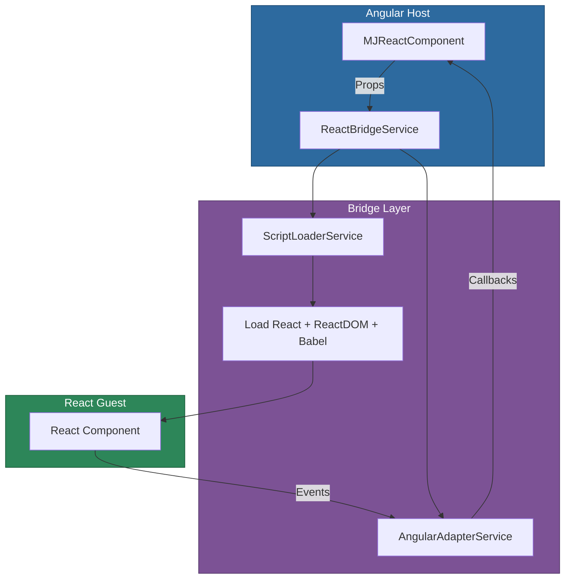

# @memberjunction/ng-react

An Angular integration library for rendering React components inside Angular applications. Provides a bridge component, script loader, and debugging tools for embedding React-based UI within the MemberJunction Angular ecosystem.

## Installation

```bash
npm install @memberjunction/ng-react
```

## Overview

This package provides a seamless bridge between Angular and React, allowing React components to be loaded and rendered within Angular templates. It handles React and ReactDOM script loading, Babel transpilation of JSX, component lifecycle management, and two-way communication between the Angular host and React guest.



## Usage

### Module Import

```typescript
import { ReactModule } from '@memberjunction/ng-react';

@NgModule({
  imports: [ReactModule]
})
export class YourModule {}
```

### Basic React Component Rendering

```html
<mj-react-component
  [ComponentCode]="reactComponentCode"
  [Props]="componentProps"
  (ComponentEvent)="handleReactEvent($event)"
  (StateChange)="handleStateChange($event)"
  (ComponentError)="handleError($event)">
</mj-react-component>
```

### Providing React Code

```typescript
reactComponentCode = `
  function MyComponent({ title, onAction }) {
    const [count, setCount] = React.useState(0);
    return (
      <div>
        <h2>{title}</h2>
        <p>Count: {count}</p>
        <button onClick={() => setCount(c => c + 1)}>Increment</button>
        <button onClick={() => onAction('submit')}>Submit</button>
      </div>
    );
  }
`;

componentProps = {
  title: 'My React Widget',
  onAction: (action: string) => console.log('React action:', action)
};
```

## Components

| Component | Selector | Purpose |
|-----------|----------|---------|
| `MJReactComponent` | `mj-react-component` | Renders a React component inside Angular |

### MJReactComponent Inputs

| Property | Type | Default | Description |
|----------|------|---------|-------------|
| `ComponentCode` | `string` | `''` | JSX/React code to transpile and render |
| `Props` | `Record<string, unknown>` | `{}` | Props passed to the React component |
| `EnableDebug` | `boolean` | `false` | Enable debug logging |

### MJReactComponent Outputs

| Event | Type | Description |
|-------|------|-------------|
| `ComponentEvent` | `EventEmitter<ReactComponentEvent>` | Custom events from the React component |
| `StateChange` | `EventEmitter<StateChangeEvent>` | React component state changes |
| `ComponentError` | `EventEmitter<Error>` | Errors during rendering or transpilation |
| `ComponentReady` | `EventEmitter<void>` | React component has mounted |

## Services

| Service | Purpose |
|---------|---------|
| `ScriptLoaderService` | Loads React, ReactDOM, and Babel from CDN with caching |
| `ReactBridgeService` | Manages React component lifecycle and prop synchronization |
| `AngularAdapterService` | Provides Angular context (router, DI) to React components |

## Configuration

### Debug Configuration

```typescript
import { ReactDebugConfig } from '@memberjunction/ng-react';

// Enable verbose logging for development
ReactDebugConfig.enabled = true;
ReactDebugConfig.logLevel = 'verbose';
```

## How It Works

1. `ScriptLoaderService` loads React, ReactDOM, and Babel scripts if not already present
2. The React component code (JSX string) is transpiled using Babel in the browser
3. `ReactBridgeService` creates a React root and renders the component into a DOM container
4. Props from Angular are passed to React; events from React are forwarded to Angular
5. On Angular component destruction, the React tree is properly unmounted

## Dependencies

- [@memberjunction/global](../../MJGlobal/README.md) -- Global utilities
- React and ReactDOM (loaded at runtime from CDN)
- Babel standalone (loaded at runtime for JSX transpilation)
