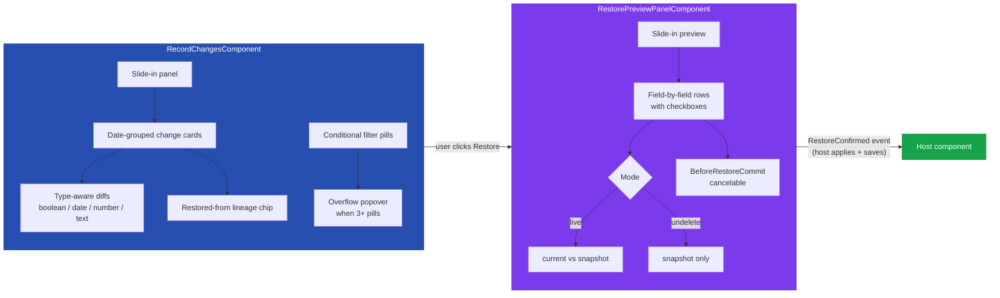

# @memberjunction/ng-record-changes

Angular components for browsing and restoring a record's change history. Renders the `RecordChange` timeline as a slide-in panel with type-aware diffs, version-label chips, restore lineage, and a reusable preview panel for the actual restore operation.



## Installation

```bash
npm install @memberjunction/ng-record-changes
```

## Usage

### Import the Module

```typescript
import { RecordChangesModule } from '@memberjunction/ng-record-changes';

@NgModule({
  imports: [RecordChangesModule]
})
export class MyModule { }
```

### Timeline + Restore (the typical case)

```html
<mj-record-changes
  [record]="myEntity"
  [AllowRestore]="true"
  (dialogClosed)="showHistory = false"
  (RestoreRequested)="onRestoreRequested($event)">
</mj-record-changes>
```

```typescript
async onRestoreRequested(event: RestoreVersionEvent) {
  // Apply each selected snapshot field
  for (const fv of event.FieldValues) {
    this.myEntity.Set(fv.FieldName, fv.Value);
  }
  // Mark the next save as a restore so the provider populates lineage columns
  this.myEntity.SetRestoreContext(event.SourceChangeID, event.Reason);
  try {
    await this.myEntity.Save();
  } finally {
    this.myEntity.ClearRestoreContext();
  }
}
```

The host is responsible for the actual save so consumers can intercept (custom approval, audit logging, etc.). `record-form-container` already wires this end-to-end.

### Standalone Restore Preview (un-delete from a Recycle Bin)

```html
<mj-restore-preview-panel
  [Visible]="showPreview"
  [Mode]="'undelete'"
  [RecordChange]="deletedChange"
  [EntityName]="'Customers'"
  (RestoreConfirmed)="onUndelete($event)"
  (RestoreCancelled)="showPreview = false">
</mj-restore-preview-panel>
```

## API Reference

### `RecordChangesComponent` (`mj-record-changes`)

The slide-in timeline of all changes to a single record. Hosts the reusable `RestorePreviewPanelComponent` for the actual restore confirmation flow.

#### Inputs

| Input | Type | Default | Description |
|-------|------|---------|-------------|
| `record` | `BaseEntity` | — | **Required.** The live record whose change history will be displayed. |
| `AllowRestore` | `boolean` | `false` | When true, renders a "Restore record to this version" button on each change card and exposes the `RestoreRequested` event. |

#### Outputs

| Output | Event Type | Description |
|--------|------------|-------------|
| `dialogClosed` | `void` | Emitted when the user closes the slide-in. |
| `RestoreRequested` | `RestoreVersionEvent` | Emitted after the user confirms a restore in the preview panel. The host is responsible for applying the snapshot and saving. |

#### `RestoreVersionEvent`

| Property | Type | Description |
|----------|------|-------------|
| `SourceChangeID` | `string` | ID of the historical RecordChange row whose state is being restored. Pass to `BaseEntity.SetRestoreContext()`. |
| `ChangedAt` | `Date` | When the historical change was made. |
| `ChangedByUser` | `string` | Display name / email of who made the historical change. |
| `Reason` | `string \| null` | Optional user-entered reason. Pass to `BaseEntity.SetRestoreContext()`. |
| `FieldValues` | `Array<{ FieldName; Value }>` | Selected snapshot field values, ready to pass to `BaseEntity.Set()`. |

#### Conditional filter pills

The filter bar renders only chips for change types/sources that actually exist in the loaded data — empty types never show. When more than two conditional chips would render they collapse into a "More filters ▾" popover with checkboxes. The "All" chip is always present.

#### Lineage chip

Change rows where `RestoredFromID` is populated render a violet "Restored from {time} by {user}" chip. Clicking the chip scrolls to and highlights the source row in the same timeline.

---

### `RestorePreviewPanelComponent` (`mj-restore-preview-panel`)

Reusable slide-in that previews a restore operation against a historical `MJRecordChangeEntity` and lets the user confirm with field-level granularity. Used by both `RecordChangesComponent` (for live-record restores) and `RecycleBinComponent` (for un-delete inserts).

#### Inputs

| Input | Type | Default | Description |
|-------|------|---------|-------------|
| `Visible` | `boolean` | `false` | Controls panel visibility. |
| `Mode` | `'live' \| 'undelete'` | `'live'` | `live` shows current-vs-snapshot diff; `undelete` shows snapshot only (the live record no longer exists). |
| `RecordChange` | `MJRecordChangeEntity` | `null` | **Required.** The historical change row whose state will be restored. The component reads `FullRecordJSON` to determine the target state. Any `Type` (`Create`, `Update`, `Delete`, `Snapshot`) is a valid restore source. |
| `LiveRecord` | `BaseEntity \| null` | `null` | The current live record to diff against. Required in `live` mode, ignored in `undelete` mode. |
| `EntityName` | `string \| null` | `null` | Required in `undelete` mode (where there's no `LiveRecord` to read it from). Optional in `live` mode. |
| `RequireReason` | `boolean` | `false` | When true, the Restore button disables until the user enters a non-empty reason. |
| `HideReason` | `boolean` | `false` | When true, hides the optional reason text area entirely. |

#### Outputs

| Output | Event Type | Description |
|--------|------------|-------------|
| `BeforeRestoreCommit` | `BeforeRestoreCommitEvent` | **Cancelable.** Fires when the user clicks Restore but before `RestoreConfirmed`. Set `cancel = true` to abort. |
| `RestoreConfirmed` | `RestoreCommitEvent` | Fires after the user confirms (and `BeforeRestoreCommit` was not cancelled). Host applies the field values and saves. |
| `RestoreCancelled` | `void` | Fires when the user dismisses the preview without restoring. |

#### `RestoreCommitEvent`

| Property | Type | Description |
|----------|------|-------------|
| `SourceChangeID` | `string` | ID of the source RecordChange row. |
| `Reason` | `string \| null` | Optional user-entered reason. |
| `FieldValues` | `Array<{ FieldName; Value }>` | Selected field values, ready for `BaseEntity.Set()`. |
| `AllRows` | `RestoreFieldRow[]` | Full preview rows including unselected, for audit/logging. |
| `Mode` | `'live' \| 'undelete'` | The mode the panel was operating in. |

## Semantic correctness

The preview compares the **full snapshot** captured in the source change's `FullRecordJSON` to the current live record (or to nothing in undelete mode). It does NOT roll back a single delta — restoring `v2` means *"make the record look like it did at v2"*, not *"undo v3's changes"*.

This also means any change row is a valid restore target: `Create` (the original state), `Update` (post-update state), `Snapshot` (an explicit point-in-time capture from the Version Label system), or `Delete` (state before deletion — used by the Recycle Bin).

## Type Exports

```typescript
import {
  // Timeline
  RecordChangesComponent,
  RecordChangesModule,
  RestoreVersionEvent,
  FieldChangeInfo,
  DateGroup,
  FilterPill,

  // Restore Preview
  RestorePreviewPanelComponent,
  RestorePreviewMode,
  RestoreFieldRow,
  RestoreCommitEvent,
  BeforeRestoreCommitEvent,
} from '@memberjunction/ng-record-changes';
```

## Dependencies

### Runtime Dependencies

| Package | Description |
|---------|-------------|
| `@memberjunction/core` | Core framework (BaseEntity, Metadata, RunView) |
| `@memberjunction/core-entities` | `MJRecordChangeEntity` definition |
| `@memberjunction/ng-shared-generic` | Shared generic components (mj-loading) |
| `@memberjunction/ng-versions` | Provides `mj-slide-panel` and version label create wizard |
| `@memberjunction/ng-notifications` | Toast notifications |
| `diff` | Word/character text diff for the timeline |

### Peer Dependencies

- `@angular/common` ^21.x
- `@angular/core` ^21.x
- `@angular/forms` ^21.x

## Build

```bash
cd packages/Angular/Generic/record-changes
npm run build
```

## License

ISC
