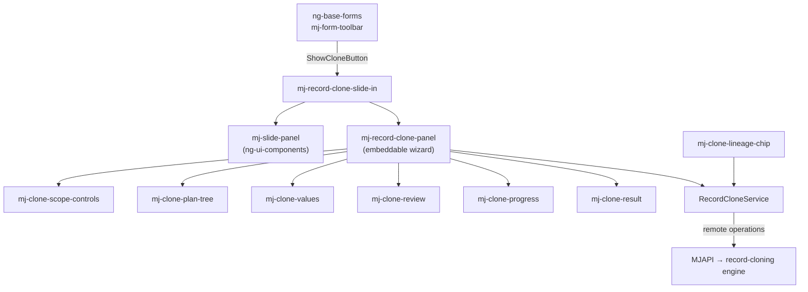

# @memberjunction/ng-record-clone

Angular widgets for cloning a MemberJunction record together with the records it owns: an embeddable clone wizard, a slide-in wrapper around it, and the smaller pieces they are built from (plan tree, values form, review, progress, result, lineage chip).

> **Layering note.** This package is UI only. The graph walk, policies, field mapping and writes live on the server in **`@memberjunction/record-cloning`** (engine) and **`@memberjunction/record-cloning-base`** (client-safe contracts). The widgets reach the engine through four MJ remote operations (`RecordClone.Describe`, `.Plan`, `.Execute`, `.GetLineage`) whose typed clients CodeGen emits into `@memberjunction/core-entities`. There is no custom GraphQL resolver. See [`plans/record-cloning/README.md`](../../../../plans/record-cloning/README.md) for the full design.

The package is a widgets-layer (`mjUILayer: "widgets"`) library. It never imports the Router or anything under `packages/Angular/Explorer`; every navigation is an output event the host maps onto its own routing.

## Overview



| Component | Selector | Use it when |
|---|---|---|
| `RecordClonePanelComponent` | `mj-record-clone-panel` | You want the wizard inline: a dialog, a dashboard card, a side pane, a test harness |
| `RecordCloneSlideInComponent` | `mj-record-clone-slide-in` | You want the standard right-hand slide-in with one element |
| `CloneLineageChipComponent` | `mj-clone-lineage-chip` | You want a "Cloned from X" / "3 clones" chip with a lineage popover |
| `RecordCloneService` | — | You want to call the remote operations directly |

The building blocks (`mj-clone-scope-controls`, `mj-clone-plan-tree`, `mj-clone-values`, `mj-clone-review`, `mj-clone-progress`, `mj-clone-result`) are exported for hosts that compose their own flow.

## Installation

```bash
npm install @memberjunction/ng-record-clone
```

Every component is standalone. Import the ones you use, or `RecordCloneModule` for all of them.

## Usage

### On entity forms (no code)

`ng-base-forms` hosts the slide-in in the record toolbar. The Clone button appears when all of these hold:

1. The toolbar config has `ShowCloneButton: true`. It is on in `DEFAULT_TOOLBAR_CONFIG`, `EXPLORER_TOOLBAR_CONFIG` and `CUSTOM_LAYOUT_TOOLBAR_CONFIG`; a form turns it off with `Toolbar: { ShowCloneButton: false }` in its form config.
2. The entity's `Configuration.Clone.Enabled` is `true` on its `MJ: Entities` record.
3. `RecordClone.Describe` says the current user may clone it (cached per provider and entity for the session).
4. The record is saved and the form is in read mode.

The toolbar re-emits the clone's navigation requests through its own `Navigate` output as a `RecordNavigationEvent`, so existing form hosts need no changes. It also emits `BeforeClone` (cancellable) and `CloneCompleted`.

### Slide-in

```html
<button (click)="ShowClone = true">Clone</button>

<mj-record-clone-slide-in
    [(Visible)]="ShowClone"
    [Record]="record"
    [Provider]="provider"
    (CloneCompleted)="OnCloned($event)"
    (NavigateToRecord)="OpenRecord($event)">
</mj-record-clone-slide-in>
```

```typescript
import { CompositeKey } from '@memberjunction/core';
import type { CloneCompletedEvent, CloneNavigationEvent } from '@memberjunction/ng-record-clone';

OnCloned(e: CloneCompletedEvent): void {
    console.log(`Created ${e.CreatedRecordsCount} records, log ${e.CloneLogID}`);
}

OpenRecord(e: CloneNavigationEvent): void {
    const entity = this.provider.EntityByName(e.EntityName);
    this.myNavigation.OpenRecord(e.EntityName, CompositeKey.FromURLSegment(entity, e.RecordKey));
}
```

The slide-in creates the panel on first open and restarts it on every later open, so each open plans against the record's current state. It refuses to close (X, Escape, backdrop, or `Close()`) while a clone is executing.

### Embedded panel

```html
<mj-record-clone-panel
    [EntityName]="'MJ: AI Prompts'"
    [RecordKey]="promptId"
    (StateChange)="State = $event"
    (CloneCompleted)="OnCloned($event)"
    (NavigateToRecord)="OpenRecord($event)"
    (CloseRequested)="HidePanel()">
</mj-record-clone-panel>
```

Give the panel a source with `Record`, or with `EntityName` plus `RecordKey`. `RecordKey` accepts a `RecordCloneKey` or a record-id string in compact URL-segment form: a bare value for a single-column key, `Field1|Value1||Field2|Value2` for a composite one. It is parsed with `CompositeKey.FromURLSegment` against the entity's metadata.

With `AutoStart` on (the default) the panel describes and plans as soon as it has a source. Set `[AutoStart]="false"` and call `Start()` to control timing.

### Lineage chip

```html
<mj-clone-lineage-chip
    [EntityName]="record.EntityInfo.Name"
    [RecordKey]="record.PrimaryKey.ToURLSegment()"
    (NavigateToRecord)="OpenRecord($event)">
</mj-clone-lineage-chip>
```

Renders nothing when the record has no lineage.

## Component Reference

### `mj-record-clone-panel` — `RecordClonePanelComponent`

The wizard: **Scope** (preset, caps, toggles, planned record tree) → **Values** (clone name, prompted fields, retarget pickers, reason) → **Review** (counts, warnings, per-node field diff) → **Executing** → **Done** or **Failed**. An entity that can't be cloned shows the server's reason instead.

**Inputs**

| Input | Type | Default | Description |
|---|---|---|---|
| `Record` | `BaseEntity \| null` | `null` | Record to clone. Supplies the key and entity name when those inputs are not set. |
| `EntityName` | `string` | — | Source entity, e.g. `'MJ: Users'`. |
| `RecordKey` | `RecordCloneKey \| string` | — | Source key; see [Embedded panel](#embedded-panel). |
| `AutoStart` | `boolean` | `true` | Start as soon as a source is set. |
| `ShowStepTabs` | `boolean` | `true` | Show the Scope / Values / Review tabs. |
| `Provider` | `IMetadataProvider \| null` | `null` | Inherited from `BaseAngularComponent`; every server call uses it. |

**Outputs**

| Output | Payload | Fires when |
|---|---|---|
| `StateChange` | `RecordClonePanelState` | The wizard state changes (`loading`, `scope`, `values`, `review`, `executing`, `done`, `failed`, `not_cloneable`, …). |
| `StepChange` | `RecordCloneStep` | The active step changes. |
| `PlanChanged` | `RecordClonePlanDetails` | A plan (re)computation succeeds. |
| `CloneCompleted` | `CloneCompletedEvent` | The clone commits. The panel also raises the standard BaseEntity `save` / `create` event for the root so open grids refresh. |
| `CloneFailed` | `CloneFailedEvent` | Describe, plan or execute fails. `ResultCode` carries `PLAN_CHANGED`, `FORBIDDEN`, etc. when the server sent one. |
| `NavigateToRecord` | `CloneNavigationEvent` | The user opens the new clone or its clone log. Followed by `CloseRequested`. |
| `CloseRequested` | `void` | The user pressed Close or Cancel. The panel never hides itself. |

**Methods and properties**

| Member | Description |
|---|---|
| `Start(): Promise<void>` | Describe, plan, land on Scope. Calling it again starts over. |
| `Reset(): Promise<void>` | Clear entered values and start over ("Clone another"). |
| `Replan(): Promise<void>` | Re-plan with the current `ScopeOptions`. |
| `GoToStep(step)` | Move to a step. Review is refused while prompted values are invalid, and entering it re-plans with the entered values. |
| `ExecuteClone(): Promise<void>` | Execute the reviewed plan with its hash. The server refuses with `PLAN_CHANGED` if the graph moved since review. |
| `CurrentState`, `CurrentStep` | Current wizard position. |
| `IsBusy` | True while loading or executing. |
| `ActivePlan`, `DescribeDetails`, `ExecutionResult` | Latest server answers. |
| `ScopeOptions` | Options sent with every plan and execute. |
| `TargetRecordKey` | Record-id string of the root clone after success. |

**Where the values step gets its fields.** Nothing on the values step is specific to any one entity. The prompted fields come from the entity's `Configuration.Clone.Fields.PromptFor` (for `MJ: Users`: `Email`, `FirstName`, `LastName`). They start empty unless the engine proposed a value, because a prompted field such as a unique Email must not keep the source row's value. The suggested clone name comes from the naming strategy (`Clone.Naming`; by default the name field plus any unique string field). When a prompted field is also a `Clone.Naming.Fields` entry, typing in it keeps the clone name in step until the user edits the name directly. Retarget pickers come from `Clone.UI.RetargetFields`.

### `mj-record-clone-slide-in` — `RecordCloneSlideInComponent`

**Inputs:** `Visible` (two-way with `VisibleChange`), `Record`, `EntityName`, `RecordKey`, `Title` (default `Clone <entity>`), `WidthPx` (default 720), `ShowStepTabs`, `Provider`.

**Outputs:** `VisibleChange`, `Closed`, plus every panel output re-emitted unchanged: `StateChange`, `StepChange`, `PlanChanged`, `CloneCompleted`, `CloneFailed`, `NavigateToRecord`.

**Methods:** `Open()`, `Close()` (ignored while executing), `Panel` (the embedded `RecordClonePanelComponent` once opened), `CanCloseGuard` (passed to `mj-slide-panel`).

### Building blocks

| Component | Inputs | Outputs |
|---|---|---|
| `mj-clone-scope-controls` | `Presets`, `SelectedPreset`, `MaxDepth`, `Subtypes`, `Hierarchy`, `SoftLinks`, `EntityActions`, `CanFireHooks`, `MaxRecords` | `ScopeChanged: RecordClonePlanOptions` |
| `mj-clone-plan-tree` | `Plan`, `SelectedNodeKey` | `NodeSelected: RecordClonePlanNode` |
| `mj-clone-values` | `EntityName`, `RootName`, `NamingStrategyReason`, `PromptedFields`, `PromptedValues`, `RetargetFields`, `Reason` | `RootNameChange`, `PromptedValuesChange`, `RetargetFieldsChange`, `ReasonChange`, `ValidityChange` |
| `mj-clone-review` | `Plan`, `RootName`, `Reason`, `IsExecuting` | `Confirm`, `Cancel`, `NodeClicked: string` |
| `mj-clone-progress` | `Progress: CloneProgressUpdate` | — |
| `mj-clone-result` | `Result`, `EntityName`, `TargetKey`, `RootRecordName` | `OpenClone`, `CloneAnother`, `Close`, `OpenCloneLog`, `NavigateToRecord` |
| `mj-clone-lineage-chip` | `EntityName`, `RecordKey`, `AutoLoad`, `LineageData` | `NavigateToRecord` |

The plan tree also exposes `ExpandAll()` and `CollapseAll()`. The lineage chip exposes `LoadLineage()`, `TogglePopover()` and `ClosePopover()`.

### `RecordCloneService`

`providedIn: 'root'`. Every method takes an optional `IMetadataProvider`; when it's omitted, the service uses `Metadata.Provider`.

| Method | Remote operation | Notes |
|---|---|---|
| `DescribeRecord(input, provider?, forceRefresh?)` | `RecordClone.Describe` | Entity-level answers (no `Key`) are cached per provider and entity. Concurrent callers share one request, and failures are not cached. |
| `PlanClone(input, provider?)` | `RecordClone.Plan` | Dry run; writes nothing. |
| `ExecuteClone(input, provider?)` | `RecordClone.Execute` | Pass `ExpectedPlanHash` from the reviewed plan. |
| `GetLineage(input, provider?)` | `RecordClone.GetLineage` | Ancestors and clones of a record. |
| `ClearDescribeCache(entityName?, provider?)` | — | Drop one entity's cached answer, or all of them. |

### Types

| Type | Description |
|---|---|
| `RecordClonePanelState`, `RecordCloneStep` | Wizard state and step unions. |
| `CloneCompletedEvent` | `EntityName`, `TargetKey`, `CloneLogID`, `CreatedRecordsCount`, `Result`. |
| `CloneFailedEvent` | `EntityName`, `Message`, `ResultCode?`. |
| `CloneNavigationEvent` | `{ Kind: 'record', EntityName, RecordKey }`. `RecordKey` is a record-id string for `CompositeKey.FromURLSegment`. |
| `ClonePromptFieldItem`, `CloneRetargetFieldItem`, `CloneProgressUpdate`, `CloneTreeNodeViewModel` | View models for the building blocks. |
| `EntityToRecordCloneKey(record)`, `CompositeKeyToRecordCloneKey(key)`, `RecordCloneKeyToString(key)` | Key helpers that keep every primary key column. |

## Key Design Patterns

- **Events out, never routing.** Components emit `CloneNavigationEvent`, `CloseRequested` and friends. The base-forms toolbar turns navigation into its own `Navigate` output; Explorer's form host routes it from there.
- **Server is the gate.** The UI hides what the server says the user can't do, but `Describe`, `Plan` and `Execute` re-check every permission, cap and lock on the server.
- **Plan hash.** `Execute` carries the reviewed plan's hash, so a graph that changed after review is refused with `PLAN_CHANGED` rather than cloned blind.
- **Theming.** Styles use MJ semantic tokens only (`--mj-bg-surface`, `--mj-border-default`, `--mj-text-*`, `--mj-status-*`, `--mj-space-*`, `--mj-radius-*`), so light, dark and custom themes apply without overrides.
- **Multi-provider.** Every component extends `BaseAngularComponent` or takes a provider, and the service never assumes the global provider when one is given.

## Dependencies

| Package | Why |
|---|---|
| `@memberjunction/core` | `BaseEntity`, `CompositeKey`, `IMetadataProvider` |
| `@memberjunction/core-entities` | Generated remote-operation clients and their input/output types |
| `@memberjunction/global` | Event bus for the post-clone `save` event |
| `@memberjunction/ng-base-types` | `BaseAngularComponent` (provider plumbing) |
| `@memberjunction/ng-ui-components` | `mj-slide-panel`, `mj-tab-nav`, `mj-switch`, `mjButton` |

Peer dependencies: `@angular/core`, `@angular/common`, `@angular/forms`.

## Build

```bash
cd packages/Angular/Generic/record-clone
npm run build        # ngc
npm test             # vitest (DOM + unit)
npm run test:types   # type-check the specs
```

## License

BUSL-1.1
