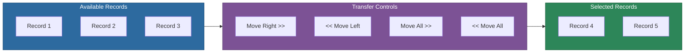

# @memberjunction/ng-record-selector

A dual-listbox Angular component for selecting entity records in MemberJunction applications. Provides a drag-and-drop or button-based interface for moving records between "available" and "selected" lists.

## Installation

```bash
npm install @memberjunction/ng-record-selector
```

## Overview

The Record Selector renders two side-by-side Kendo ListBox panels: one for available records and one for selected records. Users can transfer records between lists using toolbar buttons or drag-and-drop. It supports loading data from any MemberJunction entity and emits events when selections change.



## Usage

### Module Import

```typescript
import { RecordSelectorModule } from '@memberjunction/ng-record-selector';

@NgModule({
  imports: [RecordSelectorModule]
})
export class YourModule {}
```

### Basic Usage

```html
<mj-record-selector
  [EntityName]="'Users'"
  [DisplayField]="'UserName'"
  [SelectedRecords]="preSelectedUsers"
  (OnRecordListChanged)="onSelectionChanged($event)">
</mj-record-selector>
```

### With Custom Configuration

```html
<mj-record-selector
  [EntityName]="'Products'"
  [DisplayField]="'Name'"
  [DisplayIconField]="'IconClass'"
  [AvailableRecords]="filteredProducts"
  [UnselectedRecords]="unselectedProducts"
  [SelectedRecords]="selectedProducts"
  [ToolbarSettings]="toolbarConfig"
  (OnRecordListChanged)="handleChange($event)">
</mj-record-selector>
```

## API Reference

### Selector

`mj-record-selector`

### Inputs

| Property | Type | Default | Description |
|----------|------|---------|-------------|
| `EntityName` | `string` | `''` | MemberJunction entity to load records from |
| `DisplayField` | `string` | `''` | Field name to display as the label in each list item |
| `DisplayIconField` | `string` | `''` | Optional field for icon class on list items |
| `AvailableRecords` | `BaseEntity[]` | `[]` | Full set of available records |
| `SelectedRecords` | `BaseEntity[]` | `[]` | Records already selected |
| `UnselectedRecords` | `BaseEntity[]` | `[]` | Records explicitly unselected |
| `ToolbarSettings` | `ToolbarSettings` | default | Kendo ListBox toolbar configuration |

### Outputs

| Event | Type | Description |
|-------|------|-------------|
| `OnRecordListChanged` | `EventEmitter<RecordListChangedEvent>` | Emitted when records move between lists |

## Dependencies

- [@memberjunction/core](../../MJCore/README.md) -- Metadata, BaseEntity
- `@progress/kendo-angular-listbox` -- Dual listbox rendering
- `@progress/kendo-angular-buttons` -- Toolbar buttons

## Related Packages

- [@memberjunction/ng-find-record](../find-record/README.md) -- Search-based record selection
- [@memberjunction/ng-join-grid](../join-grid/README.md) -- Grid-based many-to-many management
