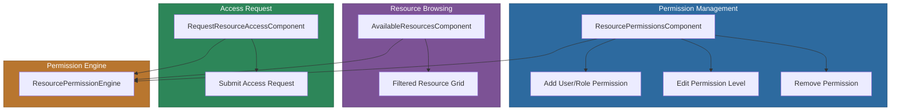

# @memberjunction/ng-resource-permissions

Angular components for managing resource-level permissions in MemberJunction applications. Provides interfaces for viewing, granting, editing, and revoking permissions for any resource type, viewing available resources, and requesting access to restricted resources.

## Installation

```bash
npm install @memberjunction/ng-resource-permissions
```

## Overview

The resource permissions package provides three components that together form a complete permission management workflow: managing who can access a resource and at what level, viewing which resources a user has access to, and requesting access to restricted resources. All permission changes are grouped in transactions for data integrity.



## Usage

### Module Import

```typescript
import { ResourcePermissionsModule } from '@memberjunction/ng-resource-permissions';

@NgModule({
  imports: [ResourcePermissionsModule]
})
export class YourModule {}
```

### Managing Permissions

```html
<mj-resource-permissions
  [ResourceTypeID]="reportResourceTypeID"
  [ResourceRecordID]="reportID"
  [ShowSaveButton]="true"
  [AllowAddPermissions]="true"
  [AllowEditPermissions]="true"
  [AllowDeletePermissions]="true"
  [PermissionLevels]="['View', 'Edit', 'Owner']">
</mj-resource-permissions>
```

### Viewing Available Resources

```html
<mj-available-resources
  [User]="currentUser"
  [ResourceTypeID]="dashboardResourceTypeID"
  [ResourceExtraFilter]="'IsActive = 1'"
  [SelectionMode]="'Multiple'"
  (SelectionChanged)="onResourceSelectionChanged($event)">
</mj-available-resources>
```

### Requesting Access

```html
<mj-request-resource-access
  [ResourceType]="'Report'"
  [ResourceName]="'Sales Dashboard'"
  [ResourceRecordID]="reportID"
  [PermissionLevel]="'View'"
  (AccessRequested)="onAccessRequested($event)">
</mj-request-resource-access>
```

## Components

| Component | Selector | Purpose |
|-----------|----------|---------|
| `ResourcePermissionsComponent` | `mj-resource-permissions` | Manage user/role permissions for a resource |
| `AvailableResourcesComponent` | `mj-available-resources` | Display resources available to a user |
| `RequestResourceAccessComponent` | `mj-request-resource-access` | Request access to a restricted resource |

## ResourcePermissionsComponent

### Inputs

| Property | Type | Default | Description |
|----------|------|---------|-------------|
| `ResourceTypeID` | `string` | -- | ID of the resource type (required) |
| `ResourceRecordID` | `string` | -- | ID of the resource record (required) |
| `ShowSaveButton` | `boolean` | `false` | Show built-in Save button |
| `ShowPermissionLevels` | `boolean` | `true` | Show permission level options |
| `AllowAddPermissions` | `boolean` | `true` | Allow adding permissions |
| `AllowEditPermissions` | `boolean` | `true` | Allow editing permissions |
| `AllowDeletePermissions` | `boolean` | `true` | Allow deleting permissions |
| `PermissionLevels` | `string[]` | `['View', 'Edit', 'Owner']` | Available permission levels |
| `PermissionTypes` | `string[]` | `['User', 'Role']` | Available permission types |

### Methods

| Method | Returns | Description |
|--------|---------|-------------|
| `SavePermissions()` | `Promise<boolean>` | Save all pending permission changes |
| `UpdateResourceRecordID(id)` | `void` | Change the resource record ID |

## Permission Workflow

1. **Grant access**: Add a user or role permission with a specific level (View, Edit, Owner)
2. **Edit access**: Change an existing permission level
3. **Revoke access**: Remove a permission entry
4. **Request access**: Users without permission can submit a request (created with `Status = 'Requested'`)
5. **Approve/deny**: Resource owner reviews and approves or denies the request

## Dependencies

- [@memberjunction/core](../../MJCore/README.md) -- Metadata, entity framework
- [@memberjunction/core-entities](../../MJCoreEntities/README.md) -- ResourcePermissionEntity, ResourcePermissionEngine
- [@memberjunction/ng-notifications](../notifications/README.md) -- Notification service
- [@memberjunction/ng-generic-dialog](../generic-dialog/README.md) -- Dialog component
- `@progress/kendo-angular-grid` -- Grid rendering
- `@progress/kendo-angular-dropdowns` -- Dropdown selectors
