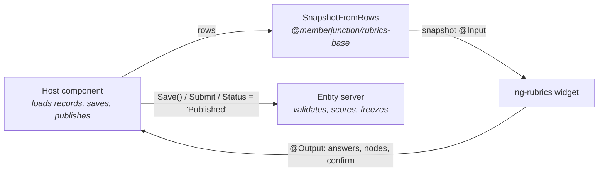

# @memberjunction/ng-rubrics

Presentational widgets for rubrics: author a draft, answer one, show a result, confirm a publish, compare
versions, and compare evaluators. They take snapshots as inputs and emit what changed. They do not save,
publish, or navigate, so they work in Explorer, in an application, or in a dialog. Scoring and previews call
`RubricScoring` from `@memberjunction/rubrics-base`; there is no second copy of the math.

> **Start with the [Rubrics Guide](../../../../guides/RUBRICS_GUIDE.md)** for the model and the tasks these
> widgets serve. This README is the component reference.



## Install

Every component is standalone. Import the ones you use, or `RubricsModule` for all of them.

```typescript
import { RubricScoringFormComponent, RubricResultComponent } from '@memberjunction/ng-rubrics';
```

## Components

### `mj-rubric-builder` — author a draft

| | Name | Type | |
|---|---|---|---|
| Input | `Nodes` | `RubricNodeSnapshot[]` | The criteria tree |
| Input | `Scales`, `Bands`, `BaseBands` | snapshots | Scales the leaves use; this draft's and the base version's bands |
| Input | `Version` | `RubricVersionSnapshot \| null` | The draft version, for the preview |
| Input | `SampleAnswers` | `RubricFormAnswer[]` | Answers the preview scores |
| Input | `ReadOnly`, `Viewing` | `boolean`, `'draft' \| 'published'` | Lock the editor; which side is shown |
| Input | `Name`, `PublishedLabel`, `NextVersion`, `ComputedBump` | `string` | Header text |
| Output | `NodesChange`, `BandsChange`, `ViewingChange` | | The edited tree or bands; the side toggle |

Shows each node's share of its group (advisory nodes are left out of the share) and the problems that would
block a publish: a duplicate key, a leaf with no scale, a gate with no minimum.

### `mj-rubric-scoring-form` — answer a rubric

| | Name | Type | |
|---|---|---|---|
| Input | `Version` | `RubricVersionSnapshot \| null` | The published version being answered |
| Input | `Answers` | `RubricFormAnswer[]` | Saved answers to resume from |
| Output | `AnswersChange` | `RubricFormAnswer[]` | Every change, for autosave |
| Output | `Submit` | `RubricFormAnswer[]` | The complete answer set |

Digits select a level and `N` marks the criterion not applicable. The shortcuts are ignored while typing in a
text field, so rationale and evidence are never intercepted. Numeric and Percentage scales take a raw value. Submit
stays disabled until every required answer, rationale, and evidence item is present.

```html
<mj-rubric-scoring-form
    [Version]="version"
    [Answers]="answers"
    (AnswersChange)="saveDraft($event)"
    (Submit)="submit($event)">
</mj-rubric-scoring-form>
```

### `mj-rubric-result` — show one evaluation

| | Name | Type | |
|---|---|---|---|
| Input | `Version` | `RubricVersionSnapshot \| null` | The version the evaluation pinned |
| Input | `Result` | `RubricScoreResult \| null` | The stored result |
| Input | `Answers` | `RubricFormAnswer[]` | Saved answers, shown beside each bar |

Read-only. The score is mapped onto the version's display range, the band is the stored band, and each
criterion is a bar with its rationale and evidence.

### `mj-rubric-publish-dialog` — confirm a publish

| | Name | Type | |
|---|---|---|---|
| Input | `Base`, `Draft` | `RubricVersionSnapshot \| null` | The version being replaced and the draft |
| Input | `RequestedBump`, `Summary`, `ReadOnly` | | The author's choices |
| Output | `RequestedBumpChange`, `SummaryChange` | | |
| Output | `Confirm` | `{ bump, summary }` | `bump` is null unless the author asked for a higher one |

Shows the computed bump and the reason for each change. The host publishes by setting the draft's `Status`
to `Published` and saving; the server computes the number and hashes.

### `mj-rubric-version-diff` — compare two versions

Inputs `Base` and `Draft`. One row per criterion key, with each change and its bump.

### `mj-rubric-comparison-matrix` — compare evaluators

| | Name | Type | |
|---|---|---|---|
| Input | `Keys` | `string[]` | Criterion keys, top to bottom |
| Input | `Columns` | `MatrixColumn[]` | One column per evaluation |
| Input | `Provider`, `RubricId`, `Major`, `SubjectEntityId` | | Lets the matrix load the cohort itself |
| Input | `ViewerStatus`, `ViewerEvaluationId` | `string` | The viewer's own evaluation |

Evaluators across, criteria down. Cells that disagree are marked, and the grid shows the human mean, the AI
mean, the self mean and the cohort mean. Withdrawn columns stay visible and stay out of the means. **While the
viewer's own evaluation is a Draft, cohort figures and other people's rationales are hidden**, so a reviewer
scores before seeing anyone else.

### `mj-rubric-version-board`

Input `Cards: RubricVersionCard[]`, output `Open` with a version id. A card per version with its status.

### Record editors and hosts

`RubricCriterionEditorComponent`, `RubricScoreEditorComponent`, `RubricScaleLevelEditorComponent`,
`RubricBandEditorComponent`, `RubricCategoryEditorComponent`, and the `*HostComponent`s bind one record each.
Hosts load through the `Provider` the form passes in and never navigate. Explorer's generated forms use them.
