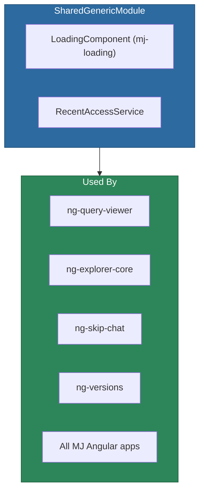

# @memberjunction/ng-shared-generic

Generic Angular shared utilities and components used across all MemberJunction Angular applications. Provides the standard `<mj-loading>` component and the `RecentAccessService` for tracking recently viewed resources.

## Installation

```bash
npm install @memberjunction/ng-shared-generic
```

## Overview

This package contains foundational UI elements and services that are used by many other MemberJunction Angular packages. Its primary exports are the animated MJ Loading component (the standard loading indicator across all MJ applications) and the RecentAccessService singleton.



## Usage

### Module Import

```typescript
import { SharedGenericModule } from '@memberjunction/ng-shared-generic';

@NgModule({
  imports: [SharedGenericModule]
})
export class YourModule {}
```

### Loading Component

The `<mj-loading>` component displays the animated MJ logo with optional text. It is the **standard loading indicator** for all MemberJunction applications.

```html
<!-- Basic usage -->
<mj-loading></mj-loading>

<!-- With custom text -->
<mj-loading text="Loading records..."></mj-loading>

<!-- Size presets -->
<mj-loading text="Please wait..." size="medium"></mj-loading>

<!-- No text, just logo animation -->
<mj-loading [showText]="false"></mj-loading>

<!-- Custom animation style -->
<mj-loading animation="spin"></mj-loading>

<!-- With gradient colors -->
<mj-loading [logoGradient]="{startColor: '#228B22', endColor: '#C41E3A'}"></mj-loading>
```

#### LoadingComponent Inputs

| Property | Type | Default | Description |
|----------|------|---------|-------------|
| `text` | `string` | `'Loading...'` | Text displayed below the animation |
| `showText` | `boolean` | `true` | Whether to show the text |
| `animationDuration` | `number` | `1.5` | Animation duration in seconds |
| `size` | `'small' \| 'medium' \| 'large' \| 'auto'` | `'medium'` | Size preset |
| `textColor` | `string` | `'#666666'` | Text color |
| `logoColor` | `string` | `'#1a73e8'` | Logo fill color |
| `logoGradient` | `LogoGradient` | `undefined` | Gradient fill (overrides `logoColor`) |
| `animation` | `'pulse' \| 'spin' \| 'bounce'` | `'pulse'` | Animation style |

#### LogoGradient Interface

```typescript
interface LogoGradient {
  startColor: string;
  endColor: string;
  angle?: number;  // default: 45
}
```

### RecentAccessService

A singleton service that tracks recently accessed resources (entities, records) for quick navigation.

```typescript
import { RecentAccessService } from '@memberjunction/ng-shared-generic';

// Track a resource access
RecentAccessService.Instance.TrackAccess({
  EntityName: 'Products',
  RecordID: 'product-123',
  DisplayName: 'Conference Pass',
  Timestamp: new Date()
});

// Get recent items
const recentItems = RecentAccessService.Instance.RecentItems;
```

### ThemeService

Manages application-wide theming with built-in light/dark modes and pluggable custom theme support. Preferences are persisted per-user via `UserInfoEngine`.

```typescript
import { ThemeService, ThemeDefinition } from '@memberjunction/ng-shared-generic';

const themeService = inject(ThemeService);

// Register a custom theme before Initialize()
themeService.RegisterTheme({
  Id: 'my-dark',
  Name: 'My Dark',
  BaseTheme: 'dark',
  CssUrl: 'assets/themes/my-dark.css',
  IsBuiltIn: false
});

// Switch themes at runtime
await themeService.SetTheme('my-dark');

// React to theme changes
themeService.AppliedTheme$.subscribe(themeId => {
  console.log('Active theme:', themeId);
});
```

Key properties: `Preference$`, `AppliedTheme$`, `AvailableThemes`, `IsInitialized`.

Key methods: `RegisterTheme()`, `RegisterThemes()`, `Initialize()`, `SetTheme()`, `Reset()`.

### Design Tokens

This package ships `_tokens.scss`, the CSS custom property foundation for the entire MJ design system. Tokens cover colors, typography, spacing, effects, and z-index.

Use semantic tokens in component SCSS:

```scss
.my-panel {
  background: var(--mj-bg-surface);
  color: var(--mj-text-primary);
  border: 1px solid var(--mj-border-default);
  padding: var(--mj-space-4);
  border-radius: var(--mj-radius-md);
}
```

For the full token catalog, architecture details, custom theme creation guide, and best practices, see **[THEMING.md](./THEMING.md)**.

## Dependencies

- [@memberjunction/core](../../MJCore/README.md) -- Core MJ framework
- [@memberjunction/core-entities](../../MJCoreEntities/README.md) -- Entity types
