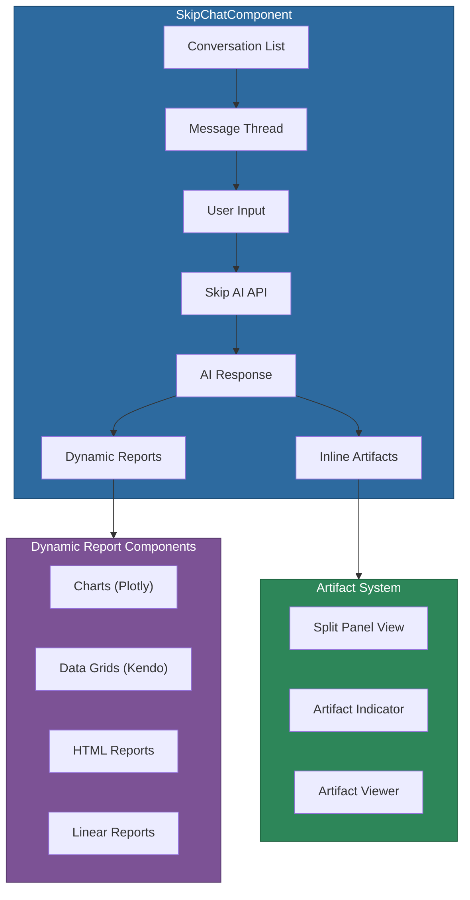

# @memberjunction/ng-skip-chat

> **Note**: For conversational AI functionality, consider using the `@memberjunction/ng-conversations` package, which provides the latest conversational interface patterns.

An Angular component package for integrating the Skip AI assistant into MemberJunction applications. Provides a full chat interface with conversation management, dynamic report rendering, inline artifact viewing, and data visualization.

## Installation

```bash
npm install @memberjunction/ng-skip-chat
```

## Overview

Skip Chat provides a complete conversational AI experience within MemberJunction applications. It manages conversation persistence, renders AI-generated dynamic reports and charts, supports inline artifact viewing with a split-panel layout, and integrates with the MJ data context system for contextual understanding.



## Usage

### Module Import

```typescript
import { SkipChatModule } from '@memberjunction/ng-skip-chat';

@NgModule({
  imports: [SkipChatModule]
})
export class YourModule {}
```

### Basic Usage

```html
<skip-chat
  [Title]="'Ask Skip'"
  [ShowConversationList]="true"
  [SkipLogoURL]="'assets/Skip-Logo.png'"
  (NavigateToMatchingReport)="handleReportNavigation($event)"
  (NewReportCreated)="handleNewReport($event)">
</skip-chat>
```

### Embedded in Entity Record

```html
<skip-chat
  [LinkedEntity]="'Products'"
  [LinkedEntityCompositeKey]="productKey"
  [ShowConversationList]="false"
  [UpdateAppRoute]="false">
</skip-chat>
```

## Key Inputs

| Property | Type | Default | Description |
|----------|------|---------|-------------|
| `Title` | `string` | `'Ask Skip'` | Chat interface title |
| `ShowConversationList` | `boolean` | `true` | Show the conversation sidebar |
| `AllowNewConversations` | `boolean` | `true` | Allow creating conversations |
| `SkipLogoURL` | `string` | -- | URL for the Skip logo image |
| `LinkedEntity` | `string` | -- | Entity name for embedded context |
| `LinkedEntityCompositeKey` | `CompositeKey` | -- | Record key for embedded context |
| `ShowDataContextButton` | `boolean` | `true` | Show data context button |
| `ShowSharingButton` | `boolean` | `true` | Show conversation sharing button |
| `EnableArtifactSplitView` | `boolean` | `true` | Enable split-panel artifact viewing |
| `WelcomeQuestions` | `ChatWelcomeQuestion[]` | -- | Custom welcome screen prompts |
| `UpdateAppRoute` | `boolean` | `true` | Update browser URL on navigation |
| `AutoLoad` | `boolean` | `true` | Auto-load data on initialization |

## Key Outputs

| Event | Type | Description |
|-------|------|-------------|
| `NavigateToMatchingReport` | `EventEmitter<string>` | Report navigation requested |
| `ConversationSelected` | `EventEmitter<string>` | Conversation selected from list |
| `NewReportCreated` | `EventEmitter<string>` | A report was created by Skip |
| `ArtifactSelected` | `EventEmitter<SkipAPIArtifact>` | Artifact indicator clicked |

## Components

| Component | Purpose |
|-----------|---------|
| `SkipChatComponent` | Main chat interface |
| `SkipSingleMessageComponent` | Individual message renderer |
| `SkipSplitPanelComponent` | Resizable split panel for artifacts |
| `SkipDynamicReportWrapperComponent` | Report container |
| `SkipDynamicChartComponent` | Plotly chart rendering |
| `SkipDynamicGridComponent` | Kendo grid for data display |
| `SkipDynamicHTMLReportComponent` | HTML report rendering |
| `SkipArtifactsCounterComponent` | Artifact count badge |

## Utility Classes

- `DrillDownInfo` -- Manages drill-down operations within reports
- `SkipConversationReportCache` -- Singleton cache for conversation reports

## Dependencies

- [@memberjunction/core](../../MJCore/README.md) -- Metadata, entity framework
- [@memberjunction/core-entities](../../MJCoreEntities/README.md) -- Conversation entities
- [@memberjunction/skip-types](../../Skip/SkipTypes/README.md) -- Skip API response types
- [@memberjunction/data-context](../../MJDataContext/README.md) -- Data context management
- [@memberjunction/ng-markdown](../markdown/README.md) -- Markdown rendering in messages
- [@memberjunction/ng-notifications](../notifications/README.md) -- Notification service
- [@memberjunction/ng-resource-permissions](../resource-permissions/README.md) -- Conversation sharing
- `plotly.js-dist-min` -- Chart rendering
- `@progress/kendo-angular-grid` -- Data grid
