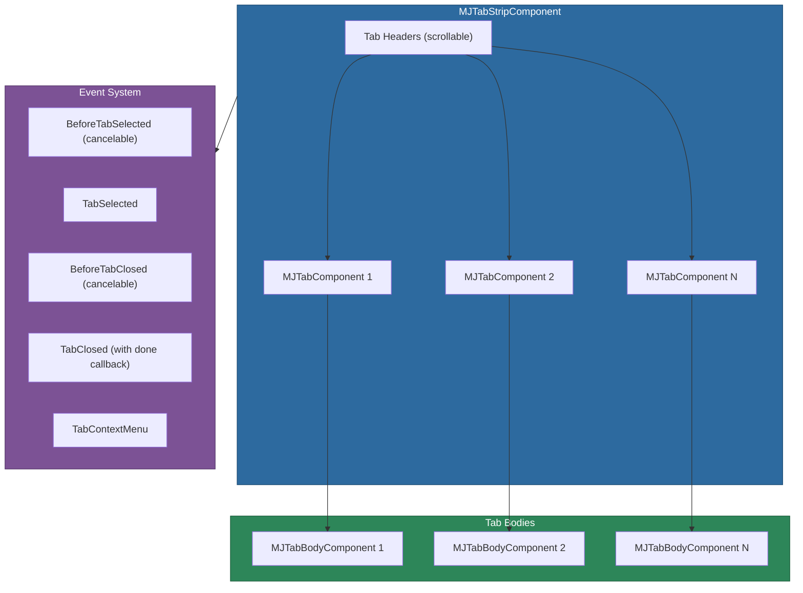

# @memberjunction/ng-tabstrip

A lightweight, zero-dependency Angular tab strip component for MemberJunction applications. Provides dynamic tab management with closeable tabs, scroll overflow handling, context menus, and programmatic tab control.

## Installation

```bash
npm install @memberjunction/ng-tabstrip
```

## Overview

The tab strip renders a row of tab headers with corresponding body panels. It handles overflow with horizontal scroll buttons, supports closeable tabs with cancelable close events, and provides a rich event system for tab lifecycle management. Unlike Kendo UI tabs, this component has no external dependencies beyond Angular.



## Usage

### Module Import

```typescript
import { MJTabStripModule } from '@memberjunction/ng-tabstrip';

@NgModule({
  imports: [MJTabStripModule]
})
export class YourModule {}
```

### Basic Usage

```html
<mj-tabstrip
  [SelectedTabIndex]="selectedTab"
  (TabSelected)="onTabSelected($event)"
  (BeforeTabClosed)="onBeforeTabClosed($event)">

  <mj-tab [Name]="'overview'" [TabCloseable]="false">Overview</mj-tab>
  <mj-tab [Name]="'details'" [TabCloseable]="true">Details</mj-tab>
  <mj-tab [Name]="'settings'" [TabCloseable]="true">Settings</mj-tab>

  <mj-tab-body>
    <h2>Overview Content</h2>
  </mj-tab-body>
  <mj-tab-body>
    <h2>Details Content</h2>
  </mj-tab-body>
  <mj-tab-body>
    <h2>Settings Content</h2>
  </mj-tab-body>
</mj-tabstrip>
```

## Components

| Component | Selector | Purpose |
|-----------|----------|---------|
| `MJTabStripComponent` | `mj-tabstrip` | Container managing tab selection and scroll |
| `MJTabComponent` | `mj-tab` | Individual tab header |
| `MJTabBodyComponent` | `mj-tab-body` | Content panel for a tab |

## MJTabStripComponent

### Inputs

| Property | Type | Default | Description |
|----------|------|---------|-------------|
| `SelectedTabIndex` | `number` | `0` | Index of the selected tab |
| `FillWidth` | `boolean` | `true` | Fill container width |
| `FillHeight` | `boolean` | `true` | Fill container height |
| `ScrollAmount` | `number` | `150` | Pixels to scroll per click |

### Outputs

| Event | Type | Description |
|-------|------|-------------|
| `BeforeTabSelected` | `EventEmitter<TabCancelableEvent>` | Before tab selection (cancelable) |
| `TabSelected` | `EventEmitter<TabEvent>` | After tab selection |
| `BeforeTabClosed` | `EventEmitter<TabCancelableEvent>` | Before tab close (cancelable) |
| `TabClosed` | `EventEmitter<TabClosedEvent>` | After tab close (call `done()` when finished) |
| `TabContextMenu` | `EventEmitter<TabContextMenuEvent>` | Tab right-click |
| `TabScrolled` | `EventEmitter<void>` | Tab strip scrolled |

### Methods

| Method | Returns | Description |
|--------|---------|-------------|
| `SelectTabByName(name)` | `MJTabComponent \| undefined` | Select a tab by name |
| `GetTabByName(name)` | `MJTabComponent \| undefined` | Find a tab by name |
| `CloseTab(index)` | `Promise<void>` | Close a tab programmatically |
| `scrollIntoView(index)` | `void` | Scroll to make a tab visible |
| `RefreshTabs()` | `void` | Refresh after dynamic changes |

## MJTabComponent

### Inputs

| Property | Type | Default | Description |
|----------|------|---------|-------------|
| `Name` | `string` | `''` | Tab identifier |
| `ID` | `string \| number` | -- | Custom identifier |
| `TabCloseable` | `boolean` | `false` | Show close button |
| `Visible` | `boolean` | `true` | Tab visibility |

## Event Types

- **`TabEvent`** -- `{ index, tab, body }`
- **`TabCancelableEvent`** -- Extends TabEvent with `cancel: boolean`
- **`TabClosedEvent`** -- Extends TabEvent with `newTabIndex` and `done()` callback
- **`TabContextMenuEvent`** -- Extends TabEvent with `mouseEvent`

## Dependencies

- `@angular/common` / `@angular/core`
- [@memberjunction/ng-container-directives](../container-directives/README.md) -- Container directives
