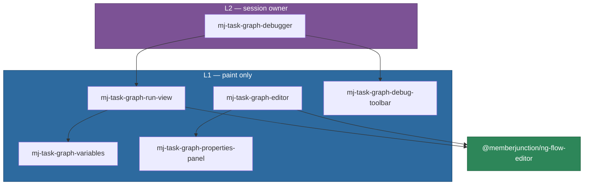

# @memberjunction/ng-task-graph-editor

View and edit a `TaskGraphSpec` on a canvas — the one graph contract shared by design-time flows
and runtime task graphs. Also the **drop-in debugger** for a live parent `MJ: Tasks` row.

Import `TaskGraphSpec` itself from `@memberjunction/ai-core-plus`. This package does not re-export
it.

> **Stepping a live run?** Start with the [Workflow Debugger Guide](../../../../guides/WORKFLOW_DEBUGGER_GUIDE.md).
> This README is the package API.

**Layer:** `widgets` (L1 canvas + L2 session wrap). No `@angular/router`. See
[UI Layering](../../../../guides/UI_LAYERING_GUIDE.md).

---

## What lives here



| Selector | Job |
|---|---|
| `mj-task-graph-editor` | Design-time: edit a `TaskGraphSpec`. Emits intent; the host saves. |
| `mj-task-graph-run-view` | Runtime paint: project rows + `$.debug` onto the same canvas. **No** `RouteOperation`. |
| `mj-task-graph-debugger` | Drop-in wrap: parent task id in, frames + verbs owned. Hosts stay zero-code. |
| `mj-task-graph-debug-toolbar` | VCR chrome (Continue / Over / Into / Stop). |
| `mj-task-graph-variables` | Invocation / input / output in the left data pane. |
| `mj-task-graph-properties-panel` | Design-time field inspector. |

The wrap is a wrap — not a rewrite. Canvas, toolbar, and Remote Operations are the ones Runs and
the harness already used. New code is the shell so those hosts do not each re-subscribe to frames.

---

## Installation

```bash
pnpm add @memberjunction/ng-task-graph-editor
```

```typescript
import { TaskGraphEditorModule } from '@memberjunction/ng-task-graph-editor';

@NgModule({
    imports: [TaskGraphEditorModule],
})
export class YourModule {}
```

---

## Drop-in debugger

Give it the parent task id. That is the whole contract.

```html
<mj-task-graph-debugger
    [ParentTaskID]="parentTaskId"
    [WorkflowName]="name"
    [AllowBreakpointEditing]="true"
    [ShowChrome]="true"
    [ShowVariables]="true"
    (Settled)="onSettled()"
    (PausedChange)="onPaused($event)"
    (Frame)="onFrame($event)"
    (NodeSelected)="onNode($event)"
    (ConnectionSelected)="onEdge($event)"
    (ControlFailed)="onControlFailed($event)">
</mj-task-graph-debugger>
```

### Inputs

| Input | Default | Notes |
|---|---|---|
| `ParentTaskID` | — | Parent `MJ: Tasks` row. Attach/detach frames and refresh `$.debug` on change. |
| `WorkflowName` | `'Workflow'` | Label in the chrome. |
| `LiveUpdates` | `true` | Subscribe to `TaskGraphFrames` when the provider has it. |
| `PollIntervalSeconds` | `3` | Fallback poll for the run view if frames are quiet. |
| `Height` | `'100%'` | |
| `ShowLegend` | `false` | |
| `ShowCanvasToolbar` | `true` | Zoom / pan / fit chip (starts minimized). |
| `ToolbarVisibility` | `'minimized'` | |
| `ToolbarAlign` | `'left'` | |
| `AllowBreakpointEditing` | `true` | Right-click Add / Remove Breakpoint. Compare IDs with `HasBreakpoint` (`UUIDsEqual`). |
| `ShowVariables` | `true` | Left data pane. |
| `ShowChrome` | `true` | VCR bar. Off if the host already has its own. |
| `Enabled` | `true` | |
| `ReplayAt` | `null` | Historical replay cursor. |

### Public verbs

`Pause` · `Resume` · `Step('one' \| 'wave')` · `Cancel` · `ToggleBreakpoint` · `OverrideEdge` ·
`SkipTask` · `RetryTask` · `UpdateTaskInput` · `ForceCompleteTask` · `Refresh` · `HasBreakpoint` ·
`GetEdgeOverride`.

`ForceCompleteTask` and `UpdateTaskInput` send the RO field `payload` (not `output`). For force
complete that value becomes the step output downstream conditions evaluate against.

### Events

`NodeSelected` · `ConnectionSelected` · `LegendToggled` · `SettledChange` · `PausedChange` ·
`Frame` · `ControlFailed` · `Settled`.

### What the wrap owns

- `TaskGraphFrames` (duck-typed on the provider — GraphQL has it; others simply do not).
- `IRemoteOperationProvider.RouteOperation` for every `TaskGraph.*` verb.
- Re-read of `$.debug` after each control so a two-console write cannot drop breakpoints.

Hosts must **not** also attach frames or call `RouteOperation` for the same parent. Runs keeps
stall/engine chrome by listening to `(Frame)`.

### Layering

The **run view** is L1 — props in, paint out. The **wrap** is L2 because its *job* is the session:
it reads the parent row through `ProviderToUse` and writes via `RouteOperation` so every host does
not re-implement the verbs. It never navigates. See [UI Layering](../../../../guides/UI_LAYERING_GUIDE.md) §5.

---

## Runtime paint

`SpecToNodes` / `SpecToConnections` in `task-graph-canvas-adapter.ts` project rows + overlay onto
`flow-editor`. Rules that are easy to get wrong:

- **Queued** (`NextToRun`): prerequisites Complete (or entry), not awaiting, not terminal, not in
  progress. Banner: *Next — waiting for the engine*. Incoming edge animates.
- **Running**: `In Progress`. Solid pulse.
- **Awaiting user**: breakpoint / start-paused. Banner: *Waiting on you*. Not drawn as a spinner.
- **Traveled edge**: origin in `{Complete, Failed, Cancelled}` **and** dest in
  `{In Progress, Complete, Failed, Cancelled}`. Pending dests stay dashed — a gate has not fired.
- **Conditional**: dashed until traveled, then **solid**, `if` label kept. Forced is always dotted
  with a hand. Untaken (skipped) edges are omitted unless forced.

---

## Persisted prefs

One typed bag per surface, via `UserInfoEngine` — never `localStorage`.

| Key | Type | Default |
|---|---|---|
| `mj.taskGraphRun.prefs.v1` | `TaskGraphRunPrefs` | `{ InvocationOpen: false, InvocationSplit: [22, 78] }` |

`TaskGraphRunPrefsStore` merges unknown JSON onto defaults. Size and openness are separate fields
so minimizing the left pane and opening it again restores the width the user dragged.

The harness Starting Payload disclosure is a different bag (`mj.aiTestHarness.prefs.v1`) because
it is harness chrome, not run-view chrome.

---

## Design-time editor

```html
<mj-task-graph-editor
    [Spec]="spec"
    (SpecChange)="onSpec($event)"
    (NodeSelected)="onNode($event)">
</mj-task-graph-editor>
```

Same canvas, no runtime overlay. Host owns persistence of the Flow agent's steps/paths.

---

## Related

- [Workflow Debugger Guide](../../../../guides/WORKFLOW_DEBUGGER_GUIDE.md)
- [Workflows and Task Graphs](../../../../guides/WORKFLOW_AND_TASK_GRAPH_GUIDE.md)
- [`@memberjunction/task-graph`](../../../TaskGraph/README.md)
- [`@memberjunction/ng-flow-editor`](../flow-editor/README.md)
