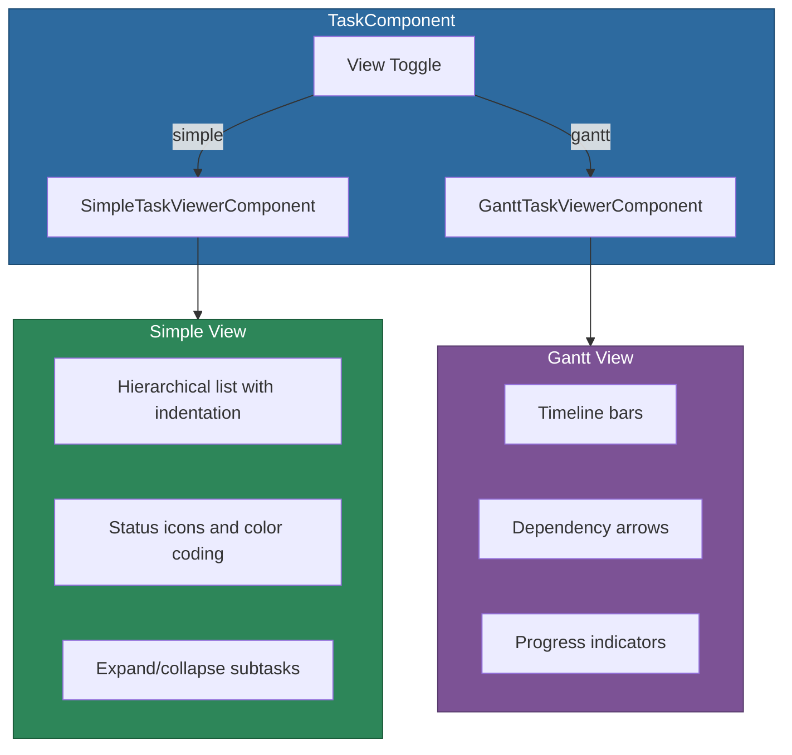

# @memberjunction/ng-tasks

Angular components for task visualization and management with Gantt chart support. Provides a simple hierarchical list view and a Gantt timeline view with dependency arrows, both working with MemberJunction `TaskEntity` data.

## Installation

```bash
npm install @memberjunction/ng-tasks
```

## Overview

The tasks package provides two interchangeable visualization modes for task data: a clean hierarchical list and a Gantt chart timeline. A wrapper component provides a toggle to switch between views. Tasks support dependencies via `DependsOnTaskID`, displayed as indentation in list view and dependency arrows in Gantt view.



## Usage

### Standalone Component Import

```typescript
import { TaskComponent } from '@memberjunction/ng-tasks';

@Component({
  imports: [TaskComponent],
  // ...
})
export class YourComponent {}
```

### Basic Usage

```html
<mj-task
  [tasks]="projectTasks"
  [title]="'Project Tasks'"
  [description]="'Active tasks for Q1'"
  [viewMode]="'simple'"
  (taskClicked)="onTaskClick($event)"
  (viewModeChanged)="onViewModeChange($event)">
</mj-task>
```

### Individual Sub-Components

```html
<!-- List view only -->
<mj-simple-task-viewer
  [tasks]="tasks"
  (taskClicked)="onTaskClick($event)">
</mj-simple-task-viewer>

<!-- Gantt view only -->
<mj-gantt-task-viewer
  [tasks]="tasks"
  (taskClicked)="onTaskClick($event)">
</mj-gantt-task-viewer>
```

## Components

| Component | Selector | Purpose |
|-----------|----------|---------|
| `TaskComponent` | `mj-task` | Composite wrapper with view toggle |
| `SimpleTaskViewerComponent` | `mj-simple-task-viewer` | Hierarchical list view |
| `GanttTaskViewerComponent` | `mj-gantt-task-viewer` | Gantt chart timeline |

## TaskComponent API

### Inputs

| Property | Type | Default | Description |
|----------|------|---------|-------------|
| `tasks` | `TaskEntity[]` | `[]` | Array of task entities |
| `title` | `string` | `undefined` | Optional header title |
| `description` | `string` | `undefined` | Optional header description |
| `showHeader` | `boolean` | `true` | Show the header area |
| `viewMode` | `TaskViewMode` | `'simple'` | Initial view mode: `'simple'` or `'gantt'` |

### Outputs

| Event | Type | Description |
|-------|------|-------------|
| `taskClicked` | `EventEmitter<TaskEntity>` | Task was clicked |
| `viewModeChanged` | `EventEmitter<TaskViewMode>` | View mode toggled |

## Exported Types

- `TaskViewMode` -- `'simple' | 'gantt'`
- `GanttTask` -- Interface for Gantt chart task data

## Dependencies

- [@memberjunction/core](../../MJCore/README.md) -- Core framework
- [@memberjunction/core-entities](../../MJCoreEntities/README.md) -- TaskEntity
- `frappe-gantt` -- Gantt chart rendering (peer dependency)
