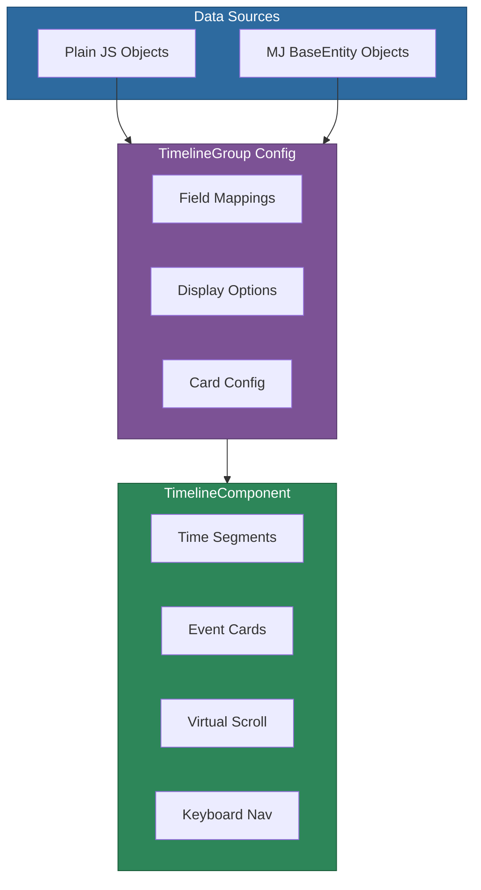

# @memberjunction/ng-timeline

A powerful, flexible Angular timeline component with zero external dependencies. Works with both MemberJunction BaseEntity objects and plain JavaScript objects. Pure HTML/CSS implementation with virtual scrolling, time-segment grouping, and full keyboard accessibility.

## Installation

```bash
npm install @memberjunction/ng-timeline
```

## Overview

The timeline renders chronologically ordered events as cards along a vertical or horizontal axis. Events can be grouped by time segments (day, week, month, quarter, year) with collapsible sections. The component uses a BeforeX/AfterX event pattern that allows container components to intercept and cancel default behaviors.



## Usage

### Module Import

```typescript
import { TimelineModule } from '@memberjunction/ng-timeline';

@NgModule({
  imports: [TimelineModule]
})
export class YourModule {}
```

### With Plain Objects

```typescript
import { TimelineGroup } from '@memberjunction/ng-timeline';

interface MyEvent {
  id: string;
  title: string;
  eventDate: Date;
  description: string;
}

const group = TimelineGroup.FromArray(myEvents, {
  titleField: 'title',
  dateField: 'eventDate',
  descriptionField: 'description'
});
```

```html
<mj-timeline [groups]="[group]"></mj-timeline>
```

### With MemberJunction Entities

```typescript
const group = new TimelineGroup<TaskEntity>();
group.EntityName = 'Tasks';
group.DataSourceType = 'entity';
group.Filter = "Status = 'Open'";
group.TitleFieldName = 'Name';
group.DateFieldName = 'DueDate';
```

## Key Inputs

| Input | Type | Default | Description |
|-------|------|---------|-------------|
| `groups` | `TimelineGroup<T>[]` | `[]` | Data groups to display |
| `orientation` | `'vertical' \| 'horizontal'` | `'vertical'` | Timeline axis |
| `layout` | `'single' \| 'alternating'` | `'single'` | Card layout |
| `sortOrder` | `'asc' \| 'desc'` | `'desc'` | Event sort order |
| `segmentGrouping` | `'none' \| 'day' \| 'week' \| 'month' \| 'quarter' \| 'year'` | `'month'` | Time grouping |
| `segmentsCollapsible` | `boolean` | `true` | Allow collapsing segments |
| `enableKeyboardNavigation` | `boolean` | `true` | Keyboard support |
| `virtualScroll` | `VirtualScrollConfig` | -- | Virtual scroll settings |

## Event System (BeforeX/AfterX Pattern)

Every user interaction emits a "before" event (cancelable) and an "after" event:

| Before Event | After Event | Description |
|-------------|-------------|-------------|
| `beforeEventClick` | `afterEventClick` | Card clicked |
| `beforeEventExpand` | `afterEventExpand` | Card expanded |
| `beforeEventCollapse` | `afterEventCollapse` | Card collapsed |
| `beforeActionClick` | `afterActionClick` | Action button clicked |
| `beforeSegmentExpand` | `afterSegmentExpand` | Segment expanded |
| `beforeSegmentCollapse` | `afterSegmentCollapse` | Segment collapsed |
| `beforeLoad` | `afterLoad` | Data loaded |

```typescript
onBeforeClick(args: BeforeEventClickArgs<MyType>) {
  if (args.event.entity.status === 'archived') {
    args.cancel = true;  // Prevent default behavior
  }
}
```

## Custom Templates

Override card rendering with Angular templates:

```html
<mj-timeline [groups]="groups">
  <ng-template #cardTemplate let-event="event">
    <div class="custom-card">{{ event.title }}</div>
  </ng-template>
  <ng-template #emptyTemplate>
    <p>No events found.</p>
  </ng-template>
</mj-timeline>
```

Available template refs: `cardTemplate`, `headerTemplate`, `bodyTemplate`, `actionsTemplate`, `segmentHeaderTemplate`, `emptyTemplate`, `loadingTemplate`

## Theming (CSS Variables)

```css
mj-timeline {
  --mj-timeline-line-color: #e0e0e0;
  --mj-timeline-marker-bg: #1976d2;
  --mj-timeline-card-bg: #ffffff;
  --mj-timeline-card-border: #e0e0e0;
  --mj-timeline-text-primary: #212121;
  --mj-timeline-accent: #1976d2;
  --mj-timeline-card-max-width: 400px;
}
```

## Keyboard Navigation

| Key | Action |
|-----|--------|
| Arrow Down/Right | Next event |
| Arrow Up/Left | Previous event |
| Enter/Space | Toggle expand/collapse |
| Escape | Collapse focused event |
| Home/End | Jump to first/last event |

## Dependencies

No external UI library dependencies. Pure Angular + HTML/CSS implementation.

- [@memberjunction/core](../../MJCore/README.md) -- Optional, for entity data sources
- [@memberjunction/core-entities](../../MJCoreEntities/README.md) -- Optional, for entity types
