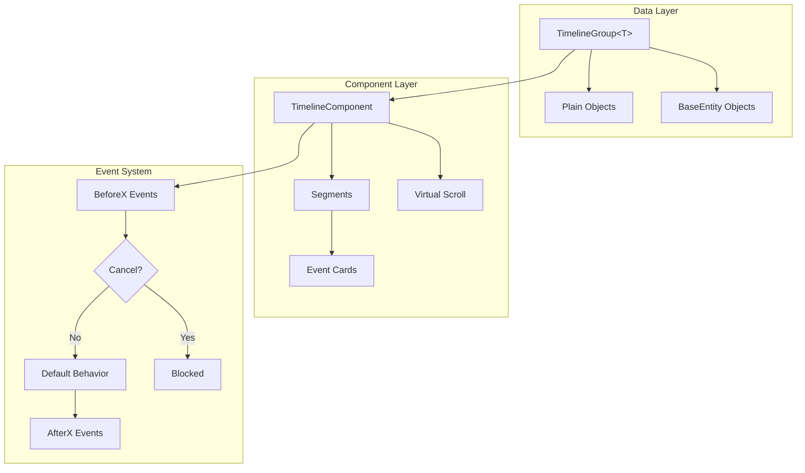

# @memberjunction/ng-timeline

A powerful, flexible, and fully responsive Angular timeline component. Works with both MemberJunction entities and plain JavaScript objects. **No external dependencies** - pure HTML/CSS implementation.

## Features

- **Universal Compatibility**: Works with MemberJunction BaseEntity objects OR plain JavaScript objects
- **Responsive Design**: Mobile-first approach with automatic layout adaptation
- **Virtual Scrolling**: Built-in support for large datasets with dynamic loading
- **Time Segment Collapsing**: Group events by day/week/month/quarter/year with collapsible sections
- **Rich Event System**: BeforeX/AfterX event pattern for full control from container components
- **Customizable Cards**: Configurable fields, images, actions, and custom templates
- **Keyboard Navigation**: Full accessibility with ARIA support
- **Theming**: CSS variables for easy customization including dark mode
- **Zero Dependencies**: No Kendo UI or other external libraries required

## Installation

```bash
npm install @memberjunction/ng-timeline
```

## Requirements

| Requirement | Version |
|------------|---------|
| Angular | 18+ |
| TypeScript | 5.0+ |
| @memberjunction/core | Optional (only for entity data sources) |

## Architecture



## Quick Start

### Import the Module

```typescript
import { TimelineModule } from '@memberjunction/ng-timeline';

@NgModule({
  imports: [TimelineModule]
})
export class YourModule { }
```

### Basic Usage with Plain Objects

```typescript
import { TimelineGroup } from '@memberjunction/ng-timeline';

interface MyEvent {
  id: string;
  title: string;
  eventDate: Date;
  description: string;
}

@Component({
  template: `<mj-timeline [groups]="groups"></mj-timeline>`
})
export class MyComponent {
  groups: TimelineGroup<MyEvent>[] = [];

  ngOnInit() {
    const group = TimelineGroup.FromArray(this.myEvents, {
      titleField: 'title',
      dateField: 'eventDate',
      descriptionField: 'description'
    });
    this.groups = [group];
  }
}
```

### Usage with MemberJunction Entities

```typescript
import { TimelineGroup } from '@memberjunction/ng-timeline';
import { TaskEntity } from '@memberjunction/core-entities';

@Component({
  template: `<mj-timeline [groups]="groups"></mj-timeline>`
})
export class MyComponent {
  groups: TimelineGroup<TaskEntity>[] = [];

  ngOnInit() {
    const group = new TimelineGroup<TaskEntity>();
    group.EntityName = 'Tasks';
    group.DataSourceType = 'entity';
    group.Filter = "Status = 'Open'";
    group.TitleFieldName = 'Name';
    group.DateFieldName = 'DueDate';
    this.groups = [group];
  }
}
```

## Component API

### Inputs

| Input | Type | Default | Description |
|-------|------|---------|-------------|
| `groups` | `TimelineGroup<T>[]` | `[]` | Data groups to display |
| `allowLoad` | `boolean` | `true` | Control deferred loading |
| `orientation` | `'vertical' \| 'horizontal'` | `'vertical'` | Timeline orientation |
| `layout` | `'single' \| 'alternating'` | `'single'` | Card layout (vertical only) |
| `sortOrder` | `'asc' \| 'desc'` | `'desc'` | Event sort order |
| `segmentGrouping` | `'none' \| 'day' \| 'week' \| 'month' \| 'quarter' \| 'year'` | `'month'` | Time segment grouping |
| `segmentsCollapsible` | `boolean` | `true` | Allow collapsing segments |
| `segmentsDefaultExpanded` | `boolean` | `true` | Segments start expanded |
| `defaultCardConfig` | `TimelineCardConfig` | (see below) | Default card configuration |
| `virtualScroll` | `VirtualScrollConfig` | (see below) | Virtual scroll settings |
| `emptyMessage` | `string` | `'No events to display'` | Empty state message |
| `emptyIcon` | `string` | `'fa-regular fa-calendar-xmark'` | Empty state icon |
| `enableKeyboardNavigation` | `boolean` | `true` | Enable keyboard navigation |

### Outputs (Events)

The component uses a BeforeX/AfterX event pattern. BeforeX events include a `cancel` property - set it to `true` to prevent the default behavior.

| Event | Args Type | Description |
|-------|-----------|-------------|
| `beforeEventClick` | `BeforeEventClickArgs<T>` | Before card click |
| `afterEventClick` | `AfterEventClickArgs<T>` | After card click |
| `beforeEventExpand` | `BeforeEventExpandArgs<T>` | Before card expand |
| `afterEventExpand` | `AfterEventExpandArgs<T>` | After card expand |
| `beforeEventCollapse` | `BeforeEventCollapseArgs<T>` | Before card collapse |
| `afterEventCollapse` | `AfterEventCollapseArgs<T>` | After card collapse |
| `beforeEventHover` | `BeforeEventHoverArgs<T>` | Before hover state change |
| `afterEventHover` | `AfterEventHoverArgs<T>` | After hover state change |
| `beforeActionClick` | `BeforeActionClickArgs<T>` | Before action button click |
| `afterActionClick` | `AfterActionClickArgs<T>` | After action button click |
| `beforeSegmentExpand` | `BeforeSegmentExpandArgs` | Before segment expand |
| `afterSegmentExpand` | `AfterSegmentExpandArgs` | After segment expand |
| `beforeSegmentCollapse` | `BeforeSegmentCollapseArgs` | Before segment collapse |
| `afterSegmentCollapse` | `AfterSegmentCollapseArgs` | After segment collapse |
| `beforeLoad` | `BeforeLoadArgs` | Before data load |
| `afterLoad` | `AfterLoadArgs` | After data load |

### Public Methods

```typescript
// Refresh all data
await timeline.refresh();

// Load more (virtual scroll)
await timeline.loadMore();

// Expand/collapse all events
timeline.expandAllEvents();
timeline.collapseAllEvents();

// Expand/collapse all segments
timeline.expandAllSegments();
timeline.collapseAllSegments();

// Target specific events
timeline.expandEvent(eventId);
timeline.collapseEvent(eventId);

// Navigation
timeline.scrollToEvent(eventId, 'smooth');
timeline.scrollToDate(new Date(), 'smooth');

// Data access
const event = timeline.getEvent(eventId);
const allEvents = timeline.getAllEvents();
```

## TimelineGroup Configuration

```typescript
const group = new TimelineGroup<MyType>();

// Data Source
group.DataSourceType = 'array';  // or 'entity' for MJ
group.EntityObjects = myData;    // For array mode
group.EntityName = 'Tasks';      // For entity mode
group.Filter = "Status='Open'";  // SQL filter (entity mode)
group.OrderBy = 'DueDate DESC';  // SQL order (entity mode)

// Field Mappings
group.TitleFieldName = 'title';
group.DateFieldName = 'eventDate';
group.SubtitleFieldName = 'category';
group.DescriptionFieldName = 'details';
group.ImageFieldName = 'thumbnailUrl';
group.IdFieldName = 'id';  // Defaults to 'ID' or 'id'

// Group Display
group.DisplayIconMode = 'custom';
group.DisplayIcon = 'fa-solid fa-check-circle';
group.DisplayColorMode = 'manual';
group.DisplayColor = '#4caf50';
group.GroupLabel = 'Completed Tasks';

// Card Configuration
group.CardConfig = {
  collapsible: true,
  defaultExpanded: false,
  summaryFields: [
    { fieldName: 'Status', icon: 'fa-solid fa-circle' }
  ],
  actions: [
    { id: 'view', label: 'View', variant: 'primary' }
  ]
};

// Custom Functions
group.SummaryFunction = (record) => `Priority: ${record.priority}`;
group.EventConfigFunction = (record) => ({
  color: record.isUrgent ? '#f44336' : undefined
});
```

## Card Configuration

```typescript
interface TimelineCardConfig {
  // Header
  showIcon?: boolean;           // Show icon in header
  showDate?: boolean;           // Show date in header
  showSubtitle?: boolean;       // Show subtitle
  dateFormat?: string;          // Angular date format

  // Image
  imageField?: string;          // Field containing image URL
  imagePosition?: 'left' | 'top' | 'none';
  imageSize?: 'small' | 'medium' | 'large';

  // Body
  descriptionField?: string;    // Description field name
  descriptionMaxLines?: number; // Max lines before truncate
  allowHtmlDescription?: boolean;

  // Expansion
  collapsible?: boolean;        // Allow expand/collapse
  defaultExpanded?: boolean;    // Start expanded
  expandedFields?: TimelineDisplayField[];  // Fields in expanded view
  summaryFields?: TimelineDisplayField[];   // Always visible fields

  // Actions
  actions?: TimelineAction[];   // Action buttons
  actionsOnHover?: boolean;     // Show actions only on hover

  // Styling
  cssClass?: string;
  minWidth?: string;
  maxWidth?: string;            // Default: '400px'
}
```

## Event Handling

### Preventing Default Behavior

```typescript
@Component({
  template: `
    <mj-timeline
      [groups]="groups"
      (beforeEventClick)="onBeforeClick($event)"
      (afterActionClick)="onAction($event)">
    </mj-timeline>
  `
})
export class MyComponent {
  onBeforeClick(args: BeforeEventClickArgs<MyType>) {
    // Prevent click on archived items
    if (args.event.entity.status === 'archived') {
      args.cancel = true;
      this.showToast('Archived items cannot be opened');
    }
  }

  onAction(args: AfterActionClickArgs<MyType>) {
    switch (args.action.id) {
      case 'view':
        this.router.navigate(['/items', args.event.entity.id]);
        break;
      case 'edit':
        this.openEditDialog(args.event.entity);
        break;
    }
  }
}
```

## Custom Templates

Override any part of the card rendering:

```html
<mj-timeline [groups]="groups">

  <!-- Full card override -->
  <ng-template #cardTemplate let-event="event" let-group="group">
    <div class="my-card">
      <h3>{{ event.title }}</h3>
      <p>{{ event.description }}</p>
    </div>
  </ng-template>

  <!-- Just override actions -->
  <ng-template #actionsTemplate let-event="event" let-actions="actions">
    <my-action-bar [event]="event"></my-action-bar>
  </ng-template>

  <!-- Custom empty state -->
  <ng-template #emptyTemplate>
    <div class="no-data">
      
      <p>Nothing here yet!</p>
    </div>
  </ng-template>

</mj-timeline>
```

Available templates: `cardTemplate`, `headerTemplate`, `bodyTemplate`, `actionsTemplate`, `segmentHeaderTemplate`, `emptyTemplate`, `loadingTemplate`

## Theming

Customize via CSS variables:

```scss
mj-timeline {
  // Colors
  --mj-timeline-line-color: #e0e0e0;
  --mj-timeline-marker-bg: #1976d2;
  --mj-timeline-card-bg: #ffffff;
  --mj-timeline-card-border: #e0e0e0;
  --mj-timeline-card-shadow: 0 2px 8px rgba(0,0,0,0.1);
  --mj-timeline-text-primary: #212121;
  --mj-timeline-text-secondary: #757575;
  --mj-timeline-accent: #1976d2;

  // Sizing
  --mj-timeline-card-max-width: 400px;
  --mj-timeline-card-padding: 16px;
  --mj-timeline-marker-size: 14px;

  // Animation
  --mj-timeline-transition: 0.25s ease;
}

// Dark mode
.dark-theme mj-timeline {
  --mj-timeline-card-bg: #1e1e1e;
  --mj-timeline-card-border: #424242;
  --mj-timeline-text-primary: #ffffff;
}
```

## Visual Layout

### Vertical Timeline (Single)

```
●─── Dec 2, 2025
│
│  ┌──────────────────────────┐
│  │  Task Completed          │
│  │  Review timeline design  │
│  │  [View] [Edit]           │
│  └──────────────────────────┘
│
●─── Nov 28, 2025
│
│  ┌──────────────────────────┐
│  │  Feature Released        │
│  │  New dashboard v2.5      │
│  └──────────────────────────┘
```

### Vertical Timeline (Alternating)

```
     ┌────────────────┐
     │  Task Done     │────●─── Dec 2
     └────────────────┘    │
                           │
            Nov 28 ───●────┤
                      │    │
                      └────┼────┌────────────────┐
                           │    │  Released      │
                           │    └────────────────┘
```

### Time Segments

```
▼ December 2025 (3 events) ────────────────────
│
│  [Events in December...]
│
► November 2025 (12 events) ─────────────────── ← Collapsed
```

## Keyboard Navigation

| Key | Action |
|-----|--------|
| `↓` / `→` | Move to next event |
| `↑` / `←` | Move to previous event |
| `Enter` / `Space` | Toggle expand/collapse |
| `Escape` | Collapse focused event |
| `Home` | Jump to first event |
| `End` | Jump to last event |

## Virtual Scrolling

Configure for large datasets:

```typescript
<mj-timeline
  [groups]="groups"
  [virtualScroll]="{
    enabled: true,
    batchSize: 25,
    loadThreshold: 200,
    showLoadingIndicator: true,
    loadingMessage: 'Loading more...'
  }">
</mj-timeline>
```

## Browser Support

- Chrome (last 2 versions)
- Firefox (last 2 versions)
- Safari (last 2 versions)
- Edge (last 2 versions)
- iOS Safari
- Android Chrome

## Migration from v1

If migrating from the Kendo-based version:

1. **No Kendo dependencies** - Remove all `@progress/kendo-*` packages
2. **Property names changed** - `Groups` → `groups`, `DisplayOrientation` → `orientation`
3. **New event system** - Replace Kendo events with BeforeX/AfterX pattern
4. **Segments are new** - Time-based grouping is now built-in

## Building

```bash
# From package directory
npm run build

# From monorepo root
turbo build --filter="@memberjunction/ng-timeline"
```

## License

ISC
