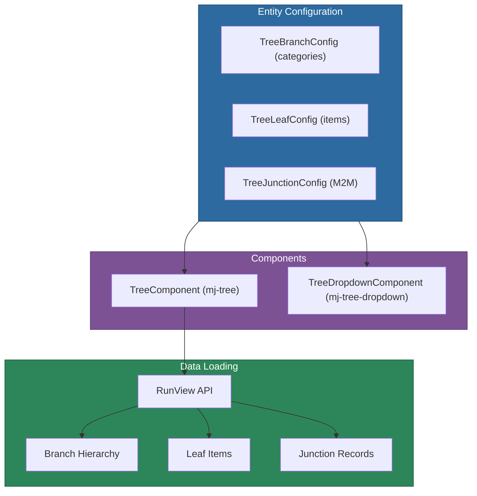

# @memberjunction/ng-trees

Angular tree and tree-dropdown components for displaying and selecting from hierarchical entity data. Supports branch/leaf entity configurations, junction table relationships, keyboard navigation, and a BeforeX/AfterX event system.

## Installation

```bash
npm install @memberjunction/ng-trees
```

## Overview

The tree package provides two components: a standalone tree view (`mj-tree`) and a dropdown variant (`mj-tree-dropdown`). Both load data from MemberJunction entities using `RunView`, support branch (category/folder) and leaf (item) entity configurations, and handle many-to-many relationships through junction table configuration.



## Usage

### Module Import

```typescript
import { TreesModule } from '@memberjunction/ng-trees';

@NgModule({
  imports: [TreesModule]
})
export class YourModule {}
```

### Basic Tree

```html
<mj-tree
  [BranchConfig]="{
    EntityName: 'Query Categories',
    DisplayField: 'Name',
    ParentIDField: 'ParentID',
    DefaultIcon: 'fa-solid fa-folder'
  }"
  [SelectionMode]="'single'"
  (afterNodeSelect)="onNodeSelected($event)">
</mj-tree>
```

### Tree with Leaf Entities

```html
<mj-tree
  [BranchConfig]="{
    EntityName: 'Query Categories',
    DisplayField: 'Name',
    ParentIDField: 'ParentID'
  }"
  [LeafConfig]="{
    EntityName: 'Queries',
    DisplayField: 'Name',
    ParentForeignKey: 'CategoryID',
    DefaultIcon: 'fa-solid fa-database'
  }"
  [SelectionMode]="'single'"
  [SelectableTypes]="'leaves'"
  (afterNodeSelect)="onQuerySelected($event)">
</mj-tree>
```

### Tree Dropdown

```html
<mj-tree-dropdown
  [BranchConfig]="categoryConfig"
  [LeafConfig]="itemConfig"
  [Placeholder]="'Select a category...'"
  [AllowClear]="true"
  (afterNodeSelect)="onSelected($event)">
</mj-tree-dropdown>
```

## Components

| Component | Selector | Purpose |
|-----------|----------|---------|
| `TreeComponent` | `mj-tree` | Standalone hierarchical tree view |
| `TreeDropdownComponent` | `mj-tree-dropdown` | Dropdown with tree popup |

## Configuration Types

### TreeBranchConfig

| Property | Type | Default | Description |
|----------|------|---------|-------------|
| `EntityName` | `string` | -- | Entity for branch nodes (required) |
| `DisplayField` | `string` | `'Name'` | Field to display as label |
| `IDField` | `string` | `'ID'` | Primary key field |
| `ParentIDField` | `string` | `'ParentID'` | Field for parent hierarchy |
| `IconField` | `string` | -- | Field for dynamic icons |
| `DefaultIcon` | `string` | `'fa-solid fa-folder'` | Fallback icon |
| `ExtraFilter` | `string` | -- | Optional RunView filter |
| `OrderBy` | `string` | `'Name ASC'` | Sort order |

### TreeLeafConfig

| Property | Type | Default | Description |
|----------|------|---------|-------------|
| `EntityName` | `string` | -- | Entity for leaf nodes (required) |
| `DisplayField` | `string` | `'Name'` | Field to display as label |
| `ParentForeignKey` | `string` | -- | FK linking to branch entity |
| `DefaultIcon` | `string` | `'fa-solid fa-file'` | Fallback icon |

### TreeJunctionConfig

For many-to-many relationships via junction tables:

| Property | Type | Description |
|----------|------|-------------|
| `EntityName` | `string` | Junction entity name |
| `LeafForeignKey` | `string` | FK referencing leaf entity |
| `BranchForeignKey` | `string` | FK referencing branch entity |

## Key Inputs

| Input | Type | Default | Description |
|-------|------|---------|-------------|
| `BranchConfig` | `TreeBranchConfig` | -- | Branch entity config (required) |
| `LeafConfig` | `TreeLeafConfig` | -- | Optional leaf entity config |
| `JunctionConfig` | `TreeJunctionConfig` | -- | Optional junction config |
| `SelectionMode` | `'none' \| 'single' \| 'multiple'` | `'none'` | Selection behavior |
| `SelectableTypes` | `'all' \| 'branches' \| 'leaves'` | `'all'` | Which node types are selectable |
| `AutoLoad` | `boolean` | `true` | Load data on init |

## Event System

Uses the BeforeX/AfterX cancelable pattern:

- `beforeNodeSelect` / `afterNodeSelect`
- `beforeNodeDeselect` / `afterNodeDeselect`
- `beforeNodeExpand` / `afterNodeExpand`
- `beforeNodeCollapse` / `afterNodeCollapse`
- `beforeNodeClick` / `afterNodeClick`
- `beforeNodeDoubleClick` / `afterNodeDoubleClick`
- `beforeDataLoad` / `afterDataLoad`

## Dependencies

- [@memberjunction/core](../../MJCore/README.md) -- RunView for data loading
- [@memberjunction/core-entities](../../MJCoreEntities/README.md) -- Entity types
