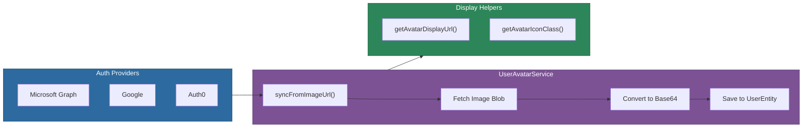

# @memberjunction/ng-user-avatar

Angular service for managing user avatar synchronization from authentication providers and avatar display operations in MemberJunction applications.

## Installation

```bash
npm install @memberjunction/ng-user-avatar
```

## Overview

The User Avatar service provides a simple API for syncing user profile images from authentication providers (Microsoft Graph, Google, Auth0, etc.) into MemberJunction's `UserEntity`. It fetches the image, converts it to a Base64 data URI, and saves it to the user record. The service is auth-provider-agnostic -- callers supply the image URL and any required auth headers.



## Usage

### Service Injection

The service is provided at root level and can be injected anywhere:

```typescript
import { UserAvatarService } from '@memberjunction/ng-user-avatar';

@Component({ /* ... */ })
export class ProfileComponent {
  constructor(private avatarService: UserAvatarService) {}

  async syncAvatar(user: UserEntity, imageUrl: string) {
    const success = await this.avatarService.syncFromImageUrl(
      user,
      imageUrl,
      { 'Authorization': 'Bearer ' + accessToken }  // optional auth headers
    );

    if (success) {
      console.log('Avatar synced successfully');
    }
  }
}
```

### Getting Display URL

```typescript
// Returns the stored Base64 data URI or a default placeholder
const displayUrl = this.avatarService.getAvatarDisplayUrl(user);

// Get the icon class for fallback display
const iconClass = this.avatarService.getAvatarIconClass(user);
```

## API Reference

### UserAvatarService

| Method | Returns | Description |
|--------|---------|-------------|
| `syncFromImageUrl(user, imageUrl, authHeaders?)` | `Promise<boolean>` | Fetch image from URL, convert to Base64, save to user entity |
| `fileToBase64(file)` | `Promise<string>` | Convert a File to Base64 data URI |
| `isValidUrl(url)` | `boolean` | Check if a string is a valid URL |
| `isValidBase64DataUri(uri)` | `boolean` | Check if a string is a valid Base64 data URI |
| `getAvatarDisplayUrl(user)` | `string` | Get avatar URL for display (Base64 or placeholder) |
| `getAvatarIconClass(user)` | `string` | Get fallback icon class for avatar display |

## How It Works

1. Caller provides a `UserEntity`, image URL, and optional auth headers
2. Service fetches the image as a Blob via Angular's `HttpClient`
3. Blob is converted to a Base64 data URI using `FileReader`
4. User entity's `UserImageURL` is set to the data URI
5. User entity's `UserImageIconClass` is cleared (image takes priority)
6. Entity is saved to the database

## Dependencies

- [@memberjunction/core](../../MJCore/README.md) -- Core framework
- [@memberjunction/core-entities](../../MJCoreEntities/README.md) -- UserEntity
- `@angular/common/http` -- HttpClient for image fetching
