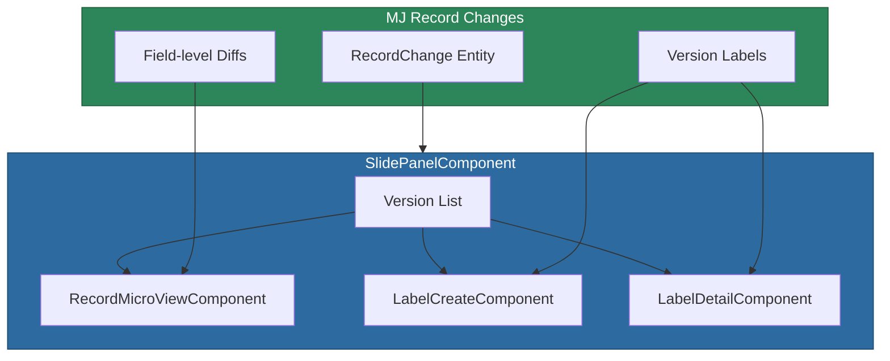

# @memberjunction/ng-versions

Angular components for viewing entity record version history in MemberJunction applications. Provides a slide panel, label creation, label detail, and record micro-view for working with the built-in Record Changes system.

## Installation

```bash
npm install @memberjunction/ng-versions
```

## Overview

MemberJunction includes built-in version control ("Record Changes") that tracks all changes to entity records. This package provides Angular components for browsing that history: a slide panel for navigating versions, a micro-view for previewing snapshots, and label management for bookmarking specific versions.



## Usage

### Module Import

```typescript
import { VersionsModule } from '@memberjunction/ng-versions';

@NgModule({
  imports: [VersionsModule]
})
export class YourModule {}
```

### Slide Panel

```html
<mj-slide-panel
  [EntityName]="'Products'"
  [RecordID]="productId"
  [Mode]="'slide'"
  [Visible]="showVersionPanel">
</mj-slide-panel>
```

### Record Micro View

```html
<mj-record-micro-view
  [Data]="microViewData">
</mj-record-micro-view>
```

### Label Creation

```html
<mj-label-create
  [EntityName]="'Products'"
  [RecordID]="productId"
  [RecordChangeID]="selectedChangeId"
  (LabelCreated)="onLabelCreated($event)">
</mj-label-create>
```

## Components

| Component | Selector | Purpose |
|-----------|----------|---------|
| `SlidePanelComponent` | `mj-slide-panel` | Container for version history navigation |
| `RecordMicroViewComponent` | `mj-record-micro-view` | Compact snapshot preview with field diffs |
| `LabelCreateComponent` | `mj-label-create` | Create a named label/bookmark for a version |
| `LabelDetailComponent` | `mj-label-detail` | View and manage label details |

## Exported Types

### MicroViewData

```typescript
interface MicroViewData {
  EntityName: string;
  EntityID: string;
  RecordID: string;
  RecordChangeID: string;
  FullRecordJSON: Record<string, unknown> | null;
  FieldDiffs: FieldChangeView[] | null;
}
```

### FieldChangeView

```typescript
interface FieldChangeView {
  FieldName: string;
  OldValue: string;
  NewValue: string;
  ChangeType: 'Added' | 'Modified' | 'Removed';
}
```

### SlidePanelMode

```typescript
type SlidePanelMode = 'slide' | 'dialog';
```

## Dependencies

- [@memberjunction/core](../../MJCore/README.md) -- Metadata, RunView
- [@memberjunction/core-entities](../../MJCoreEntities/README.md) -- RecordChange entities
- [@memberjunction/graphql-dataprovider](../../GraphQLDataProvider/README.md) -- Data provider
- [@memberjunction/ng-shared-generic](../shared/README.md) -- Loading component
