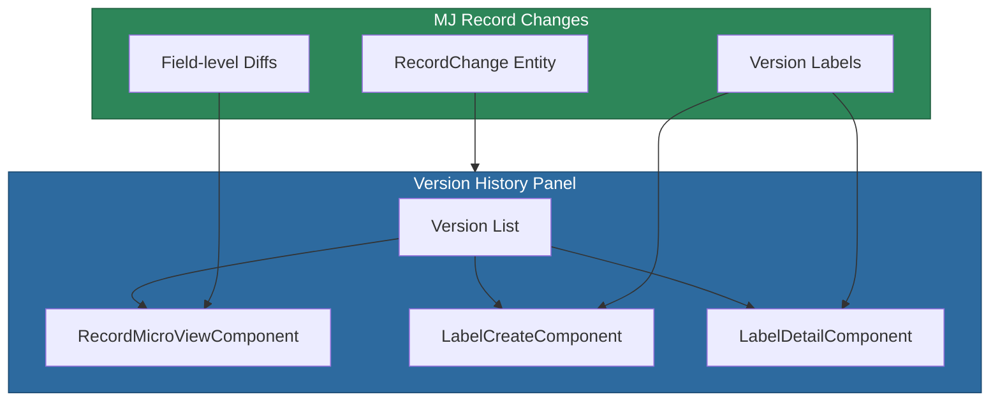

# @memberjunction/ng-versions

Angular components for viewing entity record version history in MemberJunction applications. Provides label creation, label detail, and a record micro-view for working with the built-in Record Changes system.

> **Note:** the generic slide-in/dialog primitive `MjSlidePanelComponent` (`mj-slide-panel`) previously lived here and now lives in [`@memberjunction/ng-ui-components`](../ui-components). Import it from there.

## Installation

```bash
npm install @memberjunction/ng-versions
```

## Overview

MemberJunction includes built-in version control ("Record Changes") that tracks all changes to entity records. This package provides Angular components for browsing that history: a slide panel for navigating versions, a micro-view for previewing snapshots, and label management for bookmarking specific versions.


```mermaid
flowchart TD
    subgraph Panel["Version History Panel"]
        A["Version List"]
        A --> B["RecordMicroViewComponent"]
        A --> C["LabelCreateComponent"]
        A --> D["LabelDetailComponent"]
    end
    subgraph Data["MJ Record Changes"]
        E["RecordChange Entity"]
        F["Field-level Diffs"]
        G["Version Labels"]
    end

    E --> Panel
    F --> B
    G --> C
    G --> D

    style Panel fill:#2d6a9f,stroke:#1a4971,color:#fff
    style Data fill:#2d8659,stroke:#1a5c3a,color:#fff
```

## Usage

### Module Import

```typescript
import { VersionsModule } from '@memberjunction/ng-versions';

@NgModule({
  imports: [VersionsModule]
})
export class YourModule {}
```

### Slide Panel — moved

> **`MjSlidePanelComponent` (`mj-slide-panel`) now lives in
> `@memberjunction/ng-ui-components`** as a first-class shared UI primitive.
> Import it from there:
> `import { MjSlidePanelComponent } from '@memberjunction/ng-ui-components';`
> (It's a standalone component — add it to your component/module `imports`.)
> The `SlidePanelMode` type moved with it.

### Record Micro View

```html
<mj-record-micro-view
  [Data]="microViewData">
</mj-record-micro-view>
```

### Label Creation

```html
<mj-label-create
  [EntityName]="'Products'"
  [RecordID]="productId"
  [RecordChangeID]="selectedChangeId"
  (LabelCreated)="onLabelCreated($event)">
</mj-label-create>
```

## Components

| Component | Selector | Purpose |
|-----------|----------|---------|
| `RecordMicroViewComponent` | `mj-record-micro-view` | Compact snapshot preview with field diffs |
| `LabelCreateComponent` | `mj-label-create` | Create a named label/bookmark for a version |
| `LabelDetailComponent` | `mj-label-detail` | View and manage label details |

## Exported Types

### MicroViewData

```typescript
interface MicroViewData {
  EntityName: string;
  EntityID: string;
  RecordID: string;
  RecordChangeID: string;
  FullRecordJSON: Record<string, unknown> | null;
  FieldDiffs: FieldChangeView[] | null;
}
```

### FieldChangeView

```typescript
interface FieldChangeView {
  FieldName: string;
  OldValue: string;
  NewValue: string;
  ChangeType: 'Added' | 'Modified' | 'Removed';
}
```

## Dependencies

- [@memberjunction/core](../../../MJCore/readme.md) -- Metadata, RunView
- [@memberjunction/core-entities](../../../MJCoreEntities/readme.md) -- RecordChange entities
- [@memberjunction/graphql-dataprovider](../../../GraphQLDataProvider/README.md) -- Data provider
- [@memberjunction/ng-shared-generic](../shared/README.md) -- Loading component
