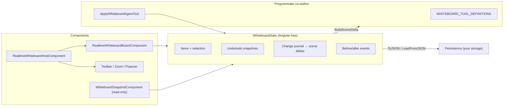

# @memberjunction/ng-whiteboard

A generic, reusable collaborative whiteboard for any Angular application — built for **dual authorship**: a human drawing with direct-manipulation tools, and a programmatic co-author (typically an AI agent) mutating the *same* board through a JSON-described tool API. One state engine, one undo history, one perception feed.

## Installation

```bash
npm install @memberjunction/ng-whiteboard
```

Peer dependencies: `@angular/common`, `@angular/core`, `@angular/platform-browser`. The package has **no Router dependency**, no MJ metadata/entity dependency, and no AI-framework dependency — it is a pure Generic-component package.

## Overview



The package is organized in layers, each usable on its own:

| Layer | File(s) | What it is |
|---|---|---|
| **State engine** | `whiteboard-state.ts` | `WhiteboardState` — the Angular-free typed board model. The *single* mutation API for both human tools and agent tools. |
| **Tool API** | `whiteboard-tools.ts` | The `Whiteboard_*` JSON tool definitions + `ApplyWhiteboardAgentTool`, the pure execute-one-call round-trip. |
| **Components** | `whiteboard-*.component.ts` | Host (full surface), board (canvas), toolbar, zoom cluster, "What the agent sees" popover, read-only snapshot. All standalone. |
| **Export** | `whiteboard-export.ts` | Pure builders for a self-contained HTML document and a standalone SVG. |
| **Widget bridge** | `whiteboard-widget-bridge.ts` | The `MJWhiteboard.submit` postMessage contract for sandboxed HTML widgets. |
| **Context menu** | `whiteboard-context-menu.ts` | The pure right-click menu model (what is offered per item kind). |

## Core Concepts

### Items

Everything on the board is a `WhiteboardItem` — a discriminated union over `Kind`:

`sticky` · `shape` (rect/ellipse/diamond) · `text` · `image` · `ink` (freehand stroke) · `connector` (item↔item or point↔point arrows) · `highlight` (transient "pointing" region) · `markdown` (rendered rich panel) · `html` (interactive sandboxed widget)

Every item carries an `Author` of `'user'` or `'agent'`. Authorship drives the ownership chrome — agent items render in a **reserved violet treatment** the user palette never offers, so provenance is always visible.

### Pages (OneNote-style)

A board is an **ordered list of named pages**, each with its own items; exactly one page is ACTIVE and *every* item operation (add/update/move/remove/connectors/clear/perception/export) targets the active page. A fresh board starts with one page named **"Page 1"**.

- `AddPage(name?, author?)` — creates **and switches to** a new page; omit the name and it auto-names "Page N" from a monotonic counter (auto-names never repeat after removals).
- `SwitchPage(idOrName, author?)` — tolerant lookup: exact page ID first, then case-insensitive trimmed name. Switching journals a `'replace'` (the agent's visible scene swaps wholesale) but is **not** an undo step — it's navigation.
- `RenamePage(idOrName, newName, author?)` / `RemovePage(idOrName, author?)` — the **last remaining page can never be removed**; removing the *active* page activates a neighbor (the next page, else the previous).
- Reads: `Pages` (snapshots: `{ ID, Name, ItemCount, Active }`), `ActivePageID`, `ActivePageName`, `TotalItemCount` (across pages), `FindPage(idOrName)`.

Each page operation raises the package's standard **cancelable before / after event pair**: `PageAdding$`/`PageAdded$`, `PageSwitching$`/`PageSwitched$`, `PageRenaming$`/`PageRenamed$`, `PageRemoving$`/`PageRemoved$`. The board surface renders a compact bottom-left **page strip** (`RealtimeWhiteboardPagesComponent`): click switches, double-click renames inline (Enter commits, Esc cancels), hover "×" deletes, "+" adds. In `ReadOnly` mode the chips still switch pages (navigation) but add/rename/delete disappear.

### The engine

`WhiteboardState` owns items, single selection, and Z-order. Callers never stamp identity — `AddItem` assigns `ID`/`Z`/`Author`. Undo/redo is snapshot-based: one entry per user gesture, or one per agent tool call via `RunBatch` (so one toast-Undo reverts a whole tool effect).

### Journal & perception deltas

Every mutation appends to a compact change journal and emits on `Changed$`. A programmatic co-author "sees" the board through:

- **`BuildSceneDelta(sinceToken)`** — coalesces everything since a previously observed `CurrentSeq` into ONE delta with *replace-current-state* semantics: N moves of one item → one `moved` entry at the current position; add+remove → nothing; undo/redo/load/page-switch (or a too-old token) → `reset: true` plus the full compact scene. Never an append-only log.
- **`BuildSceneSummary()`** — the full compact scene + per-kind counts (what the "What the agent sees" popover renders).

Both payloads describe the **active page's** items and carry a `pages` array (`{ id, name, active, items }`) plus a summary line naming the active page — so the agent always knows pages exist and which one it is looking at.

### Persistence

`ToJSON()` serializes the state of record; `WhiteboardState.FromJSON(json)` rehydrates a new engine (throws on malformed input); `LoadFromJSON(json)` rehydrates **in place** — tolerant (returns `false`, never throws), preserves existing subscriptions, clears undo/journal, and emits one `'replace'` change. `ParseBoardStateJson` (from the snapshot component file) is the tolerant parse-or-null helper for viewers.

The serialized shape is **version 2 (paged)**:

```jsonc
{
  "version": 2,
  "seq": 12, "idCounter": 5, "zCounter": 5,
  "pageCounter": 2,            // monotonic — mints page ids / "Page N" auto-names
  "activePageId": "page-2",
  "pages": [
    { "id": "page-1", "name": "Page 1", "items": [ /* WhiteboardItem[] */ ] },
    { "id": "page-2", "name": "Drafts", "items": [ /* … */ ] }
  ]
}
```

**Backward compatibility:** the legacy flat shape (`version: 1` — `items` at the root, no pages) is still accepted by `FromJSON` / `LoadFromJSON` / `ParseBoardStateJson` and migrates to a single page named "Page 1". Serialization always emits the paged shape.

## Quickstart

### Full surface — the host component

The host renders the complete experience: header (title, saved chip, ownership legend, "What [Agent] sees" popover, Focus toggle, export menu), the canvas with floating toolbar, page strip + zoom cluster, the agent-action toast with Undo, and the status footer.

The zoom cluster supports **hold-to-zoom**: a plain click on + / − steps through the usual presets, while holding the button down zooms continuously in small smooth increments (~3.5% every 50 ms) until release — same 25%–200% clamp.

```typescript
import { Component } from '@angular/core';
import { RealtimeWhiteboardHostComponent, WhiteboardState } from '@memberjunction/ng-whiteboard';

@Component({
  standalone: true,
  imports: [RealtimeWhiteboardHostComponent],
  template: `
    <mj-realtime-whiteboard-host
      [State]="Board"
      [AgentName]="'Sage'"
      [BoardTitle]="'Planning board'"
      (SceneDelta)="onSceneDelta($event)"
      (WidgetSubmitted)="onWidgetInput($event)"
      (SaveToArtifactsRequested)="saveBoard()" />
  `
})
export class MyPageComponent {
  /** You own the engine — create it, persist it, hand it to the surface. */
  public readonly Board = new WhiteboardState();

  onSceneDelta(deltaJson: string): void {
    // debounced (750 ms), coalesced — feed it to your agent's live context
  }
  onWidgetInput(e: { ItemID: string; Title: string; DataJson: string }): void {
    // a sandboxed widget called MJWhiteboard.submit(data)
  }
  saveBoard(): void {
    const json = this.Board.ToJSON(); // persist wherever you like
  }
}
```

### Standalone board — just the canvas

`RealtimeWhiteboardBoardComponent` (`<mj-realtime-whiteboard>`) is the canvas alone — pan/zoom, per-tool pointer interactions, inline editing, context menu. You supply the tool state (the host normally does this):

```html
<mj-realtime-whiteboard
  [State]="Board"
  [Tool]="'select'"
  [AgentName]="'Sage'"
  [ReadOnly]="false" />
```

### Read-only snapshot

`WhiteboardSnapshotComponent` (`<mj-whiteboard-snapshot>`) renders a persisted payload through the real board in `ReadOnly` mode — identical visuals, pan/zoom for navigation, every mutation disabled:

```html
<mj-whiteboard-snapshot [StateJson]="savedBoardJson" [AgentName]="'Sage'" />
```

### NgModule apps

`WhiteboardModule` re-exports all the standalone components for module-organized apps. There is also a `LoadWhiteboardComponents()` no-op for the rare all-dynamic-resolution bundling case.

## The Programmatic Tool API (agent integration recipe)

The agent-facing surface is intentionally transport-agnostic — it is just *names, JSON schemas, and one pure function*:

1. **Register the tools.** `WHITEBOARD_TOOL_DEFINITIONS` is an array of `{ Name, Description, ParametersSchema }` (structurally identical to `RealtimeToolDefinition` from `@memberjunction/ai`, so it drops straight into MJ realtime sessions — but any function-calling runtime works). All names share the `WHITEBOARD_TOOL_PREFIX` (`Whiteboard_`), so a single prefix route covers the set.
2. **Route tool calls back.** When your runtime receives a `Whiteboard_*` call, execute it locally:

   ```typescript
   import { ApplyWhiteboardAgentTool } from '@memberjunction/ng-whiteboard';

   const resultJson = ApplyWhiteboardAgentTool(state, toolName, argsJson);
   // → feed resultJson back to the model as the tool response
   ```

   `ApplyWhiteboardAgentTool` never throws — malformed args, unknown tools, unknown item IDs, and host-canceled operations all return `{ success: false, error }` so the model can self-correct conversationally. Each call runs as ONE undo batch (author `'agent'`).

   Prefer the host's `ApplyAgentTool(toolName, argsJson)` when a surface is bound — same round-trip plus the UI garnish (violet pop-in, action toast with Undo, gliding presence cursor).
3. **Feed perception.** Subscribe the host's `SceneDelta` output (debounced 750 ms, coalesced) and pipe each JSON delta into the agent's context as background information. Use `CurrentSeq` / `BuildSceneDelta(sinceToken)` directly if you manage your own cadence.

The tool set: `AddNote`, `AddShape`, `AddText`, `AddMarkdown`, `AddHtml`, `UpdateContent`, `DrawConnector`, `Highlight`, `MoveItem`, `RemoveItem`, `StyleItem`, plus the page tools `AddPage` (`{ name? }` — create + switch), `SwitchPage` (`{ name }` — page name, case-insensitive, or id) and `RenamePage` (`{ name, newName }`) — see `WHITEBOARD_TOOL_NAMES` and the per-tool schemas in `whiteboard-tools.ts`. Item tools always target the **active page**; page-tool results carry `pageId` instead of `itemId`. Content sizes are capped (`WHITEBOARD_MARKDOWN_MAX_CHARS` = 32 000, `WHITEBOARD_HTML_MAX_CHARS` = 64 000).

> **Reference integration:** `@memberjunction/ng-conversations` wires this package into MJ realtime voice sessions as a pluggable channel (`RealtimeWhiteboardChannel`) and ships a saved-board artifact viewer — both are thin consumers of the APIs above.

## Before / After Events

Every major mutation raises a **cancelable BEFORE** event and a matching **AFTER** event. Handlers run synchronously during the emit; setting `Cancel = true` on the args aborts the operation cleanly — no undo snapshot, no journal entry, no `Changed$` emission, and the AFTER event never fires. These events layer *alongside* the existing `Changed$`/journal/perception machinery.

### Engine level (`WhiteboardState` observables)

| Before (cancelable) | After | Raised by | Args highlights |
|---|---|---|---|
| `ItemAdding$` | `ItemAdded$` | `AddItem` (incl. `Highlight`, `DuplicateItem`) | `Input` (mutable pre-stamp item), `Author` |
| `ItemUpdating$` | `ItemUpdated$` | `UpdateItem` (`Operation: 'update'`, mutable `Patch`), `MoveItem` (`'move'`, `Position`), `BringToFront`/`SendToBack` (`'reorder'`) | `Item` (live), `Operation`, `Author` |
| `ItemRemoving$` | `ItemRemoved$` | `RemoveItem` | `Item`, `Author` |
| `PageAdding$` | `PageAdded$` | `AddPage` | mutable `Name`, `Author` |
| `PageSwitching$` | `PageSwitched$` | `SwitchPage` | `FromPage`, `ToPage`, `Author` |
| `PageRenaming$` | `PageRenamed$` | `RenamePage` | `Page`, mutable `NewName`, `Author` |
| `PageRemoving$` | `PageRemoved$` | `RemovePage` | `Page` (+ `ActivatedPage` on the after event), `Author` |

Cancellation surfaces to callers: `AddItem` returns `null`; `UpdateItem`/`MoveItem`/`RemoveItem`/reorders return `false`; agent tools return a `{ success: false, error: '… canceled …' }` payload. BEFORE handlers may also *rewrite* the operation (`Input` on adds, `Patch` on updates) — moderation and clamping without cancel-and-replay.

```typescript
// Example: block the agent from removing the user's items
board.ItemRemoving$.subscribe((e) => {
  if (e.Author === 'agent' && e.Item.Author === 'user') {
    e.Cancel = true;
  }
});
```

### Component level

`RealtimeWhiteboardBoardComponent` adds two pairs of `@Output`s of its own:

| Before (cancelable) | After | Fired when |
|---|---|---|
| `ContentApplying` | `ContentApplied` | An in-board editor commit — inline sticky/text/shape edit, or the markdown/HTML rich editor's Apply/Done — is about to write to the engine. Args: `ItemID`, `Kind`, mutable `Content` (+ `Title` for HTML widgets). |
| `WidgetSubmitting` | `WidgetSubmitted` | A sandboxed widget's `MJWhiteboard.submit(data)` passed validation. Cancel to drop the submission. |

`RealtimeWhiteboardHostComponent` **mirrors** all engine pairs as outputs (`ItemAdding`/`ItemAdded`, `ItemUpdating`/`ItemUpdated`, `ItemRemoving`/`ItemRemoved`) and **forwards** the board pairs — so template-driven consumers get the entire surface in one place. Mirrors re-emit synchronously, so `Cancel = true` set in a template handler still vetoes the engine mutation.

```html
<mj-realtime-whiteboard-host
  [State]="Board"
  (ItemAdding)="$event.Cancel = !allowAdds"
  (ItemAdded)="audit('add', $event.Item)"
  (ContentApplying)="moderate($event)"
  (WidgetSubmitted)="forwardToAgent($event)" />
```

## Sandboxed HTML Widgets & the Input Bridge

HTML widgets are self-contained documents (inline CSS/JS) rendered inside an iframe whose `sandbox` attribute is **`allow-scripts` only**:

- The frame runs in a unique **opaque origin** — its scripts cannot reach the parent document, the app session, cookies, or any storage. `allow-same-origin` is deliberately ruled out (it would let the frame script remove its own sandbox). By design there is **no DOM sanitization inside the sandbox** — the sandbox is the boundary, so SVG/script-heavy widget documents pass through byte-for-byte.
- Angular's sanitizer is bypassed *only* for the iframe `srcdoc` (the payload never touches the app's DOM). The trusted value is produced by the view-scoped `wbWidgetSrcdoc` pure pipe (`WhiteboardWidgetSrcdocPipe`), which fixes the lifecycle contract:
  - **Widget documents are rebuilt per mount.** Every time a frame is (re)created — switching whiteboard pages away and back, the viewport-lazy toggle, panel collapse/expand, whole-board re-creation — the new view gets a new pipe instance and a freshly built document, so a re-mounted widget always renders exactly what the first mount rendered. (Do not reintroduce a component-level per-item `SafeHtml` cache: a stale instance handed to a re-created frame means no `srcdoc` write and a blank widget.)
  - **Still-mounted widgets never reload on unrelated board activity.** For an unchanged `Html` source the pipe returns the identical `SafeHtml` instance, so whole-scene `'replace'` ops (page rename, undo/redo of other items, `LoadFromJSON` restores) cause no `srcdoc` rewrite and no iframe reload — widget runtime state survives. Only an actual content edit reloads the frame.
- Off-screen widgets render as placeholders — live frames are only instantiated near the viewport. Re-entering the viewport re-creates the frame from a freshly built document (internal widget state resets — acceptable for board decorations).

The only way data flows out is `postMessage`, governed by the **input bridge**:

1. `InjectWhiteboardSubmitHelper` prepends (idempotently) a tiny helper defining `window.MJWhiteboard.submit(data)` to every widget's srcdoc.
2. The board owns a single `window` `'message'` listener and validates each event with `EvaluateWidgetSubmitMessage`: the bridge marker must be present, `event.source` must resolve to a *tracked* widget iframe (anything else is dropped), and the JSON-serialized payload is capped at `WHITEBOARD_WIDGET_SUBMIT_MAX_CHARS` (8 000 chars).
3. Accepted submissions flow through `WidgetSubmitting` (cancelable) → `WidgetSubmitted`.

Markdown panels are the *non-executing* sibling: rendered through the shared `mj-markdown` component on the live board (sanitized, no raw-HTML passthrough) and through an inert escape-first renderer in exports.

## Export & Print

`whiteboard-export.ts` provides pure, deterministic builders (all user/agent text HTML-escaped). Exports render the **active page** — switch pages first to export another one:

- **`BuildWhiteboardExportHtml(state, { Title, AgentName, GeneratedAt })`** — ONE fully self-contained HTML document: inline CSS only, light paper palette, ownership chips, print-friendly `@media print` rules. HTML widgets export as placeholder cards with their escaped source in a `<details>` — live widget HTML is **never** inlined (no iframe sandbox exists in the export, so it would be XSS).
- **`BuildWhiteboardExportSvg(state)`** — a standalone SVG document of the same snapshot.

The host's export menu wires these to **Download HTML / Download SVG / Print** (print opens a blank window, writes the document, and invokes the dialog), plus a `SaveToArtifactsRequested` output for integrations that persist boards as first-class artifacts.

> The export palette is intentionally literal (not design tokens): self-contained documents must stand alone. This is the documented exception to the token rule.

## Theming

The live components style exclusively with MJ design tokens (`--mj-text-*`, `--mj-bg-surface-*`, `--mj-border-*`, …), so the board adapts to light/dark themes and white-labeling automatically. Two deliberate accents ride on top of the tokens:

- **Violet is the agent's** — agent stickies/ink/connectors/chips use the reserved violet treatment; the user palette (`WHITEBOARD_PEN_COLORS`) never offers it.
- **Amber is the user's sticky default** (two alternating tints).

Icons are Font Awesome throughout.

## Extension Points

- **Before/after events** — veto or rewrite any mutation, audit changes, forward submissions (see above). This is the primary extensibility seam.
- **Your own surface** — the engine is Angular-free; build alternate renderers or headless automations against `WhiteboardState` directly and they share undo/journal/perception with everything else.
- **Custom tool routing** — `ApplyWhiteboardAgentTool` is pure; wrap it to pre-process args, post-process results, or expose a different tool vocabulary that lowers onto the same engine calls.
- **Context menu model** — `BuildWhiteboardContextMenu(item)` is a pure model builder; reuse it in your own chrome if you replace the board's menu rendering.
- **Snapshot/viewer reuse** — `ParseBoardStateJson` + `WhiteboardSnapshotComponent` make read-only board rendering a two-liner in any review/preview surface.

## Public API Surface (selected)

```typescript
// Engine
WhiteboardState, WhiteboardItem (union), WhiteboardItemInput, WhiteboardItemPatch,
WhiteboardChange, WhiteboardSceneDelta, WhiteboardSceneSummary, WHITEBOARD_DEFAULTS,
WhiteboardItemAddingEventArgs / Added / Updating / Updated / Removing / Removed,
WhiteboardPageInfo, WhiteboardScenePage,
WhiteboardPageAddingEventArgs / Added / Switching / Switched / Renaming / Renamed / Removing / Removed

// Tools
WHITEBOARD_TOOL_DEFINITIONS, WHITEBOARD_TOOL_NAMES, WHITEBOARD_TOOL_PREFIX,
WhiteboardToolDefinition, WhiteboardToolResult, ApplyWhiteboardAgentTool

// Components
RealtimeWhiteboardHostComponent, RealtimeWhiteboardBoardComponent,
RealtimeWhiteboardToolbarComponent, RealtimeWhiteboardZoomComponent,
RealtimeWhiteboardPagesComponent, RealtimeWhiteboardAgentSeesPopoverComponent,
WhiteboardSnapshotComponent, WhiteboardModule

// Export / bridge / menu
BuildWhiteboardExportHtml, BuildWhiteboardExportSvg, RenderMarkdownInert,
InjectWhiteboardSubmitHelper, EvaluateWidgetSubmitMessage, ParseBoardStateJson,
BuildWhiteboardContextMenu
```

Everything exported carries full JSDoc — IDE hover docs are the authoritative per-member reference.

## Conventions

This package follows the MemberJunction Generic-component rules: PascalCase public members (inputs/outputs/methods), camelCase private members, standalone components with modern `@if`/`@for` templates, `inject()` DI, no Router imports, and design-token-only styling.
