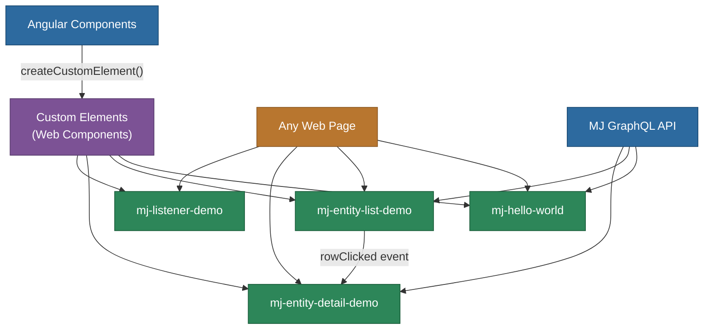

# @memberjunction/angular-elements-demo

Demonstrates how to leverage Angular Elements to create reusable web components from MemberJunction Angular components that can be embedded in any web application, regardless of the framework used.

## Overview

Angular Elements provides a bridge between Angular's powerful component model and the Web Components standard. By converting Angular components into standard Custom Elements, MemberJunction functionality can be used in non-Angular environments including React, Vue, and plain HTML pages.



This approach gives you the best of both worlds -- Angular's powerful development environment and the universal compatibility of Web Components.

## Strategic Value

Angular Elements offers several strategic advantages for organizations:

### 1. Cross-Framework Compatibility

Modern web development often involves multiple frameworks. Angular Elements allows you to:
- Leverage existing Angular components in React, Vue, or even plain JavaScript applications
- Create a unified component library that works everywhere
- Avoid framework lock-in while still using the tools you prefer

### 2. Incremental Migration Path

For applications transitioning between frameworks:
- Gradually move from one framework to another while maintaining functionality
- Reuse components during migration rather than rewriting everything
- Provide a smoother upgrade path with less risk

### 3. Microfrontend Architecture

Angular Elements is perfect for microfrontend architectures:
- Different teams can work with different frameworks but share components
- Core functionality can be encapsulated in framework-agnostic web components
- Applications can be composed from independently deployable components

### 4. Design System Implementation

For implementing design systems:
- Create components once and use them everywhere
- Ensure consistent behavior and appearance across applications
- Simplify maintenance by centralizing component logic

## Components Included

This package exports the following MemberJunction components as web components:

### 1. `<mj-hello-world>`
A simple demonstration component that:
- Connects to MemberJunction's metadata system
- Displays the total count of entities
- Emits events with entity information
- Shows basic MemberJunction integration

**Properties:** None
**Events:** `display` - Emits entity list data

### 2. `<mj-entity-list-demo>`
Displays a list of MemberJunction entities in a table format:
- Loads entity metadata automatically when user is logged in
- Handles row selection with visual feedback
- Emits events when rows are clicked
- Manages Angular change detection for web component usage

**Properties:** None
**Events:** `rowClicked` - Emits selected EntityInfo object

### 3. `<mj-entity-detail-demo>`
Shows detailed information about a selected entity:
- Accepts an EntityInfo object as input
- Displays entity properties in a grid layout
- Updates automatically when input changes

**Properties:** `entity` (EntityInfo) - The entity to display
**Events:** None

### 4. `<mj-listener-demo>`
Demonstrates event listening capabilities:
- Subscribes to MemberJunction global events
- Logs event information to console
- Shows how components can communicate via event system

**Properties:** `displayString` (string) - Text to display
**Events:** None

### 5. `<mj-user-view-grid-wrapper>`
A wrapper component for the MemberJunction user view grid (implementation pending).

## Installation

### Prerequisites

- Node.js (LTS version recommended)
- npm or yarn
- Angular CLI (`npm install -g @angular/cli`)
- MemberJunction backend API running (for data functionality)

### Package Installation

This package is part of the MemberJunction monorepo. To work with it:

1. Clone the MemberJunction repository
2. Navigate to the root directory
3. Install all dependencies (from the monorepo root):
   ```bash
   npm install
   ```
4. Navigate to this package:
   ```bash
   cd packages/AngularElements/mj-angular-elements-demo
   ```

## Building the Web Components

### Development Build

```bash
# Build in development mode
ng build
# or
npm run build
```

### Production Build with Bundling

Run the build script to create the bundled web components:

```bash
# Make the script executable (first time only)
chmod +x build_angular_elements.sh

# Run the build script
./build_angular_elements.sh
```

This script:
1. Builds the Angular application with production optimizations
2. Concatenates the resulting JavaScript files (runtime, polyfills, scripts, main)
3. Creates a single bundle (`dist/mj-angular-elements-demo-complete.js`) that can be included in any web page

### Build Output

- `dist/mj-angular-elements-demo/`: Standard Angular build output
- `dist/mj-angular-elements-demo-complete.js`: Bundled file containing all components

### Available NPM Scripts

```bash
npm run build    # Build the project
npm run watch    # Build and watch for changes
npm run start    # Start development server
npm run test     # Run unit tests
```

## Usage Examples

### Basic Usage

Include the generated bundle in any HTML page:

```html
<!DOCTYPE html>
<html>
<head>
  <script src="path/to/mj-angular-elements-demo-complete.js"></script>
</head>
<body>
  <!-- Use the components like any HTML element -->
  <mj-hello-world></mj-hello-world>
  <mj-entity-list-demo></mj-entity-list-demo>
</body>
</html>
```

### Complete Example with MemberJunction Integration

```html
<!DOCTYPE html>
<html>
<head>
  <script src="dist/mj-angular-elements-demo-complete.js"></script>
  <script src="path/to/MemberJunctionGraphQLDataProvider.js"></script>
</head>
<body>
  <div style="display: flex; gap: 20px;">
    <mj-entity-list-demo></mj-entity-list-demo>
    <mj-entity-detail-demo></mj-entity-detail-demo>
  </div>

  <script>
    document.addEventListener("DOMContentLoaded", async function() {
      // Set up component communication
      const entityList = document.querySelector('mj-entity-list-demo');
      const entityDetail = document.querySelector('mj-entity-detail-demo');
      
      entityList.addEventListener('rowClicked', event => {
        entityDetail.entity = event.detail;
      });

      // Initialize MemberJunction
      const { GraphQLProviderConfigData, setupGraphQLClient } = MemberJunctionGraphQLDataProvider;
      const config = new GraphQLProviderConfigData(
        'YOUR_JWT_TOKEN',
        'http://localhost:4000',
        'ws://localhost:4000/',
        '__mj'
      );
      await setupGraphQLClient(config);
    });
  </script>
</body>
</html>
```

### Demo Pages

This package includes working demo pages:

- `demo_mj_hello_angular_elements.html`: Simple hello world component demo
- `demo_mj_entity_list_angular_elements.html`: Advanced demo showing entity list and detail components working together with event communication

## API Documentation

### Component Communication

Components communicate through standard DOM events and properties:

```javascript
// Listen for events from a component
const entityList = document.querySelector('mj-entity-list-demo');
entityList.addEventListener('rowClicked', event => {
  // Access the data passed with the event
  const entityData = event.detail; // EntityInfo object
  
  // Pass data to another component via property
  const entityDetail = document.querySelector('mj-entity-detail-demo');
  entityDetail.entity = entityData;
});

// Set properties directly
const listener = document.querySelector('mj-listener-demo');
listener.displayString = 'Hello from JavaScript!';
```

### TypeScript Support

When using these components in a TypeScript project:

```typescript
import { EntityInfo } from '@memberjunction/core';

// Type the elements
const entityList = document.querySelector('mj-entity-list-demo') as HTMLElement & {
  addEventListener(type: 'rowClicked', listener: (event: CustomEvent<EntityInfo>) => void): void;
};

const entityDetail = document.querySelector('mj-entity-detail-demo') as HTMLElement & {
  entity: EntityInfo;
};

// Use with full type safety
entityList.addEventListener('rowClicked', (event) => {
  entityDetail.entity = event.detail; // TypeScript knows this is EntityInfo
});
```

## Implementation Approach

### Understanding Angular Elements

Angular Elements works by:
1. Creating a standard Angular component
2. Converting it to a Custom Element using `createCustomElement()`
3. Registering it with the browser using `customElements.define()`

When the component is used in a web page:
1. Angular bootstraps a mini-app for each component instance
2. `@Input()` properties become attributes or properties of the custom element
3. `@Output()` events become standard DOM events
4. Change detection works as expected within the component

### Technical Considerations

When implementing Angular Elements:

1. **Bundle Size**: Angular Elements includes Angular's core runtime with each component, so bundle size optimization is important.
   - Consider using `ngx-build-plus` for more efficient bundling
   - For very large applications, lazy loading chunks may be beneficial

2. **Zone.js**: Angular Elements relies on Zone.js for change detection:
   - Include Zone.js in your bundle or load it separately
   - Be aware of potential conflicts with other frameworks using Zone.js

3. **Shadow DOM**: By default, Angular Elements uses Shadow DOM for style encapsulation:
   - This isolates styles from the rest of the page
   - You can configure this behavior with the `ViewEncapsulation` setting

4. **Browser Support**: Custom Elements are supported in all modern browsers, but polyfills may be needed for older browsers:
   - `@webcomponents/custom-elements` provides necessary polyfills
   - Consider using a polyfill loading strategy for optimal performance

## Developing New Components

### Creating Components for Dual Use

You can design your Angular components to work both as regular Angular components and as web components:

1. **Design for standalone use**: Ensure components can function with minimal external dependencies
2. **Use Input/Output for communication**: Rely on `@Input()` and `@Output()` decorators for component interaction
3. **Handle change detection**: When used as web components, Angular's change detection works differently, so manually trigger detection when needed

### Converting to Web Components

In your Angular module, convert components to custom elements:

```typescript
import { NgModule, Injector } from '@angular/core';
import { createCustomElement } from '@angular/elements';
import { YourComponent } from './your-component';

@NgModule({
  declarations: [YourComponent],
  imports: [...],
})
export class AppModule {
  constructor(injector: Injector) {
    // Convert Angular component to custom element
    const element = createCustomElement(YourComponent, {injector});
    // Define the custom element
    customElements.define('your-element', element);
  }
  
  ngDoBootstrap() {} // Required for custom elements
}
```

## Best Practices

1. **Keep dependencies minimal**: Web components work best when they have few external dependencies
2. **Use shadow DOM wisely**: Angular Elements uses shadow DOM by default, which provides style isolation
3. **Handle events properly**: Use standard DOM events for communication between components
4. **Document attributes and events**: Clear documentation helps others use your web components
5. **Consider polyfills**: For older browsers, include web components polyfills
6. **Optimize bundle size**: Use tree-shaking, code splitting, and other techniques to reduce payload size
7. **Test in all target browsers**: Ensure your components work in all browsers you need to support

## Real-World Use Cases

### 1. Embedded Widgets

Angular Elements is ideal for creating widgets that can be embedded in any website:
- Analytics dashboards that can be embedded in content management systems
- Interactive forms that can be placed on static websites
- Third-party functionality that needs to be distributed as a script

### 2. Shared Component Libraries

For organizations with multiple applications using different technologies:
- Create a central component library using Angular
- Export key components as web components
- Use them consistently across all applications

### 3. Legacy Application Enhancement

When working with older web applications:
- Add modern functionality without rewriting the entire application
- Incrementally enhance pages with interactive components
- Bridge the gap between legacy systems and modern UX

### 4. Dynamic Content Systems

For systems that load components at runtime:
- Create a library of components that can be loaded based on user needs
- Allow non-technical users to compose pages from pre-built components
- Support extension through standardized component interfaces

## Benefits of This Approach

### For Angular Developers

- Reuse components across different Angular applications
- Package functionality for non-Angular projects
- Create a consistent design system for your organization

### For Web Developers

- Use powerful Angular components without adopting the entire framework
- Integrate Angular components into any JavaScript framework (React, Vue, etc.)
- Enhance static websites with dynamic Angular functionality

## Dependencies

### Production Dependencies
- `@angular/core`: ^18.0.2 - Angular framework core
- `@angular/elements`: ^18.0.2 - Angular Elements for web component creation
- `@angular/common`, `@angular/forms`, `@angular/platform-browser`: Angular framework modules
- `@memberjunction/core`: ^2.43.0 - MemberJunction core functionality
- `@memberjunction/global`: ^2.43.0 - Global MemberJunction utilities and events
- `@memberjunction/graphql-dataprovider`: ^2.43.0 - GraphQL data provider for MemberJunction
- `@memberjunction/ng-user-view-grid`: ^2.43.0 - Angular grid component for user views
- `rxjs`: ^7.8.1 - Reactive programming library
- `zone.js`: ^0.14.0 - Angular's change detection mechanism

### Development Dependencies
- `@angular-devkit/build-angular`: ^18.0.3 - Angular build tools
- `@angular/cli`: ^18.0.3 - Angular command line interface
- TypeScript, Karma, Jasmine for development and testing

## Integration with MemberJunction

These components are designed to work with the MemberJunction framework:

1. **Authentication**: Components wait for the MemberJunction `LoggedIn` event before loading data
2. **Metadata System**: Components use MemberJunction's metadata system to access entity information
3. **GraphQL Integration**: Requires a configured GraphQL data provider for backend communication
4. **Event System**: Components use MemberJunction's global event system for internal communication

### Setting Up MemberJunction Connection

```javascript
import { GraphQLProviderConfigData, setupGraphQLClient } from '@memberjunction/graphql-dataprovider';

// Configure and initialize the GraphQL client
const config = new GraphQLProviderConfigData(
  jwtToken,        // Your authentication token
  apiUrl,          // e.g., 'http://localhost:4000'
  websocketUrl,    // e.g., 'ws://localhost:4000/'
  schemaName       // e.g., '__mj'
);

await setupGraphQLClient(config);
// Components will now automatically load data when ready
```

## Configuration Options

### Angular Build Configuration

The `angular.json` file is configured with:
- **Output Hashing**: Disabled for consistent file names in bundles
- **Budget Limits**: 20MB maximum for initial bundle (accommodates Angular framework)
- **Polyfills**: Includes Zone.js for change detection

### Build Script Options

The `build_angular_elements.sh` script supports:
- Development builds: Faster builds with source maps
- Production builds: Optimized and minified output
- Custom configurations via Angular CLI flags

## Development

### Development Server

```bash
ng serve
# or
npm run start
```

Navigate to `http://localhost:4200/`. The app will automatically reload if you change any source files.

### Testing

```bash
# Run unit tests
ng test
# or
npm run test
```

Tests are executed via [Karma](https://karma-runner.github.io) with Jasmine.

### Adding New Components

1. Create your Angular component as normal
2. Add it to the declarations in `app.module.ts`
3. Convert it to a custom element in the module constructor:
   ```typescript
   const element = createCustomElement(YourComponent, {injector});
   customElements.define('your-element-name', element);
   ```
4. Rebuild the bundle using `./build_angular_elements.sh`

## Troubleshooting

### Common Issues

1. **Components not rendering**: Ensure the bundle script is loaded before using the components
2. **No data loading**: Verify MemberJunction GraphQL client is properly initialized
3. **Events not firing**: Check that event listeners are attached after DOM is loaded
4. **Style conflicts**: Angular Elements uses Shadow DOM by default for style isolation

### Browser Compatibility

- Modern browsers (Chrome, Firefox, Safari, Edge) have native support
- For older browsers, include polyfills:
  ```html
  <script src="https://unpkg.com/@webcomponents/custom-elements"></script>
  ```

## License

This package is part of the MemberJunction project. See the root LICENSE file for details.

## Learn More

- [Angular Elements Documentation](https://angular.io/guide/elements)
- [Web Components MDN](https://developer.mozilla.org/en-US/docs/Web/Web_Components)
- [Custom Elements Specification](https://html.spec.whatwg.org/multipage/custom-elements.html)
- [MemberJunction Documentation](https://docs.memberjunction.org)