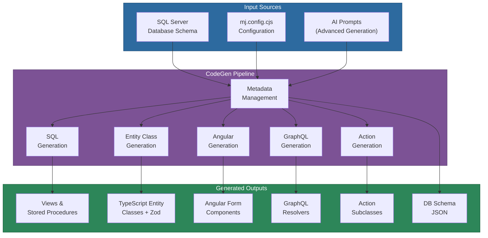
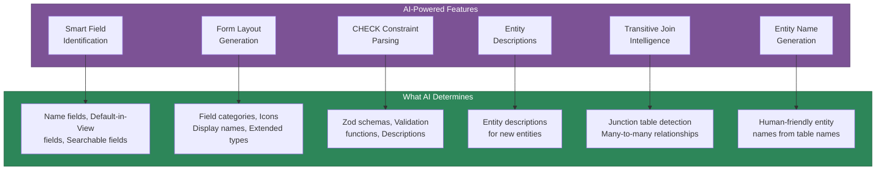

# @memberjunction/codegen-lib

The code generation engine for the MemberJunction platform. This library transforms database schema metadata into a complete, type-safe, full-stack application: TypeScript entity classes with Zod validation, Angular form components, SQL stored procedures and views, GraphQL resolvers, and Action subclasses -- all from a single `mj codegen` invocation.

## Installation

```bash
npm install @memberjunction/codegen-lib
```

## Overview

CodeGenLib sits at the center of MemberJunction's development workflow. When you change a database schema (add a table, alter a column, define a CHECK constraint), CodeGenLib detects those changes, updates internal metadata, and regenerates synchronized code across every layer of the stack. The result is guaranteed type safety from database to UI with zero manual boilerplate.

The library is designed for extensibility: every major generator is a base class that can be subclassed and registered via `@RegisterClass` to override or extend default behavior.



## Key Features

- **Full-Stack Synchronization**: A single schema change propagates to TypeScript entities, Angular forms, SQL procedures, and GraphQL resolvers automatically
- **AI-Powered Intelligence**: Uses AI prompts to translate CHECK constraints into Zod schemas, generate semantic form layouts, identify name fields, and create entity descriptions
- **Extensible Architecture**: Every generator (`SQLCodeGenBase`, `EntitySubClassGeneratorBase`, `AngularClientGeneratorBase`, etc.) can be subclassed and overridden via MJ's class factory
- **Zod Validation Schemas**: Generates Zod schemas from SQL CHECK constraints with proper union types and refinements
- **Recursive Hierarchy Support**: Automatically detects self-referential foreign keys and generates CTE-based `Root{FieldName}` columns in views
- **Cascade Delete Generation**: Produces cursor-based cascade delete procedures that call child entity stored procedures, respecting business logic at every level
- **Force Regeneration**: Surgically regenerate specific SQL objects for specific entities without requiring schema changes
- **Class Registration Manifests**: Prevents tree-shaking of `@RegisterClass`-decorated classes by generating static import manifests
- **SQL Migration Logging**: Outputs all generated SQL as Flyway-compatible migration files with schema placeholder support
- **Configurable via Zod-Validated Config**: All settings validated at startup through comprehensive Zod schemas with sensible defaults

## Architecture

### Pipeline Stages

The code generation process follows a well-defined pipeline orchestrated by the `RunCodeGenBase` class:


| Stage | Class | Description |
|-------|-------|-------------|
| BEFORE Commands | `RunCommandsBase` | Execute pre-generation shell commands and SQL scripts |
| Metadata Management | `ManageMetadataBase` | Analyze schema changes, create/update entity metadata, run AI-powered field analysis |
| SQL Generation | `SQLCodeGenBase` | Generate base views (with recursive CTEs), stored procedures (create/update/delete), foreign key indexes, permissions |
| GraphQL Resolvers | `GraphQLServerGeneratorBase` | Generate TypeGraphQL resolver and type definitions for all API-enabled entities |
| Entity Subclasses | `EntitySubClassGeneratorBase` | Generate TypeScript entity classes with Zod validation schemas, typed getters/setters, and value list types |
| Angular Components | `AngularClientGeneratorBase` | Generate Angular form components with smart field types, category-based layouts, and related entity tabs |
| DB Schema JSON | `DBSchemaGeneratorBase` | Export database schema as JSON for documentation and AI consumption |
| Action Subclasses | `ActionSubClassGeneratorBase` | Generate Action implementation classes from metadata-defined business logic |
| Integrity Checks | `SystemIntegrityBase` | Validate entity field sequences and other system consistency rules |
| AFTER Commands | `RunCommandsBase` | Execute post-generation commands (typically package builds) |

### Core vs Non-Core Entity Separation

CodeGen distinguishes between core MemberJunction entities (in the `__mj` schema) and application-specific entities. Each generator runs twice: once for core entities with output directed to `@memberjunction/core-entities`, and once for non-core entities with output directed to the application's generated packages. This separation ensures MJ framework code and application code stay independent.

### Class Factory Extensibility

Every generator base class can be subclassed and registered with a higher priority to customize behavior:

```mermaid
classDiagram
    class RunCodeGenBase {
        +setupDataSource() SQLServerDataProvider
        +Run(skipDatabaseGeneration) void
    }

    class ManageMetadataBase {
        +manageMetadata(pool, user) boolean
        +loadGeneratedCode(pool, user) boolean
    }

    class SQLCodeGenBase {
        +manageSQLScriptsAndExecution(pool, entities, dir, user) boolean
        +runCustomSQLScripts(pool, when) boolean
    }

    class EntitySubClassGeneratorBase {
        +generateAllEntitySubClasses(pool, entities, dir, skipDB) boolean
    }

    class AngularClientGeneratorBase {
        +generateAngularCode(entities, dir, prefix, user) boolean
    }

    class GraphQLServerGeneratorBase {
        +generateGraphQLServerCode(entities, dir, lib, exclude) boolean
    }

    class ActionSubClassGeneratorBase {
        +generateActions(actions, dir) boolean
    }

    RunCodeGenBase --> ManageMetadataBase : creates via ClassFactory
    RunCodeGenBase --> SQLCodeGenBase : creates via ClassFactory
    RunCodeGenBase --> EntitySubClassGeneratorBase : creates via ClassFactory
    RunCodeGenBase --> AngularClientGeneratorBase : creates via ClassFactory
    RunCodeGenBase --> GraphQLServerGeneratorBase : creates via ClassFactory
    RunCodeGenBase --> ActionSubClassGeneratorBase : creates via ClassFactory

    style RunCodeGenBase fill:#2d6a9f,stroke:#1a4971,color:#fff
    style ManageMetadataBase fill:#7c5295,stroke:#563a6b,color:#fff
    style SQLCodeGenBase fill:#7c5295,stroke:#563a6b,color:#fff
    style EntitySubClassGeneratorBase fill:#7c5295,stroke:#563a6b,color:#fff
    style AngularClientGeneratorBase fill:#7c5295,stroke:#563a6b,color:#fff
    style GraphQLServerGeneratorBase fill:#7c5295,stroke:#563a6b,color:#fff
    style ActionSubClassGeneratorBase fill:#7c5295,stroke:#563a6b,color:#fff
```



To override any generator, subclass the base and register it:

```typescript
import { RegisterClass } from '@memberjunction/global';
import { EntitySubClassGeneratorBase } from '@memberjunction/codegen-lib';

@RegisterClass(EntitySubClassGeneratorBase, undefined, 1) // priority 1 overrides default (0)
export class CustomEntityGenerator extends EntitySubClassGeneratorBase {
    // Override methods to customize generation
}
```

## Usage

### Running the Full Pipeline

```typescript
import { RunCodeGenBase, initializeConfig } from '@memberjunction/codegen-lib';

// Initialize configuration from working directory
const config = initializeConfig(process.cwd());

// Run the complete code generation pipeline
const codeGen = new RunCodeGenBase();
await codeGen.Run();

// Or skip database operations for faster UI-only regeneration
await codeGen.Run(true);
```

The convenience function provides a simpler entry point:

```typescript
import { runMemberJunctionCodeGeneration } from '@memberjunction/codegen-lib';

await runMemberJunctionCodeGeneration();
```

### Using Individual Generators

Each generator can be used independently:

```typescript
import { EntitySubClassGeneratorBase } from '@memberjunction/codegen-lib';
import { MJGlobal } from '@memberjunction/global';

const generator = MJGlobal.Instance.ClassFactory.CreateInstance<EntitySubClassGeneratorBase>(
    EntitySubClassGeneratorBase
);

await generator.generateAllEntitySubClasses(pool, entities, outputDir, false);
```

### Generating Class Registration Manifests

The manifest generator prevents tree-shaking of `@RegisterClass`-decorated classes:

```typescript
import { generateClassRegistrationsManifest } from '@memberjunction/codegen-lib';

const result = await generateClassRegistrationsManifest({
    outputPath: './src/generated/class-registrations-manifest.ts',
    appDir: './packages/MJAPI',
    excludePackages: ['@memberjunction'], // Use pre-built manifest for MJ packages
});

if (result.success) {
    console.log(`${result.packages.length} packages, ${result.classes.length} classes`);
}
```

See the [Class Manifest Guide](CLASS_MANIFEST_GUIDE.md) for comprehensive documentation on the manifest system.

## Configuration

CodeGenLib uses [cosmiconfig](https://github.com/cosmiconfig/cosmiconfig) to locate configuration. The recommended approach is a `mj.config.cjs` file at the repository root:

```javascript
module.exports = {
    // Database connection
    dbHost: 'localhost',
    dbPort: 1433,
    dbDatabase: 'YourDatabase',
    codeGenLogin: 'codegen_user',
    codeGenPassword: 'your_password',
    mjCoreSchema: '__mj',

    // Output directories for each generator
    output: [
        { type: 'SQL', directory: '../../SQL Scripts/generated' },
        { type: 'Angular', directory: '../MJExplorer/src/app/generated' },
        { type: 'GraphQLServer', directory: '../MJAPI/src/generated' },
        { type: 'CoreEntitySubclasses', directory: '../MJCoreEntities/src/generated' },
        { type: 'EntitySubclasses', directory: '../GeneratedEntities/src/generated' },
    ],

    // AI-powered features
    advancedGeneration: {
        enableAdvancedGeneration: true,
        features: [
            { name: 'SmartFieldIdentification', enabled: true },
            { name: 'FormLayoutGeneration', enabled: true },
            { name: 'ParseCheckConstraints', enabled: true },
            { name: 'TransitiveJoinIntelligence', enabled: true },
        ],
    },

    // SQL output for Flyway migrations
    SQLOutput: {
        enabled: true,
        folderPath: './migrations/v3/',
        convertCoreSchemaToFlywayMigrationFile: true,
    },

    // Force regeneration of specific objects
    forceRegeneration: {
        enabled: false,
        entityWhereClause: "SchemaName = 'dbo'",
        baseViews: true,
        spUpdate: true,
    },
};
```

All configuration is validated at startup using Zod schemas, with clear error messages for invalid settings. Environment variables (`DB_HOST`, `DB_DATABASE`, `CODEGEN_DB_USERNAME`, `CODEGEN_DB_PASSWORD`) provide fallback values for database connection settings.

### Key Configuration Sections

| Section | Purpose |
|---------|---------|
| `output` | Maps each generator type to its output directory |
| `advancedGeneration` | Controls which AI-powered features are enabled |
| `newEntityDefaults` | Default settings for newly discovered entities (permissions, tracking, API access) |
| `forceRegeneration` | Surgically regenerate specific SQL object types for filtered entities |
| `SQLOutput` | Controls Flyway migration file generation from SQL logging |
| `commands` | Shell commands to run before/after generation (typically package builds) |
| `excludeSchemas` / `excludeTables` | Filter schemas and tables from metadata discovery |

## What Gets Generated

### TypeScript Entity Classes

From a SQL table with CHECK constraints, CodeGen produces a complete entity class:

```typescript
// Auto-generated from database schema
export class AIPromptEntity extends BaseEntity {
    // Typed getter/setter for CHECK-constrained field
    get PromptRole(): 'System' | 'User' | 'Assistant' | 'SystemOrUser' {
        return this.Get('PromptRole');
    }
    set PromptRole(value: 'System' | 'User' | 'Assistant' | 'SystemOrUser') {
        this.Set('PromptRole', value);
    }

    // Zod validation from CHECK constraint
    validate(): ValidationResult {
        return this.validateWithZod(AIPromptSchema);
    }
}

// Zod schema with union types from CHECK constraint
export const AIPromptSchema = z.object({
    PromptRole: z.union([
        z.literal('System'),
        z.literal('User'),
        z.literal('Assistant'),
        z.literal('SystemOrUser'),
    ]),
    // ... all other fields
});
```

### SQL Views with Recursive Hierarchy Support

For tables with self-referential foreign keys, CodeGen automatically generates recursive CTEs:

```sql
-- Auto-detected: Task.ParentTaskID references Task.ID
CREATE VIEW [vwTasks] AS
WITH CTE_RootParentTaskID AS (
    SELECT [ID], [ID] AS [RootParentTaskID]
    FROM [__mj].[Task]
    WHERE [ParentTaskID] IS NULL

    UNION ALL

    SELECT child.[ID], parent.[RootParentTaskID]
    FROM [__mj].[Task] child
    INNER JOIN CTE_RootParentTaskID parent
        ON child.[ParentTaskID] = parent.[ID]
)
SELECT t.*, cte.[RootParentTaskID]
FROM [__mj].[Task] AS t
LEFT OUTER JOIN CTE_RootParentTaskID cte ON t.[ID] = cte.[ID]
```

The CTE is zero-overhead: the SQL optimizer eliminates it entirely when the root column is not selected.

### Angular Form Components

CodeGen creates production-ready Angular forms with AI-determined field categories and smart field types:

```typescript
@Component({
    selector: 'mj-ai-prompt-form',
    template: `
        <mj-form-field [record]="record"
            FieldName="PromptRole"
            Type="dropdownlist"
            [EditMode]="EditMode">
        </mj-form-field>
    `
})
export class AIPromptFormComponent extends BaseFormComponent { }
```

### Cascade Delete Procedures

Delete procedures use cursor-based stored procedure calls to respect business logic at every level of the hierarchy:

```sql
CREATE PROCEDURE [spDeleteOrder] @ID UNIQUEIDENTIFIER AS
BEGIN
    -- Cascade through child stored procedures
    DECLARE @ItemID UNIQUEIDENTIFIER
    DECLARE cascade_cursor CURSOR FOR
        SELECT [ID] FROM [OrderItems] WHERE [OrderID] = @ID

    OPEN cascade_cursor
    FETCH NEXT FROM cascade_cursor INTO @ItemID
    WHILE @@FETCH_STATUS = 0
    BEGIN
        EXEC [spDeleteOrderItem] @ItemID  -- Respects OrderItem's own cascade logic
        FETCH NEXT FROM cascade_cursor INTO @ItemID
    END
    CLOSE cascade_cursor
    DEALLOCATE cascade_cursor

    DELETE FROM [Orders] WHERE [ID] = @ID
END
```

## AI-Powered Advanced Generation

When `advancedGeneration.enableAdvancedGeneration` is enabled, CodeGen uses AI prompts (stored in the database as AI Prompt entities) to enhance the generation process:



| Feature | Purpose | When It Runs |
|---------|---------|-------------|
| `SmartFieldIdentification` | Determines which field is the "name" field, which fields show in default views, and which are searchable | Entity/field creation, or when `AutoUpdate` flags allow |
| `FormLayoutGeneration` | Groups fields into semantic categories with icons and display names | Every run (forms are always regenerated) |
| `ParseCheckConstraints` | Translates SQL CHECK constraints into Zod validation schemas and TypeScript union types | When CHECK constraints are detected |
| `EntityDescriptions` | Generates human-readable descriptions for entities | Entity creation only |
| `TransitiveJoinIntelligence` | Detects junction tables and many-to-many relationships | Entity/relationship creation |
| `EntityNames` | Converts technical table names to user-friendly entity names | Entity creation only |
| `VirtualEntityFieldDecoration` | Analyzes SQL view definitions to identify PKs, FKs, descriptions, and extended types for virtual entities | Virtual entity creation (idempotent unless `forceRegenerate` option is set) |

### Form Layout Stability Guarantees

The form layout system enforces stability to prevent unnecessary churn:

- Existing category names and icons are never changed by AI
- AI can assign fields to existing categories or create categories for genuinely new field groups
- Existing fields cannot be moved to newly created categories (prevents renaming)
- Per-field `AutoUpdateCategory` and `AutoUpdateDisplayName` flags provide granular control

## Force Regeneration

Regenerate specific SQL objects without schema changes using surgical filtering:

```javascript
// In mj.config.cjs
forceRegeneration: {
    enabled: true,
    // Filter to specific entities
    entityWhereClause: "SchemaName = 'CRM' AND __mj_UpdatedAt >= '2025-06-24'",
    // Control which object types regenerate
    baseViews: true,
    spCreate: false,
    spUpdate: true,
    spDelete: false,
    indexes: true,
}
```

Only the intersection of matched entities and enabled object types gets regenerated.

## SQL Migration Logging

All SQL generated during metadata management and object generation is logged to a Flyway-compatible migration file. The `SQLOutput` configuration controls this behavior:

```javascript
SQLOutput: {
    enabled: true,
    folderPath: './migrations/v3/',
    appendToFile: true,
    convertCoreSchemaToFlywayMigrationFile: true,
    schemaPlaceholders: [
        { schema: '__mj', placeholder: '${flyway:defaultSchema}' },
    ],
}
```

The `SQLLogging` class accumulates all SQL statements during a run and writes them as a single migration file with schema names replaced by Flyway placeholders.

## Source Structure

```
src/
  index.ts                          # Public API exports
  runCodeGen.ts                     # RunCodeGenBase - main pipeline orchestrator

  Config/
    config.ts                       # Zod-validated configuration schemas and loaders
    db-connection.ts                # SQL Server connection pool management

  Database/
    manage-metadata.ts              # ManageMetadataBase - schema analysis and metadata sync
    sql_codegen.ts                  # SQLCodeGenBase - views, procedures, indexes, permissions
    sql.ts                          # SQLUtilityBase - SQL file management and execution
    dbSchema.ts                     # DBSchemaGeneratorBase - JSON schema export
    reorder-columns.ts              # Table column reordering utilities

  Angular/
    angular-codegen.ts              # AngularClientGeneratorBase - form and module generation
    related-entity-components.ts    # Base classes for related entity display components
    entity-data-grid-related-entity-component.ts  # Data grid component generator
    join-grid-related-entity-component.ts         # Join grid component generator
    timeline-related-entity-component.ts          # Timeline component generator

  Misc/
    entity_subclasses_codegen.ts    # EntitySubClassGeneratorBase - TypeScript entity generation
    action_subclasses_codegen.ts    # ActionSubClassGeneratorBase - Action class generation
    graphql_server_codegen.ts       # GraphQLServerGeneratorBase - resolver generation
    advanced_generation.ts          # AdvancedGeneration - AI-powered enhancement features
    status_logging.ts               # Spinner and log utilities (ora-based)
    sql_logging.ts                  # SQLLogging - migration file accumulator
    system_integrity.ts             # SystemIntegrityBase - post-generation validation
    createNewUser.ts                # CreateNewUserBase - initial user setup
    runCommand.ts                   # RunCommandsBase - shell command execution
    util.ts                         # File system and sorting utilities

  Manifest/
    GenerateClassRegistrationsManifest.ts  # Tree-shaking prevention manifest generator
```

## API Reference

### RunCodeGenBase

The main orchestrator class. Creates instances of all generator classes via `MJGlobal.ClassFactory` and runs the pipeline.

| Method | Description |
|--------|-------------|
| `Run(skipDatabaseGeneration?)` | Execute the full code generation pipeline. Pass `true` to skip database operations. |
| `setupDataSource()` | Initialize the SQL Server connection pool and data provider. |

### ManageMetadataBase

Analyzes database schema changes and updates MJ metadata tables.

| Method | Description |
|--------|-------------|
| `manageMetadata(pool, user)` | Full metadata management: detect schema changes, create entities/fields, run AI features. |
| `loadGeneratedCode(pool, user)` | Load previously generated AI code from database (used when skipping DB generation). |

### SQLCodeGenBase

Generates database objects: views, stored procedures, indexes, and permissions. Delegates platform-specific SQL generation to `CodeGenDatabaseProvider` implementations (see below).

| Method | Description |
|--------|-------------|
| `manageSQLScriptsAndExecution(pool, entities, dir, user)` | Generate and execute all SQL objects for the given entities. |
| `runCustomSQLScripts(pool, when)` | Execute custom SQL scripts configured for the specified timing. |

### CodeGenDatabaseProvider (Database Abstraction Layer)

The `CodeGenDatabaseProvider` is the abstract base class that encapsulates **all database-specific SQL generation** for CodeGen. It has **55 abstract methods** organized into categories that each platform provider must implement:

| Category | Methods | Purpose |
|----------|---------|---------|
| DROP Guards | `generateDropGuard` | Conditional drop statements (IF EXISTS, IF OBJECT_ID) |
| Base Views | `generateBaseView` | Entity views with joins and soft-delete filtering |
| CRUD Routines | `generateCRUDCreate`, `generateCRUDUpdate`, `generateCRUDDelete` | Create/Update/Delete stored procedures or functions |
| Triggers | `generateTimestampTrigger` | Timestamp auto-update triggers |
| Indexes | `generateForeignKeyIndexes` | Foreign key index generation |
| Full-Text Search | `generateFullTextSearch` | Platform-specific FTS infrastructure |
| Root ID Functions | `generateRootIDFunction`, `generateRootFieldSelect`, `generateRootFieldJoin` | Recursive hierarchy root ID calculation |
| Permissions | `generateViewPermissions`, `generateCRUDPermissions`, `generateFullTextSearchPermissions` | GRANT statements per entity role |
| Cascade Deletes | `generateSingleCascadeOperation` | Cascade delete/update-to-NULL operations |
| Timestamp Columns | `generateTimestampColumns` | Adding __mj_CreatedAt/__mj_UpdatedAt columns |
| Parameter Helpers | `generateCRUDParamString`, `generateInsertFieldString`, `generateUpdateFieldString` | SQL generation utilities for routines |
| DDL Operations | `addColumnSQL`, `alterColumnTypeAndNullabilitySQL`, `dropObjectSQL`, etc. | Schema modification statements |
| Introspection | `getViewDefinitionSQL`, `getPrimaryKeyIndexNameSQL`, `getViewColumnsSQL` | Catalog queries for schema discovery |
| Type System | `compareDataTypes`, `get TimestampType` | Data type comparison and platform constants |
| Platform Config | `getSystemSchemasToExclude`, `get NeedsViewRefresh`, `get PlatformKey` | Platform-specific behavior flags |
| SQL Execution | `executeSQLFileViaShell` | Shell-based SQL file execution (sqlcmd, psql) |
| Default Parsing | `parseColumnDefaultValue` | Extracting defaults from catalog metadata |

#### Built-in Implementations

| Provider | Package | Platform |
|----------|---------|----------|
| `SQLServerCodeGenProvider` | `@memberjunction/codegen-lib` | SQL Server (T-SQL stored procedures, OBJECT_ID checks, sqlcmd) |
| `PostgreSQLCodeGenProvider` | `@memberjunction/postgresql-dataprovider` | PostgreSQL (PL/pgSQL functions, DROP IF EXISTS, psql) |

Providers are registered via `@RegisterClass(CodeGenDatabaseProvider, 'ProviderName')` and selected at runtime based on the configured database platform.

#### Adding a New Database Backend

To add support for a new database (e.g., MySQL, Oracle):

1. **Create a provider class** extending `CodeGenDatabaseProvider`
2. **Implement all 55 abstract methods** with platform-native SQL
3. **Create a `SQLDialect` subclass** in `@memberjunction/sql-dialect` for identifier quoting, type mapping, etc.
4. **Register with `@RegisterClass`** so CodeGen discovers it at runtime
5. **Create a data provider** implementing `DatabaseProviderBase` from `@memberjunction/core`

```typescript
import { RegisterClass } from '@memberjunction/global';
import { CodeGenDatabaseProvider } from '@memberjunction/codegen-lib';

@RegisterClass(CodeGenDatabaseProvider, 'MySQLCodeGenProvider')
export class MySQLCodeGenProvider extends CodeGenDatabaseProvider {
    get PlatformKey(): string { return 'mysql'; }
    get Dialect(): SQLDialect { return new MySQLDialect(); }

    generateDropGuard(objectType, schema, name): string {
        return `DROP ${objectType} IF EXISTS ${schema}.\`${name}\`;`;
    }
    // ... implement remaining 53 abstract methods
}
```

The PostgreSQL provider in `@memberjunction/postgresql-dataprovider` serves as the reference implementation for adding new backends.

### EntitySubClassGeneratorBase

Generates TypeScript entity classes with Zod validation.

| Method | Description |
|--------|-------------|
| `generateAllEntitySubClasses(pool, entities, dir, skipDB)` | Generate all entity subclass files including Zod schemas. |
| `generateEntitySubClass(pool, entity, includeHeader, skipDB)` | Generate a single entity subclass. |
| `GenerateSchemaAndType(entity)` | Generate Zod schema and TypeScript type for an entity. |

### AngularClientGeneratorBase

Generates Angular form components, section components, and Angular modules.

| Method | Description |
|--------|-------------|
| `generateAngularCode(entities, dir, prefix, user)` | Generate all Angular components and modules. |

### GraphQLServerGeneratorBase

Generates TypeGraphQL resolver and type definitions.

| Method | Description |
|--------|-------------|
| `generateGraphQLServerCode(entities, dir, lib, exclude)` | Generate GraphQL resolvers for all entities. |

### generateClassRegistrationsManifest

Generates an import manifest that prevents tree-shaking of `@RegisterClass` decorated classes. See the [Class Manifest Guide](CLASS_MANIFEST_GUIDE.md) for full documentation.

| Option | Description |
|--------|-------------|
| `outputPath` | Path for the generated manifest file |
| `appDir` | Directory containing the app's `package.json` (default: `process.cwd()`) |
| `filterBaseClasses` | Only include classes extending specific base classes |
| `excludePackages` | Skip packages matching name prefixes (e.g., `['@memberjunction']`) |

### Configuration Functions

| Function | Description |
|----------|-------------|
| `initializeConfig(cwd)` | Load and validate configuration from the given directory |
| `outputDir(type, fallback)` | Get the configured output directory for a generator type |
| `getSettingValue(name, default)` | Get a named setting value from configuration |
| `mj_core_schema()` | Get the MJ core schema name (typically `__mj`) |

## Dependencies

This package depends on:

- [@memberjunction/core](../MJCore) - Entity framework, metadata system, and type utilities
- [@memberjunction/core-entities](../MJCoreEntities) - Generated entity classes for MJ system entities
- [@memberjunction/global](../MJGlobal) - `@RegisterClass` decorator and `MJGlobal.ClassFactory`
- [@memberjunction/sql-dialect](../SQLDialect) - Abstract SQL dialect layer for multi-database support
- [@memberjunction/sqlserver-dataprovider](../SQLServerDataProvider) - SQL Server data provider and connection management
- [@memberjunction/ai](../AI) - AI provider abstraction layer
- [@memberjunction/ai-prompts](../AI/Prompts) - AI prompt execution for advanced generation features
- [@memberjunction/ai-core-plus](../AI/CorePlus) - AI prompt parameter types
- [@memberjunction/aiengine](../AIEngine) - AI engine for model and prompt configuration
- [@memberjunction/actions](../Actions/Engine) - Action engine for action code generation
- [@memberjunction/actions-base](../Actions/Base) - Action base classes and types
- [@memberjunction/config](../Config) - Configuration merging utilities
- [@memberjunction/server-bootstrap-lite](../server-bootstrap-lite) - Pre-built class registration manifest

## Related Packages

- [@memberjunction/cli](../MJCLI) - CLI that invokes CodeGenLib (`mj codegen` commands)
- [@memberjunction/core-entities](../MJCoreEntities) - Contains the generated `entity_subclasses.ts` output
- [@memberjunction/server-bootstrap](../server-bootstrap) - Ships pre-built server-side class manifest
- [@memberjunction/ng-bootstrap](../Angular/ng-bootstrap) - Ships pre-built Angular class manifest

## Documentation

- [Multi-Database Workflow](MULTI_DATABASE_WORKFLOW.md) - How migrations and CodeGen work together to support SQL Server, PostgreSQL, and future database backends
- [Class Manifest Guide](CLASS_MANIFEST_GUIDE.md) - Comprehensive guide to the manifest system for preventing tree-shaking of `@RegisterClass` classes
- [EXAMPLE_MANIFEST_MJAPI.md](EXAMPLE_MANIFEST_MJAPI.md) - Example server-side manifest (54 packages, 715 classes)
- [EXAMPLE_MANIFEST_MJEXPLORER.md](EXAMPLE_MANIFEST_MJEXPLORER.md) - Example client-side manifest (17 packages, 721 classes)

## IS-A Type Relationships in CodeGen

MemberJunction supports **IS-A (inheritance) relationships** between entities, where one entity extends another by adding additional fields while inheriting the parent's schema. CodeGen automatically handles IS-A relationships with specialized generation logic.

For comprehensive conceptual documentation, see the **[IS-A Relationships Guide](../../MJCore/docs/isa-relationships.md)** in MJCore.

### How CodeGen Handles IS-A Entities

When an entity has a `ParentEntity` relationship (IS-A child):

#### 1. SQL View Generation - Parent JOINs
**Child views automatically JOIN to parent views** to provide a complete record with all inherited fields:

```sql
-- CodeGen automatically generates:
CREATE VIEW [vwEmployee]
AS
SELECT
    e.*,               -- All Employee fields
    p.FirstName,       -- Inherited from Person
    p.LastName,        -- Inherited from Person
    p.DateOfBirth      -- Inherited from Person
FROM
    [__mj].[Employee] AS e
INNER JOIN
    [__mj].[vwPerson] AS p ON e.[ID] = p.[ID]
```

This ensures querying the child view returns a complete record including all parent fields.

#### 2. Stored Procedure Generation - Child Fields Only
**Create and Update procedures only include the child's own fields**, not parent fields:

```sql
-- spCreateEmployee only has Employee-specific parameters
CREATE PROCEDURE [spCreateEmployee]
    @ID uniqueidentifier,
    @EmployeeNumber nvarchar(50),
    @HireDate date,
    @Salary decimal(18,2)
    -- No FirstName, LastName (those are Person fields)
AS BEGIN
    -- Only inserts into Employee table
    INSERT INTO [__mj].[Employee] (ID, EmployeeNumber, HireDate, Salary)
    VALUES (@ID, @EmployeeNumber, @HireDate, @Salary)
END
```

**Why this design?** When creating an Employee, you first create the Person record (which gets an ID), then use that same ID to create the Employee record. The stored procedures reflect this two-step creation pattern.

#### 3. GraphQL Schema Generation - Complete Field Set
**GraphQL input types include ALL fields (parent + child)** for seamless API usage:

```graphql
input CreateEmployeeInput {
  # Parent fields (from Person)
  firstName: String!
  lastName: String!
  dateOfBirth: Date

  # Child fields (from Employee)
  employeeNumber: String!
  hireDate: Date!
  salary: Decimal!
}
```

This provides a convenient single-operation API while the resolver handles the underlying two-step creation.

#### 4. TypeScript Entity Classes - JSDoc Annotations
**Generated entity classes include JSDoc annotations** on getter/setter methods to indicate IS-A relationships:

```typescript
export class EmployeeEntity extends BaseEntity {
  /**
   * Inherited from Person entity
   */
  get FirstName(): string {
    return this.Get('FirstName');
  }

  set FirstName(value: string) {
    this.Set('FirstName', value);
  }

  // Own fields have no annotation
  get EmployeeNumber(): string {
    return this.Get('EmployeeNumber');
  }
}
```

#### 5. EntityField Metadata Synchronization
**`manageEntityFields()` respects IS-A hierarchy** when syncing field metadata:

- Fields from parent entities are NOT duplicated in child entity metadata
- Only the child's own fields appear in `EntityField` for the child entity
- `RelatedEntityID` and field relationships are preserved across the hierarchy
- Prevents metadata pollution from inherited fields

### Configuration in Database Metadata

IS-A relationships are defined in the `Entity` table:

```sql
-- Person is the base entity
INSERT INTO Entity (ID, ParentEntity, Name)
VALUES (NEWID(), NULL, 'Person')

-- Employee IS-A Person
INSERT INTO Entity (ID, ParentEntity, Name)
VALUES (NEWID(), 'Person', 'Employee')
```

CodeGen detects the `ParentEntity` relationship and applies the specialized generation logic automatically.

### Use Cases for IS-A Relationships

Common scenarios where IS-A relationships improve your schema:

- **Person → Employee, Customer, Vendor** - Shared contact information with role-specific fields
- **Document → Invoice, PurchaseOrder, Contract** - Common document metadata with type-specific data
- **Product → PhysicalProduct, DigitalProduct** - Shared catalog info with delivery-specific fields
- **Communication → Email, SMS, PhoneCall** - Common tracking with channel-specific metadata

### Best Practices

1. **Keep hierarchies shallow** - One or two levels is ideal (Person → Employee, not Person → Worker → Employee)
2. **Parent entities should be meaningful** - Don't create artificial base classes just for inheritance
3. **Child fields should be truly specific** - If a field applies to all children, put it in the parent
4. **ID management is manual** - When creating child records, explicitly use the parent's ID

## Virtual Entity Support

MemberJunction supports **virtual entities** - entities backed by database views instead of tables. Virtual entities enable read-only access to complex queries, external data sources, or denormalized views while maintaining the full MemberJunction metadata and API experience.

For comprehensive conceptual documentation, see the **[Virtual Entities Guide](../../MJCore/docs/virtual-entities.md)** in MJCore.

### Configuration-Driven Virtual Entity Creation

Virtual entities are defined in `database-metadata-config.json` under the `VirtualEntities` array:

```json
{
  "VirtualEntities": [
    {
      "ViewName": "vwSalesSummary",
      "EntityName": "Sales Summary",
      "SchemaName": "__mj",
      "Description": "Aggregated sales data by region and period",
      "PrimaryKey": ["SummaryID"],
      "ForeignKeys": [
        {
          "FieldName": "RegionID",
          "SchemaName": "__mj",
          "RelatedTable": "Region",
          "RelatedField": "ID",
          "Description": "FK to Region table"
        }
      ]
    }
  ]
}
```

#### Key Configuration Properties

- **`ViewName`**: The SQL view name (must already exist in the database)
- **`EntityName`**: The MemberJunction entity name (appears in metadata, UI, APIs)
- **`SchemaName`**: Database schema (typically `__mj` for core entities)
- **`Description`**: Entity description for metadata and documentation
- **`PrimaryKey`**: Array of column names forming the primary key (supports composite keys)
- **`ForeignKeys`**: Optional array of foreign key relationships to other entities (if omitted, LLM decoration discovers them)

### CodeGen Pipeline for Virtual Entities

CodeGen processes virtual entities through several specialized steps:

#### 1. `processVirtualEntityConfig()` - Entity Creation
Reads the `VirtualEntities` configuration and calls `spCreateVirtualEntity` for each entry:

```typescript
// CodeGen calls this stored procedure for each virtual entity
EXEC spCreateVirtualEntity
    @Name = 'Sales Summary',
    @SchemaName = '__mj',
    @BaseView = 'vwSalesSummary',
    @Description = 'Aggregated sales data...',
    @PrimaryKeyColumnName = 'SummaryID'
```

This creates the `Entity` metadata record with `VirtualEntity = 1`.

#### 2. `manageVirtualEntities()` - Field Synchronization
Scans `sys.columns` on the virtual entity's view and creates `EntityField` metadata for each column:

- Automatically detects data types, nullability, and max lengths
- Creates `EntityField` records for all view columns
- Updates existing fields if column definitions change
- Marks fields as `IsVirtual = 1` in metadata

```typescript
// CodeGen inspects the view schema
SELECT
    c.name,
    t.name AS TypeName,
    c.max_length,
    c.is_nullable
FROM
    sys.columns c
INNER JOIN
    sys.types t ON c.user_type_id = t.user_type_id
WHERE
    object_id = OBJECT_ID('__mj.vwSalesSummary')
```

#### 3. `applySoftPKFKConfig()` - Explicit Relationship Overrides
Applies the `primaryKeyColumnName` and `foreignKeyDefinitions` from the config:

```typescript
// Sets the primary key field
UPDATE EntityField
SET IsPrimaryKey = 1
WHERE EntityID = @VirtualEntityID
  AND Name = 'SummaryID'

// Creates foreign key relationships
INSERT INTO EntityRelationship (...)
SELECT ... FROM foreignKeyDefinitions
```

**Why explicit FK definitions?** Views don't have database-level foreign keys, so CodeGen can't detect relationships automatically. The config provides this metadata.

#### 4. LLM-Assisted Field Decoration (Advanced Feature)
The **`decorateVirtualEntitiesWithLLM()`** pipeline step uses AI to enhance virtual entity field metadata:

```typescript
import { AIPromptRunner } from '@memberjunction/ai-prompts';

// CodeGen calls a database-driven prompt to decorate fields
const promptParams = new AIPromptParams();
promptParams.prompt = 'Decorate Virtual Entity Fields';
promptParams.data = {
    entityName: 'Sales Summary',
    viewDefinition: viewSQL,
    existingFields: fieldsFromMetadata
};

const runner = new AIPromptRunner();
const result = await runner.ExecutePrompt(promptParams);
```

The LLM analyzes the view definition and provides:
- **Display names** - User-friendly field labels (e.g., `TotalRevenue` → "Total Revenue")
- **Descriptions** - Field-level documentation explaining what each column represents
- **Category assignments** - Semantic grouping for form layouts
- **DefaultInView flags** - Recommended visibility settings for grid displays

This is controlled by the `VirtualEntityFieldDecoration` feature in the Advanced Generation Features configuration.

### Virtual Entity Metadata Structure

After CodeGen processing, virtual entities have complete metadata:

```sql
-- Entity record
SELECT * FROM Entity WHERE Name = 'Sales Summary'
-- VirtualEntity = 1, BaseView = 'vwSalesSummary'

-- EntityField records (auto-detected from view)
SELECT * FROM EntityField WHERE EntityID = @SalesEntityID
-- Name, Type, Description, IsVirtual = 1

-- EntityRelationship records (from config)
SELECT * FROM EntityRelationship WHERE EntityID = @SalesEntityID
-- Foreign keys defined in foreignKeyDefinitions
```

### Generated Code for Virtual Entities

Virtual entities generate the same TypeScript, GraphQL, and Angular code as table-based entities:

**TypeScript Entity Class:**
```typescript
export class SalesSummaryEntity extends BaseEntity {
  get SummaryID(): string {
    return this.Get('SummaryID');
  }

  get RegionID(): string {
    return this.Get('RegionID');
  }

  get TotalRevenue(): number {
    return this.Get('TotalRevenue');
  }

  // Save/Delete methods throw errors (read-only entity)
}
```

**GraphQL Schema:**
```graphql
type SalesSummary {
  summaryID: ID!
  regionID: ID!
  region: Region    # Auto-resolved from FK definition
  totalRevenue: Float!
}

type Query {
  SalesSummaries(filter: String): [SalesSummary!]!
}
```

**Angular Form:**
```html
<mj-form-field
    [record]="record"
    FieldName="TotalRevenue"
    Type="textbox"
    [ReadOnly]="true"  <!-- Virtual entities are read-only -->
></mj-form-field>
```

### Virtual Entity Limitations

Virtual entities are **read-only** by design:

- No `spCreate`, `spUpdate`, or `spDelete` procedures generated
- `AllowCreateAPI`, `AllowUpdateAPI`, `AllowDeleteAPI` set to `0` in metadata
- Entity class `Save()` and `Delete()` methods throw errors
- GraphQL mutations not generated for virtual entities
- Angular forms display in read-only mode

### Advanced Generation Features Configuration

Virtual entity LLM decoration is controlled in the `advancedGeneration.features` array in `mj.config.cjs`:

```javascript
advancedGeneration: {
    enableAdvancedGeneration: true,
    features: [
        {
            name: 'VirtualEntityFieldDecoration',
            enabled: true,
            // Optional: force re-decoration even if entities already have soft PK/FK annotations
            options: [{ name: 'forceRegenerate', value: true }],
        },
    ],
},
```

By default, `VirtualEntityFieldDecoration` is **enabled** and uses an idempotency check — entities that already have `IsSoftPrimaryKey` or `IsSoftForeignKey` annotations are skipped. Set the `forceRegenerate` option to `true` to override this check and re-run LLM decoration for all virtual entities (useful after prompt improvements or when you want to refresh metadata).

When active, CodeGen calls `decorateVirtualEntitiesWithLLM()` after field synchronization.

### Use Cases for Virtual Entities

Virtual entities excel at:

- **Reporting and Analytics** - Pre-aggregated views for dashboards (sales summaries, usage metrics)
- **External Data Sources** - Linked server views, API-backed views, federated queries
- **Denormalized Views** - Flattened data for grid displays without JOIN overhead
- **Legacy System Integration** - Expose legacy tables through normalized MJ entity layer
- **Calculated Fields** - Complex computed columns not suitable for table storage
- **Security Views** - Row-level security via filtered views with full MJ API access

### Best Practices

1. **View must exist first** - Create the SQL view before running CodeGen with virtual entity config
2. **Primary key is required** - Views must have a unique identifier column
3. **Use meaningful names** - `entityName` appears throughout UI and APIs
4. **Document foreign keys** - Explicit FK definitions enable relationship navigation
5. **Enable LLM decoration** - Let AI generate field descriptions for better UX
6. **Keep views simple** - Complex views with subqueries may have performance issues
7. **Test read operations** - Verify grid displays and API queries perform acceptably

## Contributing

See the [MemberJunction Contributing Guide](../../CONTRIBUTING.md) for development setup and guidelines.

When contributing to CodeGenLib:

1. All generator base classes use the class factory pattern -- always subclass and register rather than modifying base classes directly
2. Generated SQL must be valid for the target database platform and produce valid Flyway migration output
3. Generated TypeScript must compile without errors and follow MJ naming conventions (PascalCase public members)
4. AI-powered features must enforce stability guarantees (existing categories and icons are never changed)

## CLI Usage Guide

CodeGen is invoked through the MemberJunction CLI (`mj` command). Two subcommands are available:

### `mj codegen` — Full Code Generation Pipeline

Runs the complete pipeline: database schema analysis, metadata sync, and code generation across all layers.

```bash
# Run the full pipeline (most common usage)
mj codegen

# Skip database operations, only regenerate code files from existing metadata
mj codegen --skipdb
```

| Flag | Description |
|------|-------------|
| `--skipdb` | Skip all database operations (metadata sync, SQL object generation). Only regenerates TypeScript entities, Angular components, and GraphQL resolvers from existing metadata. |

#### Verbose Mode

Verbose output is controlled via `mj.config.cjs` (not a CLI flag):

```javascript
module.exports = {
    verboseOutput: true,  // Enable detailed logging during code generation
};
```

When enabled, you see additional detail about each pipeline stage including per-entity processing, AI prompt calls, and SQL statement execution.

### `mj codegen manifest` — Class Registration Manifest

Generates a TypeScript manifest file that prevents modern bundlers (ESBuild, Vite) from tree-shaking `@RegisterClass`-decorated classes.

```bash
# Generate manifest with defaults
mj codegen manifest

# Generate for a specific app, excluding MJ packages
mj codegen manifest --appDir ./packages/MJAPI \
  --output ./packages/MJAPI/src/generated/class-registrations-manifest.ts \
  --exclude-packages @memberjunction

# Only include classes extending specific base classes
mj codegen manifest --filter BaseEngine --filter BaseAction --verbose
```

| Flag | Short | Description |
|------|-------|-------------|
| `--output <path>` | `-o` | Output file path. Default: `./src/generated/class-registrations-manifest.ts` |
| `--appDir <path>` | `-a` | Root directory whose `package.json` dependency tree is scanned. Default: cwd |
| `--filter <class>` | `-f` | Only include classes extending this base class. Repeatable. |
| `--exclude-packages <prefix>` | `-e` | Skip packages whose name starts with this prefix. Repeatable. |
| `--quiet` | `-q` | Suppress all output except errors. |
| `--verbose` | `-v` | Show detailed per-package scanning progress. |

### Example Workflows

#### First-Time Setup

```bash
# 1. Configure database connection in mj.config.cjs
# 2. Run the full pipeline
mj codegen

# 3. Generated output lands in directories specified in mj.config.cjs:
#    - TypeScript entities  → packages/GeneratedEntities/src/generated/
#    - Angular forms        → packages/MJExplorer/src/app/generated/
#    - GraphQL resolvers    → packages/MJAPI/src/generated/
#    - SQL migration file   → migrations/v3/
```

#### After Schema Changes

```bash
# CodeGen detects schema changes automatically
mj codegen

# Review the generated Flyway migration file
ls -la migrations/v3/CodeGen_Run_*.sql
```

#### Regenerating Code Only (No DB Changes)

```bash
# Skip database operations for a faster run
mj codegen --skipdb
```

#### Forcing Regeneration of Specific Entities

Use `forceRegeneration` in `mj.config.cjs`:

```javascript
module.exports = {
    forceRegeneration: {
        enabled: true,
        entityWhereClause: "SchemaName = 'CRM' AND Name LIKE 'Customer%'",
        baseViews: true,
        spUpdate: true,
    },
};
```

Then run `mj codegen`. Set `enabled: false` afterward to avoid unnecessary work on future runs.

## Troubleshooting

### Database Connection Failures

**Symptom:** CodeGen fails immediately with a connection error or timeout.

**Common fixes:**

1. **Wrong credentials** — Verify `dbHost`, `dbDatabase`, `codeGenLogin`, and `codeGenPassword` in `mj.config.cjs`. Environment variables `DB_HOST`, `DB_DATABASE`, `CODEGEN_DB_USERNAME`, `CODEGEN_DB_PASSWORD` serve as fallbacks.

2. **Named instance** — If using a named instance (e.g., `localhost\SQLEXPRESS`), set `dbInstanceName` in config.

3. **Certificate trust** — For self-signed certificates, set `dbTrustServerCertificate: true`.

### Missing Output Directories

**Symptom:** `ENOENT` errors when writing generated files.

**Fix:** Ensure all directories listed in the `output` array of `mj.config.cjs` exist. CodeGen does not create parent directories automatically.

### Entity Relationship Errors

**Common causes:**

1. **Missing referenced tables** — If a foreign key references a table excluded via `excludeSchemas` or `excludeTables`, either include the referenced table or remove the foreign key.

2. **Stale metadata** — If you dropped and recreated tables, metadata may be out of sync. Run a full `mj codegen` (without `--skipdb`) to refresh.

### When to Use --skipdb

**Use it when:**
- You only need to regenerate code files from existing metadata
- The database is temporarily unavailable but you have valid metadata from a previous run

**Don't use it when:**
- You have made schema changes (new tables, altered columns, new constraints)
- You are running CodeGen for the first time
- You have changed `forceRegeneration` settings

### Configuration Validation Errors

**Symptom:** Zod validation errors at startup.

CodeGen validates all configuration using Zod schemas. Common issues:
- Missing required fields (`dbHost`, `dbDatabase`, `codeGenLogin`, `codeGenPassword`)
- Invalid types (`dbPort` must be a positive integer, `verboseOutput` must be a boolean)
- Malformed `output` array (each entry needs `type` and `directory` properties)

### AI-Powered Features Not Running

1. Verify `advancedGeneration.enableAdvancedGeneration` is `true` in `mj.config.cjs`
2. Verify the specific feature is `enabled: true` in the `features` array
3. Ensure the AI Prompts referenced by CodeGen exist in the database
4. Confirm that at least one AI model is configured and accessible
