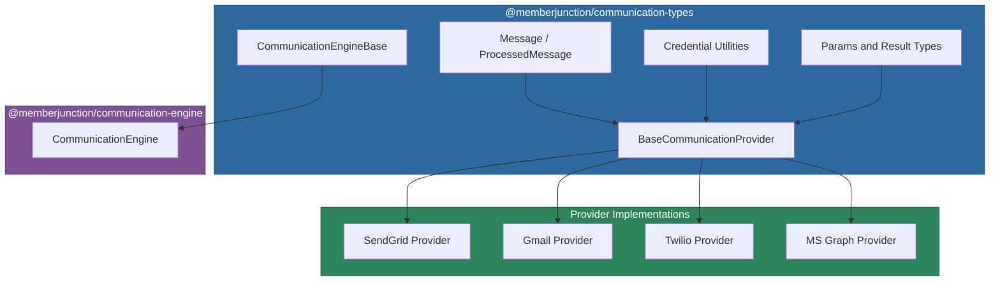
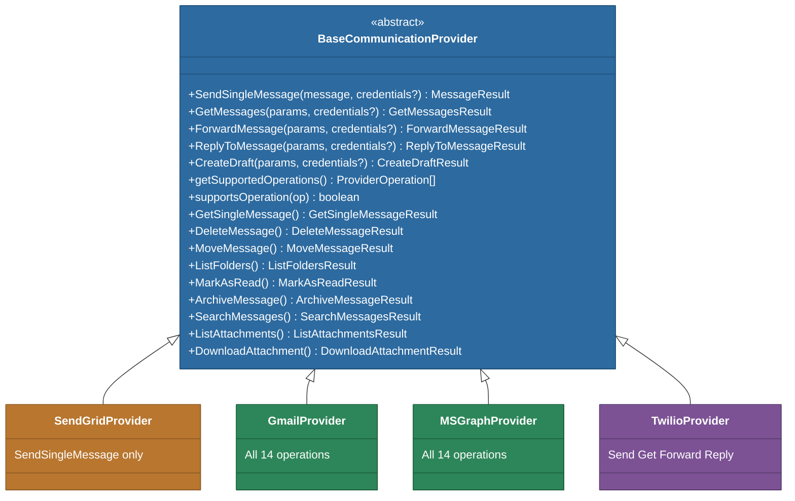

# @memberjunction/communication-types

Core types, interfaces, and abstract base classes for the MemberJunction Communication Framework. This package defines the contract that all communication providers must implement, along with shared message types, credential utilities, and the communication engine base class.

## Architecture



## Installation

```bash
npm install @memberjunction/communication-types
```

## Key Exports

### CommunicationEngineBase

Singleton base class that loads communication metadata (providers, message types, entity communication fields) and provides lifecycle management for communication runs and logs.

```typescript
import { CommunicationEngineBase } from '@memberjunction/communication-types';

const engine = CommunicationEngineBase.Instance;
await engine.Config(false, contextUser);

// Access loaded metadata
const providers = engine.Providers;           // MJCommunicationProviderEntityExtended[]
const messageTypes = engine.BaseMessageTypes; // CommunicationBaseMessageTypeEntity[]
```

### BaseCommunicationProvider

Abstract base class that all communication providers must extend. Defines both core operations (must implement) and extended mailbox operations (optional override).



#### Core Operations (Abstract -- Must Implement)

| Method | Description |
|--------|-------------|
| `SendSingleMessage()` | Send a single message through the provider |
| `GetMessages()` | Retrieve messages from the provider |
| `ForwardMessage()` | Forward a message to new recipients |
| `ReplyToMessage()` | Reply to an existing message |
| `CreateDraft()` | Create a draft message (return error if unsupported) |

#### Extended Operations (Optional -- Override to Support)

These methods have default implementations that return "not supported" errors. Override them in providers that have full mailbox access.

| Method | Description |
|--------|-------------|
| `GetSingleMessage()` | Retrieve a single message by ID |
| `DeleteMessage()` | Delete or trash a message |
| `MoveMessage()` | Move a message to a different folder |
| `ListFolders()` | List available folders/labels |
| `MarkAsRead()` | Mark messages as read or unread |
| `ArchiveMessage()` | Archive a message |
| `SearchMessages()` | Search messages by query string |
| `ListAttachments()` | List attachments on a message |
| `DownloadAttachment()` | Download an attachment by ID |

#### Capability Discovery

```typescript
const operations = provider.getSupportedOperations();

if (provider.supportsOperation('SearchMessages')) {
    const results = await provider.SearchMessages({ Query: 'invoice' });
}
```

### Message Classes

- **Message**: Holds all data for a single communication including optional template references, CC/BCC recipients, headers, and scheduled send time.
- **ProcessedMessage**: Abstract subclass of `Message` with rendered content (`ProcessedBody`, `ProcessedHTMLBody`, `ProcessedSubject`) and a `Process()` method for template rendering.
- **MessageRecipient**: Represents a single recipient with per-recipient template context data.
- **MessageResult**: Result of a send operation including success/failure status, error details, and the processed message.

```typescript
import { Message, ProcessedMessage, MessageRecipient } from '@memberjunction/communication-types';

const message = new Message();
message.From = 'sender@example.com';
message.To = 'recipient@example.com';
message.Subject = 'Hello';
message.Body = 'Plain text body';
message.HTMLBody = '<p>HTML body</p>';
message.CCRecipients = ['cc@example.com'];
message.BCCRecipients = ['bcc@example.com'];
message.Headers = { 'X-Custom': 'value' };
message.SendAt = new Date('2025-01-01');

// Template-based messages
message.BodyTemplate = templateEntity;
message.SubjectTemplate = subjectTemplateEntity;
message.ContextData = { name: 'John', company: 'Acme Corp' };
```

### Credential Utilities

The credential system supports per-request credential overrides while maintaining backward compatibility with environment variables.

```typescript
import {
    ProviderCredentialsBase,
    resolveCredentialValue,
    validateRequiredCredentials,
    resolveCredentials
} from '@memberjunction/communication-types';

// Resolve a single credential (request value takes precedence over env fallback)
const apiKey = resolveCredentialValue(
    credentials?.apiKey,        // from request
    process.env.SENDGRID_KEY,   // environment fallback
    false                       // disableEnvironmentFallback
);

// Validate all required fields are present
validateRequiredCredentials(
    { apiKey, tenantId },
    ['apiKey', 'tenantId'],
    'MyProvider'
);

// Resolve multiple fields with source tracking
const result = resolveCredentials(
    requestCredentials,
    envCredentials,
    ['apiKey', 'secret'],
    false
);
// result.source: 'request' | 'environment' | 'mixed'
// result.fieldSources: { apiKey: 'request', secret: 'environment' }
```

### Communication Runs and Logging

The engine provides methods for tracking communication activities through database entities:

```typescript
const run = await engine.StartRun();
const log = await engine.StartLog(processedMessage, run);
// ... send message ...
log.Status = 'Complete';
await log.Save();
await engine.EndRun(run);
```

## Type Definitions

All parameter and result types used across the framework:

| Type | Purpose |
|------|---------|
| `GetMessagesParams` / `GetMessagesResult` | Message retrieval |
| `ForwardMessageParams` / `ForwardMessageResult` | Message forwarding |
| `ReplyToMessageParams` / `ReplyToMessageResult` | Message replies |
| `CreateDraftParams` / `CreateDraftResult` | Draft creation |
| `GetSingleMessageParams` / `GetSingleMessageResult` | Single message retrieval |
| `DeleteMessageParams` / `DeleteMessageResult` | Message deletion |
| `MoveMessageParams` / `MoveMessageResult` | Folder management |
| `ListFoldersParams` / `ListFoldersResult` | Folder listing |
| `MarkAsReadParams` / `MarkAsReadResult` | Read status |
| `SearchMessagesParams` / `SearchMessagesResult` | Message search |
| `ListAttachmentsParams` / `ListAttachmentsResult` | Attachment listing |
| `DownloadAttachmentParams` / `DownloadAttachmentResult` | Attachment download |
| `ProviderOperation` | Union type of all operation names |
| `MessageFolder` / `MessageAttachment` | Data structures for folders and attachments |

## Dependencies

| Package | Purpose |
|---------|---------|
| `@memberjunction/core` | BaseEngine, UserInfo, logging utilities |
| `@memberjunction/core-entities` | Generated entity types for Communication metadata |
| `@memberjunction/global` | RegisterClass decorator and MJGlobal class factory |
| `@memberjunction/templates-base-types` | Template entity types for message templating |

## Development

```bash
npm run build    # Compile TypeScript
npm start        # Watch mode
```
