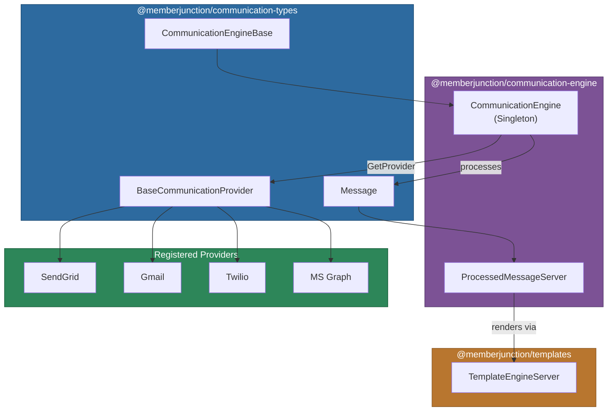
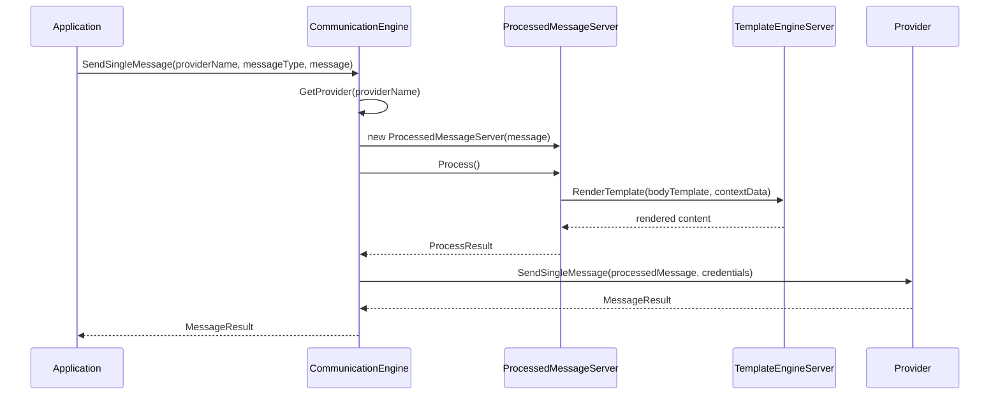

# @memberjunction/communication-engine

Server-side communication engine for MemberJunction. This package extends `CommunicationEngineBase` from `@memberjunction/communication-types` to provide the concrete implementation for sending messages, creating drafts, and managing communication runs through registered providers.

## Architecture



## Installation

```bash
npm install @memberjunction/communication-engine
```

## Key Classes

### CommunicationEngine

Singleton engine that orchestrates message sending across all registered providers. Handles provider lookup via the MJGlobal class factory, message processing (template rendering), communication run lifecycle, and logging.

```typescript
import { CommunicationEngine } from '@memberjunction/communication-engine';
import { Message, MessageRecipient } from '@memberjunction/communication-types';

const engine = CommunicationEngine.Instance;
await engine.Config(false, contextUser);
```

### Sending a Single Message

```typescript
const message = new Message();
message.From = 'sender@example.com';
message.To = 'recipient@example.com';
message.Subject = 'Welcome';
message.HTMLBody = '<h1>Hello</h1>';

const result = await engine.SendSingleMessage(
    'SendGrid',           // provider name
    'Email',              // provider message type name
    message,
    undefined,            // optional CommunicationRunEntity
    false                 // previewOnly
);

if (result.Success) {
    console.log('Message sent');
}
```

### Sending to Multiple Recipients

```typescript
const recipients: MessageRecipient[] = [
    { To: 'alice@example.com', FullName: 'Alice', ContextData: { role: 'admin' } },
    { To: 'bob@example.com', FullName: 'Bob', ContextData: { role: 'user' } }
];

const message = new Message();
message.From = 'noreply@example.com';
message.BodyTemplate = templateEntity; // uses template for personalization
message.Subject = 'Update';

const results = await engine.SendMessages(
    'SendGrid',
    'Email',
    message,
    recipients,
    false // previewOnly
);
// results is MessageResult[] - one per recipient
```

### Creating a Draft

```typescript
const message = new Message();
message.From = 'user@example.com';
message.To = 'recipient@example.com';
message.Subject = 'Draft Email';
message.HTMLBody = '<p>Content here</p>';

const result = await engine.CreateDraft(
    message,
    'Microsoft Graph', // only providers with SupportsDrafts
    contextUser
);

if (result.Success) {
    console.log(`Draft ID: ${result.DraftID}`);
}
```

### Per-Request Credentials

All send methods accept an optional `credentials` parameter for per-request credential overrides:

```typescript
import { SendGridCredentials } from '@memberjunction/communication-sendgrid';

const result = await engine.SendSingleMessage(
    'SendGrid',
    'Email',
    message,
    undefined,
    false,
    { apiKey: 'SG.customer-specific-key' } // per-request credentials
);
```

### ProcessedMessageServer

Server-side implementation of `ProcessedMessage` that renders templates using `TemplateEngineServer`. Automatically processes body, HTML body, and subject templates with the provided context data.



## API Reference

| Method | Description |
|--------|-------------|
| `Config(forceRefresh, contextUser, provider)` | Initialize the engine and load metadata |
| `GetProvider(providerName)` | Retrieve a provider instance from the class factory |
| `SendSingleMessage(provider, type, message, run?, preview?, credentials?)` | Send one message |
| `SendMessages(provider, type, message, recipients, preview?, credentials?)` | Send to multiple recipients |
| `CreateDraft(message, providerName, contextUser?, credentials?)` | Create a draft message |

## Dependencies

| Package | Purpose |
|---------|---------|
| `@memberjunction/communication-types` | Base engine, provider, and message types |
| `@memberjunction/core` | UserInfo, logging, metadata access |
| `@memberjunction/core-entities` | CommunicationRunEntity and related entities |
| `@memberjunction/global` | MJGlobal class factory for provider instantiation |
| `@memberjunction/templates` | Server-side template rendering engine |

## Development

```bash
npm run build    # Compile TypeScript
npm start        # Watch mode
```
