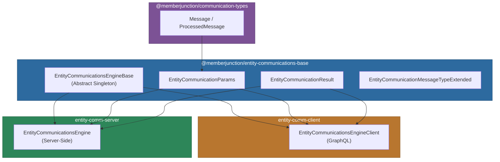
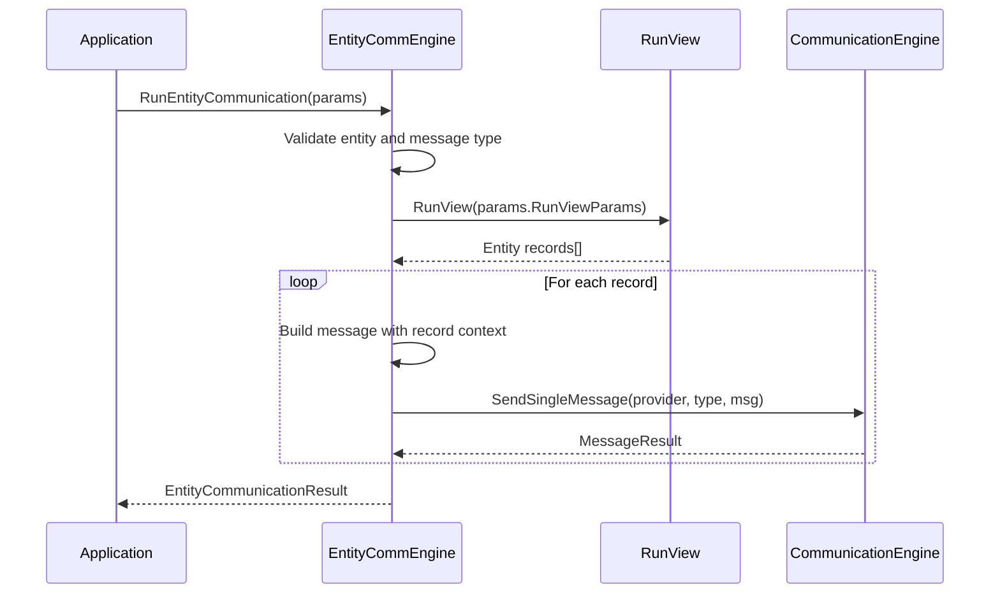

# @memberjunction/entity-communications-base

Shared types and base classes for entity-based communications in MemberJunction. This package defines the parameter, result, and data structures used by both the client-side (`entity-comm-client`) and server-side (`entity-comm-server`) entity communication implementations.

## Architecture



## Installation

```bash
npm install @memberjunction/entity-communications-base
```

## Key Exports

### EntityCommunicationsEngineBase

Abstract singleton base class that loads entity communication metadata including message types, field mappings, and provider associations. Both the client and server implementations extend this class.

```typescript
import { EntityCommunicationsEngineBase } from '@memberjunction/entity-communications-base';

// After Config(), access loaded metadata
const messageTypes = engine.EntityCommunicationMessageTypes;

// Check entity support
if (engine.EntitySupportsCommunication(entityID)) {
    const types = engine.GetEntityCommunicationMessageTypes(entityID);
}
```

#### Abstract Method

```typescript
abstract RunEntityCommunication(
    params: EntityCommunicationParams
): Promise<EntityCommunicationResult>;
```

Both `EntityCommunicationsEngineClient` and `EntityCommunicationsEngine` (server) implement this method with their respective communication strategies.

### EntityCommunicationParams

Defines the parameters for running an entity-based communication.

```typescript
import { EntityCommunicationParams } from '@memberjunction/entity-communications-base';

const params: EntityCommunicationParams = {
    EntityID: 'entity-uuid',
    RunViewParams: {
        EntityName: 'Contacts',
        ExtraFilter: 'Status = "Active"',
        OrderBy: 'LastName, FirstName'
    },
    ProviderName: 'SendGrid',
    ProviderMessageTypeName: 'Email',
    Message: {
        Subject: 'Monthly Newsletter',
        Body: 'Hello {{FirstName}}!',
        HTMLBody: '<h1>Hello {{FirstName}}!</h1>',
        ContextData: { CompanyName: 'Acme Corp' }
    },
    PreviewOnly: false,
    IncludeProcessedMessages: true
};
```

| Property | Type | Required | Description |
|----------|------|----------|-------------|
| `EntityID` | `string` | Yes | UUID of the entity to communicate with |
| `RunViewParams` | `RunViewParams` | Yes | View parameters for selecting recipient records |
| `ProviderName` | `string` | Yes | Communication provider name (e.g., "SendGrid") |
| `ProviderMessageTypeName` | `string` | Yes | Message type (e.g., "Email", "SMS") |
| `Message` | `Message` | Yes | Message content and optional templates |
| `PreviewOnly` | `boolean` | No | Preview without sending |
| `IncludeProcessedMessages` | `boolean` | No | Include rendered content in results |

### EntityCommunicationResult / EntityCommunicationResultItem

```typescript
interface EntityCommunicationResult {
    Success: boolean;
    ErrorMessage?: string;
    Results?: EntityCommunicationResultItem[];
}

interface EntityCommunicationResultItem {
    RecipientData: Record<string, unknown>;  // Entity record fields
    Message: ProcessedMessage;               // Rendered message
}
```

### EntityCommunicationMessageTypeExtended

Extends the base `EntityCommunicationMessageTypeEntity` with communication field mappings, linking base message types to entity-specific fields for recipient resolution.

```typescript
const messageTypes = engine.GetEntityCommunicationMessageTypes(entityID);
messageTypes.forEach(mt => {
    console.log(`Type: ${mt.BaseMessageType}`);
    mt.CommunicationFields.forEach(field => {
        console.log(`  Field: ${field.FieldName} (Priority: ${field.Priority})`);
    });
});
```

## Data Flow



## Dependencies

| Package | Purpose |
|---------|---------|
| `@memberjunction/core` | BaseEngine, RunView, UserInfo, EntityInfo |
| `@memberjunction/core-entities` | Entity Communication metadata types |
| `@memberjunction/communication-types` | Message and ProcessedMessage classes |
| `@memberjunction/global` | RegisterClass decorator |

## Development

```bash
npm run build    # Compile TypeScript
npm start        # Watch mode
```
