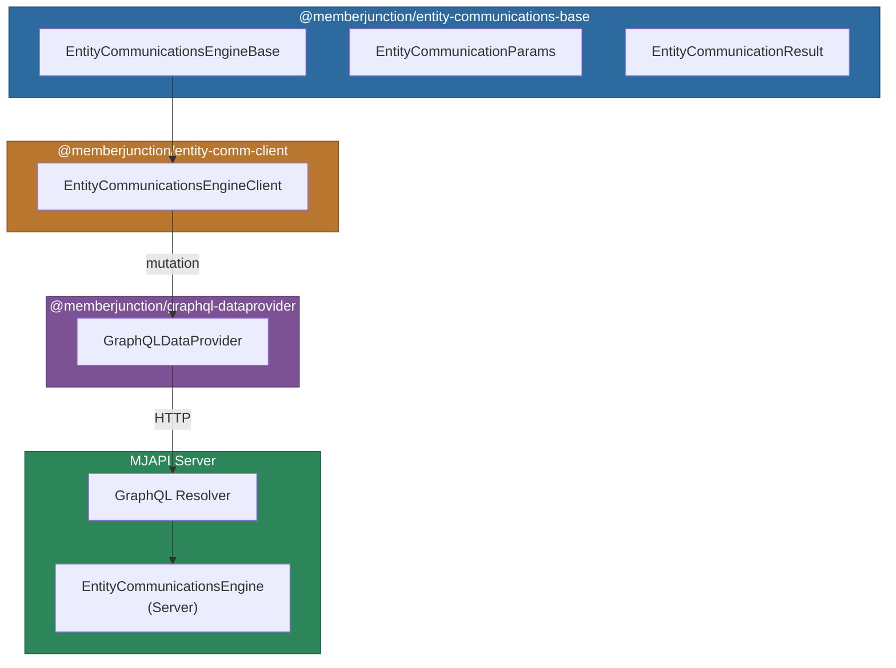
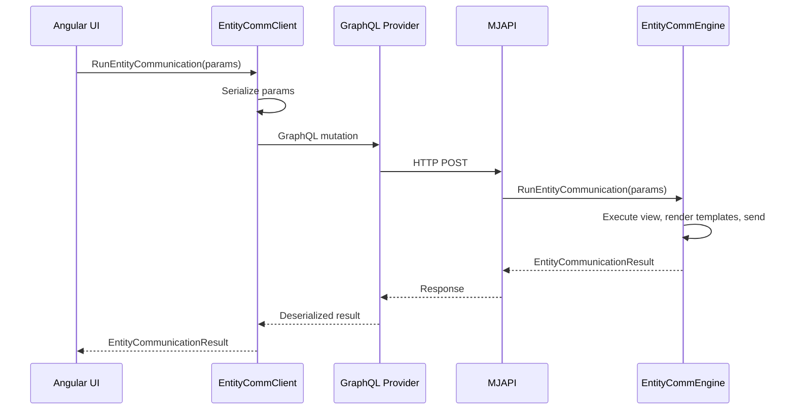

# @memberjunction/entity-communications-client

Client-side (Angular / browser) implementation of the MemberJunction Entity Communications Engine. This package sends entity communication requests to the server via GraphQL, enabling bulk messaging to records retrieved from entity views.

## Architecture



## Installation

```bash
npm install @memberjunction/entity-communications-client
```

## Usage

### Basic Example

```typescript
import { EntityCommunicationsEngineClient } from '@memberjunction/entity-communications-client';
import { EntityCommunicationParams } from '@memberjunction/entity-communications-base';

const client = new EntityCommunicationsEngineClient();
await client.Config();

const params: EntityCommunicationParams = {
    EntityID: '123',
    RunViewParams: {
        ViewID: '456',
        ExtraFilter: 'IsActive = 1',
        MaxRows: 100
    },
    ProviderName: 'SendGrid',
    ProviderMessageTypeName: 'Email',
    Message: {
        From: 'noreply@example.com',
        To: '{{Email}}',
        Subject: 'Important Update',
        Body: 'Hello {{FirstName}}, we have an update for you.',
        ContextData: {
            CompanyName: 'Acme Corp'
        }
    },
    PreviewOnly: false,
    IncludeProcessedMessages: true
};

const result = await client.RunEntityCommunication(params);

if (result.Success) {
    console.log(`Sent ${result.Results.length} messages`);
} else {
    console.error(`Failed: ${result.ErrorMessage}`);
}
```

### Preview Mode

Test communications without actually sending messages:

```typescript
const params: EntityCommunicationParams = {
    // ...same parameters...
    PreviewOnly: true,
    IncludeProcessedMessages: true
};

const result = await client.RunEntityCommunication(params);
result.Results.forEach(item => {
    console.log('Would send to:', item.RecipientData);
    console.log('Subject:', item.Message.ProcessedSubject);
    console.log('Body:', item.Message.ProcessedBody);
});
```

### Using Templates

```typescript
const params: EntityCommunicationParams = {
    EntityID: '123',
    RunViewParams: { ViewID: '456' },
    ProviderName: 'SendGrid',
    ProviderMessageTypeName: 'Email',
    Message: {
        From: 'welcome@example.com',
        To: '{{Email}}',
        SubjectTemplate: subjectTemplate,
        BodyTemplate: bodyTemplate,
        HTMLBodyTemplate: htmlTemplate,
        ContextData: { Year: new Date().getFullYear() }
    }
};
```

## How It Works

The client serializes `EntityCommunicationParams` and sends them to the MJAPI server via a GraphQL mutation. The server-side `EntityCommunicationsEngine` handles the actual view execution, template rendering, and message delivery through communication providers.



## API Reference

| Method | Description |
|--------|-------------|
| `Config(forceRefresh?, contextUser?, provider?)` | Load metadata (required before first use) |
| `RunEntityCommunication(params)` | Execute entity communication via GraphQL |

## Error Handling

```typescript
const result = await client.RunEntityCommunication(params);

if (!result.Success) {
    console.error('Communication failed:', result.ErrorMessage);

    // Check individual message failures
    result.Results?.forEach(item => {
        if (!item.Message.Success) {
            console.error(`Failed for ${item.RecipientData.Email}:`, item.Message.Error);
        }
    });
}
```

## Dependencies

| Package | Purpose |
|---------|---------|
| `@memberjunction/entity-communications-base` | Shared types and base engine |
| `@memberjunction/graphql-dataprovider` | GraphQL client for API communication |
| `@memberjunction/core` | Core framework utilities |
| `@memberjunction/core-entities` | Entity type definitions |
| `@memberjunction/global` | Class registration |

## Development

```bash
npm run build    # Compile TypeScript
npm start        # Watch mode
```
