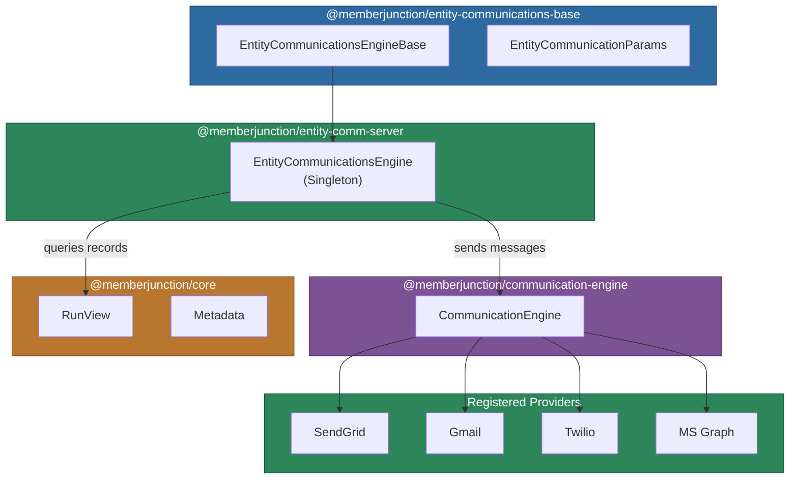
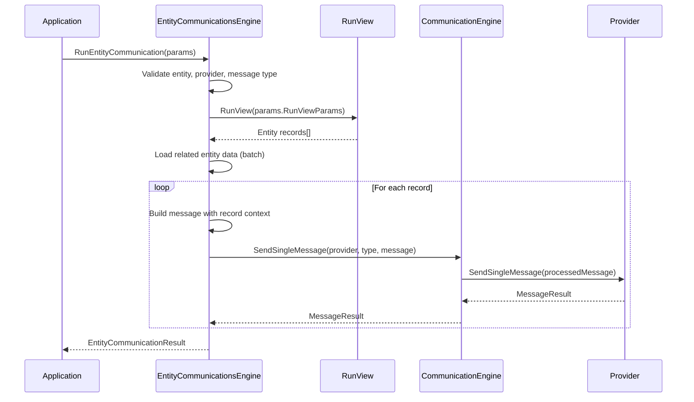

# @memberjunction/entity-communications-server

Server-side implementation of the MemberJunction Entity Communications Engine. Connects the entity/view system to the communication framework, enabling bulk messaging to records retrieved from entity views with full template rendering, related-entity data resolution, and multi-provider support.

## Architecture



## Installation

```bash
npm install @memberjunction/entity-communications-server
```

## Usage

### Basic Example

```typescript
import { EntityCommunicationsEngine } from '@memberjunction/entity-communications-server';
import { EntityCommunicationParams } from '@memberjunction/entity-communications-base';

const engine = EntityCommunicationsEngine.Instance;
await engine.Config(false, contextUser);

const params: EntityCommunicationParams = {
    EntityID: 'entity-uuid',
    RunViewParams: {
        EntityName: 'Contacts',
        ExtraFilter: 'Status = "Active"'
    },
    ProviderName: 'SendGrid',
    ProviderMessageTypeName: 'Email',
    Message: {
        Subject: 'Welcome',
        Body: 'Hello {{FirstName}}!',
        HTMLBodyTemplate: htmlTemplate
    },
    PreviewOnly: false
};

const result = await engine.RunEntityCommunication(params);
if (result.Success) {
    console.log(`Sent ${result.Results.length} messages`);
}
```

### Template Parameters with Related Entity Data

When templates reference related entities, the engine automatically fetches the related data in batch and populates each recipient's context:

```typescript
const params: EntityCommunicationParams = {
    EntityID: 'customer-entity-id',
    RunViewParams: { EntityName: 'Customers', ViewName: 'Premium Customers' },
    ProviderName: 'SendGrid',
    ProviderMessageTypeName: 'Email',
    Message: {
        BodyTemplate: templateWithRelatedEntities
    }
};
// Engine auto-fetches related orders for each customer
const result = await engine.RunEntityCommunication(params);
```

### Checking Entity Communication Support

```typescript
if (engine.EntitySupportsCommunication(entityID)) {
    const messageTypes = engine.GetEntityCommunicationMessageTypes(entityID);
    messageTypes.forEach(mt => {
        console.log(`Type: ${mt.BaseMessageType}`);
        mt.CommunicationFields.forEach(field => {
            console.log(`  Field: ${field.FieldName} (Priority: ${field.Priority})`);
        });
    });
}
```

## Processing Pipeline



## Key Features

- **Bulk Message Sending**: Send to all records from an entity view in a single call
- **Template Parameter Resolution**: Automatically fetches related entity data for template parameters
- **Multi-Provider Support**: Works with any registered communication provider (email, SMS, etc.)
- **Preview Mode**: Test communications without sending (`PreviewOnly: true`)
- **Context Data Population**: Per-recipient template context from entity record fields
- **Scheduled Sending**: Supports provider-level `SendAt` scheduling
- **Communication Logging**: All sends are tracked through `CommunicationRun` and `CommunicationLog` entities

## Configuration

### Entity Communication Setup

For an entity to support communications:

1. Configure `Entity Communication Message Types` in the MJ metadata
2. Set up `Entity Communication Fields` to define recipient address fields
3. Configure field priorities for automatic recipient resolution

### Template Parameters

Templates support multiple parameter types:

- **Record**: The current entity record being processed
- **Entity**: Related entity data fetched based on relationships
- **Array/Scalar/Object**: Direct programmatic use (not supported in messaging)

When using related entity parameters, the engine automatically:
1. Identifies unique relationships needed
2. Fetches all related data in batch queries
3. Filters related data per recipient record
4. Populates template context with filtered data

## Dependencies

| Package | Purpose |
|---------|---------|
| `@memberjunction/entity-communications-base` | Shared types and base engine class |
| `@memberjunction/communication-engine` | CommunicationEngine for message delivery |
| `@memberjunction/core` | RunView, Metadata, UserInfo, EntityInfo |
| `@memberjunction/core-entities` | Entity type definitions |
| `@memberjunction/global` | Class registration |

## Development

```bash
npm run build    # Compile TypeScript
npm start        # Watch mode
```
