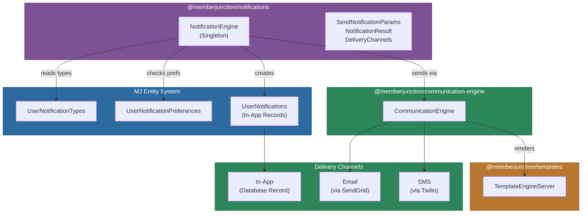
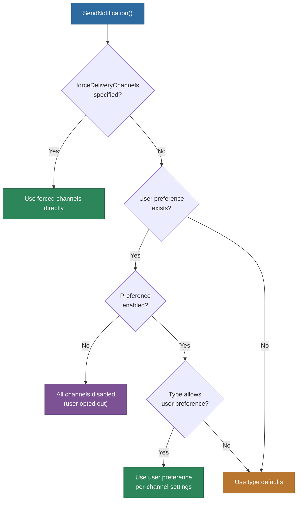

# @memberjunction/notifications

Unified notification engine for MemberJunction that handles in-app, email, and SMS delivery based on notification types and user preferences. This server-side package coordinates between the MJ entity system, template engine, and communication engine to deliver notifications through the appropriate channels.

## Architecture



## Installation

```bash
npm install @memberjunction/notifications
```

## Usage

### Sending a Notification

```typescript
import { NotificationEngine } from '@memberjunction/notifications';
import { SendNotificationParams } from '@memberjunction/notifications';

const engine = NotificationEngine.Instance;
await engine.Config(false, contextUser);

const params: SendNotificationParams = {
    userId: 'user-uuid',
    typeNameOrId: 'Agent Completion',
    title: 'Agent Run Finished',
    message: 'Your AI agent has completed processing.',
    templateData: {
        agentName: 'Data Analyzer',
        duration: '2m 34s'
    },
    resourceTypeId: 'resource-type-uuid',
    resourceRecordId: 'agent-run-uuid',
    resourceConfiguration: { conversationId: 'conv-uuid' }
};

const result = await engine.SendNotification(params, contextUser);

if (result.success) {
    console.log('Channels used:', result.deliveryChannels);
    // { inApp: true, email: true, sms: false }
}
```

### Forcing Delivery Channels

Override user preferences and type defaults by specifying exact channels:

```typescript
const result = await engine.SendNotification({
    userId: 'user-uuid',
    typeNameOrId: 'System Alert',
    title: 'Critical Error',
    message: 'Database connection lost',
    forceDeliveryChannels: {
        inApp: true,
        email: true,
        sms: true
    }
}, contextUser);
```

## Channel Resolution Logic



The engine resolves delivery channels with this priority:

1. **Force override**: If `forceDeliveryChannels` is set, use it directly
2. **User opt-out**: If user preference exists but `Enabled` is false, all channels are disabled
3. **User preference**: If the notification type allows user preferences, use per-channel settings (`InAppEnabled`, `EmailEnabled`, `SMSEnabled`)
4. **Type defaults**: Fall back to `DefaultInApp`, `DefaultEmail`, `DefaultSMS` from the notification type

## Delivery Channels

| Channel | How It Works |
|---------|-------------|
| **In-App** | Creates a `UserNotification` entity record in the database. Synchronous, instant. |
| **Email** | Renders the notification type's `EmailTemplateID` via `TemplateEngineServer`, then sends through `CommunicationEngine` using SendGrid. Fire-and-forget (async). |
| **SMS** | Renders the notification type's `SMSTemplateID` via `TemplateEngineServer`, then sends through `CommunicationEngine` using Twilio. Fire-and-forget (async). |

## Type Definitions

### SendNotificationParams

| Property | Type | Required | Description |
|----------|------|----------|-------------|
| `userId` | `string` | Yes | Target user ID |
| `typeNameOrId` | `string` | Yes | Notification type name or UUID |
| `title` | `string` | Yes | Short title (in-app display, email subject) |
| `message` | `string` | Yes | Full notification message |
| `templateData` | `Record<string, unknown>` | No | Data for email/SMS template rendering |
| `resourceTypeId` | `string` | No | Link notification to a resource type |
| `resourceRecordId` | `string` | No | Link notification to a specific record |
| `resourceConfiguration` | `object` | No | Navigation context stored as JSON |
| `forceDeliveryChannels` | `DeliveryChannels` | No | Override channel resolution |

### NotificationResult

| Property | Type | Description |
|----------|------|-------------|
| `success` | `boolean` | Overall operation success |
| `inAppNotificationId` | `string` | ID of created in-app notification |
| `emailSent` | `boolean` | Whether email delivery was initiated |
| `smsSent` | `boolean` | Whether SMS delivery was initiated |
| `deliveryChannels` | `DeliveryChannels` | Resolved channels used |
| `errors` | `string[]` | Error messages if any |

### DeliveryChannels

```typescript
interface DeliveryChannels {
    inApp: boolean;
    email: boolean;
    sms: boolean;
}
```

## Dependencies

| Package | Purpose |
|---------|---------|
| `@memberjunction/core` | BaseEngine, Metadata, UserInfo, logging |
| `@memberjunction/core-entities` | UserNotification, UserNotificationType entities |
| `@memberjunction/communication-engine` | CommunicationEngine for email/SMS delivery |
| `@memberjunction/communication-types` | Message class |
| `@memberjunction/templates` | TemplateEngineServer for rendering |
| `@memberjunction/sqlserver-dataprovider` | UserCache for server-side user lookup |

## Development

```bash
npm run build    # Compile TypeScript
```
